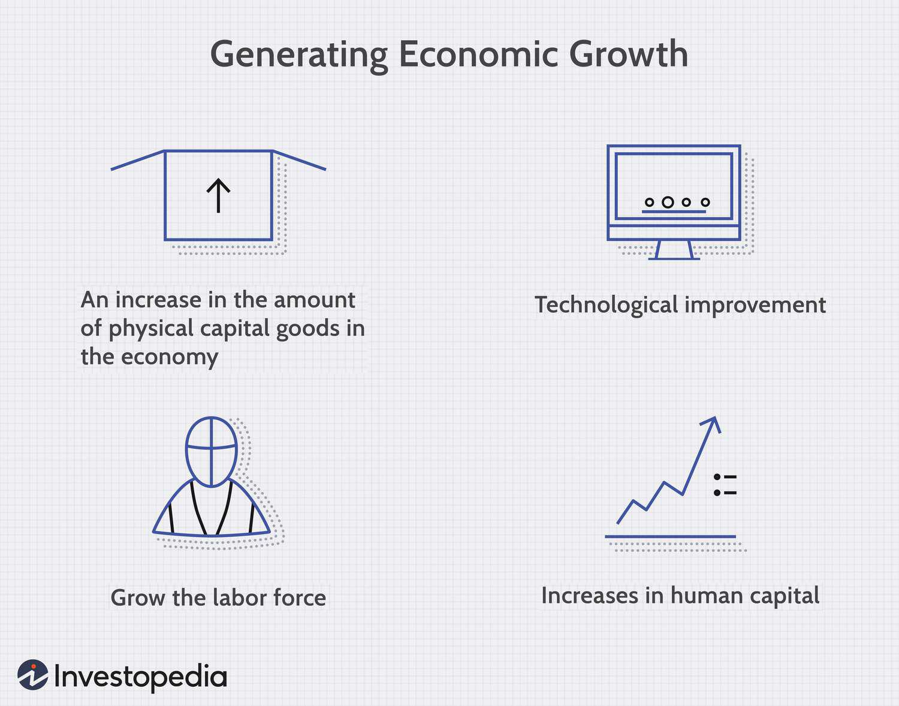

The concept of measuring economic growth has long been a critical component of governmental policy in the United States, with Gross Domestic Product (GDP) serving as the primary metric. GDP quantifies the total monetary value of all final goods and services produced over a specific time period within a nation, providing a snapshot of economic health. Formulaically, GDP can be expressed as:

$$
GDP = C + I + G + (X - M)
$$

where $C$ is consumption, $I$ is investment, $G$ is government spending, and $(X - M)$ represents net exports (exports minus imports). The accurate collection and analysis of this data are imperative, as they influence the preparation of federal budgets and the development of monetary policies by legislators and economic decision-makers.

The interplay of GDP metrics and modern financial practices, such as algorithmic trading, highlights the dynamic nature of current economic landscapes. Algorithmic trading uses computer algorithms to execute a large number of trades at high speed and frequency, capitalizing on small market inefficiencies. This technological advancement in financial markets introduces additional complexity to economic measurement and assessment.

Understanding how government policies affect and are affected by economic metrics like GDP and innovations in financial systems forms the backbone of this exploration. Economic measurement involves not only quantitative data but also qualitative insight into the factors that drive financial markets and government interventions. A critical analysis of these interactions elucidates the intricate relationship between policy-making and the evolving practices in finance, ultimately reflecting the challenges and opportunities faced by today's economies.

These interconnections underscore the necessity for continued scrutiny of financial practices and government policies, ensuring that economic growth is both sustainable and inclusive. As financial markets evolve with technological advances and novel trading strategies, understanding the implications of these changes on economic measurement becomes increasingly significant, revealing the complexities and intertwined nature of 21st-century economics.

## Table of Contents

## US Government Methods of Measuring Economic Growth

Gross Domestic Product (GDP) serves as the primary indicator for assessing economic growth in the United States. This measurement reflects the total monetary value of all final goods and services produced within the country's borders over a specified period. GDP is foundational for economic analysis, providing crucial insights into the health and trajectory of the economy. It informs policymakers, businesses, and investors, enabling them to make well-grounded decisions.

The Bureau of Economic Analysis (BEA) and the Bureau of Labor Statistics (BLS) are fundamental agencies responsible for collecting, analyzing, and disseminating the data required for GDP estimation. The BEA, part of the U.S. Department of Commerce, collects data on national income and product accounts, from which GDP is derived. The BLS contributes essential information on employment, productivity, and compensation, ensuring comprehensive coverage of economic activity.

There are several approaches to calculating GDP, each emphasizing different aspects of economic output: the production approach, the income approach, and the expenditure approach. However, the expenditure approach is the most commonly utilized in the United States, given its focus on national spending patterns.

To capture a more precise understanding of economic performance, it's necessary to differentiate between nominal GDP and real GDP. Nominal GDP is measured at current market prices and does not account for changes in the price level, or inflation, over time. Conversely, real GDP adjusts for inflation, offering a more accurate depiction of an economy's true growth by using constant prices from a base year. This adjustment is essential because it isolates changes in production volumes from shifts in price levels. For example, if an economy's nominal GDP grew by 5% over a year, but inflation was 2%, the real GDP growth would effectively be approximately 3%.

GDP holds significant value for the preparation of federal budgets and the development of monetary policies. Policymakers rely on GDP data to assess economic conditions and forecast future trends. A growing GDP typically signals an expanding economy, prompting considerations for [interest rate](/wiki/interest-rate-trading-strategies) adjustments or fiscal policy changes to sustain growth. Conversely, a shrinking GDP could indicate a recessionary trajectory, requiring stimulative measures.

In conclusion, GDP remains indispensable to economic analysis in the United States. Its calculation involves comprehensive data collection and sophisticated adjustments for price changes over time. The contributions of the BEA and BLS are vital to ensuring accuracy and reliability in this metric, providing indispensable information for effective governmental and economic decision-making.

## Understanding GDP as a Measure of Economic Performance

Gross Domestic Product (GDP) is a central metric in assessing a country's economic performance. It represents the total monetary value of all final goods and services produced within a nation's borders in a given period. GDP serves as a proxy for the country's economic activity and is crucial for policymakers, economists, and investors to understand broader economic trends.

In GDP calculation, it is essential to distinguish between intermediate and final goods. Final goods are those that have completed the production process and are ready for consumption or investment; conversely, intermediate goods are used as inputs in the production of final goods. Including only final goods in GDP calculations is vital to avoid double counting, which would occur if intermediate goods were also counted. This distinction ensures that GDP accurately reflects the economy's aggregate output.

Calculating GDP accurately presents several challenges. One significant issue is capturing the true economic output. For instance, the informal economy, comprising unregulated and often unregistered economic activities, is typically not captured in GDP [statistics](/wiki/bayesian-statistics), leading to underestimations of economic performance. Additionally, GDP does not account for environmental degradation or depletion of natural resources, potentially overstating economic well-being.

Double counting is another challenge in GDP measurement. It occurs when the value of intermediate goods is unintentionally included along with final goods. To prevent this, GDP calculation typically uses the value-added method, where only the value added at each stage of production is counted. Mathematically, this can be expressed as:

$$
\text{GDP} = \sum (\text{Value of Final Goods}) = \sum (\text{Value Added at each stage})
$$

Limitations of GDP as an economic health indicator have led economists to consider alternative measures. While GDP focuses on economic output, it does not address the distribution of income among residents of a country; hence, it might not accurately reflect the economic well-being of its population. Moreover, GDP doesn't incorporate non-market transactions, such as household labor, which contribute to the actual standard of living.

Alternative measures like Gross National Product (GNP), which accounts for income from abroad, and Net National Product (NNP), which adjusts GDP for depreciation, attempt to provide a more comprehensive picture. Additionally, indices like the Human Development Index (HDI) incorporate health and education metrics to emphasize quality-of-life factors that GDP overlooks.

In summary, although GDP remains a critical measure of economic performance, it is essential to recognize its limitations and complement it with other indicators for a holistic understanding of economic health and societal well-being.

## Economic Intervention: Government Policies and Their Impact

Fiscal and monetary policies are critical tools used by governments to regulate economic growth and maintain stability. Fiscal policy, executed through government spending and taxation, directly influences the economy's output and employment levels. It aims to either stimulate growth during a recession by increasing public expenditure or implementing tax cuts, or to cool down an overheated economy by reducing spending or increasing taxes.

Monetary policy, on the other hand, is primarily concerned with the regulation of money supply and interest rates, a responsibility typically managed by central banks. By altering interest rates, central banks can control inflation and encourage investment. For example, lowering interest rates reduces the cost of borrowing, spurring businesses and consumers to increase spending, thus boosting economic activity. Conversely, raising interest rates can help curb excessive inflation by discouraging borrowing and spending.

Economic interventions are vital, especially during times of financial distress. The 2008 financial crisis, for example, saw the application of these policies on a large scale. In response to the crisis, governments worldwide implemented significant fiscal stimulus packages to prop up the flagging economy. Simultaneously, central banks slashed interest rates and took unconventional measures such as quantitative easing to ensure [liquidity](/wiki/liquidity-risk-premium) in the financial system.

Despite their importance, economic interventions have faced criticism. Critics argue that such measures can lead to market distortions and inefficiencies. For example, prolonged low interest rates might encourage excessive risk-taking in financial markets, leading to asset bubbles. Additionally, fiscal interventions can lead to substantial public debt, posing long-term sustainability challenges.

Furthermore, there is a debate over the effectiveness and timing of these interventions. Keynesian economists advocate proactive fiscal policies to counteract economic fluctuations, while monetarists highlight the risks of inflation and advocate for a more passive approach, emphasizing the role of monetary policy.

In summary, while fiscal and monetary policies are indispensable for guiding economies through various phases of the business cycle, they must be carefully calibrated to avoid unintended consequences. Historical examples highlight both their necessity and potential pitfalls, underscoring the complexities involved in their design and implementation.

## Algorithmic Trading: Transforming Financial Markets

Algorithmic trading has revolutionized the landscape of financial markets by automating transactions based on predefined criteria, thus enhancing market efficiency. This form of trading leverages advanced mathematical models and high-speed algorithms to execute orders faster than human traders. By processing large volumes of data instantaneously, [algorithmic trading](/wiki/algorithmic-trading) facilitates quick decision-making and effective execution of trades, improving liquidity and narrowing bid-ask spreads.

Technological advancements have been crucial in enabling algorithmic trading. The use of sophisticated software and powerful computing infrastructure allows for the rapid analysis of market conditions and execution of trades. Algorithms scrutinize a plethora of market data, including price movements and trading volumes, to identify optimal trading opportunities. This capacity to rapidly assimilate and react to vast quantities of information contributes to increased market efficiency by ensuring that prices reflect available information more accurately and swiftly.

High-frequency trading ([HFT](/wiki/high-frequency-trading-strategies)), a specialized subset of algorithmic trading, executes a significant number of trades at extremely high speeds, often in fractions of a second. While HFT can further enhance market liquidity, it poses complex regulatory challenges. The high speed and [volume](/wiki/volume-trading-strategy) of trades can lead to increased market [volatility](/wiki/volatility-trading-strategies) and systemic risks, as witnessed in events like the 2010 "Flash Crash." These incidents underscore the necessity for robust regulatory frameworks to mitigate the risks associated with HFT and ensure market stability.

Regulatory bodies such as the U.S. Securities and Exchange Commission (SEC) have developed comprehensive regulations tailored to monitor and control algorithmic trading activities. These regulations aim to enforce transparency, reduce the risks of market manipulation, and ensure that trading practices are aligned with broader market integrity goals. For instance, rules may require firms engaged in HFT to register with the SEC and comply with strict data reporting and risk management standards.

Furthermore, ongoing technological innovations necessitate continuous updates to the regulatory framework. Regulators strive to balance the encouragement of innovation with the safeguarding of market participants and the financial system. They explore measures such as implementing circuit breakers to temporarily halt trading during extreme volatility and enforcing stricter access controls to sensitive trading infrastructure.

In summary, algorithmic trading, enabled by cutting-edge technology, has become a cornerstone of modern financial markets, offering substantial benefits in terms of efficiency and liquidity. However, its complexity and the potential for misuse demand vigilant regulatory oversight to address the challenges it poses and to maintain the health and stability of the financial system.

## The Interaction of Government Policies and Algorithmic Trading

Algorithmic trading, which automates financial transactions through precise, preprogrammed criteria, is fundamentally influenced by government economic policies. These interactions are crucial in shaping the behavior and patterns seen in financial markets today.

Government economic policies, particularly monetary and fiscal measures, play a significant role in dictating the parameters within which algorithmic trading operates. Policies affecting interest rates, inflation, and governmental spending can have profound implications on market conditions, which in turn influence the algorithms designed to exploit these conditions. For instance, the Federal Reserve's monetary policy decisions, such as changes in the federal funds rate, can alter market liquidity and volatility. Algorithmic trading systems are often calibrated to respond almost instantaneously to such policy changes, aiming to capitalize on shifts in market dynamics.

The alignment or misalignment of algorithmic trading with government policies can lead to various synergies and conflicts. A synergy might occur when fiscal policies intended to stimulate economic activity, like infrastructure spending, create predictable market movements that algorithms are designed to leverage. In contrast, conflicts can arise when abrupt policy changes lead to market uncertainty, increasing the risk of algorithmic strategies that rely on stable and predictable conditions. These conflicts necessitate robust risk management frameworks within trading algorithms to mitigate potential losses during periods of heightened policy-induced market volatility.

One of the critical considerations is the regulatory environment's role in encouraging technological advancements in trading. Regulatory bodies, such as the Securities and Exchange Commission (SEC), impose rules to ensure market fairness and transparency, aiming to prevent algorithmic trading from leading to market manipulation or systemic risks. These regulatory frameworks must adapt to the evolving landscape of financial technologies, balancing the need for innovation with the assurance of market integrity.

Looking to the future, there is an anticipated trend toward greater integration of policy frameworks with technological advancements in trading. This involves not only regulatory adaptations but also the potential use of advanced technologies, such as [machine learning](/wiki/machine-learning), to align algorithmic trading strategies more effectively with macroeconomic indicators and policy signals. As these technologies evolve, they could offer more sophisticated models that interpret a broader array of policy impacts on market conditions, allowing for a more nuanced approach to trading strategy development.

In conclusion, the interaction between government policies and algorithmic trading is dynamic and multifaceted. Successfully navigating this interaction requires a keen understanding of both economic policy impacts and technological capabilities, ensuring that market participants can respond efficiently and effectively to policy shifts while maintaining market stability and integrity.

## Challenges and Criticisms of Economic Interventions and Algo Trading

Economic interventions, whether through fiscal or monetary policies, frequently face criticisms centered on their potential to cause market distortions and inefficiencies. Critics argue that government actions such as subsidies, tax incentives, or interest rate manipulations can lead to resource misallocation, economic dependencies, and inflationary pressures. These interventions may create environments where businesses are incentivized to rely on government support rather than innovation and competitive practices, thereby hindering market efficiency and growth.

Algorithmic trading, which uses algorithms to automate trading processes, introduces another set of ethical and fairness concerns, primarily revolving around market manipulation. High-frequency trading (HFT), a subset of algorithmic trading, can exacerbate market volatility and create unequal playing fields. The speed and complexity of algorithms may allow for practices such as front-running, where traders can exploit their near-instantaneous market access to trade ahead of known market orders. This raises substantial fairness issues since retail investors may not have access to the same technological capabilities as institutional actors.

Ensuring the balance between regulation and innovation is crucial in maintaining market integrity. Over-regulation can stifle technological advancements and limit the potential benefits of algorithmic trading, such as improved liquidity and market efficiency. However, inadequate oversight could lead to systemic risks, where unchecked trading practices pose broader threats to financial stability. Regulatory frameworks need to adapt dynamically to technological advances while safeguarding market participants.

The debate over government intervention versus free-market principles remains a heated topic among economists and policymakers. Proponents of intervention argue that strategic policies can correct market failures, guide economic development, and protect consumers. In contrast, advocates of laissez-faire economics believe that markets, when left to operate freely, are self-correcting and inherently efficient — minimizing the need for government intervention.

In summary, the interplay between economic interventions and algorithmic trading illustrates the complexities of modern financial markets. Striking the right balance requires careful consideration and a nuanced understanding of both regulatory requirements and the innovative potential of contemporary trading technologies.

## Conclusion

The examination of US economic measurement methods and the rising influence of algorithmic trading underscores the intricate interplay between traditional metrics like GDP and modern financial technologies. Gross Domestic Product remains the cornerstone for gauging economic performance, offering a snapshot of overall economic health. However, the evolving landscape of financial markets demands that policymakers also consider the rapid advancements in technology-enabled trading, such as algorithmic and high-frequency trading.

Algorithmic trading drives significant changes in market dynamics, improving liquidity and efficiency while also presenting regulatory challenges and ethical considerations. The symbiotic relationship between economic policies and financial market innovations necessitates a balanced approach in policymaking. It is crucial for policymakers to recognize how technological shifts in trading strategies can affect economic indicators and adjust their strategies accordingly.

The interplay between government policies and algorithmic trading highlights the potential for both synergy and conflict. Effective policymaking requires an understanding of technological impacts on market behaviors, as well as proactive measures to mitigate risks while fostering innovation. As financial technologies continually evolve, forward-thinking strategies must be employed to ensure sustainable economic growth and stability. This necessitates an adaptive regulatory framework that supports innovation while safeguarding market integrity, allowing economies to thrive amid technological advancements.

## References & Further Reading

1. Bureau of Economic Analysis. "Concepts and Methods of the U.S. National Income and Product Accounts." This document provides a comprehensive guide to the methodologies used by the BEA in calculating GDP and other national economic metrics. It is essential reading for understanding the nuances of economic measurement: [BEA Resources](https://www.bea.gov/resources/methodologies/nipa-handbook).

2. Bureau of Labor Statistics. "Handbook of Methods." This resource outlines the procedures and techniques used by the BLS to collect and analyze labor market data, which complements GDP analysis and aids in policy formation. Available at [BLS Handbook](https://www.bls.gov/opub/hom/).

3. Taylor, J. B., & Weerapana, A. "Principles of Economics." An introductory text that provides an overview of economic theories, GDP calculation, and the implications of fiscal and monetary policies.

4. Hull, J. C. "Options, Futures, and Other Derivatives." This book offers insights into derivative markets and explores algorithmic strategies that are prevalent in financial markets today, including high-frequency trading.

5. Aldridge, I. "High-Frequency Trading: A Practical Guide to Algorithmic Strategies and Trading Systems." This resource delves into the mechanics of algorithmic trading and its implications for market structures.

6. Stiglitz, J. E. "The Price of Inequality: How Today's Divided Society Endangers Our Future." This book explores the broader implications of economic measurements and policies, offering critiques relevant to contemporary economic practice.

7. Loukianova, A., Nikitopoulos, C., & Wihlborg, C. "Algorithmic Trading and High Frequency Trading: An Overview." This paper provides an analytical view of algorithmic trading, its benefits, risks, and the regulatory challenges it presents: [SSRN Paper](https://ssrn.com/abstract=2402972).

8. Bernanke, B. S. "The Federal Reserve and the Financial Crisis." A series of lectures providing insights into the role of the Federal Reserve in economic stabilization, relevant for understanding monetary policy in conjunction with market mechanisms: [Federal Reserve Resources](https://www.federalreserve.gov/newsevents/speech/bernanke20120320a.htm).

9. National Academy of Sciences. "Measuring Economic Growth and Productivity: Foundations, K-12 Education, and Beyond." This report examines current practices in measuring economic growth and recommends ways to enhance these measures for future needs: [National Academies Press](https://www.nap.edu/catalog/10623).

These resources offer foundational and advanced insights into economic measurement, government interventions, and the evolving nature of financial markets, providing a well-rounded basis for further exploration.

