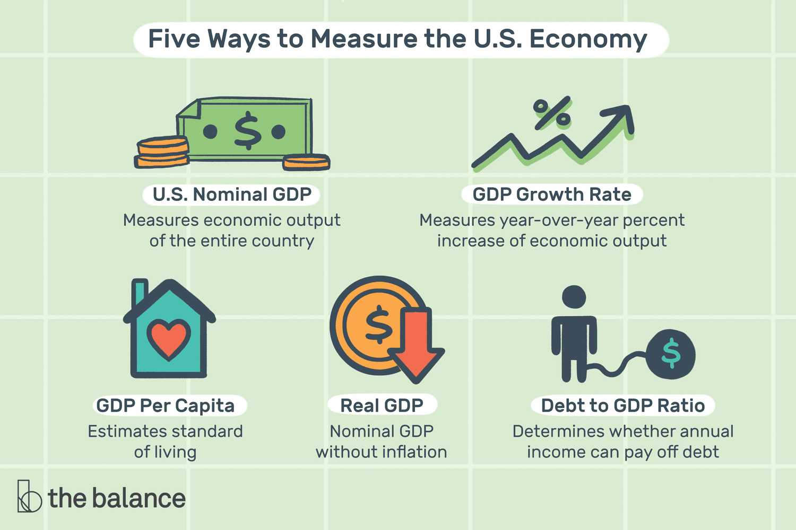

## Table of Contents

## What is economic growth and why is it important to measure?

Economic growth is when a country's total production of goods and services increases over time. It's usually measured by looking at the Gross Domestic Product (GDP), which adds up everything made and sold in a country. When GDP goes up, it means the economy is growing. This can happen because more people are working, or because workers are making more stuff, or because new technology helps make things better or faster.

Measuring economic growth is important because it helps us understand how well a country's economy is doing. If the economy is growing, it usually means more jobs and more money for people to spend. This can make life better for everyone in the country. Governments and businesses use this information to make plans and decisions. For example, if growth is slow, a government might try to help the economy by spending more money or changing laws. If growth is too fast, it might cause problems like inflation, so they might try to slow it down. Knowing about economic growth helps everyone make better choices.

## What are the basic indicators used to measure economic growth in the United States?

The main way to measure economic growth in the United States is by looking at the Gross Domestic Product (GDP). GDP is the total value of all goods and services produced in the country over a certain time, usually a year or a quarter. When GDP goes up, it means the economy is growing. The U.S. government and economists use this number to see if the economy is getting bigger or smaller. They also look at real GDP, which takes away the effects of inflation, to get a clearer picture of growth.

Another important indicator is the employment rate. This shows how many people have jobs and are working. When more people are working, it usually means the economy is doing well because businesses need more workers to make more stuff. The unemployment rate, which is the opposite, shows how many people who want to work can't find a job. A low unemployment rate is a good sign of economic growth. Together, GDP and employment rates give a good idea of how the U.S. economy is doing.

## How is Gross Domestic Product (GDP) calculated and why is it a key measure of economic growth?

Gross Domestic Product, or GDP, is calculated by adding up the total value of all goods and services produced in a country during a specific time, like a year or a quarter. There are three main ways to calculate it, but the most common way is to add up everything people spend on goods and services. This includes what consumers buy, what businesses invest in, what the government spends, and the difference between what a country exports and imports. Another way is to add up all the income earned by everyone in the country, like wages, profits, and taxes. A third way is to add up the value added at each stage of production. All these methods should give the same total GDP number if done correctly.

GDP is a key measure of economic growth because it shows how much a country's economy is producing. When GDP goes up, it means the economy is growing and people are making and buying more stuff. This usually leads to more jobs and higher incomes, which can make life better for everyone in the country. Governments and businesses watch GDP closely to see if the economy is doing well or if it needs help. If GDP is growing too slowly, they might try to boost the economy by spending more or changing laws. If it's growing too fast, it might cause problems like inflation, so they might try to slow it down. That's why GDP is so important for understanding and managing the economy.

## What is the difference between nominal GDP and real GDP, and why does it matter?

Nominal GDP and real GDP are two ways to measure the total value of goods and services produced in a country. Nominal GDP is the raw number, showing the total value without any adjustments. It includes the effects of inflation, so if prices go up, nominal GDP will go up even if the actual amount of stuff produced stays the same. Real GDP, on the other hand, takes away the effects of inflation. It uses a base year's prices to measure the value of goods and services, so it shows the real growth in the economy, not just price changes.

It matters because nominal GDP can be misleading. If you only look at nominal GDP, you might think the economy is growing when it's really just prices that are going up. Real GDP gives a clearer picture of whether the economy is actually producing more. This is important for making good decisions. Governments and businesses use real GDP to plan and make policies. If they see real GDP growing, they know the economy is doing well, and if it's not, they might need to do something to help it grow.

## How do economists use GDP per capita to assess economic growth?

Economists use GDP per capita to assess economic growth by looking at how much of the country's total production each person would get if it was split evenly among everyone. GDP per capita is just the GDP divided by the number of people in the country. It helps show how well-off people are on average. If GDP per capita goes up over time, it means that the economy is growing and people are getting richer.

This measure is useful because it takes into account the size of the population. A country might have a big GDP, but if it has a lot of people, each person might not be that well-off. By looking at GDP per capita, economists can compare how well people are doing in different countries or see if people's lives are getting better over time in one country. It's a simple way to see if economic growth is actually making a difference for regular people.

## What role do employment rates and unemployment rates play in measuring economic growth?

Employment rates and unemployment rates are important for understanding economic growth. The employment rate tells us the percentage of people who are working. When more people have jobs, it usually means the economy is doing well. Businesses need more workers to make more things or provide more services, which means the economy is growing. A high employment rate is a good sign because it shows that people are earning money and can spend it on goods and services, which helps the economy grow even more.

The unemployment rate is the opposite. It shows the percentage of people who want to work but can't find a job. A low unemployment rate is a good sign of economic growth because it means most people who want to work can find a job. But if the unemployment rate is high, it can mean the economy is not doing well. When a lot of people are out of work, they can't spend money, which can slow down the economy. So, both employment and unemployment rates help economists see if the economy is growing or shrinking.

## How are consumer spending and personal income used as indicators of economic growth?

Consumer spending is a big part of what makes the economy grow. When people spend more money on things like food, clothes, and cars, it means they feel good about their money situation. This spending helps businesses make more money, which can lead to more jobs and more stuff being made. Economists watch consumer spending closely because it's a good sign of how the economy is doing. If people are spending more, it usually means the economy is growing.

Personal income is also important for understanding economic growth. It's the total amount of money people earn from working, investments, and other sources. When personal income goes up, people usually have more money to spend or save. This can help the economy grow because when people have more money, they can buy more things, which helps businesses. Economists look at personal income to see if people are doing better financially, which can be a sign that the economy is getting stronger.

## What are the limitations of using GDP as a measure of economic growth?

GDP is a good way to see how much stuff a country makes and sells, but it has some problems. One big problem is that GDP only counts things that people pay for. It doesn't count work like taking care of kids or cleaning the house if no one pays for it. So, if a mom stays home to look after her kids instead of working a paid job, the GDP might go down even though the family is still doing important work. Also, GDP doesn't care if the stuff being made is good or bad for the environment. If a country cuts down a lot of trees to make paper, the GDP goes up, but the environment suffers.

Another problem with GDP is that it doesn't show how the money is spread out among people. A country can have a high GDP, but if most of the money goes to just a few rich people, many others might still be poor. GDP also doesn't say anything about how happy or healthy people are. A country can have a growing GDP, but if people are stressed out or sick, they might not feel like their lives are getting better. So, while GDP is useful for seeing how much an economy is growing, it doesn't tell the whole story about how well a country and its people are doing.

## How do alternative measures like the Genuine Progress Indicator (GPI) and Human Development Index (HDI) provide a different perspective on economic growth?

The Genuine Progress Indicator (GPI) is a way to measure how well a country is doing that looks at more than just how much stuff is made and sold, like GDP does. GPI tries to see if people's lives are getting better by counting things like how much time people spend with their families, how clean the air and water are, and how much crime there is. It also takes away the bad things that can happen when the economy grows, like pollution and the cost of fixing it. So, GPI gives a fuller picture of whether economic growth is really making life better for everyone.

The Human Development Index (HDI) is another way to look at how well a country is doing, but it focuses on people's lives instead of just the economy. HDI looks at three main things: how long people live, how much education they get, and how much money they make. By putting these together, HDI shows if people are living longer, healthier lives and if they have the chance to learn and earn money. This gives a better idea of whether economic growth is helping people live better lives, not just making more stuff.

## What advanced statistical methods are used to forecast economic growth in the United States?

Economists use a lot of fancy math to guess how the U.S. economy will grow in the future. One way they do this is by using something called time series analysis. This method looks at past numbers, like GDP or unemployment rates, to find patterns and use them to predict what will happen next. They also use something called regression analysis, which helps them see how different things, like interest rates or consumer spending, affect economic growth. By putting all these numbers into a computer, economists can make models that help them guess what the economy will do in the future.

Another way economists forecast economic growth is by using something called econometric models. These models are like big math puzzles that try to show how the whole economy works. They take in a lot of different information, like how much people are spending, how many people are working, and what the government is doing. Then, they use this information to make guesses about the future. Sometimes, economists also use something called machine learning, which is a type of computer program that can learn from data and make better guesses over time. All these methods help economists give the best possible predictions about how the U.S. economy will grow.

## How do regional economic indicators vary and what does this tell us about national economic growth?

Regional economic indicators can be different from one part of the country to another. For example, some states might have a lot of factories and make a lot of stuff, so their GDP might be higher than other places. Other places might have a lot of people working in offices or tech jobs, so their employment rates could be different. These differences can tell us a lot about what's happening in the whole country. If some regions are doing really well, it can help pull up the national numbers, but if a lot of regions are struggling, it can bring the national numbers down.

Looking at regional indicators helps us understand the bigger picture of national economic growth. For instance, if the Midwest is doing great because of farming, but the Northeast is struggling because of fewer factory jobs, the national GDP might still look okay. But it's important to know that not everyone is doing the same. By looking at these regional differences, we can see if growth is spread out evenly or if some places need more help. This can help the government and businesses make better plans to help the whole country grow.

## What are the current debates among economists about the best methods to measure economic growth?

Economists are always talking about the best way to measure how an economy is doing. Some say that GDP is good because it shows how much stuff a country makes and sells. But others think GDP has problems because it doesn't show if people are happy or if the environment is okay. They say we should use other measures like the Genuine Progress Indicator (GPI) or the Human Development Index (HDI) because these look at more than just money. They check things like how long people live, how much they learn, and if they have time for family and friends.

Another big debate is about how to predict what will happen to the economy. Some economists like to use old-school math methods like time series analysis and regression models. These methods look at past numbers to guess what will happen next. But others think we should use new technology like machine learning. They say these computer programs can learn from data and make better guesses over time. Both sides want to find the best way to help governments and businesses plan for the future, but they don't always agree on which method is best.

## What is the understanding of GDP as a measure of economic performance?

Gross Domestic Product (GDP) is a central metric in assessing a country's economic performance. It represents the total monetary value of all final goods and services produced within a nation's borders in a given period. GDP serves as a proxy for the country's economic activity and is crucial for policymakers, economists, and investors to understand broader economic trends.

In GDP calculation, it is essential to distinguish between intermediate and final goods. Final goods are those that have completed the production process and are ready for consumption or investment; conversely, intermediate goods are used as inputs in the production of final goods. Including only final goods in GDP calculations is vital to avoid double counting, which would occur if intermediate goods were also counted. This distinction ensures that GDP accurately reflects the economy's aggregate output.

Calculating GDP accurately presents several challenges. One significant issue is capturing the true economic output. For instance, the informal economy, comprising unregulated and often unregistered economic activities, is typically not captured in GDP [statistics](/wiki/bayesian-statistics), leading to underestimations of economic performance. Additionally, GDP does not account for environmental degradation or depletion of natural resources, potentially overstating economic well-being.

Double counting is another challenge in GDP measurement. It occurs when the value of intermediate goods is unintentionally included along with final goods. To prevent this, GDP calculation typically uses the value-added method, where only the value added at each stage of production is counted. Mathematically, this can be expressed as:

$$
\text{GDP} = \sum (\text{Value of Final Goods}) = \sum (\text{Value Added at each stage})
$$

Limitations of GDP as an economic health indicator have led economists to consider alternative measures. While GDP focuses on economic output, it does not address the distribution of income among residents of a country; hence, it might not accurately reflect the economic well-being of its population. Moreover, GDP doesn't incorporate non-market transactions, such as household labor, which contribute to the actual standard of living.

Alternative measures like Gross National Product (GNP), which accounts for income from abroad, and Net National Product (NNP), which adjusts GDP for depreciation, attempt to provide a more comprehensive picture. Additionally, indices like the Human Development Index (HDI) incorporate health and education metrics to emphasize quality-of-life factors that GDP overlooks.

In summary, although GDP remains a critical measure of economic performance, it is essential to recognize its limitations and complement it with other indicators for a holistic understanding of economic health and societal well-being.

## References & Further Reading

1. Bureau of Economic Analysis. "Concepts and Methods of the U.S. National Income and Product Accounts." This document provides a comprehensive guide to the methodologies used by the BEA in calculating GDP and other national economic metrics. It is essential reading for understanding the nuances of economic measurement: [BEA Resources](https://www.bea.gov/resources/methodologies/nipa-handbook).

2. Bureau of Labor Statistics. "Handbook of Methods." This resource outlines the procedures and techniques used by the BLS to collect and analyze labor market data, which complements GDP analysis and aids in policy formation. Available at [BLS Handbook](https://www.bls.gov/opub/hom/).

3. Taylor, J. B., & Weerapana, A. "Principles of Economics." An introductory text that provides an overview of economic theories, GDP calculation, and the implications of fiscal and monetary policies.

4. Hull, J. C. "Options, Futures, and Other Derivatives." This book offers insights into derivative markets and explores algorithmic strategies that are prevalent in financial markets today, including high-frequency trading.

5. Aldridge, I. "High-Frequency Trading: A Practical Guide to Algorithmic Strategies and Trading Systems." This resource investigates into the mechanics of algorithmic trading and its implications for market structures.

6. Stiglitz, J. E. "The Price of Inequality: How Today's Divided Society Endangers Our Future." This book explores the broader implications of economic measurements and policies, offering critiques relevant to contemporary economic practice.

7. Loukianova, A., Nikitopoulos, C., & Wihlborg, C. "Algorithmic Trading and High Frequency Trading: An Overview." This paper provides an analytical view of algorithmic trading, its benefits, risks, and the regulatory challenges it presents: [SSRN Paper](https://ssrn.com/abstract=2402972).

8. Bernanke, B. S. "The Federal Reserve and the Financial Crisis." A series of lectures providing insights into the role of the Federal Reserve in economic stabilization, relevant for understanding monetary policy in conjunction with market mechanisms: [Federal Reserve Resources](https://www.federalreserve.gov/newsevents/speech/bernanke20120320a.htm).

9. National Academy of Sciences. "Measuring Economic Growth and Productivity: Foundations, K-12 Education, and Beyond." This report examines current practices in measuring economic growth and recommends ways to enhance these measures for future needs: [National Academies Press](https://www.nap.edu/catalog/10623).

These resources offer foundational and advanced insights into economic measurement, government interventions, and the evolving nature of financial markets, providing a well-rounded basis for further exploration.

