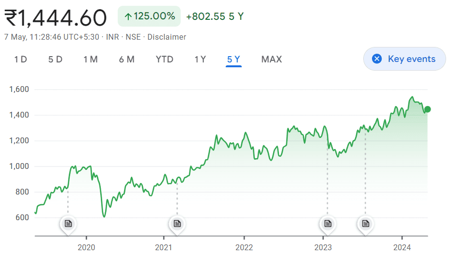

## Table of Contents

## What is a mutual fund and who is a mutual fund manager?

A mutual fund is a type of investment where many people pool their money together to buy a variety of stocks, bonds, or other assets. This makes it easier for individuals to invest in a diverse range of securities without having to buy each one separately. When you invest in a mutual fund, you are buying shares of the fund, and the value of your investment goes up or down based on the performance of the assets the fund holds.

A mutual fund manager is a professional who is responsible for making decisions about which assets to buy and sell within the mutual fund. Their main job is to try to grow the fund's value by choosing the right investments. The manager uses their knowledge and experience to make these choices, aiming to meet the goals of the fund, whether that's growth, income, or a combination of both. The success of the fund largely depends on the skill and decisions of the mutual fund manager.

## Why is stock selection important for mutual fund managers?

Stock selection is important for mutual fund managers because it directly affects the performance of the mutual fund. When a manager picks good stocks, the value of the fund can go up, which makes the investors happy. If the manager picks bad stocks, the value of the fund can go down, and investors might lose money. So, choosing the right stocks is a big part of a manager's job.

Also, stock selection helps the mutual fund meet its goals. Different funds have different aims, like growing quickly or giving steady income. The manager needs to pick stocks that fit these goals. For example, if a fund wants to grow fast, the manager might choose stocks from companies that are expected to do well in the future. If the fund wants to give steady income, the manager might pick stocks that pay good dividends. By [picking](/wiki/asset-class-picking) the right stocks, the manager can help the fund do what it's supposed to do for its investors.

## What are the basic criteria mutual fund managers use to select stocks?

Mutual fund managers use several basic criteria to pick stocks. One important thing they look at is how well a company is doing. They check things like how much money the company is making, if it's growing, and if it's making more profit than before. They also look at the company's financial health, like how much debt it has and if it can pay its bills. Another thing they consider is how the company is run. They want to know if the people in charge are good at their jobs and if they have a good plan for the future.

Another criterion is how much the stock costs compared to what it's worth. Managers look at things like the price-to-earnings ratio to see if the stock is a good deal. They also think about how the stock might do in the future. They use things like market trends and economic forecasts to guess if the stock will go up or down. Lastly, they think about how the stock fits with the other stocks in the fund. They want to make sure the fund is not too risky and that it meets its goals, like growing or giving income to investors.

## How do mutual fund managers use fundamental analysis in stock selection?

Mutual fund managers use [fundamental analysis](/wiki/fundamental-analysis) to look at the basic things about a company. They check the company's financial statements to see how much money it's making, how much it's growing, and if it's making more profit than before. They also look at the company's debt and if it can pay its bills. This helps them figure out if the company is healthy and has a good future. They also think about the people running the company. They want to know if the leaders are good at their jobs and if they have a plan that makes sense.

Another part of fundamental analysis is looking at how much the stock costs compared to what it's worth. Managers use things like the price-to-earnings ratio to see if the stock is a good deal. If the stock is cheap compared to what the company is worth, it might be a good buy. They also think about the bigger picture, like what's happening in the economy and in the company's industry. This helps them guess if the stock will go up or down in the future. By using fundamental analysis, mutual fund managers can pick stocks that fit the fund's goals and make smart choices for their investors.

## What role does technical analysis play in a mutual fund manager's stock selection process?

Technical analysis is another tool that mutual fund managers use to pick stocks. It's different from fundamental analysis because it looks at the stock's price and trading [volume](/wiki/volume-trading-strategy) over time, instead of the company's financial health. Managers use charts and patterns to try to guess where the stock price might go next. They look for trends, like if the stock has been going up or down, and they use things like moving averages to help them make decisions. This can help them find the right time to buy or sell a stock.

Even though technical analysis doesn't look at the company's financials, it can still be helpful for mutual fund managers. It helps them understand how the market feels about a stock and how other investors are acting. By using technical analysis, managers can spot short-term opportunities and make quick moves to take advantage of them. This can be important for managing the fund's performance and meeting its goals. So, while fundamental analysis tells them about the company's health, technical analysis helps them time their moves in the market.

## How do mutual fund managers incorporate macroeconomic factors into their stock selection strategy?

Mutual fund managers pay attention to big things happening in the economy, like interest rates, inflation, and how fast the economy is growing. These things can affect how well companies do and how much their stocks are worth. For example, if interest rates go up, it might be harder for companies to borrow money, which could slow down their growth. On the other hand, if the economy is growing fast, companies might do better and their stocks might go up. So, managers look at these big economic factors to guess how different stocks might do in the future.

By understanding what's going on in the economy, mutual fund managers can pick stocks that will do well in that situation. For instance, if they think inflation will go up, they might choose stocks from companies that can raise their prices easily. Or if they think the economy will slow down, they might pick stocks from companies that are less affected by economic ups and downs. This way, they can make smart choices for the fund and help it meet its goals, like growing or giving steady income to investors.

## What are quantitative models and how are they used by mutual fund managers for stock picking?

Quantitative models are tools that use math and numbers to help mutual fund managers pick stocks. These models look at lots of data about companies, like how much money they make, how fast they're growing, and how their stocks have been doing. The models use this data to make guesses about which stocks might go up in value. They do this by finding patterns and relationships in the data that a person might not see easily.

Mutual fund managers use these models to make their stock picking more scientific and less based on feelings or guesses. By using numbers and math, the models can help managers find stocks that fit the fund's goals, like growing fast or giving steady income. The models can also help managers see how different stocks might do in different situations, like if the economy is doing well or not. This way, managers can make better choices and help the fund do well for its investors.

## Can you explain the use of sector rotation strategies in stock selection by mutual fund managers?

Sector rotation is a strategy that mutual fund managers use to pick stocks based on which parts of the economy, or sectors, are doing well at different times. The economy goes through cycles, and different sectors do better at different parts of these cycles. For example, when the economy is growing fast, sectors like technology and consumer goods might do well. But when the economy is slowing down, sectors like utilities and healthcare might be safer bets. Mutual fund managers try to figure out where the economy is in its cycle and pick stocks from the sectors that are likely to do well next.

By using sector rotation, mutual fund managers can move their money from one sector to another to take advantage of these cycles. This helps them pick stocks that are likely to go up in value and avoid stocks that might go down. For example, if they think the economy is about to start growing again, they might buy more stocks from sectors like industrials or consumer discretionary. This strategy can help the fund do better over time by staying ahead of changes in the economy.

## How do mutual fund managers use risk management techniques to optimize their stock selection?

Mutual fund managers use risk management techniques to make sure they pick stocks that help the fund do well without taking too many chances. One way they do this is by spreading out their investments, which is called diversification. They pick stocks from different companies and different sectors so that if one stock goes down, the whole fund doesn't lose too much money. They also look at how much each stock might go up or down, which is called [volatility](/wiki/volatility-trading-strategies). By choosing stocks that don't all move in the same way, they can make the fund less risky.

Another way mutual fund managers manage risk is by setting limits on how much they can lose. They might decide not to put too much money into one stock or one sector. This way, if something bad happens to that stock or sector, it won't hurt the whole fund too much. They also use tools like stop-loss orders, which automatically sell a stock if it goes down to a certain price. This helps them cut their losses and protect the fund's value. By using these risk management techniques, mutual fund managers can pick stocks that help the fund grow while keeping it safe.

## What advanced statistical methods do expert mutual fund managers employ for stock selection?

Expert mutual fund managers often use advanced statistical methods like regression analysis to pick stocks. Regression analysis helps them see how different things, like a company's earnings or the overall economy, affect a stock's price. By understanding these relationships, managers can guess how a stock might do in the future. They also use something called [factor](/wiki/factor-investing) analysis to find out what drives a stock's performance. This can help them see if a stock is going up because the whole market is doing well or because the company itself is doing something special.

Another method they use is called Monte Carlo simulation. This method helps managers see how different things might happen in the future and how they could affect the fund's value. They run many different scenarios to see what could happen and make choices based on what they learn. Also, some managers use [machine learning](/wiki/machine-learning), which is a type of computer program that can learn from data. Machine learning can help them find patterns in big sets of data that they might not see otherwise. By using these advanced methods, expert mutual fund managers can make smarter choices about which stocks to pick for their funds.

## How do mutual fund managers integrate ESG (Environmental, Social, and Governance) criteria into their stock selection process?

Mutual fund managers use [ESG](/wiki/esg-investing) criteria to pick stocks that are good for the environment, society, and how companies are run. They look at things like how much a company pollutes, how it treats its workers, and if it has good leaders. By choosing companies that do well in these areas, managers can make the fund more responsible and attractive to investors who care about these things. For example, they might pick a company that uses clean energy or one that has fair labor practices. This helps the fund meet its goals while also doing good for the world.

To use ESG criteria, mutual fund managers often use special ratings and scores. These ratings help them see how well a company is doing in terms of the environment, social issues, and governance. Managers might decide to only pick stocks from companies that have high ESG scores or to avoid companies with low scores. This way, they can make sure the fund is investing in companies that are trying to make a positive impact. By integrating ESG criteria, managers can help the fund grow in a way that's good for both the investors and the planet.

## What are some of the latest trends and technologies that mutual fund managers are adopting for more effective stock selection?

Mutual fund managers are using new technologies like [artificial intelligence](/wiki/ai-artificial-intelligence) (AI) and big data to pick stocks better. AI can look at huge amounts of information quickly and find patterns that people might miss. For example, AI can check news articles, social media posts, and financial reports to see how people feel about a company. This helps managers guess if a stock will go up or down. Big data lets managers use lots of different kinds of information, like weather data or satellite images, to make smarter choices about which stocks to pick.

Another trend is using something called "[alternative data](/wiki/best-alternative-data)." This is information that isn't usually used for picking stocks, like credit card spending or how many people visit a store. By looking at this data, managers can learn more about how a company is doing before it shows up in financial reports. They can also use cloud computing to store and analyze all this data easily. These new tools help mutual fund managers make better decisions and pick stocks that help the fund do well.

## What is Mutual Fund Management?

Mutual funds allow investors to participate in a diversified portfolio curated by professional managers. This diversification reduces individual risk by pooling assets into various securities, fostering a balanced approach to investment.

### Types of Mutual Funds

Several types of mutual funds cater to different investment goals and risk preferences:

1. **Index Funds**: These funds aim to replicate the performance of a specific index, such as the S&P 500. They are known for their low expense ratios and passive management style, offering broad market exposure.

2. **Dividend Funds**: Focused on providing income, these funds invest in companies that regularly distribute dividends. They are preferred by investors seeking steady, periodic income along with potential capital appreciation.

3. **Growth Funds**: Targeting high capital appreciation, growth funds invest in companies expected to grow at an above-average rate compared to other firms. These funds are typically riskier as they often involve stocks with higher volatility.

### Role of Mutual Fund Managers

Mutual fund managers are critical in crafting portfolios aligned with the fund's objectives and strategies. They conduct thorough analyses of economic trends, market conditions, and company fundamentals to make informed stock selections. Managers continuously monitor and adjust portfolio compositions to maximize returns while adhering to the fund's investment goals.

### Cost Structures of Mutual Funds

The cost of investing in mutual funds is influenced by various fees, the most significant of which is the **expense ratio**. This ratio represents the annual cost of operating a fund, expressed as a percentage of average net assets. High expense ratios can erode returns over time, making it crucial for investors to evaluate these costs prior to investing.

$$
\text{Net Return} = \text{Gross Return} - \text{Expense Ratio}
$$

### Benefits and Challenges

Mutual funds provide several advantages, including easy accessibility and professional management, making them suitable for novice investors. However, they come with certain challenges:

- **Benefits**:
  - **Diversification**: Decreases risk by spreading investments across various industries and asset classes.
  - **Liquidity**: Investors can buy or sell mutual fund shares at the end-of-day net asset value.
  - **Affordability**: Allows investors to obtain a diversified portfolio with a relatively modest initial investment.

- **Challenges**:
  - **Cost**: Expense ratios and other fees can be higher than those for individual stock investments.
  - **Lack of Control**: Investors have limited say in the fund's investment decisions.
  - **Customization**: Some funds may not perfectly align with the specific investment goals or risk tolerances of individual investors.

By understanding these factors, investors can make informed decisions when considering mutual fund investments, balancing the benefits of diversified, professionally managed portfolios against the inherent costs and limitations.

## References & Further Reading

[1]: Bergstra, J., Bardenet, R., Bengio, Y., & Kégl, B. (2011). ["Algorithms for Hyper-Parameter Optimization."](https://dl.acm.org/doi/10.5555/2986459.2986743) Advances in Neural Information Processing Systems 24.

[2]: ["Advances in Financial Machine Learning"](https://www.amazon.com/Advances-Financial-Machine-Learning-Marcos/dp/1119482089) by Marcos Lopez de Prado

[3]: ["Evidence-Based Technical Analysis: Applying the Scientific Method and Statistical Inference to Trading Signals"](https://www.amazon.com/Evidence-Based-Technical-Analysis-Scientific-Statistical/dp/0470008741) by David Aronson

[4]: ["Machine Learning for Algorithmic Trading"](https://github.com/stefan-jansen/machine-learning-for-trading) by Stefan Jansen

[5]: ["Quantitative Trading: How to Build Your Own Algorithmic Trading Business"](https://github.com/LucindaYa/quant-resources/blob/master/Quantitative%20Trading%20How%20to%20Build%20Your%20Own%20Algorithmic%20Trading%20Business.pdf) by Ernest P. Chan