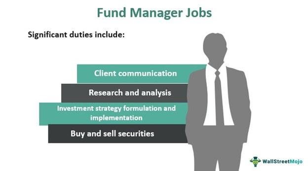

Investing in today's financial landscape involves a diverse array of strategies and instruments. With the increasing complexity of global markets, investors are required to develop a solid understanding of various investment tools and strategies to make informed decisions. Key areas like stock selection, mutual fund management, and algorithmic trading form the cornerstone of modern investment decision-making. They offer a structured approach for investors seeking to optimize their portfolios and manage risks effectively.

Stock selection is a crucial component of building a successful investment portfolio. It involves the careful analysis of company financials, market conditions, and economic factors to identify stocks that have the potential for superior performance. Fundamental analysis and technical analysis are the predominant methodologies used by investors to evaluate stocks. Fundamental analysis focuses on assessing a company's intrinsic value through financial statements and industry conditions, while technical analysis examines historical price patterns and trading volumes to forecast future price movements.

Mutual fund management provides an accessible entry point for both novice and experienced investors to hold a diversified portfolio managed by professional fund managers. These funds range from index funds, which track specific market indices, to growth funds that target rapid capital appreciation. Understanding the cost structure, including expense ratios, is crucial as it directly impacts the overall returns of mutual funds. Investors benefit from the expertise of fund managers, although this comes with limited control over individual investment choices.

Algorithmic trading represents the latest evolution in investment strategies, capitalizing on technological advancements to execute trades based on pre-defined algorithms with remarkable speed and precision. This method reduces human error and leverages data-driven insights to identify and exploit market inefficiencies. However, algorithmic trading must contend with challenges such as adapting to high market volatility and technological dependencies that can affect performance.

The integration of these key strategies creates a robust framework for modern investment. By combining stock selection, mutual fund management, and algorithmic trading, investors can develop a comprehensive strategy that balances the strengths of traditional investing practices with cutting-edge technological tools. The synergy between these strategies facilitates enhanced portfolio management and paves the way for achieving optimal investment outcomes.

Through this article, we explore each of these aspects of investment strategies, offering insights into how investors can harness them to navigate complex markets and improve portfolio performance. By staying informed and adapting to new tools and strategies, investors can maintain a competitive edge and manage risks more effectively. The future of investing is shaped by the delicate balance between human insight and technological advancements, enabling more informed decision-making.

## Table of Contents

## Stock Selection Strategies

Stock selection is a critical element in constructing a successful investment portfolio, and it involves various methodologies that investors employ to identify promising stocks. Two principal approaches to stock selection are [fundamental analysis](/wiki/fundamental-analysis) and technical analysis.

**Fundamental Analysis**

Fundamental analysis involves evaluating a company's financial statements, business model, management, and market position to estimate its intrinsic value. Key metrics used in fundamental analysis include earnings per share (EPS), price-to-earnings (P/E) ratio, return on equity (ROE), and debt-to-equity ratio. Analysts assess these metrics in the context of industry peers and market conditions to decide if a stock is undervalued or overvalued. It is essential for investors to understand the broader economic factors, such as interest rates and geopolitical events, that can impact a company's performance.

**Technical Analysis**

Technical analysis evaluates stocks based on historical price and [volume](/wiki/volume-trading-strategy) data to predict future price movements. This approach relies on chart patterns, technical indicators like moving averages and relative strength index (RSI), and trading volumes. Technical analysts believe that stock prices reflect all available information, and patterns or trends can help forecast market behavior.

**Portfolio Diversification**

Diversification is a risk management strategy that involves spreading investments across various asset classes and sectors to reduce exposure to any single entity's risk. A diversified portfolio can enhance returns by balancing performance through varying market conditions and sectors. The principle behind diversification is the reduction of unsystematic risk, the type of risk associated with individual assets or industries.

**Selecting Stocks in Line with Investment Goals and Risk Tolerance**

Investors should align their stock selection with their individual investment objectives and risk tolerance. A clear understanding of one's financial goals, investment horizon, and capacity for risk should guide the selection process. For instance, conservative investors might prioritize stable companies with consistent earnings and dividends, while aggressive investors might focus on [growth stocks](/wiki/growth-stocks) with higher [volatility](/wiki/volatility-trading-strategies) but significant appreciation potential.

**Practical Tips** 

1. **Consistent Research**: Stay informed about the companies and industries of interest. Continuous research and staying up-to-date with financial news are crucial for making informed decisions.

2. **Use of Tools and Resources**: Utilize financial tools, stock screeners, and resources like financial news platforms and analysis software to gather insights and data.

3. **Regular Portfolio Review**: Periodically review and adjust the stock holdings to reflect changing market conditions, personal financial goals, and economic factors.

By employing these strategies and methodologies, investors can make informed decisions about stock selection and enhance their portfolio's performance and resilience against market fluctuations.

## Mutual Fund Management

Mutual funds allow investors to participate in a diversified portfolio curated by professional managers. This diversification reduces individual risk by pooling assets into various securities, fostering a balanced approach to investment.

### Types of Mutual Funds

Several types of mutual funds cater to different investment goals and risk preferences:

1. **Index Funds**: These funds aim to replicate the performance of a specific index, such as the S&P 500. They are known for their low expense ratios and passive management style, offering broad market exposure.

2. **Dividend Funds**: Focused on providing income, these funds invest in companies that regularly distribute dividends. They are preferred by investors seeking steady, periodic income along with potential capital appreciation.

3. **Growth Funds**: Targeting high capital appreciation, growth funds invest in companies expected to grow at an above-average rate compared to other firms. These funds are typically riskier as they often involve stocks with higher volatility.

### Role of Mutual Fund Managers

Mutual fund managers are critical in crafting portfolios aligned with the fund's objectives and strategies. They conduct thorough analyses of economic trends, market conditions, and company fundamentals to make informed stock selections. Managers continuously monitor and adjust portfolio compositions to maximize returns while adhering to the fund's investment goals.

### Cost Structures of Mutual Funds

The cost of investing in mutual funds is influenced by various fees, the most significant of which is the **expense ratio**. This ratio represents the annual cost of operating a fund, expressed as a percentage of average net assets. High expense ratios can erode returns over time, making it crucial for investors to evaluate these costs prior to investing.

$$
\text{Net Return} = \text{Gross Return} - \text{Expense Ratio}
$$

### Benefits and Challenges

Mutual funds provide several advantages, including easy accessibility and professional management, making them suitable for novice investors. However, they come with certain challenges:

- **Benefits**:
  - **Diversification**: Decreases risk by spreading investments across various industries and asset classes.
  - **Liquidity**: Investors can buy or sell mutual fund shares at the end-of-day net asset value.
  - **Affordability**: Allows investors to obtain a diversified portfolio with a relatively modest initial investment.

- **Challenges**:
  - **Cost**: Expense ratios and other fees can be higher than those for individual stock investments.
  - **Lack of Control**: Investors have limited say in the fund's investment decisions.
  - **Customization**: Some funds may not perfectly align with the specific investment goals or risk tolerances of individual investors.

By understanding these factors, investors can make informed decisions when considering mutual fund investments, balancing the benefits of diversified, professionally managed portfolios against the inherent costs and limitations.

## Algorithmic Trading in Modern Investing

Algorithmic trading employs a systematic approach to execute trades based on pre-defined algorithms, allowing for consistency, speed, and minimal human intervention. This method leverages advanced mathematical models and data analytics to make trading decisions, optimizing efficiency and throughput.

One of the primary advantages of [algorithmic trading](/wiki/algorithmic-trading) is its speed. Algorithms can analyze vast amounts of market data and execute trades in fractions of a second, far quicker than a human trader. This capability is particularly beneficial when trading in volatile markets, where being even milliseconds ahead can significantly impact profitability. The precision offered by algorithmic trading minimizes human errors, ensuring that trades are executed at the desired prices without the influence of emotional decision-making.

Algorithmic trading employs several strategies, each catering to different market conditions and investment goals. Trend-following strategies are popular, utilizing historical data to predict future price movements and identify opportunities for profit. These strategies can be effective in markets with clear trends, taking advantage of sustained price movements. Arbitrage opportunities are also exploited through algorithmic trading by simultaneously buying and selling an asset in different markets to profit from price discrepancies. This strategy, however, requires high speed and accuracy due to its reliance on market inefficiencies that often exist for brief periods. Mean reversion is another strategy, based on the assumption that asset prices will return to their historical averages over time. This involves identifying overbought or oversold conditions and making trades that capitalize on the predicted reversion.

Despite its advantages, algorithmic trading faces several challenges. Market volatility can affect algorithmic strategies, especially if they are not designed to adapt to rapid changes. Algorithms rely heavily on historical data, which may not always predict future market movements accurately, particularly in unprecedented market conditions. Moreover, technological dependencies present risks; system failures, latency issues, and cyber threats can significantly impact performance.

Algorithmic trading has the potential to revolutionize investment management by utilizing data-driven insights. By analyzing large datasets and identifying patterns and trends, algorithms can optimize trading strategies in ways that are difficult to achieve manually. This data-centric approach allows for better risk management and more informed decision-making, as algorithms can quickly adapt to new information and adjust strategies accordingly.

In summary, algorithmic trading offers significant benefits in terms of speed, precision, and efficiency in modern investing. While it presents challenges like dealing with market volatility and technological risks, its ability to leverage data for enhanced trading strategies positions it as a transformative tool in the investment landscape.

## Integrating Investment Strategies

Integrating stock selection, mutual fund management, and algorithmic trading can significantly enhance an investor's portfolio strategy. This integration leverages the strengths of each approach, creating a comprehensive investment strategy that optimizes returns while managing risks.

The synergy between traditional investing practices and technological advancements is increasingly vital in today's financial landscape. Traditional stock selection methods, such as fundamental analysis, provide a strong basis for understanding underlying market dynamics, company valuations, and potential growth opportunities. This foundational knowledge is crucial when choosing stocks that align with individual investment goals and risk preferences. However, incorporating mutual fund management into this equation allows investors to achieve diversification and professional oversight, which can mitigate individual stock risk. Mutual funds, particularly diversified funds like index funds, offer access to a broader range of assets, reducing the overall volatility of the investment portfolio.

Algorithmic trading introduces an additional layer of sophistication by utilizing predefined algorithms to automate trading decisions. This method ensures transactions are executed with precision and speed, minimizing emotional biases that can affect human decision-making. Algorithms can apply various strategies such as trend-following, [arbitrage](/wiki/arbitrage), and mean reversion, allowing for dynamic and responsive portfolio adjustments based on real-time data.

Integrating these three components requires careful consideration. Investors must evaluate their objectives and risk tolerance to determine the appropriate balance between active management, as seen in stock selection and mutual fund oversight, and automated trading strategies. A practical example of successful integration is the use of a core-satellite approach, where a significant portion of the portfolio is invested in core mutual funds designed for stability and diversification, while satellite investments focus on algorithmically traded stock selections for additional growth potential.

Staying informed about emerging trends and technological developments is crucial for maintaining a competitive edge. Investors can leverage financial news platforms, investment research reports, and professional advisory services to stay abreast of market shifts and technological innovations. Additionally, adopting a flexible investment strategy that can adapt to new tools and methodologies ensures long-term portfolio resilience and performance.

In conclusion, integrating stock selection, mutual fund management, and algorithmic trading can result in a robust investment framework, balancing traditional insights with cutting-edge technology to navigate complex financial markets effectively.

## Conclusion

Investment strategies are continually evolving, driven by both technological advancements and dynamic market conditions. Understanding and effectively deploying stock selection, mutual fund management, and algorithmic trading are crucial to achieving successful investment outcomes. These strategies, individually potent, become even more effective when integrated, allowing investors to optimize their portfolio performance and manage risks with greater precision.

As investment environments shift, staying abreast of new tools and strategies is paramount. Investors who are proactive in learning and adapting are better positioned to maintain a competitive edge. This adaptability ensures not only that they can capitalize on emerging opportunities, but also that they can shield their portfolios against unforeseen market challenges.

The integration of stock selection, mutual fund management, and algorithmic trading exemplifies the synergy between human insight and technological tools. Human intuition provides the nuanced understanding of market trends and investor behavior, while technological tools contribute speed, accuracy, and data-driven insights. This balance of human and machine intelligence enables more informed decision-making.

Looking ahead, the future of investing will likely be characterized by this interplay between human expertise and technology. Investors who master this balance will enhance their ability to make strategic choices, optimize portfolio returns, and effectively manage investment risks. By embracing both human insight and technological advancements, investors can navigate the complexities of modern financial markets and secure substantial growth in their investment endeavors.

## References & Further Reading

[1]: Bergstra, J., Bardenet, R., Bengio, Y., & Kégl, B. (2011). ["Algorithms for Hyper-Parameter Optimization."](https://dl.acm.org/doi/10.5555/2986459.2986743) Advances in Neural Information Processing Systems 24.

[2]: ["Advances in Financial Machine Learning"](https://www.amazon.com/Advances-Financial-Machine-Learning-Marcos/dp/1119482089) by Marcos Lopez de Prado

[3]: ["Evidence-Based Technical Analysis: Applying the Scientific Method and Statistical Inference to Trading Signals"](https://www.amazon.com/Evidence-Based-Technical-Analysis-Scientific-Statistical/dp/0470008741) by David Aronson

[4]: ["Machine Learning for Algorithmic Trading"](https://github.com/stefan-jansen/machine-learning-for-trading) by Stefan Jansen

[5]: ["Quantitative Trading: How to Build Your Own Algorithmic Trading Business"](https://github.com/LucindaYa/quant-resources/blob/master/Quantitative%20Trading%20How%20to%20Build%20Your%20Own%20Algorithmic%20Trading%20Business.pdf) by Ernest P. Chan