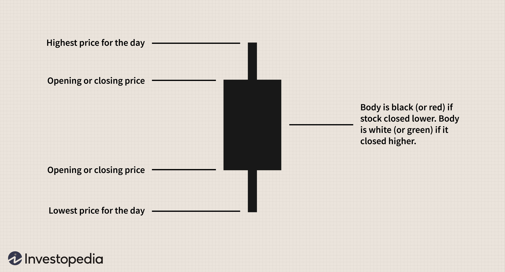

Forex trading involves the exchange of currencies in a global marketplace where participants engage in buying and selling activities. It is crucial for traders to understand and utilize various trading methods to achieve success. Operating on a 24-hour basis, the forex market is the most actively traded market worldwide, accommodating participants from different time zones and providing continuous trading opportunities. 

Forex trading methods vary widely, from manual systems that rely on individual decision-making and analysis, to automated trading algorithms that execute trades based on pre-defined criteria. Each method offers distinct advantages and limitations. For instance, manual trading allows for a personalized approach and flexibility in decision-making but may be limited by the trader's ability to react swiftly to market changes. Conversely, algorithmic trading can process vast amounts of data at high speeds and execute trades without emotional influences but demands thorough coding and testing to ensure reliable performance.



As this article outlines, we will examine an array of trading methods, analysis techniques, and the growing prominence of algorithmic trading. Our aim is to provide a detailed guide to assist both novice and experienced traders in making well-informed decisions. By exploring these components, traders can develop a comprehensive understanding of the forex market, improve their trading strategies, and enhance their ability to adapt to market changes.

## Table of Contents

## Types of Forex Market Analysis

Forex market analysis is a fundamental component of successful trading, providing traders with the essential information needed to make informed buy or sell decisions. Analysis in the forex market is categorized into three main types: fundamental, technical, and weekend analysis.

Fundamental analysis involves examining economic indicators that can influence currency values. Key factors include interest rates, inflation rates, gross domestic product (GDP), employment data, and geopolitical events. For instance, a country's interest rate policy can affect capital inflows and outflows, influencing currency demand. High interest rates typically attract foreign investors seeking better returns, thus appreciating the country's currency. Conversely, a decrease in interest rates might lead to a currency depreciation. Geopolitical events, such as elections or conflicts, can also have immediate and significant impacts on currency values. Traders employing fundamental analysis aim to understand these macroeconomic indicators and predict how they might drive currency prices in the short and long term.

Technical analysis, distinct from [fundamental analysis](/wiki/fundamental-analysis), relies on charting tools and historical price data to forecast future market movements. Technical analysts, or chartists, use price charts and technical indicators, such as moving averages, relative strength index (RSI), and MACD (Moving Average Convergence Divergence), to identify patterns and trends. The core premise of technical analysis is that historical price activity tends to repeat itself, and by studying past price movements, analysts can anticipate future behavior. Techniques like candlestick charting and pattern recognition (e.g., head and shoulders, flags, or triangles) serve as the basis for many technical trading strategies.

Weekend analysis, the third type, allows traders to prepare for the upcoming trading week when markets are closed. During this period, traders can analyze the events of the previous week and anticipate potential market movements. This form of analysis is strategic, enabling traders to establish a broader overview and formulate plans without the pressure of live market fluctuations. By reflecting on last week’s market performance and considering upcoming economic releases or events that might affect the market, traders can develop strategies for the week ahead.

In summary, understanding and integrating these different types of analysis can significantly enhance a trader's ability to navigate the [forex](/wiki/forex-system) market effectively. Each type of analysis provides unique insights, and their combined use can lead to more robust and informed trading decisions.

## Forex Trading Strategies

Forex trading strategies are vital tools for traders aiming to navigate the complexities of the forex market. These strategies provide structure and guidance, allowing traders to capitalize on market movements while mitigating risks.

One of the most prevalent strategies is [trend following](/wiki/trend-following). This approach involves identifying and following the direction of a market trend, whether upward or downward, to maximize potential gains. Traders employing trend following often use technical indicators such as moving averages or trend lines to determine entry and [exit](/wiki/exit-strategy) points. For instance, a trader might decide to buy a currency pair when its price crosses above the moving average, indicating an upward trend, and sell when it drops below the moving average.

Another commonly used strategy is mean reversion. This strategy is based on the assumption that asset prices will eventually revert to their historical average or mean. Traders executing mean reversion strategies look for price extremes or anomalies, betting on a return to average levels. This strategy often requires statistical analysis to identify these divergence points and can be more effective in markets with stable price ranges.

When selecting a strategy, it is essential for traders to consider current market conditions and personal trading goals. Market conditions can vary significantly, with some periods favoring trend following, such as during strong economic data releases, while others might be more suitable for mean reversion, especially during low [volatility](/wiki/volatility-trading-strategies) and range-bound markets. 

Moreover, risk management plays a critical role in any trading strategy. Effective risk management involves setting stop-loss orders, determining position sizes, and adhering to a disciplined trading plan to protect against significant losses. For example, a trader might use a fixed percentage of their account balance to determine position size, ensuring that no single trade poses an undue risk to their overall portfolio. Implementing stop-loss orders can also prevent substantial losses by automatically closing positions when predetermined price levels are reached.

In summary, forex trading strategies such as trend following and mean reversion offer diverse approaches to trading by focusing on different market aspects. Choosing the right strategy involves understanding the market environment and aligning it with one's trading objectives, all while prioritizing robust risk management practices to safeguard against potential losses.

## Understanding Algo Trading in Forex

Algorithmic trading, often referred to as algo trading, employs computer programs to conduct trading activities based on predetermined rules or criteria. The core advantage of this method is its capacity for high-speed execution, enabling the rapid processing of numerous trades simultaneously. This is particularly valuable in the forex market, where the ability to react swiftly to market fluctuations can significantly impact profitability.

Algo trading minimizes the influence of human emotions, which are often detrimental to trading decisions. By adhering strictly to well-defined algorithms, emotional biases, such as fear or greed, are removed from the trading process. This results in more consistent and objective decision-making, potentially increasing the reliability of trade outcomes.

Traders have the option to either develop their own algorithms or utilize pre-existing ones available through trading platforms. Developing custom algorithms allows traders to tailor strategies specifically to their objectives and market views. However, this requires a deep understanding of both programming and market dynamics to ensure success. A typical example in Python might include defining an algorithm that automatically buys a currency pair when a short-term moving average crosses above a long-term moving average, indicating a bullish trend:

```python
def moving_average_crossover(prices, short_window, long_window):
    short_ma = prices.rolling(window=short_window).mean()
    long_ma = prices.rolling(window=long_window).mean()
    return short_ma > long_ma

# Example usage with historical price data
prices = get_historical_data('EUR/USD')
buy_signals = moving_average_crossover(prices, short_window=20, long_window=50)
```

Despite its advantages, algo trading is not without challenges. The algorithms require comprehensive [backtesting](/wiki/backtesting) to validate their effectiveness in historical market conditions. This testing is critical to ensure the algorithm's performance under various scenarios and to minimize risks associated with its deployment.

Moreover, continuous monitoring is essential, as market conditions are dynamic, and an algorithm that performs well under certain conditions might fail in others. Over-reliance on past data during the backtesting phase can lead to overfitting, where an algorithm is too finely tuned to historical patterns and performs poorly in live trading environments.

In conclusion, while algo trading presents a sophisticated and efficient approach to forex trading, its success is contingent upon proper development, testing, and monitoring. Traders need to possess or acquire the technical expertise required to set up and maintain these systems effectively, constantly adapting them to maintain their relevance in an ever-changing market.

## Risks and Challenges

Forex trading, while offering significant opportunities, also presents a variety of risks and challenges that traders must navigate. The highly volatile nature of the forex market means that currency prices can experience rapid fluctuations within short periods, leading to potential losses. This volatility is one of the primary risks inherent to forex trading, as external factors such as economic news, geopolitical events, and sudden market sentiment shifts can cause unpredictable market movements.

In the domain of [algorithmic trading](/wiki/algorithmic-trading), one significant challenge is ensuring that algorithms are properly coded and thoroughly tested. An inadequately tested algorithm may fail to perform in live market conditions, leading to unexpected and potentially costly trading outcomes. For instance, if a trading algorithm is not robustly designed, it could misinterpret market signals and execute erroneous trades, exacerbating losses rather than mitigating them.

Another prevalent risk in the use of trading algorithms is overfitting during the backtesting phase. Overfitting occurs when a model is excessively tailored to historical data, capturing noise instead of genuine market patterns. This means that while the algorithm may show excellent performance on past data, it could fail to adapt to new, unseen data in the real market, as it lacks generality. To mitigate this, traders should employ techniques like cross-validation and use a diverse set of data for testing.

Emotion-driven trading is another risk that affects both manual and automated trading. Human traders are susceptible to psychological factors such as fear, greed, and panic, which can lead to irrational decision-making and deviation from planned strategies. Even in algorithmic trading, when humans intervene or override automated systems based on emotional responses, it undermines the advantages of systematic trading. This highlights the importance of adhering to well-defined strategies that prioritize objective criteria over emotional impulses.

To address these challenges, traders can adopt risk management strategies such as setting stop-loss orders and maintaining a balanced trading portfolio. This way, they can limit potential drawdowns and ensure that trading strategies are consistently aligned with their risk tolerance and investment goals. Developing a profound understanding of market dynamics and continuously improving algorithmic strategies through rigorous testing and validation can also help in mitigating the inherent risks associated with forex trading.

## The Future of Forex Trading

Advancements in technology are significantly influencing forex trading, creating a landscape where algorithmic (algo) trading is increasingly accessible and sophisticated. This evolution is largely driven by the integration of [machine learning](/wiki/machine-learning) and [artificial intelligence](/wiki/ai-artificial-intelligence) (AI) into forex trading strategies. Machine learning algorithms, especially, have the capacity to analyze vast datasets to identify patterns and trends that might not be immediately evident to human traders. These algorithms can adapt to new market conditions, learning from real-time data to improve decision-making processes.

The implementation of AI in forex trading allows for the development of more complex trading strategies, which can be backtested and optimized through simulated conditions before being applied in live markets. By utilizing AI, traders can minimize human errors, thereby improving the accuracy of forecasts and trading decisions. This ability to process and analyze large volumes of data quickly and effectively is transforming the speed and precision of trading actions.

Moreover, the evolution of trading platforms is providing traders with sophisticated tools and comprehensive datasets that enhance decision-making. Modern trading platforms support advanced charting tools, real-time analytics, and customizable indicators that offer unparalleled insight into market dynamics. These platforms often come with APIs (Application Programming Interfaces) allowing traders to connect and implement custom algorithms directly, thereby automating complex trading strategies.

Despite these technological advancements, the foundational principles of trading remain crucial. Risk management, including the establishment of stop-loss and take-profit levels, continues to be a fundamental practice in protecting against significant losses. Traditional analyses such as fundamental and technical remain relevant, providing essential insights that complement algorithmic strategies. 

The fusion of technology with these fundamental principles presents a balanced approach, ensuring traders are equipped to navigate the complexities of the forex market. As these technologies advance, they promise to provide even greater efficiencies and opportunities, but traders must remain vigilant of the potential challenges, such as data quality issues and the possibility of over-reliance on automated systems which might not account for unprecedented market events.

## Conclusion

Forex trading methods and strategies are diverse, catering to a wide array of trading preferences and goals. Whether a trader opts for manual strategies or embraces automated systems, maintaining an informed perspective and adapting strategies in response to market dynamics is essential. The forex market is characterized by volatility and rapid changes, necessitating continuous research and strategy adjustments to stay competitive and minimize risks.

The integration of multiple analysis methods, such as fundamental, technical, and algorithmic trading, is conducive to enhancing trading effectiveness. By combining these approaches, traders can achieve a more comprehensive understanding of market trends and patterns, thus making more informed decisions. Algorithmic solutions provide the advantage of speed and accuracy, yet they must be carefully monitored and refined to avoid issues such as overfitting or malfunctioning during volatile periods.

Caution and preparedness are crucial for successfully navigating the forex market. This involves developing a solid grasp of trading methods, recognizing the risks inherent in each strategy, and implementing robust risk management practices to protect against significant losses. Emotional discipline is also critical, as it helps avoid impulsive decisions that can arise from market fluctuations.

Ultimately, success in forex trading lies in a trader’s ability to combine knowledge, adaptability, and technological tools to create a balanced and informed approach. By continuously evaluating and updating their methods, traders can effectively leverage the opportunities the forex market presents while mitigating its inherent challenges.

## References & Further Reading

[1]: Bergstra, J., Bardenet, R., Bengio, Y., & Kégl, B. (2011). ["Algorithms for Hyper-Parameter Optimization."](https://proceedings.neurips.cc/paper/2011/file/86e8f7ab32cfd12577bc2619bc635690-Paper.pdf) Advances in Neural Information Processing Systems 24.

[2]: ["Advances in Financial Machine Learning"](https://www.amazon.com/Advances-Financial-Machine-Learning-Marcos/dp/1119482089) by Marcos Lopez de Prado

[3]: ["Evidence-Based Technical Analysis: Applying the Scientific Method and Statistical Inference to Trading Signals"](https://www.amazon.com/Evidence-Based-Technical-Analysis-Scientific-Statistical/dp/0470008741) by David Aronson

[4]: ["Machine Learning for Algorithmic Trading"](https://github.com/stefan-jansen/machine-learning-for-trading) by Stefan Jansen

[5]: ["Quantitative Trading: How to Build Your Own Algorithmic Trading Business"](https://books.google.com/books/about/Quantitative_Trading.html?id=j70yEAAAQBAJ) by Ernest P. Chan