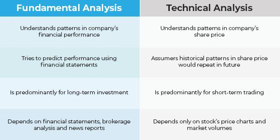

## Table of Contents

## What is Forex trading and why is analysis important?

Forex trading, also known as foreign exchange trading, is when people buy and sell different currencies to make money. It's like a big market where you can trade dollars for euros, or yen for pounds, hoping that the currency you buy will become more valuable than the one you sold. People do this trading all over the world, and it happens all the time, even while you're sleeping.

Analysis is really important in Forex trading because it helps traders make smart choices. There are two main types of analysis: technical and fundamental. Technical analysis looks at past price movements and patterns to predict what might happen next. Fundamental analysis looks at things like a country's economy, interest rates, and political events to guess how a currency might do. By using analysis, traders can better understand the market and make decisions that could help them earn more money.

## What are the basic types of analysis used in Forex trading?

In Forex trading, there are two main types of analysis that traders use: technical analysis and fundamental analysis. Technical analysis is all about looking at charts and past price movements. Traders use this to spot patterns and trends that can help them guess where the price might go next. They use tools like moving averages, support and resistance levels, and indicators to make their predictions. It's like trying to read the future by studying the past.

Fundamental analysis, on the other hand, focuses on the bigger picture. It looks at things like a country's economy, interest rates, employment rates, and even political events. Traders use this information to understand how strong or weak a currency might be. For example, if a country's economy is doing well, its currency might get stronger. By keeping an eye on these factors, traders can make better decisions about which currencies to buy or sell.

Both types of analysis are important and many traders use them together to get a fuller picture of the market. Technical analysis helps with the timing of trades, while [fundamental analysis](/wiki/fundamental-analysis) helps understand the reasons behind currency movements. By combining the two, traders can make more informed choices and hopefully increase their chances of making a profit.

## How does technical analysis work in Forex trading?

Technical analysis in Forex trading is all about looking at charts and past price movements to make guesses about where the price might go next. Traders use special tools like moving averages, which help smooth out price data to see trends more clearly. They also look for support and resistance levels, which are like invisible barriers where the price often stops and turns around. Another tool they use is indicators, like the Relative Strength Index (RSI), which can show if a currency is overbought or oversold. By studying these patterns and tools, traders try to predict future price movements and decide when to buy or sell.

For example, if a trader sees that the price of a currency pair has been going up and down between two levels, they might think it's in a range. If the price gets close to the bottom of the range, the trader might buy, hoping it will go back up. Or, if the price breaks out of the range and starts going up, the trader might see this as a signal to buy, thinking the price will keep going higher. Technical analysis helps traders time their trades better, but it's not perfect and doesn't always work. That's why many traders use it along with fundamental analysis to make their trading decisions.

## What are some common technical indicators used by Forex traders?

Forex traders use several common technical indicators to help them understand the market and make better trading decisions. One popular indicator is the Moving Average (MA), which helps smooth out price data over a certain period to show trends more clearly. Traders often use two types of moving averages: the Simple Moving Average (SMA), which is the average price over a set number of periods, and the Exponential Moving Average (EMA), which gives more weight to recent prices. Another widely used indicator is the Relative Strength Index (RSI), which measures the speed and change of price movements to see if a currency is overbought or oversold. An RSI value above 70 might suggest that a currency is overbought and could fall soon, while a value below 30 might indicate it's oversold and could rise.

Other common indicators include the Moving Average Convergence Divergence (MACD), which helps traders see the relationship between two moving averages of a currency's price. The MACD line is calculated by subtracting the 26-period EMA from the 12-period EMA, and the signal line is a 9-period EMA of the MACD line. When the MACD line crosses above the signal line, it might be a good time to buy, and when it crosses below, it might be a good time to sell. The Bollinger Bands are also popular; they consist of a middle band being an SMA and two outer bands that are standard deviations away from the middle band. These bands help traders see if a currency's price is too high or too low compared to its recent average, which can signal when a price might reverse. By using these indicators, Forex traders can get a better idea of when to enter or [exit](/wiki/exit-strategy) trades.

## How can fundamental analysis be applied to Forex trading?

Fundamental analysis in Forex trading is about looking at the big picture of a country's economy to understand how its currency might do. Traders look at things like the country's GDP, interest rates, employment rates, and even big political events. For example, if a country's economy is growing fast and its interest rates are going up, its currency might get stronger because more people might want to invest there. On the other hand, if a country is having a hard time with high unemployment or political problems, its currency might get weaker. By keeping an eye on these big factors, traders can make better guesses about which currencies to buy or sell.

Traders also pay attention to economic reports and news that come out regularly, like the Non-Farm Payrolls in the US or the Consumer Price Index in different countries. These reports can give clues about how strong or weak an economy is. If a report shows that more people are getting jobs, it might mean the economy is doing well, and the currency could go up. If inflation is rising a lot, it might make the central bank raise interest rates, which could also make the currency stronger. By understanding these reports and what they mean for the economy, traders can make smarter choices about their trades.

## What economic indicators should Forex traders monitor?

Forex traders should keep an eye on several important economic indicators to understand how currencies might move. One key indicator is the Gross Domestic Product (GDP), which shows how much a country's economy is growing. If GDP is going up, it usually means the economy is doing well, and the currency might get stronger. Another important indicator is the [interest rate](/wiki/interest-rate-trading-strategies) set by a country's central bank. When interest rates go up, it can attract more foreign investment, making the currency stronger. Employment data, like the Non-Farm Payrolls in the US, also matters a lot. If more people are getting jobs, it's a sign of a healthy economy, which can boost the currency's value.

Other indicators that traders watch include inflation rates, like the Consumer Price Index (CPI), which shows how prices are changing. If inflation is high, the central bank might raise interest rates to control it, which can affect the currency. Trade balances are also important; if a country is exporting more than it's importing, it can lead to a stronger currency. Political events and policy changes can have a big impact too. For example, if there's a lot of uncertainty because of an election or a new policy, it might make the currency weaker. By keeping track of these indicators, Forex traders can make better guesses about which currencies to buy or sell.

## What is sentiment analysis and how is it used in Forex trading?

Sentiment analysis in Forex trading is about figuring out how people feel about a currency. Traders look at things like news, social media, and surveys to see if people are feeling good or bad about a country's money. If a lot of people think a currency will do well, it's called positive sentiment, and that might make the currency stronger. On the other hand, if people are worried or think a currency will do badly, it's called negative sentiment, and that might make the currency weaker.

Traders use sentiment analysis to help them decide when to buy or sell. For example, if they see a lot of positive news and comments about the US dollar, they might think it's a good time to buy it. They can use tools like the Commitment of Traders (COT) report, which shows what big investors are doing, or they can look at the news to see what's happening. By understanding how people feel, traders can make better guesses about where the currency might go next and make smarter trading choices.

## How do experienced traders combine different analysis methods?

Experienced traders often mix technical, fundamental, and sentiment analysis to make smarter trading choices. They use technical analysis to look at charts and past price movements, helping them find the best times to buy or sell. They might spot patterns or use indicators like moving averages and the Relative Strength Index to guess where the price might go next. At the same time, they keep an eye on fundamental analysis, which looks at big things like a country's economy, interest rates, and news events. This helps them understand why a currency might be moving and if it's likely to keep going that way. By combining these two, traders get a better picture of both the timing and the reasons behind currency movements.

In addition to technical and fundamental analysis, experienced traders also pay attention to sentiment analysis. This means they look at how people feel about a currency, using tools like social media, news, and reports like the Commitment of Traders to see if the sentiment is positive or negative. If a lot of people are feeling good about a currency, it might be a good time to buy it, and if they're feeling bad, it might be a good time to sell. By putting all these pieces together—technical patterns, economic indicators, and public sentiment—traders can make more informed decisions. This helps them see the full picture of what's happening in the market and increases their chances of making successful trades.

## What are advanced charting techniques for Forex analysis?

Advanced charting techniques in Forex analysis help traders see more details and make better guesses about where the price might go next. One popular technique is using Fibonacci retracement levels, which are lines on a chart that show where the price might stop and turn around. Traders draw these lines between big high and low points on the chart, and they look for the price to hit certain levels like 38.2%, 50%, or 61.8%. Another technique is using candlestick patterns, which are special shapes on the chart that can signal if the price might go up or down. For example, a "doji" candlestick might mean the market is unsure, while a "hammer" could mean the price might go up soon.

Traders also use advanced indicators like the Ichimoku Cloud, which is a set of lines and areas on the chart that can show support and resistance, as well as trends and [momentum](/wiki/momentum). The cloud can help traders see if the price is likely to keep going in the same direction or if it might change. Another useful tool is the Elliott Wave Theory, which looks at how prices move in waves. Traders use this to guess where the price might go next by counting the waves and looking for patterns. By using these advanced charting techniques, traders can get a deeper understanding of the market and make smarter trading choices.

## How can algorithmic trading enhance Forex analysis?

Algorithmic trading can make Forex analysis better by using computers to look at lots of data really fast. Traders can set up rules, called algorithms, that tell the computer what to do. These rules can use technical indicators, economic reports, and even sentiment data to decide when to buy or sell. Because computers can work much faster than humans, they can find patterns and make trades in seconds, which can help traders take advantage of small price changes that they might miss otherwise.

Using [algorithmic trading](/wiki/algorithmic-trading) also helps traders stick to their plans. Sometimes, people can get scared or excited and make bad choices, but a computer will follow the rules without getting emotional. This can lead to more steady and disciplined trading. Plus, algorithmic trading can handle many trades at once, so traders can work on different currency pairs and strategies at the same time, which can help them make more money and manage risk better.

## What role does risk management play in Forex analysis?

Risk management is super important in Forex trading because it helps traders protect their money. When you trade currencies, there's always a chance you might lose some of your money. That's why traders use risk management to set rules on how much they're willing to lose on each trade. They might decide to only risk a small part of their money, like 1% or 2%, on any single trade. This way, even if they lose, they won't lose too much of their total money. They also use something called a stop-loss order, which automatically closes a trade if the price goes against them too much. This helps limit how much they can lose on a bad trade.

Another way risk management helps is by helping traders make smarter choices about when to trade. By looking at how much they could lose compared to how much they could win, traders can decide if a trade is worth it. They might use something called a risk-reward ratio to see if the possible reward is big enough compared to the risk. If the reward isn't big enough, they might skip the trade. By managing risk well, traders can keep trading even if they have some losses, because they won't lose all their money at once. This helps them stay in the game longer and have a better chance of making money in the long run.

## How do expert traders adapt their analysis methods to different market conditions?

Expert traders know that the Forex market can change a lot, so they change their analysis methods to fit different situations. When the market is moving a lot, like during big news events or when there's a lot of trading, they might use more technical analysis. They look at charts and use indicators to see fast price changes and patterns. This helps them make quick trades and take advantage of the big moves. But when the market is calm and not moving much, they might focus more on fundamental analysis. They look at things like economic reports and news to understand the bigger picture and make longer-term trades.

Traders also use sentiment analysis to see how people feel about currencies, which can change a lot depending on what's happening in the world. If there's a lot of good news about a country's economy, traders might see more positive sentiment and decide to buy that currency. But if there's bad news or uncertainty, like during a political crisis, they might see more negative sentiment and decide to sell. By mixing technical, fundamental, and sentiment analysis, expert traders can adapt to whatever the market is doing. They can switch between short-term and long-term strategies, and they can change their focus to make the best trades no matter what's happening.

## References & Further Reading

[1]: Bergstra, J., Bardenet, R., Bengio, Y., & Kégl, B. (2011). ["Algorithms for Hyper-Parameter Optimization."](https://proceedings.neurips.cc/paper/2011/file/86e8f7ab32cfd12577bc2619bc635690-Paper.pdf) Advances in Neural Information Processing Systems 24.

[2]: ["Advances in Financial Machine Learning"](https://www.amazon.com/Advances-Financial-Machine-Learning-Marcos/dp/1119482089) by Marcos Lopez de Prado

[3]: ["Evidence-Based Technical Analysis: Applying the Scientific Method and Statistical Inference to Trading Signals"](https://www.amazon.com/Evidence-Based-Technical-Analysis-Scientific-Statistical/dp/0470008741) by David Aronson

[4]: ["Machine Learning for Algorithmic Trading"](https://github.com/stefan-jansen/machine-learning-for-trading) by Stefan Jansen

[5]: ["Quantitative Trading: How to Build Your Own Algorithmic Trading Business"](https://books.google.com/books/about/Quantitative_Trading.html?id=j70yEAAAQBAJ) by Ernest P. Chan