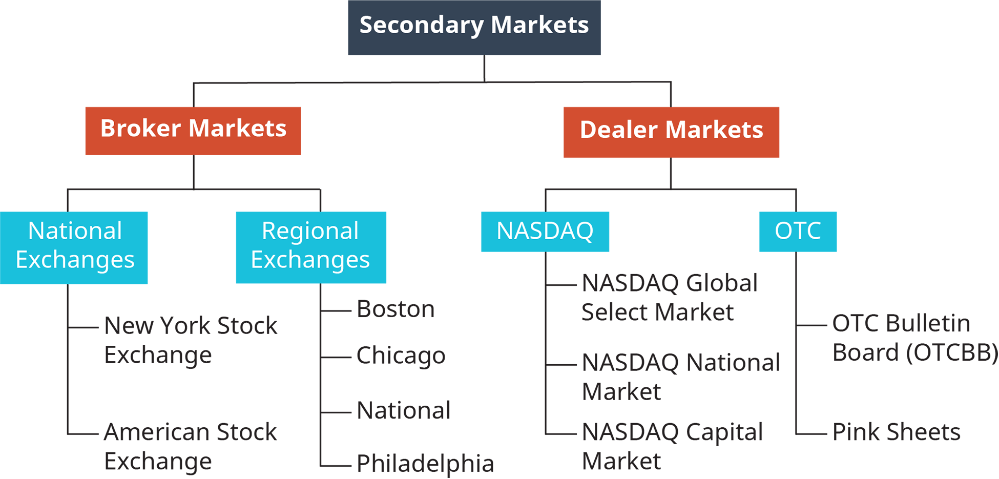

In modern financial markets, buying and selling strategies, investment methods, securities trading, and algorithmic trading are crucial components that shape the landscape for investors and traders. These elements provide diverse pathways for capital growth and risk management, helping market participants optimize their financial outcomes. 

Buying and selling strategies refer to various approaches investors use to acquire and dispose of financial assets, such as stocks and bonds. These strategies may involve transactions through brokerages, banks, or directly with other investors. Choosing the right method can significantly impact transaction costs and overall investment returns. 



Investment methods encompass a wide range of techniques that guide how investors allocate resources across different asset classes, such as equities, fixed income, and derivatives. Understanding investment principles, such as diversification and risk tolerance, is vital for making informed decisions. 

Securities trading is the process of buying and selling financial instruments within markets, where strategies like day trading, swing trading, and position trading are often employed. Each approach presents unique opportunities and risks, requiring careful analysis and risk management. 

Algorithmic trading represents a technological revolution, where pre-programmed algorithms execute trades at speeds and frequencies beyond human capabilities. This method leverages mathematical models and data analysis to identify trading opportunities, aiming to capitalize on market inefficiencies. 

The objective of this article is to offer insights into the various strategies and techniques utilized in the financial industry, helping investors and traders enhance their understanding and application of these methods for improved financial performance.

## Table of Contents

## Fundamental Concepts of Investment and Trading

Investment and trading are foundational concepts in the financial markets, each serving distinct purposes for wealth creation and risk management. Various basic investment methods facilitate participation in these markets, primarily through instruments such as stocks, bonds, mutual funds, and Exchange-Traded Funds (ETFs).

**Stocks** represent ownership in a company. When investors purchase stocks, they buy a share of a company's assets and earnings. Stocks are known for their potential for high returns, which also come with a proportionately higher risk. They are typically categorized into common and preferred stocks. Common stockholders have voting rights but are the last to receive any residual assets if the company is dissolved. Preferred stockholders receive dividends before common stockholders and have priority if the company is liquidated. 

**Bonds** are debt securities in which the investor loans money to an issuer (government or corporation) for a defined period at a fixed interest rate. Bonds are typically considered less risky than stocks due to their predictable income streams and priority over stocks in case of issuer bankruptcy. However, they also usually offer lower returns compared to stocks. Bond valuation is influenced by interest rate changes, credit ratings, and maturity durations.

**Mutual Funds** pool money from multiple investors to purchase a diversified portfolio of stocks, bonds, or other securities. Managed by professional fund managers, mutual funds offer investors diversification, which can help mitigate risk. They come with management fees and may impose load fees, impacting overall returns. Mutual funds are classified into open-end or closed-end funds based on their structural setup and liquidity features.

**Exchange-Traded Funds (ETFs)** are similar to mutual funds but are traded on stock exchanges like individual stocks. ETFs provide the benefit of diversification across various industry sectors or asset classes and usually come with lower expense ratios than mutual funds. The tradability of ETFs throughout the trading day adds flexibility for investors compared to mutual-fund end-of-day trading.

Understanding market fundamentals is crucial for investors aiming to make informed decisions. The dynamics of supply and demand, macroeconomic indicators, market sentiment, and geopolitical events are integral in shaping the prices of financial instruments. Investment decisions rooted in firm market understanding can aid in managing risks while optimizing returns.

Securities trading is categorized primarily into three types: equity, fixed income, and derivatives trading. **Equity trading** involves the buying and selling of company shares, emphasizing capital appreciation and dividend income. **Fixed income trading** encompasses the trading of debt securities, focusing on interest income and capital preservation. **Derivatives trading** involves financial contracts whose value is derived from underlying assets like stocks, commodities, or currencies. Derivatives often serve as instruments for hedging risks or speculating on future price movements.

Informed trading involves leveraging market fundamentals to assess the potential value of securities, recognizing that such an assessment can significantly influence investment strategy and trade execution.

## Buying and Selling Strategies

Investors have several avenues to buy and sell securities, each with its own set of advantages and challenges. Understanding these options is crucial for making informed decisions that align with one's financial goals and risk tolerance.

### Methods of Buying and Selling Securities

1. **Brokerages**: Brokerages act as intermediaries that facilitate transactions between buyers and sellers in the securities market. There are two primary types of brokerages: full-service brokers and discount brokers.

   - **Full-Service Brokers**: These brokers offer a comprehensive range of services including investment advice, portfolio management, and financial planning. They often charge higher fees or commissions due to the personalized service provided. Their expertise is beneficial for investors who require guidance or wish to manage large portfolios.

   - **Discount Brokers**: These brokers provide limited services, focusing primarily on executing trades at a lower cost. They are suitable for self-directed investors who have the knowledge and confidence to manage their investments without extensive support.

2. **Direct Purchase from Companies**: Some companies offer direct stock purchase plans (DSPPs), allowing investors to buy stock directly from the company. This method can eliminate brokerage fees and may offer certain tax advantages or incentives. However, it typically requires handling one's own record-keeping and trading processes, which can be cumbersome for some investors.

3. **Banks**: While traditionally associated with savings and loans, many banks now offer securities trading services. They can provide convenience through integrated financial services. Having all financial activities in one place is beneficial from a management perspective, but banks might not offer the same breadth of investment options or competitive pricing as specialized brokerages.

4. **Individual Investors**: Peer-to-peer platforms are emerging that allow investors to buy and sell securities directly from one another without intermediary services. This method can yield cost savings and offer unique investment opportunities but entails higher risk due to less regulation and oversight.

### Comparison and Considerations

- **Cost**: Discount brokers generally offer the lowest costs thanks to reduced fees and commissions. In contrast, full-service brokers charge premiums for their advisory services. Direct purchases and peer-to-peer transactions can also be cost-effective, though they may involve other hidden costs, such as taxes or platform fees.

- **Service**: Full-service brokers excel in providing personalized advice and comprehensive financial services. Discount brokers cater to investors who prefer less hand-holding. Banks provide convenience and integration, while direct and peer-to-peer options offer minimal service.

- **Complexity**: Direct purchases and peer-to-peer transactions require investors to have a solid understanding of market operations and self-management capabilities. Brokerages and banks generally offer more structured processes, facilitating ease of trading for less experienced investors.

- **Control and Flexibility**: Individual investors using discount brokers or direct purchase plans may enjoy greater control over their investment decisions. Full-service brokers often have more restrictive trading rules as they manage client investments holistically.

In conclusion, each method of buying and selling securities presents unique benefits and challenges. Investors should evaluate their personal financial goals, expertise, and service needs to determine the most suitable approach. As financial markets and technologies evolve, staying informed about these options is vital for optimizing investment outcomes.

## Investment Methods and Techniques

Investment methods and techniques form the cornerstone of any robust financial strategy, providing the framework through which individuals and institutions engage with the market to achieve their financial objectives. A comprehensive understanding of these concepts can guide investors towards more strategic and informed decisions. 

### Common Investment Strategies

**Buy-and-Hold Strategy**

The buy-and-hold strategy is a long-term investment approach where an investor purchases stocks or other securities intending to hold them for an extended period, often regardless of market fluctuations. This strategy contrasts with more active trading techniques where investors frequently buy and sell assets. The premise is that, over time, markets generally tend to rise, thus providing returns on investments that are held long enough to weather short-term volatilities. Historical data suggests that the buy-and-hold approach can lead to substantial returns, particularly in favorable economic conditions [1].

**Value Investing**

Value investing involves [picking](/wiki/asset-class-picking) stocks that appear to be undervalued in the market. Investors employing this strategy seek to capitalize on inefficiencies in the market, purchasing stocks they believe the market is underestimating. The strategy often relies on a thorough analysis of a company's financials and comparisons to intrinsic values calculated using models like Discounted Cash Flow (DCF) analysis. Pioneered by investors like Benjamin Graham and Warren Buffett, value investing maintains that, in the long term, market prices will converge with intrinsic values, allowing value investors to realize gains.

**Growth Investing**

Growth investing focuses on stocks expected to grow at an above-average rate compared to others in the market. Key indicators of [growth stocks](/wiki/growth-stocks) often include earnings growth, revenue increases, and expansion in market share. Growth investors might prioritize industries in innovative sectors such as technology or biotech, betting that future growth will lead to higher stock value despite currently high valuations.

### Advanced Investment Strategies

**Options Trading and Derivatives**

Options trading involves buying and selling options contracts, allowing investors to profit based on the movements of underlying assets without necessarily owning them. Options can provide leverage, as they allow control over shares with a smaller capital investment compared to purchasing the shares outright. Derivatives expand this concept further, including financial contracts such as futures and swaps that derive value from underlying assets or benchmarks. Although these instruments can hedge against risks or leverage positions, their complexity and high risk often require sophisticated understanding and experience in financial markets.

### Fundamental and Technical Analysis

**Fundamental Analysis**

Fundamental analysis involves evaluating a company's intrinsic value by examining related economic, financial, and other qualitative and quantitative factors. This method involves analyzing financial statements, management, competitive advantages, industry performance, and economic conditions to determine whether a stock is fairly valued. It is a cornerstone of strategies like value investing, aligning investment decisions with the underlying worth rather than market trends.

**Technical Analysis**

In contrast, technical analysis focuses on statistical trends gathered from trading activity, such as price movement and [volume](/wiki/volume-trading-strategy). It employs tools like charts and technical indicators, analyzing patterns and market signals to predict future price movements. While [fundamental analysis](/wiki/fundamental-analysis) seeks to determine the 'why', technical analysis concerns itself with the 'when', aiming to guide investors on timing trades for maximum benefit.

Comprehending these diverse methods and techniques allows investors to align their strategies with their financial goals, risk tolerance, and market understanding.

---

[1] Jeremy J. Siegel, "Stocks for the Long Run," McGraw-Hill Education, 5th Edition, 2014.

## Securities Trading: Opportunities and Risks

Securities trading is a dynamic component of the financial markets, involving the buying and selling of financial instruments like stocks, bonds, and derivatives. This ecosystem consists of various participants, including retail investors, institutional investors, market makers, brokers, and regulatory authorities, all interacting to facilitate the functioning of financial exchanges. Understanding this ecosystem is crucial for anyone participating in the market, as it provides insights into how trades are executed and the roles different entities play in maintaining market [liquidity](/wiki/liquidity-risk-premium) and efficiency.

### Trading Strategies

Trading strategies are methodologies used by traders to make decisions about buying and selling securities. Each strategy has its own advantages, risks, and suitability depending on the trader's goals and market conditions.

**Day Trading** involves buying and selling securities within the same trading day. Day traders capitalize on small price movements, often utilizing leverage to maximize returns. This strategy requires a high level of attention and quick decision-making, usually supported by technical analysis tools.

**Swing Trading** targets capturing short- to medium-term gains over several days to weeks. Swing traders often rely on technical indicators to identify entry and exit points, looking for patterns indicating potential price reversals or trends.

**Position Trading** is a longer-term strategy where trades are held for weeks to months, aiming to profit from significant price movements. This approach is typically based on fundamental analysis, considering the intrinsic value of securities and macroeconomic factors.

### Risk Management Techniques

Effective risk management is essential in securities trading to protect capital and ensure long-term success. Traders employ several techniques to manage and mitigate risks:

- **Stop-Loss Orders**: A stop-loss order is an automatic order to sell a security once its price falls to a predetermined level. This helps limit losses on a declining trade.

- **Position Sizing**: Determining the correct amount of capital to allocate to a single trade is crucial. This involves assessing one's total capital and the risk of an individual trade.

- **Diversification**: Spreading investments across a variety of securities can reduce risk exposure. Diversification aims to minimize the impact of a poor-performing asset on the overall portfolio.

- **Risk-Reward Ratio**: Traders often assess the potential profit of a trade relative to the loss they are willing to accept. A favorable risk-reward ratio helps in selecting trades with the best potential for profit relative to risk.

Implementing these strategies and techniques requires constant learning and adaptation, as market conditions and participant behavior can change rapidly. Understanding the opportunities and risks associated with securities trading enables traders to navigate the markets more effectively while safeguarding their investments.

## Algorithmic Trading: A Technological Revolution

Algorithmic trading, often referred to as algo-trading, involves using computer algorithms to execute trades at speeds and frequencies impossible for human traders. These algorithms follow pre-defined criteria, such as timing, price, or quantity, to make trading decisions. The primary purpose of [algorithmic trading](/wiki/algorithmic-trading) is to leverage computational power, taking advantage of intricate mathematical models and human oversight, to identify and exploit market inefficiencies for profit.

One popular strategy in algorithmic trading is [arbitrage](/wiki/arbitrage). Arbitrage algorithms identify price differences of the same asset across different markets or forms, buying low in one market while simultaneously selling high in another. The efficiency and speed required to exploit these opportunities make algorithms particularly suited for this strategy.

Trend-following is another strategy that depends on algorithmic execution. These algorithms analyze historical price data and trading volumes to identify trends and predict future movements. Based on these indicators, the algorithm executes trades that align with the identified trends, thus capitalizing on market [momentum](/wiki/momentum) without the need to forecast market directions.

Market-making is also a prevalent algorithmic strategy, where the algorithm provides liquidity by continuously quoting buy and sell prices for financial instruments and profiting from the spread, the difference between these prices. This strategy requires constant market monitoring and rapid execution, qualities inherent to algorithmic systems.

Algorithmic trading systems offer several benefits. They execute trades with precision and at speeds millions of times faster than a human trader could achieve. This speed minimizes market impact and reduces transaction costs. Algorithms also remove emotional bias from trading decisions, adhering strictly to predefined criteria. 

However, these systems face challenges. The complexity of algorithms requires rigorous [backtesting](/wiki/backtesting) and optimization to ensure their success in varied market conditions. Moreover, the reliance on technology poses a risk; system failures or programming errors can lead to significant financial losses. Additionally, algorithms can exacerbate market [volatility](/wiki/volatility-trading-strategies), as seen in flash crashes where automated systems rapidly reduce liquidity.

In conclusion, algorithmic trading represents a significant advancement in financial markets, empowering traders with tools for efficient and rapid execution. Balancing the potential benefits with the inherent challenges necessitates stringent risk management and continuous system enhancement.

## Backtesting and Optimization in Algorithmic Trading

Backtesting is a critical process in developing algorithmic trading strategies, as it allows traders to evaluate the effectiveness of a strategy using historical data. By simulating how a trading strategy would have performed in the past, traders can gain insights into its potential future performance. This process is essential for identifying flaws in strategy design and ensuring that strategies can adapt to various market conditions. The core idea is to replicate market conditions as closely as possible to reveal how a strategy might perform under real-world circumstances.

The accuracy of backtesting depends largely on the quality and granularity of the historical data used. Trades must be executed based on realistic constraints, such as transaction costs and order slippage, to mimic the true trading environment. It's crucial to use clean, robust datasets that accurately reflect past market conditions. Data discrepancies can lead to misguided confidence in the strategy's viability. Thus, sourcing data from reliable providers and ensuring it is well-scrubbed and free of anomalies is indispensable.

Optimizing algorithmic trading strategies involves fine-tuning various parameters to achieve the desired performance outcomes. Techniques for optimization often involve adjusting the algorithm's parameters to maximize returns while balancing risk factors. Traditional methods used in optimization include grid search, random search, and more sophisticated techniques such as genetic algorithms and [machine learning](/wiki/machine-learning) approaches.

For example, a simple grid search might involve testing a range of parameter values systematically to find the combination that yields the best performance based on historical data. Genetic algorithms, inspired by natural selection, may also be used to iterate through potential solutions, applying evolutionary concepts such as mutation and crossover to gradually improve the strategy's effectiveness.

A simple Python example of backtesting and parameter optimization might involve a strategy based on moving averages:

```python
import pandas as pd
import numpy as np
import talib

# Load historical data
data = pd.read_csv('historical_data.csv')
close_prices = data['Close']

# Define moving average strategy
def moving_average_strategy(short_window, long_window):
    signals = pd.DataFrame(index=data.index)
    signals['signal'] = 0.0

    signals['short_mavg'] = talib.SMA(close_prices, window=short_window)
    signals['long_mavg'] = talib.SMA(close_prices, window=long_window)

    signals['signal'][short_window:] = np.where(
        signals['short_mavg'][short_window:] > signals['long_mavg'][short_window:], 1.0, 0.0)

    signals['positions'] = signals['signal'].diff()
    return signals

# Backtest the strategy
short_window = 40
long_window = 100
signals = moving_average_strategy(short_window, long_window)

# Evaluate performance (e.g., calculate returns)
data['returns'] = close_prices.pct_change()
strategy_returns = data['returns'] * signals['positions'].shift()

# Optimization placeholder (example of parameter tuning)
best_performance = -np.inf
for short_window in range(20, 80, 10):
    for long_window in range(50, 200, 10):
        signals = moving_average_strategy(short_window, long_window)
        strategy_returns = data['returns'] * signals['positions'].shift()
        performance = np.mean(strategy_returns) / np.std(strategy_returns)  # Sharpe ratio

        if performance > best_performance:
            best_parameters = (short_window, long_window)
            best_performance = performance

print(f'Best parameters: Short window: {best_parameters[0]}, Long window: {best_parameters[1]}')
```

Techniques like these allow traders to optimize strategy parameters and improve robustness, enhancing the likelihood of successful deployment in live markets. Furthermore, ensuring data accuracy and accounting for outliers or erroneous entries strengthens the reliability of backtesting outcomes. It prevents overfitting, where a model performs well on historical data but poorly in the actual trading environment due to excessive tailoring to past data idiosyncrasies.

In conclusion, backtesting and optimization are indispensable components in the lifecycle of algorithmic trading strategy development. By systematically evaluating, refining, and validating strategies before live deployment, traders can better manage risks and enhance their strategies' potential profitability.

## Choosing the Right Trading Platform and Tools

When deciding on a trading platform and tools, investors and traders need to consider several key features to maximize their trading efficiency and execution speed. A suitable trading platform should provide a user-friendly interface, low latency execution, comprehensive data analysis tools, reliable customer support, and robust security measures.

A user-friendly interface is vital to facilitate easy navigation and prompt decision-making. Low latency execution ensures the trades are processed at near-instantaneous speeds, which is crucial in fast-moving markets. Comprehensive data analysis tools allow traders to perform both fundamental and technical analysis efficiently, aiding in informed decision-making. Platforms should also offer charting tools, economic calendars, and real-time market data. Customer support and security are indispensable, as technical glitches and security breaches can result in significant financial losses.

Several popular trading platforms and APIs are worth comparing. MetaTrader 4 and 5, for example, are well-known for [forex](/wiki/forex-system) trading, offering a range of trading signals and a comprehensive suite of analytical tools. On the other hand, platforms like TradingView are renowned for their advanced charting capabilities, making them popular with technical analysts.

For algorithmic trading, platforms such as QuantConnect and MetaTrader's MQL5 offer robust APIs. QuantConnect supports multiple programming languages, including Python and C#, allowing traders to backtest their strategies with high flexibility. MetaTrader's MQL5 language is specifically designed for automated trading and features a community marketplace where users can buy or sell trading robots and indicators.

Python, a popular programming language in financial markets, can enhance trading platforms significantly. Libraries such as Pandas for data manipulation, NumPy for numerical calculations, and Matplotlib or Plotly for data visualization can augment analysis and strategy development. An example Python script to calculate a simple moving average (SMA) might look like this:

```python
import pandas as pd

# Assuming 'data' is a DataFrame containing the closing prices
data['SMA'] = data['Close'].rolling(window=20).mean()
```

This code snippet demonstrates how technical indicators can be computed in a trading strategy. Additionally, using APIs to automate trading processes can significantly improve execution times and reduce emotional bias in trading decisions.

By leveraging advanced technology, traders and investors can optimize their operations. High-frequency traders might prioritize platforms with minimal latency, whereas those focusing on manual trading might prefer in-depth analytical tools. Selecting the right combination of platform features and tools, aligned with one's trading strategy, is crucial for achieving consistent success in the financial markets.

## Conclusion

The exploration of various investment and trading strategies, from basic methods to cutting-edge algorithmic systems, underscores the dynamic and complex nature of modern financial markets. Investors and traders, whether relying on traditional securities trading or venturing into algorithmic trading, must remain agile and informed to navigate these ever-evolving landscapes. Traditional methods like choosing between full-service brokers and discount brokerages, employing strategies such as buy-and-hold or growth investing, and understanding market fundamentals form the bedrock of investment knowledge.

In parallel, the rise of algorithmic trading signifies a significant shift towards technology-driven practices. Sophisticated techniques such as backtesting and optimization elevate trading strategies, demanding accuracy and robustness in data and execution tools. These approaches illustrate the necessity for an adaptive mindset, embracing both the historical contexts of investment strategies and the potential of technological advancements.

Continuous learning emerges as a cornerstone for success. Markets evolve, influenced by geopolitical events, technological breakthroughs, and shifts in consumer sentiment. Therefore, a commitment to ongoing education, whether through formal training, self-directed learning, or practical experience, is essential for sustaining profitability and growth.

Traders and investors are encouraged to engage with the diversity of strategies discussed, approaching them as tools to be tailored to their individual objectives and risk tolerances. Whether one is programming algorithmic paths in Python or analyzing market patterns through technical charts, the journey is marked by personal exploration and adaptation.

Ultimately, the pursuit of financial success requires a blend of foundational understanding and innovative application. By critically assessing and continuously adjusting their approaches, investors and traders can position themselves to thrive in the intricate and fast-paced world of finance.

## References & Further Reading

[1]: Siegel, J. J. (2014). ["Stocks for the Long Run"](https://en.wikipedia.org/wiki/Stocks_for_the_Long_Run). McGraw-Hill Education, 5th Edition.

[2]: Lopez de Prado, M. (2018). ["Advances in Financial Machine Learning"](https://www.amazon.com/Advances-Financial-Machine-Learning-Marcos/dp/1119482089). Wiley.

[3]: Aronson, D.R. (2006). ["Evidence-Based Technical Analysis: Applying the Scientific Method and Statistical Inference to Trading Signals"](https://www.amazon.com/Evidence-Based-Technical-Analysis-Scientific-Statistical/dp/0470008741). Wiley.

[4]: Jansen, S. (2022). ["Machine Learning for Algorithmic Trading"](https://github.com/stefan-jansen/machine-learning-for-trading). Packt Publishing.

[5]: Chan, E. P. (2009). ["Quantitative Trading: How to Build Your Own Algorithmic Trading Business"](https://github.com/ftvision/quant_trading_echan_book). Wiley.