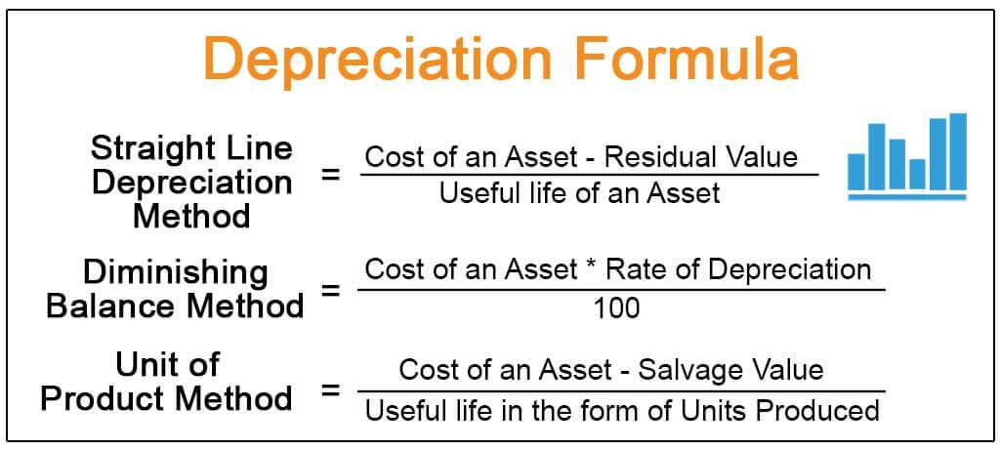

Depreciation is a fundamental accounting practice that enables companies to systematically allocate the expense of tangible assets over their expected useful life. This methodical approach allows businesses to recognize asset expenses gradually, rather than as a one-time financial hit, which aligns expenses with the revenue those assets generate. The calculation of depreciation is not merely a bookkeeping exercise; it significantly influences financial reporting and tax obligations. By spreading the asset's cost over time, companies can match expenses with income, thus providing a more accurate financial picture.

Several methods exist for calculating depreciation, each with distinct impacts on financial statements and taxation. The choice of method—be it straight-line, declining balance, sum-of-the-years' digits, or units of production—can lead to variations in reported profits and tax liabilities. Straight-line depreciation evenly splits the asset's cost across its useful lifespan, offering simplicity and consistency. In contrast, methods like declining balance front-load the expense, reflecting quicker asset consumption in the early years.



In addition to its accounting and tax implications, depreciation bears relevance in modern financial strategies, particularly in algorithmic trading. Here, the consideration of asset depreciation becomes crucial in adjusting financial models that drive automated trading decisions. As algorithms evaluate company valuations and performance metrics, understanding asset depreciation patterns helps in predicting asset-related expenditure and informing trading strategies.

In summary, mastery over depreciation methods and their implications extends beyond accounting, influencing taxation and algorithmic trading strategies, offering a conduit for enhanced financial management and forecasting.

## Table of Contents

## Understanding Depreciation

Depreciation is a critical accounting concept that represents the reduction in value of a company's tangible assets over time as a result of factors like wear and tear, usage, and obsolescence. This gradual reduction in value is pivotal for both accounting and financial reporting purposes as it ensures that the cost of an asset is allocated over its useful life. Rather than incurring a large expense at the time of purchase, depreciation spreads this cost across several accounting periods, providing a more accurate reflection of the asset's long-term economic value and impact on profitability.

There are four widely recognized methods to calculate depreciation, each with its unique approach to allocating asset costs:

1. **Straight-Line Method**: The most straightforward approach, this method involves evenly distributing the depreciable value of an asset over its useful life. The formula is:
$$
   \text{Depreciation Expense} = \frac{\text{Cost of Asset} - \text{Salvage Value}}{\text{Useful Life}}

$$

   Here, the cost of the asset is reduced by any expected salvage value, and this net cost is divided by the asset's useful life. This approach is suitable for assets with consistent usage and wear over time.

2. **Declining Balance Method**: An accelerated depreciation method, the declining balance accounts for higher depreciation costs in the early years of an asset's life. This methodology recognizes that assets often lose value more quickly in the initial years of operation. The double declining balance is a common variant and can be expressed as:
$$
   \text{Depreciation Expense} = 2 \times \text{Straight-Line Rate} \times \text{Book Value at Beginning of Year}

$$

   This method is beneficial for tech equipment or vehicles that rapidly decrease in value.

3. **Sum-of-the-Years' Digits (SYD) Method**: Another accelerated depreciation method, SYD assigns a decreasing depreciation expense over an asset's life by applying a fraction based on the sum of the years. The calculation involves:
$$
   \text{Depreciation Expense} = \frac{\text{Remaining Life of Asset}}{\text{Sum of the Years}} \times (\text{Cost of Asset} - \text{Salvage Value})

$$

   The sum of the years is calculated by adding the digits up to the asset's useful life number (e.g., for a 5-year life, 5 + 4 + 3 + 2 + 1 = 15).

4. **Units of Production Method**: Unlike time-based methods, this approach bases depreciation on the asset's actual usage or production output. The formula is:
$$
   \text{Depreciation Expense} = \frac{(\text{Cost of Asset} - \text{Salvage Value})}{\text{Total Estimated Production}} \times \text{Actual Production}

$$

   This method is particularly useful for machinery that incurs wear proportional to its output rather than elapsed time, ensuring that quarterly depreciation aligns with operational intensity.

By choosing the appropriate method, businesses can better manage profitability, tax liabilities, and financial disclosures, reflecting a more accurate financial and operational picture.

## Methods of Calculating Depreciation

Depreciation accounting allows businesses to distribute the cost of physical assets over their useful lives. There are several methods employed to calculate depreciation, each with its nuances and suitability depending on the nature of the asset and the company’s financial strategy.

### Straight-Line Method

The straight-line method is the simplest and most commonly used method of depreciation. It involves spreading the cost of an asset evenly across its useful life. The annual depreciation expense is calculated using the following formula:

$$
\text{Depreciation Expense} = \frac{\text{Cost of Asset} - \text{Salvage Value}}{\text{Useful Life}}
$$

Where the **Cost of Asset** is the initial purchase price, **Salvage Value** is the estimated residual value at the end of its useful life, and **Useful Life** is the expected period of use.

### Declining Balance Method

The declining balance method is an accelerated depreciation model that results in higher depreciation expenses in the early years of an asset's life, decreasing over time. This method is apt for assets that lose value quickly:

$$
\text{Depreciation Expense} = \text{Book Value at Beginning of Year} \times \frac{\text{Depreciation Rate}}{100}
$$

The depreciation rate is often determined as a multiple of the straight-line rate. For example, in the double-declining balance method, this multiple is two. This method reflects the usage pattern of assets that are more productive or useful early in their life cycle.

### Sum-of-the-Years' Digits (SYD) Method

The Sum-of-the-Years' Digits method is another accelerated depreciation approach that applies a sliding-scale fraction to the asset's depreciable base each year. The formula involves calculating a fraction with a numerator that decreases annually and a fixed denominator:

$$
\text{Depreciation Expense} = \frac{\text{Remaining Life}}{\text{Sum of the Years' Digits}} \times (\text{Cost of Asset} - \text{Salvage Value})
$$

The sum of the years' digits is the sum of the years of the asset's useful life. For an asset with a useful life of five years, this would be 1 + 2 + 3 + 4 + 5 = 15.

### Units of Production Method

Instead of time, the units of production method bases depreciation on an asset's actual usage or output. This method is suitable for machinery and equipment where usage rather than time dictates wear and tear:

$$
\text{Depreciation Expense} = \left(\frac{\text{Actual Units Produced}}{\text{Total Estimated Units}}\right) \times (\text{Cost of Asset} - \text{Salvage Value})
$$

By providing a clear linkage between actual output and depreciation expense, this method enables more precise matching of costs with revenue in asset-heavy industries.

Each depreciation method holds unique advantages and disadvantages, impacting a company’s financial statements and tax obligations differently. Understanding these methods is essential for optimizing financial reporting and maximizing tax benefits related to capital investments.

## Examples of Depreciation Calculations

To understand the practical application of various depreciation methods, we will explore how a hypothetical purchase of machinery is treated under different approaches. Consider a scenario where a company has purchased a machine for $100,000 with an estimated salvage value of $10,000 and a useful life of 5 years.

### Straight-Line Method
The straight-line method is the simplest and most commonly used. The annual depreciation expense is calculated by subtracting the salvage value from the cost of the asset and dividing by its useful life.

$$
\text{Annual Depreciation} = \frac{\text{Cost} - \text{Salvage Value}}{\text{Useful Life}}
$$

$$
\text{Annual Depreciation} = \frac{100,000 - 10,000}{5} = 18,000
$$

Under this method, the company would recognize a depreciation expense of $18,000 each year for five years.

### Declining Balance Method
This accelerated depreciation method results in higher expenses in the initial years. For this example, consider the double-declining balance method with a rate calculated as:

$$
\text{Depreciation Rate} = \frac{2}{\text{Useful Life}} = \frac{2}{5} = 40\%
$$

The annual depreciation expense is calculated by applying the rate to the book value at the beginning of each year.

**Year 1:**
$$
\text{Depreciation Expense} = 100,000 \times 0.4 = 40,000
$$
**Year 2:**
$$
\text{Book Value} = 100,000 - 40,000 = 60,000
$$
$$
\text{Depreciation Expense} = 60,000 \times 0.4 = 24,000
$$

This continues until the book value reaches the salvage value.

### Sum-of-the-Years' Digits Method
This method applies a decreasing fraction to the depreciation base each year. The sum-of-the-years digits for a 5-year life is:

$$
1 + 2 + 3 + 4 + 5 = 15
$$

Depreciation fractions for each year are calculated as follows:

**Year 1:**
$$
\frac{5}{15} \] 
**Year 2:**
$$
\frac{4}{15} \] 

The depreciation expense for Year 1 is:

$$
\text{Depreciation} = (100,000 - 10,000) \times \frac{5}{15} = 30,000
$$

And for Year 2:

$$
\text{Depreciation} = 90,000 \times \frac{4}{15} = 24,000
$$

### Units of Production Method
Depreciation here is based on the actual usage. Assume the machine is expected to produce 100,000 units over its life. If 20,000 units are produced in the first year, the depreciation is:

$$
\text{Depreciation per Unit} = \frac{100,000 - 10,000}{100,000} = 0.9
$$

$$
\text{Depreciation for Year 1} = 20,000 \times 0.9 = 18,000
$$

### Financial Statement Impact
Different methods of depreciation affect financial statements variably due to the timing of expense recognition. Accelerated methods like declining balance result in higher early expenses, reducing taxable income initially but increasing it in later years compared to the straight-line method. The units of production method directly correlates with output, making it suitable for manufacturing-intensive industries. These differences illustrate the strategic importance of selecting an appropriate depreciation method aligned with business operations and financial strategies.

## Special Considerations in Depreciation

Choosing the right depreciation method is a critical decision that can have significant implications for a company’s financial health and strategic planning. Various factors, such as industry norms, asset types, and organizational financial strategies, influence this choice. Moreover, adherence to Generally Accepted Accounting Principles (GAAP) is essential in guiding which method is appropriate for both accurate financial reporting and compliance.

### Industry and Asset-Type Considerations

Different industries may favor particular depreciation methods due to the nature of their assets and operational requirements. For instance, industries with rapidly advancing technology, like electronics, might prefer accelerated depreciation methods. This approach arises because such assets can become obsolete quickly, necessitating an accounting method that reflects their accelerated loss of utility. On the other hand, industries such as real estate generally utilize the straight-line method because assets like buildings tend to have a more predictable and stable depreciation pattern over time.

Moreover, the type of asset itself can dictate the depreciation method. Machinery subject to intensive use might utilize the units of production method, which aligns depreciation expenses with the actual output. In contrast, office furniture might be more appropriately depreciated using the straight-line method due to its consistent usage over time.

### GAAP Compliance

Adhering to GAAP is mandatory in financial reporting for publicly traded companies in the United States, thereby influencing depreciation method selection. GAAP dictates that companies must choose methods that accurately reflect asset usage and the economic reality of asset consumption. This ensures transparency and consistency in financial statements, enabling stakeholders to make informed decisions.

For example, the straight-line method, recognized for its simplicity and consistency, is favored under GAAP for assets whose economic benefit is uniform over time. Conversely, methods like the declining balance or sum-of-the-years' digits are justified under GAAP when an asset's economic benefit decreases over time.

### Tax Implications

Depreciation also plays a pivotal role in a company's tax strategy. Different depreciation methods can lead to varying tax outcomes, influencing decisions regarding capital investments. The Internal Revenue Service (IRS) specifies parameters for tax depreciation, which can differ from those accepted for financial reporting due to GAAP. For instance, companies may use the Modified Accelerated Cost Recovery System (MACRS) for tax purposes, which allows for accelerated depreciation and thus, larger tax deductions in the early years of an asset’s life.

These tax strategies directly impact a company’s cash flow and investment capacity. Accelerated depreciation methods, by maximizing upfront deductions, can reduce taxable income more rapidly, freeing up capital for reinvestment. However, businesses must balance the desire for tax efficiency with the truthfulness of financial reporting, maintaining a consistent approach that satisfies both tax obligations and GAAP standards.

In sum, selecting an appropriate depreciation method involves a strategic evaluation of industry practices, asset characteristics, and the dual requirements of tax efficiency and financial transparency. The proper alignment of these factors ensures not only compliance and accuracy in financial reporting but also the optimization of a company’s financial position and investment potential.

## Integration with Algorithmic Trading

Algorithmic trading leverages the power of automated systems and mathematical models to execute trades at optimal speeds and reduce human errors. Integrating depreciation data into these models can enhance accuracy by refining asset valuation processes, which in turn influences trading decisions.

Depreciation plays a significant role in the valuation of assets, as it reflects the reduction in asset value over time due to wear, tear, or obsolescence. In [algorithmic trading](/wiki/algorithmic-trading), accurate asset valuation is crucial for strategies that rely on analyzing an asset's historical and current value to predict future performance. For instance, incorporating depreciation calculations helps in adjusting the book value of physical assets in a company's balance sheet, leading to more precise estimations of the net worth of a company. This data can be pivotal when algorithms are configured to target undervalued stocks or assets, optimizing trading strategies.

Moreover, algorithms can be programmed to adjust financial models based on depreciation schedules such as the straight-line method or accelerated methods like declining balance or sum-of-the-years' digits. Each method influences the timing and magnitude of depreciation, thereby affecting tax liabilities and net income. By integrating these variables, algorithmic systems can better forecast earnings, taking into account potential changes in asset depreciation. Python, widely used for developing algorithmic trading models, can easily integrate these calculations. Below is a simplified example of how one might calculate depreciation in Python using the straight-line method:

```python
def straight_line_depreciation(cost, salvage_value, useful_life):
    return (cost - salvage_value) / useful_life

# Example
asset_cost = 10000  # Initial cost of the asset
salvage_value = 2000  # Asset value at the end of useful life
useful_life = 5  # Useful life in years

annual_depreciation = straight_line_depreciation(asset_cost, salvage_value, useful_life)
print(f"Annual Depreciation: ${annual_depreciation}")
```

By incorporating calculations like these, trading algorithms can dynamically update their forecasts and strategies, making the systems more responsive to real-time financial data. Depreciation data also assists in stress-testing models against economic indicators that might affect asset life expectancy and value. This integration ensures that algorithms account for depreciation-driven changes in asset valuation, resulting in more informed and effective trading decisions.

In summary, while depreciation is a traditional accounting practice, its application in algorithmic trading highlights its importance in adjusting financial models. By reflecting the actual economic value of assets, depreciation data aids automated trading systems in making accurate predictions and informed trade executions.

## Frequently Asked Questions (FAQs)

**What is depreciation, and why is it important?**

Depreciation is an accounting method that systematically allocates the cost of a tangible asset over its useful life. This practice reflects the asset's consumption, wear, and eventual obsolescence, ensuring that financial statements present a more accurate picture of a company’s financial health. By spreading the cost of an asset over time, depreciation avoids large, upfront expenses in financial statements, thereby stabilizing earnings and reflecting the true expense associated with owning and using the asset. It is important because it aligns the recording of an asset's expense with the revenue it generates, thereby adhering to the matching principle in accounting. Understanding depreciation is essential for making informed decisions regarding asset management, investment, and strategic financial planning. 

**How does depreciation impact financial statements and taxes?**

Depreciation impacts a company’s financial statements by reducing the book value of the reported assets and lowering net income before taxes through depreciation expense entries. On the balance sheet, accumulated depreciation is recorded as a contra asset account, which decreases the gross value of the fixed assets. This reduction in asset value can influence the company's return on assets (ROA) ratio, affecting performance evaluations and investment decisions.

From a taxation perspective, depreciation is significant because it lowers taxable income. In many jurisdictions, tax laws provide guidelines for obligatory depreciation schedules, which companies must follow for tax reporting. This reduces a company’s reported profit, thus potentially lowering its tax liability. The timing and method of depreciation can therefore have strategic implications on both financial reporting and tax obligations. 

**What are the pros and cons of different depreciation methods?**

Different depreciation methods offer varied advantages and disadvantages:

1. **Straight-Line Method:**
   - *Pros:* Simplest to calculate and evenly spreads the cost of an asset over its useful life, providing consistency and predictability in financial reporting.
   - *Cons:* Does not account for accelerated wear and tear; might not align well with an asset’s actual usage pattern.

2. **Declining Balance Method:**
   - *Pros:* Provides greater expense recognition in the early years of an asset's life, which can be beneficial if assets rapidly lose value or if early depreciation expenses offer tax advantages.
   - *Cons:* More complex than straight-line and could potentially misrepresent an asset’s long-term value if over-applied.

3. **Sum-of-the-Years' Digits:**
   - *Pros:* Accelerates depreciation similar to the declining balance, which can align with assets that lose value quickly.
   - *Cons:* Calculation is more complex and may not be suitable for assets that provide consistent utility over time.

4. **Units of Production:**
   - *Pros:* Ties depreciation expense directly to asset usage, providing a realistic expense representation if usage patterns are predictable and measurable.
   - *Cons:* Requires precise tracking of asset use, which can be administratively burdensome.

Selecting the appropriate method depends on the asset type, usage pattern, and strategic objectives of financial management, including considerations for tax minimization and financial statement presentation.

## The Bottom Line

Understanding and selecting the appropriate method of depreciation is critical for both accurate financial reporting and strategic financial management. Each depreciation method offers a unique approach to spreading the cost of an asset over its useful life, thus providing different benefits and impacting financial statements uniquely. For instance, the straight-line method evenly distributes depreciation expenses, which is suitable for assets that lose value consistently over time. In contrast, accelerated methods like the declining balance method deliver higher expenses in the initial years, aligning with assets that rapidly diminish in value or become obsolete.

Depreciation extends beyond being merely an accounting concept; it plays a pivotal role in taxation and financial forecasting. From a taxation perspective, the choice of depreciation method directly influences the taxable income of a company. Depreciation reduces net income, thus lowering tax liabilities. Companies might opt for accelerated depreciation to defer tax payments in earlier years, using those savings for further investments or operational expenditures.

In financial forecasting, accurately assessing the depreciation of assets aids in projecting future cash flows and determining the asset's replacement timetable. This is essential for sustaining operational efficiency and planning capital investments. Furthermore, in automated trading systems, depreciation data can influence the valuation models for certain companies, affecting trading decisions. For instance, algorithmic trading strategies might incorporate asset depreciation metrics to adjust asset valuations, enhancing the accuracy of trading predictions.

Ultimately, a comprehensive understanding of depreciation and its implications ensures more informed decision-making, aligning with both financial reporting objectives and broader business strategies.

## References & Further Reading

[1]: Wild, J. J., Shaw, K. W., & Chiappetta, B. A. (2018). ["Fundamental Accounting Principles."](https://www.amazon.com/Fundamental-Accounting-Principles-John-Wild/dp/1259536351) McGraw-Hill Education.

[2]: Garrison, R. H., Noreen, E. W., & Brewer, P. C. (2017). ["Managerial Accounting."](https://books.google.com/books/about/Managerial_Accounting.html?id=Yn3jnAAACAAJ) McGraw-Hill Education.

[3]: Pratt, J., & Peters, D. J. (2010). ["Financial Accounting in an Economic Context."](https://www.wiley.com/en-us/Financial+Accounting+in+an+Economic+Context%2C+10th+Edition-p-9781119306160) John Wiley & Sons.

[4]: ["Depreciation: Accounting Policies and Practices."](https://www.investopedia.com/terms/d/depreciation.asp) The Journal of Accountancy.

[5]: Revsine, L., Collins, D. W., & Johnson, W. B. (2002). ["Financial Reporting and Analysis."](https://www.mheducation.com/highered/product/Financial-Reporting-and-Analysis-Revsine.html) Prentice Hall.

[6]: ["Accelerated Depreciation Techniques and Their Economic Effects."](https://www.investopedia.com/terms/a/accelerateddepreciation.asp) National Bureau of Economic Research.

[7]: ["Depreciation Calculation Methods."](https://www.investopedia.com/ask/answers/021815/what-are-different-ways-calculate-depreciation.asp) Investopedia.

