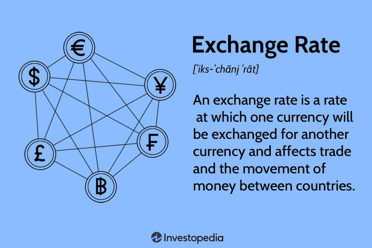

Forex trading, also known as currency trading, is one of the most dynamic markets in the financial world. It involves the exchange of currencies in a decentralized global market, which is the largest and most liquid financial market globally. With a daily trading volume exceeding $6 trillion, it offers traders and investors a vast arena of opportunities. In this article, we will explore the key strategies for investing in forex, covering both traditional methods and the emerging trend of algorithmic trading. 

Traditional forex trading strategies have long been employed by traders who analyze market trends, economic indicators, and geopolitical events to make informed decisions. These methods rely heavily on understanding the forces driving currency valuations and the broader market sentiment. However, the advent of technology has introduced a new dimension in the form of algorithmic trading. This approach leverages computer programs to automate trading decisions, providing advantages such as speed, accuracy, and the elimination of human emotions from trading processes.



We'll examine the benefits and challenges posed by these investment strategies. The ability to trade 24 hours a day due to overlapping time zones of major financial centers is a significant benefit, providing continuous opportunities, but it also introduces unique risks. Currency values can fluctuate rapidly due to unforeseen global events, requiring traders and investors to have sharp risk management practices. 

Understanding these strategies can help traders and investors capitalize on the market's potential while managing inherent risks. By combining traditional and algorithmic techniques, and maintaining a disciplined approach, individuals can enhance their chances of success in the forex market. This dynamic interplay of strategy and risk management forms the backbone of successful forex trading, illuminating paths to profitability while safeguarding against potential pitfalls.

## Table of Contents

## Understanding Forex Trading and Investing

Forex trading involves the buying and selling of currency pairs with the goal of profiting from fluctuations in exchange rates. Unlike traditional investments such as stocks or bonds, forex trading requires a deep understanding of the complex dynamics that govern currency values. These dynamics are influenced by various factors, including economic indicators, geopolitical events, and overall market sentiment.

One of the distinctive attributes of the forex market is its high liquidity. With an average daily trading [volume](/wiki/volume-trading-strategy) surpassing $6 trillion, it is significantly larger than any other financial market. This liquidity translates into tight bid-ask spreads and the ability to enter and [exit](/wiki/exit-strategy) trades swiftly, making forex trading particularly appealing to short-term traders and speculators.

Leverage is another defining characteristic of [forex](/wiki/forex-system) trading. Many brokers offer leverage ratios that allow traders to control large positions with a relatively small amount of capital. For instance, a leverage of 100:1 means that with just $1,000 in an account, a trader can control a position worth $100,000. While leverage can amplify profits, it equally magnifies potential losses, making risk management essential.

Currencies are sensitive to an array of economic indicators. Key data such as GDP growth rates, employment figures, inflation rates, and central bank [interest rate](/wiki/interest-rate-trading-strategies) decisions can all significantly sway currency valuations. For example, higher-than-expected inflation in a country may lead to expectations of an interest rate hike by its central bank, potentially strengthening that country's currency.

Political developments also wield considerable influence over currency markets. Elections, changes in government policy, and geopolitical tensions can create uncertainty, leading to volatile market conditions. Traders must remain vigilant and adapt quickly to such changes to protect their investments and capitalize on emerging opportunities.

Choosing the right forex broker is crucial for successful investing. A reputable broker provides access to global currency markets and a suite of trading tools and educational resources. Factors to consider when selecting a broker include regulatory compliance, the variety of currency pairs offered, trading platform features, customer service quality, and fee structures. A reliable broker can enhance the trading experience, offering the necessary support and infrastructure to execute trades efficiently and effectively.

## Traditional Forex Trading Strategies

Forex trading, a dynamic and often volatile market, comprises various strategies that traders use to gain an advantage. Traditional strategies remain popular due to their effectiveness and practicality.

**Trend Following** is one of the most commonly used strategies. Traders identify the direction of the market movement and capitalize on that momentum to execute trades in the same direction. This strategy relies heavily on technical analysis tools such as moving averages, trend lines, and also indicators like the MACD (Moving Average Convergence Divergence) to determine entry and exit points. The underlying principle is that prices are more likely to continue in the direction of a current trend than to move against it.

**Mean Reversion Strategies** are based on the statistical concept that prices and returns eventually move back towards their historical average. Traders employing this strategy look for currencies that have deviated significantly from their historical average value and bet on their return to this mean. This approach often utilizes tools such as Bollinger Bands to measure the volatility and relative price levels over time.

**Carry Trading** involves taking advantage of the interest rate differential between two currencies. This strategy entails borrowing funds in a currency with a low-interest rate and investing them in a currency with a higher interest rate. The trader aims to profit not only from the interest rate differential but also potentially from favorable movements in exchange rates. The profitability of carry trades depends significantly on stable market conditions and low volatility, as volatile swings can offset interest gains.

**Risk Management** is a cornerstone of successful forex trading. The use of **stop-loss** orders allows traders to set a pre-determined exit point for losing trades to limit potential losses. Similarly, **take-profit** levels secure profits by closing a trade once a price target is achieved. Proper risk management ensures that traders do not expose themselves to excessive losses that could erode their capital base.

**Diversification** is another crucial aspect, used to mitigate risks associated with currency volatility. By spreading investments across multiple currency pairs, traders can manage risk better, as losses in one currency pair may be offset by gains in another. This approach helps in balancing the overall portfolio performance despite market unpredictability.

These traditional strategies require a careful balance of skill, analysis, and risk management to be effective. They offer methods for traders to capitalize on different market conditions and profit opportunities.

## Algorithmic Trading in Forex

Algorithmic trading in forex uses sophisticated computer programs to automate trading processes based on predefined mathematical models and rules. This method enhances trading efficiency and eliminates human emotions, which can often lead to suboptimal trading decisions. By leveraging technology, traders can execute orders with speed and accuracy that manual trading cannot match.

A significant benefit of [algorithmic trading](/wiki/algorithmic-trading) is its ability to implement complex strategies rapidly. One such strategy is statistical [arbitrage](/wiki/arbitrage), which involves exploiting the price differences between related financial instruments on the assumption that these deviations will eventually revert to their mean. Another common strategy is [trend following](/wiki/trend-following), where algorithms identify and capitalize on existing market trends by placing trades in the direction of the trend until signs of reversal are detected. Auto-hedging is also frequently used, automatically managing risk by taking positions in opposite directions to an asset's primary trade to protect against adverse price movements.

High-frequency trading ([HFT](/wiki/high-frequency-trading-strategies)) is a particular subset of algorithmic trading that involves executing a large number of orders at extremely high speeds, often within milliseconds. HFT relies on advanced computational power and data analysis to capture small price inefficiencies in the market before they disappear. 

Despite the benefits, algorithmic trading requires continuous maintenance to remain effective. Algorithms must be regularly updated to adapt to new market conditions and avoid becoming obsolete. This involves testing and optimizing strategies using historical data, a process known as [backtesting](/wiki/backtesting). However, overfitting—a scenario where the trading model is too closely tailored to past data and fails to perform well in live markets—remains a significant risk.

Additionally, technical failures can occur, leading to unintended trades or missed opportunities. Ensuring robust infrastructure and having contingency plans are crucial to mitigate such risks. Traders and developers must remain vigilant to market changes and technological advancements to ensure the algorithms remain competitive and effective.

## Challenges and Risks of Forex Trading Strategies

Forex trading, with its allure of high [liquidity](/wiki/liquidity-risk-premium) and 24-hour operation, is characterized by significant [volatility](/wiki/volatility-trading-strategies) that presents both opportunities and risks for traders. The market's nature is such that unexpected global events, such as geopolitical tensions or economic shocks, can cause sudden and dramatic fluctuations in currency values. This volatility necessitates a robust understanding of market dynamics and the potential for rapid changes in market conditions.

### Leverage: A Double-Edged Sword

A key feature of forex trading is the use of leverage, which allows traders to control positions much larger than their actual investment. While leverage can amplify profits, it also exacerbates losses. For example, in a typical leverage ratio of 50:1, a 2% adverse move in the market could result in a complete loss of the trader's initial investment. Therefore, it is imperative to manage leverage prudently to avoid substantial financial losses.

### Risks in Algorithmic Trading

Algorithmic trading has gained popularity due to its potential for speed and precision, but it comes with its unique set of risks. Technical failures, such as software bugs or network issues, can disrupt trading activities, leading to financial losses. Moreover, algorithms can suffer from over-optimization, where they perform exceptionally well on historical data but fail to adapt to real-time market conditions. This phenomenon, known as curve fitting, results in poor performance when deployed in live markets. Regular testing and updates of algorithms are crucial to mitigate these risks.

### Currency Risk and International Investments

Currency risk, or exchange rate risk, arises from the potential change in the value of one currency relative to another, affecting international trading and investments. This risk is particularly pronounced in forex trading, where the value of investments can fluctuate due to shifts in currency exchange rates. Traders must account for this risk, as it can impact the value of both foreign investments and domestic trading accounts denominated in foreign currencies.

### Regulatory Challenges

The forex market is subject to regulatory changes that can affect trading conditions and the implementation of algorithmic strategies. Different countries have varying regulatory requirements, which can influence how forex transactions are conducted. For instance, changes in margin requirements or the implementation of new trading rules can alter the market landscape and necessitate adjustments in trading strategies. Staying informed about regulatory developments is essential for traders to remain compliant and competitive in the forex market.

In summary, while forex trading offers significant rewards, it also poses substantial risks that require careful management and strategy. Recognizing the challenges associated with leverage, algorithmic systems, currency fluctuations, and regulatory shifts is critical for maintaining a sustainable trading practice.

## Getting Started with Forex and Algo Trading

Educating oneself about forex markets, trading platforms, and regulatory environments is an essential first step for anyone interested in forex and algorithmic trading. Start by familiarizing yourself with the basic concepts of currency pairs, exchange rate movements, and the economic indicators that can influence currency values. Resources from reputable financial websites, online courses, and forex trading [books](/wiki/algo-trading-books) can provide valuable insights into how the forex market functions and what factors drive its dynamics.

Opening a demo account is a practical way to practice trading strategies without the risk of losing real money. Demo accounts simulate real-market conditions, allowing traders to execute trades based on live market data. This experience is crucial for developing a deeper understanding of how trades are executed and how various market conditions can affect outcomes.

Selecting a reliable forex broker is critical, as it can significantly impact your trading experience. Look for brokers who offer comprehensive support for both manual and algorithmic trading. Key criteria include competitive spreads, a variety of currency pairs, robust trading platforms, and adherence to regulatory standards. Popular platforms like MetaTrader 4, MetaTrader 5, or cTrader are widely used for both manual trades and algorithmic executions.

Backtesting trading algorithms is an essential process that involves testing your trading strategy against historical market data. This helps in refining strategies and identifying potential weaknesses. By simulating how your algorithm would have performed in the past, you can optimize it for better outcomes. Python is a widely used language for backtesting due to its rich ecosystem of financial libraries, such as Pandas and NumPy, which can be used to handle and analyze data. For instance, here's a simple example of calculating moving averages in Python:

```python
import pandas as pd

# Assume 'data' is a DataFrame with historical price data
data['SMA_20'] = data['Close'].rolling(window=20).mean()
data['SMA_50'] = data['Close'].rolling(window=50).mean()

# Plotting the moving averages
data[['Close', 'SMA_20', 'SMA_50']].plot()
```

Risk management techniques are vital to managing potential losses. These include setting stop-loss and take-profit levels to automate exits from trades, thus protecting your capital from adverse market movements. Continually monitor performance to adapt to evolving market conditions. Regularly review and adjust your trading strategies to ensure they remain effective under changing market dynamics.

By taking these foundational steps, you can build a strong framework for engaging in forex and algorithmic trading while managing both opportunity and risk effectively.

## Conclusion

Forex and algorithmic trading present a myriad of opportunities for investors looking to diversify their portfolios and capitalize on the dynamic currency markets. Despite these opportunities, they also [carry](/wiki/carry-trading) inherent risks that demand careful management. Investors who employ informed strategies can potentially enhance their returns, but it is crucial to remain vigilant against the market's inherent volatility. This volatility often arises from unexpected geopolitical events, economic data releases, or abrupt changes in market sentiment, which can cause significant fluctuations in currency prices.

To maintain a competitive edge in forex trading, continuously updating one's knowledge and tools is paramount. Financial markets are ever-evolving, and staying informed about global economic trends, technological advancements in trading platforms, and regulatory changes is essential. Employing advanced analytics and integrating real-time data feeds into trading systems are practical steps traders can take to adapt to these changes effectively.

Whether engaging in manual trading or utilizing algorithmic systems, a disciplined approach is essential for achieving long-term success. This discipline includes adhering to a well-defined trading plan, implementing robust risk management practices, and maintaining emotional detachment from trades. Automated algorithms can assist in this regard by executing trades based on pre-set criteria, thus removing the emotional element and allowing for more consistent decision-making.

Investors can optimize their strategies by blending traditional methods with modern trading technologies. For instance, combining [fundamental analysis](/wiki/fundamental-analysis) with algorithmic trades can offer a more comprehensive perspective, leveraging data-driven insights alongside an understanding of economic indicators and market sentiment. This integrated approach enables traders to make informed investment decisions within the dynamic forex market.

In summary, while forex and algorithmic trading offer substantial potential rewards, they require astute strategy development, risk management, and adaptability to maintain success. By continuously refining knowledge and utilizing innovative tools, investors can navigate the complex forex landscape effectively, capitalizing on its opportunities while safeguarding against its risks.

## References & Further Reading

[1]: Menkhoff, L., Sarno, L., Schmeling, M., & Schrimpf, A. (2012). ["Currency Momentum Strategies."](https://papers.ssrn.com/sol3/papers.cfm?abstract_id=1809776) Review of Financial Studies, 25(3), 921-957.

[2]: ["Advances in Financial Machine Learning"](https://www.amazon.com/Advances-Financial-Machine-Learning-Marcos/dp/1119482089) by Marcos Lopez de Prado

[3]: ["Algorithmic Trading: Winning Strategies and Their Rationale"](https://www.wiley.com/en-us/Algorithmic+Trading%3A+Winning+Strategies+and+Their+Rationale-p-9781118460146) by Ernie Chan

[4]: [Bollerslev, T. (1986). "Generalized Autoregressive Conditional Heteroskedasticity."](https://www.sciencedirect.com/science/article/pii/0304407686900631) Journal of Econometrics, 31(3), 307-327.

[5]: ["The Little Book of Currency Trading: How to Make Big Profits in the World of Forex"](https://archive.org/details/littlebookofcurr0000lien) by Kathy Lien