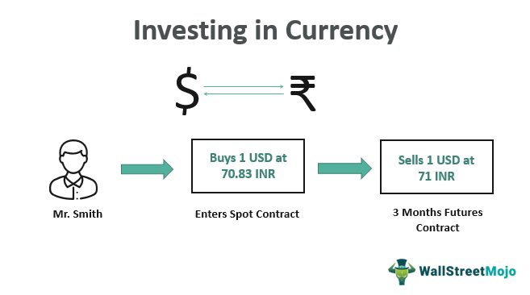

## Table of Contents

## What is currency investment and why should beginners consider it?

Currency investment, also known as forex trading, is when people buy and sell different types of money from around the world. For example, you might trade US dollars for Euros, hoping that the value of Euros will go up so you can trade them back for more dollars than you started with. It's a big market where lots of money changes hands every day, and it's open all the time because somewhere in the world, it's always daytime.

Beginners might want to consider currency investment because it can be a good way to learn about how money works in different countries. It's also a way to possibly make some extra money if you learn how to do it well. But, it's important to remember that it can be risky, so it's a good idea to start small and learn as much as you can before you put a lot of money into it.

## How does currency trading differ from traditional investing?

Currency trading and traditional investing are different in some big ways. When you do traditional investing, you might buy things like stocks or bonds. These are pieces of companies or loans to companies or governments. You usually plan to keep them for a while, hoping their value goes up over time. It's like planting a tree and waiting for it to grow. On the other hand, currency trading is more like buying and selling different kinds of money quickly. You might trade US dollars for Euros and then trade them back again in just a few hours or days, trying to make money from small changes in their value.

Another difference is how much the market moves. In traditional investing, the prices of stocks and bonds can change, but they usually don't jump around as much as currency values do. Currency markets can be very active and change a lot in a short time. This can make currency trading exciting but also riskier. Also, currency markets are open all the time because there's always somewhere in the world where it's business hours, while traditional markets like stock exchanges have set times when they're open.

## What are the basic terms and concepts a beginner needs to know before starting?

Before you start currency trading, it's good to know some basic terms and ideas. First, you should understand what a currency pair is. This is when you trade one type of money for another, like US dollars for Euros. The first currency in the pair is called the base currency, and the second one is the quote currency. The price you see tells you how much of the quote currency you need to buy one unit of the base currency. Another important term is 'pip,' which stands for "percentage in point." A pip is the smallest change in the value of a currency pair, and it's how traders measure how much money they're making or losing.

You also need to know about 'leverage.' This is when you borrow money to trade more than you have in your account. It can make your profits bigger, but it can also make your losses bigger, so it's risky. 'Margin' is the money you need to put up to open a trade when you're using leverage. And finally, 'bid' and 'ask' prices are important. The bid price is what people are willing to pay for the currency pair, and the ask price is what people are asking to sell it for. The difference between these two prices is called the 'spread,' and it's how brokers make money. Understanding these terms will help you get started with currency trading.

## What are the most common methods of currency investment for beginners?

One common way for beginners to start with currency investment is through a demo account. A demo account is like a practice version of real trading. You get fake money to trade with, so you can learn how it works without risking your real money. This is a great way to understand how the market moves and practice using trading platforms. Once you feel comfortable, you can move to a real account but start with a small amount of money. This way, you won't lose too much if things don't go as planned.

Another method is using a managed account or a copy trading service. With a managed account, you give your money to a professional trader who makes the trades for you. This can be good if you don't have time to learn everything about trading or if you're not sure you want to make the decisions yourself. Copy trading is similar but you choose to follow the trades of other successful traders. Your account will automatically do what they do, so you can learn from them and hopefully make money too. Both of these methods can help you get started without needing to know everything about currency trading right away.

## How can someone start investing in currencies with a small amount of money?

If you want to start investing in currencies but don't have a lot of money, you can begin with a demo account. A demo account lets you practice trading with fake money, so you can learn how it works without risking your real money. It's like playing a game where you get to see how the market moves and try out different strategies. Once you feel ready, you can switch to a real account but start with a small amount of money. This way, you won't lose too much if things don't go well, and you can still learn and grow your skills.

Another way to start with a small amount of money is by using a managed account or a copy trading service. With a managed account, you give your money to a professional trader who makes the trades for you. This can be good if you don't have a lot of time to learn everything about trading or if you're not sure you want to make the decisions yourself. Copy trading is similar, but you choose to follow the trades of other successful traders. Your account will automatically do what they do, so you can learn from them and hopefully make some money too. Both of these methods let you start small and still have a chance to make profits.

## What are the risks associated with currency investment and how can they be managed?

Currency investment can be risky because the value of money from different countries can change a lot in a short time. This means you might lose money if the currency you buy goes down in value before you sell it. Another risk is using leverage, which is like borrowing money to trade more than you have. It can make your profits bigger, but it can also make your losses bigger if things don't go your way. Also, there's always the chance that something big happens in the world, like a political change or a natural disaster, which can make currency values jump around even more.

To manage these risks, you can start by using a demo account to practice trading without losing real money. This helps you learn how the market works without the pressure of losing money. When you do start trading with real money, it's a good idea to begin with a small amount so you don't lose too much if things go wrong. Another way to manage risk is by setting stop-loss orders, which automatically sell your currency if it drops to a certain price, helping to limit your losses. It's also smart to keep learning about the market and the world events that can affect currency values, so you can make better trading decisions.

## What advanced strategies can be used to maximize returns in currency investment?

One advanced strategy to maximize returns in currency investment is called [carry](/wiki/carry-trading) trading. This is when you borrow money in a currency that has a low [interest rate](/wiki/interest-rate-trading-strategies) and then use that money to buy a currency that has a higher interest rate. The difference between the two interest rates can add up over time, and if the currency you bought goes up in value too, you can make even more money. But, this strategy can be risky because if the currency you borrowed goes up in value or the one you bought goes down, you might lose money instead. So, it's important to keep an eye on what's happening in the world that might affect currency values.

Another strategy is called [scalping](/wiki/gamma-scalping), which is all about making lots of small trades in a short time to take advantage of tiny changes in currency prices. Scalpers look at the market very closely and try to buy and sell quickly to make a little bit of money on each trade. When you add up all those small profits, it can add up to a big return. This strategy needs a lot of focus and fast decision-making because the market can change in the blink of an eye. It's also important to use a good trading platform that can handle quick trades and to have a solid plan for managing your risk so you don't lose too much if a trade goes the wrong way.

## How do geopolitical events and economic indicators influence currency markets?

Geopolitical events can really shake up currency markets. When something big happens, like a country going to war or having a big election, it can make people worried about what will happen next. If people think a country will have problems because of these events, they might sell its currency, making its value go down. On the other hand, if people think a country will do well because of these events, they might buy its currency, making its value go up. For example, if there's a peaceful agreement between countries, people might feel more confident and buy the currencies of those countries, hoping they'll do better in the future.

Economic indicators also play a big role in how currencies move. These are numbers that tell us how well a country's economy is doing, like how many people have jobs, how much stuff people are buying, and how fast prices are going up. If these numbers show that a country's economy is strong, its currency might go up in value because people want to invest there. But if the numbers show the economy is weak, people might sell that currency, making its value go down. For example, if a country's unemployment rate goes down, it might mean more people are working and spending money, which could make the currency stronger.

## What are the differences between spot trading, forwards, and futures in currency investment?

Spot trading is when you buy and sell currencies right away, at the price you see now. It's like going to a store and buying something off the shelf. You pay the price that's listed and take the item home with you. In spot trading, you get the currency you bought almost right away, usually within two days. This is the most common way people trade currencies because it's simple and you can see what's happening in the market right now.

Forwards and futures are a bit different because they're about trading currencies at a price you agree on now, but you don't actually buy or sell them until later. A forward contract is when you and someone else agree on a price for a currency, and then you trade it at that price on a specific date in the future. It's like making a deal to buy something at a set price, even if the price changes later. Forwards are usually made between two people and can be customized to fit their needs. Futures are similar, but they're traded on special markets and have standard rules. You buy or sell a contract that says you'll trade a certain amount of currency at a set price on a set date. Futures are good if you want to be sure about the price you'll pay or get in the future, even if the market changes.

## How can algorithmic trading and forex robots enhance currency investment strategies?

Algorithmic trading and [forex](/wiki/forex-system) robots can make currency investment easier and more efficient. They use special computer programs to do trades automatically, based on rules you set up. This means you don't have to watch the market all the time or make quick decisions yourself. The computer can look at a lot of information very fast and make trades when it sees the right moment, which can help you make more money or lose less. It's like having a helper that never gets tired and can work 24 hours a day.

Using these tools can also help you stick to your trading plan better. Sometimes, people can get emotional about their trades and make bad decisions because they're feeling scared or excited. But a computer doesn't get emotional, so it will follow your rules exactly. This can help you avoid making mistakes and keep your strategy on track. Plus, you can test your trading ideas on past data to see if they would have worked, which can help you improve your plan before you use real money.

## What are the tax implications and regulatory considerations for expert currency investors?

Expert currency investors need to think about taxes and rules when they trade. In many places, the money you make from trading currencies is seen as income, and you have to pay taxes on it. The rules can be different depending on where you live. Sometimes, you might have to pay taxes on every trade you make, and other times, you might only pay taxes on your total profit at the end of the year. It's important to keep good records of all your trades so you can figure out how much tax you owe. If you're not sure about the tax rules, it's a good idea to talk to a tax expert who knows about currency trading.

There are also rules about how you can trade currencies. Different countries have different rules, and some places have strict laws about who can trade and how they can do it. For example, some countries require you to have a special license to trade currencies, and there might be limits on how much you can trade. It's important to know the rules in your country and follow them, or you could get in trouble. If you're trading in different countries, you need to know their rules too. It can be helpful to talk to a lawyer who knows about financial rules to make sure you're doing everything right.

## How can portfolio diversification be achieved through currency investment, and what are the best practices?

Portfolio diversification through currency investment means spreading your money across different types of currencies to lower your risk. Instead of putting all your money into one currency, you can buy a mix of currencies from different countries. This way, if one currency goes down in value, you might still make money from the others. For example, if you have money in US dollars, Euros, and Japanese yen, and the dollar goes down, the Euros and yen might still be doing well. This can help protect your money and make your overall investment more stable.

The best practices for diversifying your currency portfolio include starting with a clear plan. Decide how much of your money you want to put into different currencies based on how much risk you're willing to take and how much you think each currency will grow. It's also a good idea to keep an eye on what's happening in the world, like political changes or economic news, because these things can affect currency values. Regularly check and adjust your portfolio to make sure it still fits your plan. And remember, don't put all your money into currencies; mix them with other types of investments like stocks or bonds to spread your risk even more.

## References & Further Reading

[1]: Menkhoff, L., Sarno, L., Schmeling, M., & Schrimpf, A. (2012). ["Currency Momentum Strategies."](https://papers.ssrn.com/sol3/papers.cfm?abstract_id=1809776) Review of Financial Studies, 25(3), 921-957.

[2]: ["Advances in Financial Machine Learning"](https://www.amazon.com/Advances-Financial-Machine-Learning-Marcos/dp/1119482089) by Marcos Lopez de Prado

[3]: ["Algorithmic Trading: Winning Strategies and Their Rationale"](https://www.wiley.com/en-us/Algorithmic+Trading%3A+Winning+Strategies+and+Their+Rationale-p-9781118460146) by Ernie Chan

[4]: [Bollerslev, T. (1986). "Generalized Autoregressive Conditional Heteroskedasticity."](https://www.sciencedirect.com/science/article/pii/0304407686900631) Journal of Econometrics, 31(3), 307-327.

[5]: ["The Little Book of Currency Trading: How to Make Big Profits in the World of Forex"](https://archive.org/details/littlebookofcurr0000lien) by Kathy Lien