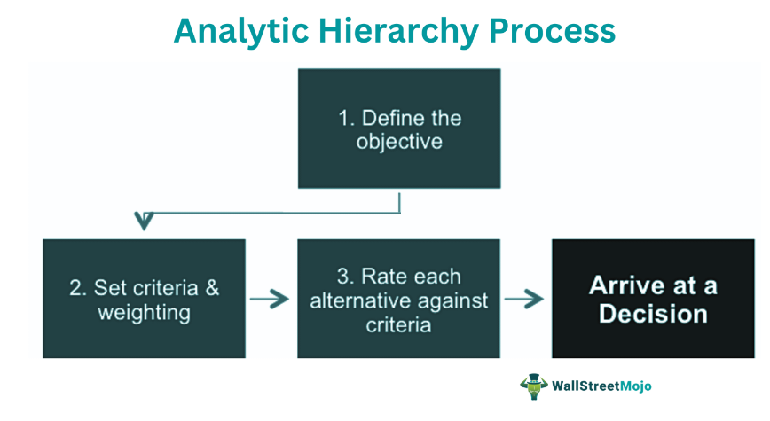

In the world of both culinary and financial preparation, technique is key. This article explores the unexpected parallels between fruit preparation, specifically melon cutting techniques, and the precision required in algorithmic trading. The art of melon cutting transforms a daunting task into a skillful process, much like how algorithms transform raw data into strategic trading opportunities. Melon cutting requires precision, planning, and the right tools—qualities equally essential in financial markets when employing algorithmic trading strategies.

This piece will cover practical melon cutting techniques while also bridging the conceptual gap to algorithmic trading strategies. The comparison is fascinating: in the kitchen, a steady hand and a sharp knife can efficiently transform a melon into a crafted appetizer, whereas in finance, algorithms navigate the complexities of data to produce optimized trading decisions. Both activities share a structured methodology, emphasizing preparation, execution, and refinement. 



By mastering these techniques, whether in the kitchen or in trading markets, you can enhance your efficiency, results, and perhaps even your enjoyment. With practice, what once seemed complex becomes simple, leading to precision and success in both the culinary and financial worlds. The intersection of these skills demonstrates how structure and strategy play a vital role in diverse environments, highlighting the art and science behind each discipline.

## Table of Contents

## Mastering Melon Cutting Techniques

Melon cutting is an integral kitchen technique that requires precision and the right tools to transform the fruit into convenient and aesthetically pleasing forms. This process begins with the selection of a ripe melon, which is crucial to achieving the best flavor and texture. Indicators of ripeness in melons, such as cantaloupes or watermelons, include a sweet aroma, a slight softness to touch without mushiness, and a hollow sound when tapped. Once a suitable melon is selected, it should be washed thoroughly under running water to remove any dirt or pesticides from the rind.

The next step is to place the melon on a stable, non-slip cutting board to ensure safety. Secure stability minimizes the risk of accidents that can occur from the melon rolling or slipping as you cut. With a sharp chef’s knife, slice the melon in half. This initial cut is significant as it exposes the interior, allowing for the removal of seeds. The central cavity of melons usually contains seeds and fibrous strands that need to be scooped out with a spoon.

After removing the seeds, the melon is ready to be cut into various shapes. Cubes are popular for their versatility in salads and fruit platters. To create cubes, place the halved melon flesh-side down and slice it into even sections, then cross-cut to achieve cube shapes. Sticks or wedges can be created by cutting the halves further into eighths, making them suitable for simple snacking or dipping.

For more decorative presentations, a melon baller can be used to scoop the flesh into uniform spheres. This tool allows for the creation of visually appealing salad toppings or cocktail garnishes. Each cutting technique serves distinct culinary purposes—from easy serving and consumption to enhancing the visual appeal of dishes.

Mastering these techniques not only enhances culinary skills but also maximizes the utility of the melon, reducing waste and ensuring every part of the fruit is utilized effectively.

## Essential Tools for the Kitchen

For effective melon cutting, having the right tools is fundamental to achieving both precision and ease. The primary tool in this endeavor is a sharp chef’s knife. The knife's sharpness is vital as it allows for seamless penetration through the melon’s dense rind while offering control over the smooth flesh inside. To maintain the sharpness of a chef’s knife, regular honing and occasional sharpening are recommended. A well-maintained edge minimizes the risk of slipping and ensures clean cuts, which are especially important when dealing with the slick internal surface of a melon.

Supplementary tools such as a melon baller can enhance the versatility of your melon cutting. A melon baller is designed to carve out uniform, spherical shapes from the melon flesh, ideal for decorative fruit salads or garnishes. Alternatively, a large spoon is useful for scooping out seeds efficiently. To use a melon baller effectively, align the tool perpendicularly to the melon surface and apply a controlled amount of pressure while rotating to achieve a consistent ball shape.

A stable cutting board is yet another essential component of safe kitchen practice. The board should be non-slip to prevent hazardous movements during cutting. Rubberized feet or a damp kitchen towel placed underneath the board can provide additional stability. A cutting board that remains stationary allows for precise cuts and reduces the risk of accidents, especially when applying significant force to cut through the rind.

These tools together create a synergistic environment for effective melon preparation. Ultimately, the consideration of tool quality and functionality leads to better results and a more enjoyable culinary experience.

## Algorithmic Trading Techniques: Precision in Finance

Algorithmic trading fundamentally relies on precision, proper tools, and strategic planning, similar to the meticulous nature of cutting a melon. At its core, [algorithmic trading](/wiki/algorithmic-trading) utilizes pre-defined algorithms to execute orders with speed and accuracy, minimizing human intervention and emotions, which can lead to inefficient trading decisions.

Automated trading systems leverage these algorithms to continuously monitor markets and identify trading opportunities by analyzing real-time data. The process begins with data acquisition, capturing a wide array of market inputs like price, [volume](/wiki/volume-trading-strategy), and historical patterns. This data is then processed and analyzed to make informed trading decisions.

Key techniques in algorithmic trading focus on defining parameters for entry and [exit](/wiki/exit-strategy) points. These parameters are often based on technical indicators like moving averages, Bollinger bands, or relative strength index (RSI), which systematically signal the optimal moments to buy or sell assets. For instance, a common strategy may involve a crossover of moving averages; when a short-term moving average crosses above a long-term one, it might signal a buying opportunity.

Risk management is another crucial component, ensuring that potential losses are mitigated. Techniques include setting stop-loss orders, which automatically close a position at a certain price level to prevent further loss, and position sizing strategies, which determine the amount of capital allocated to each trade, balancing potential return and acceptable risk.

Machine learning has increasingly become integral in refining these strategies. Adaptive algorithms can learn from historical data, adjust to changing market conditions, and predict future price movements. Machine learning models, such as decision trees or neural networks, can process complex datasets to identify patterns not readily apparent to human traders. A Python example using [machine learning](/wiki/machine-learning) might involve the Scikit-learn library to implement a decision tree classifier:

```python
from sklearn.tree import DecisionTreeClassifier
from sklearn.model_selection import train_test_split
from sklearn.metrics import accuracy_score

# Sample data and labels for market conditions
X = [[price, volume_change, indicator1, indicator2] for data_point in market_data]
y = [1 if trend == 'up' else 0 for trend in trend_data] # 1 for uptrend, 0 for downtrend

# Splitting the data into training and test sets
X_train, X_test, y_train, y_test = train_test_split(X, y, test_size=0.3, random_state=42)

# Training the model
clf = DecisionTreeClassifier()
clf.fit(X_train, y_train)

# Making predictions
predictions = clf.predict(X_test)

# Evaluating the model
accuracy = accuracy_score(y_test, predictions)
print(f'Accuracy: {accuracy*100:.2f}%')
```

This example demonstrates how machine learning can be deployed to predict market trends using historical data. The decision tree algorithm classifies market conditions into uptrends or downtrends, allowing traders to optimize entry and exit points. By continuously honing these skills and leveraging advanced analytical tools, traders can achieve precision and success akin to mastering culinary techniques in melon preparation.

## Parallels in Technique and Execution

Both melon cutting and algorithmic trading require a structured approach to achieve successful outcomes. At the heart of these disciplines is the need for precision, preparation, and the use of appropriate tools. Understanding these parallels can provide insights into how mastery in one area can inform and enhance skills in the other.

When slicing a melon, the goal is to achieve uniformity and efficiency. This translates into a set of repeatable processes: selecting the right melon, using a stable cutting board, employing precise knife skills, and applying the appropriate cutting techniques for the desired outcome, such as cubes or slices. This structured method ensures that the task is executed efficiently and consistently.

In algorithmic trading, similar principles apply. Traders must develop and adhere to a systematic approach to market analysis and trade execution. This involves setting clear trading rules, employing precise algorithms, and executing trades automatically in response to market signals. For instance, an algorithm might be designed to buy a stock when the short-term moving average crosses above the long-term moving average, a classic example of a moving average crossover strategy.

```python
# Example of a simple moving average crossover strategy in Python

def moving_average(data, window):
    """Calculate the moving average with a specified window size."""
    return data.rolling(window=window).mean()

def compute_signals(data, short_window, long_window):
    """Generate buy/sell signals based on moving averages."""
    signals = pd.DataFrame(index=data.index)
    signals['price'] = data['Close']
    signals['short_mavg'] = moving_average(data['Close'], short_window)
    signals['long_mavg'] = moving_average(data['Close'], long_window)

    # Create buy signal
    signals['signal'] = 0.0
    signals.loc[signals['short_mavg'] > signals['long_mavg'], 'signal'] = 1.0

    # Create sell signal
    signals.loc[signals['short_mavg'] < signals['long_mavg'], 'signal'] = 0.0

    signals['positions'] = signals['signal'].diff()

    return signals

# Example usage:
# data is a DataFrame with a 'Close' column representing closing prices
# short_window and long_window represent the short-term and long-term moving average window sizes, respectively
signals = compute_signals(data, short_window=40, long_window=100)
```

The proficiency in both melon cutting and algorithmic trading emphasizes the value of practice and honed skills. In culinary ventures, repeated practice ensures precise cuts and efficient workflows, enhancing both the aesthetic and functional qualities of food preparation. Similarly, in trading, continuous practice through [backtesting](/wiki/backtesting) and refining algorithms leads to better prediction of market trends and improved trading outcomes.

Moreover, in both contexts, the right equipment is essential. For melon cutting, this means having a sharp knife and a stable cutting surface. In trading, high-quality data feeds, reliable software platforms, and powerful computing resources are crucial.

The overlap between these skills underscores a fundamental truth: meticulous preparation and structured execution are core to achieving competency, be it in the kitchen or in financial markets. As individuals strive to master these techniques, they can translate the discipline and precision learned in one field to enhance their performance in the other, revealing the interconnected nature of skill and strategy across diverse domains.

## The Importance of Preparation

Preparation serves as the bedrock for success in both culinary and trading endeavors. In the culinary world, meticulous preparation transforms the task of cutting a melon into a straightforward and efficient process. The first step is to choose the right melon, ensuring it is ripe and ready for consumption. Indicators of a ripe melon include a sweet aroma and a slight give at the blossom end when pressed. Once selected, clear away any dirt or bacteria by washing the melon thoroughly under running water. This ensures that any remnants from the rind are not transferred to the flesh during cutting. A clean set of tools, including a sharp knife and a stable cutting board, is essential for precision and safety, minimizing the risk of accidents and ensuring even cuts. Ensuring a clutter-free and well-lit environment further enhances safety and efficiency.

In algorithmic trading, preparation is no less critical. Robust backtesting forms the cornerstone of any successful trading strategy. By analyzing historical data, traders can gauge the effectiveness of their algorithms under various market conditions. This involves using statistical methods and libraries, such as Python's `pandas` and `numpy`, to simulate trades based on historical input:

```python
import pandas as pd

# Example of a simple backtesting structure
def backtest_strategy(data):
    for index, row in data.iterrows():
        # Dummy logic for entry/exit conditions
        if row['indicator'] > threshold:
            # Placeholder for executing a trade
            pass

# Load historical market data
data = pd.read_csv('market_data.csv')
backtest_strategy(data)
```

Understanding algorithm parameters is akin to knowing your kitchen tools; both are pivotal for making informed decisions. Parameters such as entry and exit points, position sizing, and risk tolerance need careful calibration. Realistic trading goals further anchor the process, setting a clear path forward and providing measurable benchmarks for success.

Thus, preparation, whether for slicing through the tender flesh of a melon or navigating the complexities of financial markets, underscores the potential for proficiency and accomplishment. By embedding preparation at the core of their practice, individuals can transition seamlessly from complexity to clarity, achieving success in their chosen fields.

## Conclusion

Mastering both melon preparation and algorithmic trading emphasizes the sophistication and finesse required in diverse disciplines. While seemingly unrelated, the precision and strategic planning inherent in each activity underscore their similarities. In melon cutting, accurate slices not only serve culinary functions but also elevate the aesthetic appeal of a dish. Similarly, algorithmic trading involves meticulously crafted algorithms that parse vast datasets, seeking optimal entry and exit points to maximize financial returns.

The parallel between these skills lies in their demand for precision; both begin with preparation, rely on proper tools, and benefit from honed techniques. The artistry in cutting a melon to create visually appealing shapes mirrors the precision in coding sophisticated trading algorithms that respond dynamically to market changes. As one refines their skill in either field, complexities become more manageable, revealing patterns and efficiencies that enhance overall performance.

With continued practice and the right tools, both tasks transition from daunting to second nature, facilitating success and enjoyment in culinary and financial pursuits. By acknowledging the artistry in both melon preparation and algorithmic trading, individuals can foster a deeper appreciation for the precision and strategy that drive success across seemingly disparate endeavors.

## References & Further Reading

[1]: Bergstra, J., Bardenet, R., Bengio, Y., & Kégl, B. (2011). ["Algorithms for Hyper-Parameter Optimization."](https://dl.acm.org/doi/10.5555/2986459.2986743) Advances in Neural Information Processing Systems 24.

[2]: ["Advances in Financial Machine Learning"](https://www.amazon.com/Advances-Financial-Machine-Learning-Marcos/dp/1119482089) by Marcos Lopez de Prado

[3]: ["Evidence-Based Technical Analysis: Applying the Scientific Method and Statistical Inference to Trading Signals"](https://www.amazon.com/Evidence-Based-Technical-Analysis-Scientific-Statistical/dp/0470008741) by David Aronson

[4]: ["Machine Learning for Algorithmic Trading"](https://github.com/stefan-jansen/machine-learning-for-trading) by Stefan Jansen

[5]: ["Quantitative Trading: How to Build Your Own Algorithmic Trading Business"](https://github.com/LucindaYa/quant-resources/blob/master/Quantitative%20Trading%20How%20to%20Build%20Your%20Own%20Algorithmic%20Trading%20Business.pdf) by Ernest P. Chan