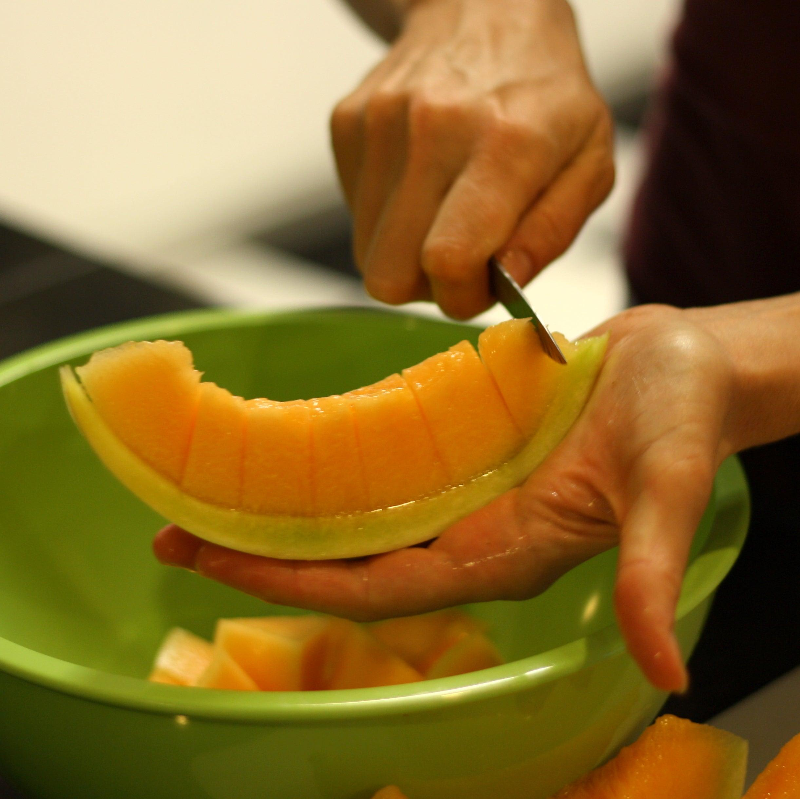

## Table of Contents

## What tools do I need to cut a melon?

To cut a melon, you will need a sharp knife and a cutting board. The knife should be big enough to easily slice through the melon but not so big that it's hard to handle. A chef's knife or a santoku knife works well. The cutting board should be sturdy and large enough to hold the melon securely while you cut it.

First, place the melon on the cutting board. If it's a round melon like a cantaloupe or honeydew, you might want to cut off the ends first to create a flat surface. This will keep the melon from rolling around. Then, use the knife to cut the melon in half. If you're cutting a watermelon, you might want to cut it into quarters for easier handling.

After you've cut the melon into manageable pieces, you can scoop out the seeds with a spoon if necessary. Then, you can slice or cube the melon as needed. Always be careful with the knife to avoid cutting yourself, and make sure to clean up any mess on the cutting board when you're done.

## How do I safely handle a knife when cutting a melon?

When you cut a melon, always hold the knife right. Use your dominant hand to hold the knife handle. Keep your fingers away from the blade. Use your other hand to hold the melon steady. Keep your fingers curled under so the knife does not cut them if it slips.

Make sure the melon is on a flat, stable surface. If the melon rolls, it can make the knife slip. Cut slowly and carefully. Do not rush. If the knife gets stuck, do not force it. Gently wiggle it free or start a new cut. Always keep the knife sharp. A sharp knife is safer because it cuts easily and does not slip as much.

## What are the different types of melons and how does their structure affect cutting?

Melons come in many types, like watermelon, cantaloupe, honeydew, and muskmelon. Each type has a different structure that can change how you cut them. Watermelons are big and round with a hard, thick rind and juicy, red or pink inside. Cantaloupes and honeydews are smaller, with a rough or smooth skin and sweet, orange or green flesh. Muskmelons are similar to cantaloupes but can have different flavors and textures.

The structure of a melon affects how you cut it. For watermelons, you need to use a strong knife because the rind is tough. You can cut the watermelon into quarters to make it easier to handle, then slice or cube the flesh. Cantaloupes and honeydews have softer skin, so they are easier to cut. You can cut them in half, scoop out the seeds, and then slice or scoop the flesh. Muskmelons are cut similarly to cantaloupes, but the flesh might be softer or firmer depending on the type, so adjust your cutting technique accordingly. Always use a sharp knife and be careful to keep your fingers safe.

## How do I choose a ripe melon for cutting?

Choosing a ripe melon is important for the best taste and texture. For watermelons, look for a yellow spot on the bottom where it sat on the ground. This spot means the melon ripened on the vine. The melon should feel heavy for its size, and when you tap it, it should sound hollow. For cantaloupes and honeydews, smell the stem end. A sweet smell means it's ripe. The skin should be firm but not too hard, and the melon should feel heavy for its size.

Muskmelons are a bit like cantaloupes. They should have a sweet smell at the stem end and feel heavy. The skin should give a little when you press it gently. If you're not sure, ask someone at the store for help. They can often tell you if a melon is ripe just by looking at it. Always pick melons carefully to make sure they're ready to eat when you cut them.

## What is the basic method to cut a melon into slices?

To cut a melon into slices, first wash the outside of the melon to remove any dirt or germs. Place the melon on a stable cutting board. If it's a round melon like a watermelon or cantaloupe, cut off a small piece from one end to make a flat surface. This helps the melon stay steady while you cut. Use a sharp knife to cut the melon in half from top to bottom.

Next, scoop out the seeds with a spoon if there are any. Lay the cut side down on the cutting board. Hold the melon firmly with one hand and use the knife to cut it into slices. Make the slices as thick or thin as you want. If you're cutting a watermelon, you might want to cut it into quarters first to make it easier to handle. Always be careful with the knife to keep your fingers safe.

## How can I cut a melon into cubes for fruit salads?

To cut a melon into cubes for fruit salads, start by washing the melon. Put it on a stable cutting board. If it's a round melon like a watermelon or cantaloupe, cut off a small piece from one end to make a flat surface. This keeps the melon steady. Use a sharp knife to cut the melon in half from top to bottom. If there are seeds, scoop them out with a spoon. Lay the cut side down on the cutting board.

Next, cut the melon into slices. Make the slices about an inch thick. Then, take each slice and lay it flat on the cutting board. Cut the slice into strips, also about an inch wide. Finally, cut across the strips to make cubes. Be careful with the knife to keep your fingers safe. Now your melon is ready to add to a fruit salad.

## What are some creative ways to cut a melon for presentation?

One fun way to cut a melon for a special look is to make melon balls. Use a melon baller tool to scoop out round pieces from the melon. You can put these balls on a plate or in a bowl. They look nice and are fun to eat. Another idea is to cut the melon into shapes with cookie cutters. Cut the melon into thick slices first, then use the cookie cutters to make stars, hearts, or other shapes. This is great for parties or to make a snack look more fun.

You can also make a melon boat. Cut a watermelon in half lengthwise. Scoop out all the flesh, leaving just the rind. Then, cut the flesh into cubes or balls and put them back into the hollowed-out rind. This makes a cool serving dish that looks like a boat. For a fancy look, try cutting the melon into thin, long slices and then make a fan shape. Lay the slices in a circle, overlapping them a bit. This makes a pretty fan that can be the center of your fruit display.

## How do I use a melon baller to create melon balls?

To use a melon baller to make melon balls, first cut the melon in half and scoop out the seeds if there are any. Hold the melon half with one hand and use the other hand to press the melon baller into the flesh. Twist the melon baller to scoop out a round piece of melon. Keep doing this all over the melon half until you have as many melon balls as you want.

Put the melon balls in a bowl or on a plate. You can use them to make a fruit salad look nice or serve them by themselves. Melon balls are fun to eat and look good at parties or special events.

## What techniques can I use to minimize waste when cutting a melon?

To cut a melon with less waste, start by [picking](/wiki/asset-class-picking) the right spot to cut. If it's a round melon like a watermelon or cantaloupe, cut off the ends first to make flat surfaces. This helps the melon stay steady and makes it easier to cut evenly. Use a sharp knife to cut the melon into halves or quarters, depending on its size. This way, you can see the inside better and cut around the seeds without losing too much of the good part.

Next, be careful when you scoop out the seeds. Use a spoon to gently remove them, making sure not to take too much of the flesh with them. After you take out the seeds, cut the melon into slices or cubes. Try to cut as close to the rind as you can without including it. This helps you use as much of the melon as possible. If you have any leftover pieces, you can use them in smoothies or other recipes to avoid wasting them.

## How do I store cut melon to maintain freshness?

To keep cut melon fresh, put it in the fridge right away. Use a container that seals well or wrap the melon tightly with plastic wrap. This helps keep air out and stops the melon from drying out or getting other smells from the fridge. Try to eat the melon within 3 to 5 days for the best taste and freshness.

If you want to keep the melon longer, you can freeze it. Cut the melon into cubes or balls and put them in a freezer bag or container. Squeeze out as much air as you can before sealing it. Frozen melon is good for smoothies or to eat as a cold snack. It can last in the freezer for up to 3 months.

## What are advanced cutting techniques for professional chefs?

Professional chefs often use special cutting techniques to make their dishes look better and work faster. One technique is called "julienning," where they cut the melon into thin, long strips. They first cut the melon into thick slices, then cut those slices into thin strips. This is good for adding to salads or using as a garnish. Another technique is "brunoise," where they cut the melon into tiny cubes. They start by cutting the melon into julienne strips, then cut those strips into small cubes. This is great for adding a pop of color and flavor to dishes.

Chefs also use a technique called "chiffonade" to cut melon into thin ribbons. They cut the melon into thin slices first, then stack the slices and roll them up tightly. They cut across the roll to make thin ribbons. This can be used to decorate plates or add a fancy touch to salads. These techniques help chefs use the melon in many ways and make their food look more professional.

## How can I incorporate different cutting methods into melon recipes?

You can use different ways to cut melon to make your recipes look and taste better. For example, if you want to make a fruit salad, you can cut the melon into cubes. This makes it easy to mix with other fruits. If you want to make the salad look fancy, you can use a melon baller to make melon balls. These look nice and are fun to eat. Another idea is to cut the melon into thin slices and then use cookie cutters to make shapes like stars or hearts. This is great for kids' snacks or special events.

For a more professional look, you can try advanced cutting techniques. Julienning the melon means cutting it into thin, long strips. These strips can be added to salads or used as a garnish on plates. Brunoise is another technique where you cut the melon into tiny cubes. These tiny cubes can add a pop of color and flavor to dishes. If you want to make your dish look really fancy, you can use the chiffonade technique. Cut the melon into thin slices, roll them up, and then cut across to make thin ribbons. These ribbons can be used to decorate plates or add a special touch to your recipes.

## References & Further Reading

[1]: Bergstra, J., Bardenet, R., Bengio, Y., & Kégl, B. (2011). ["Algorithms for Hyper-Parameter Optimization."](https://dl.acm.org/doi/10.5555/2986459.2986743) Advances in Neural Information Processing Systems 24.

[2]: ["Advances in Financial Machine Learning"](https://www.amazon.com/Advances-Financial-Machine-Learning-Marcos/dp/1119482089) by Marcos Lopez de Prado

[3]: ["Evidence-Based Technical Analysis: Applying the Scientific Method and Statistical Inference to Trading Signals"](https://www.amazon.com/Evidence-Based-Technical-Analysis-Scientific-Statistical/dp/0470008741) by David Aronson

[4]: ["Machine Learning for Algorithmic Trading"](https://github.com/stefan-jansen/machine-learning-for-trading) by Stefan Jansen

[5]: ["Quantitative Trading: How to Build Your Own Algorithmic Trading Business"](https://github.com/LucindaYa/quant-resources/blob/master/Quantitative%20Trading%20How%20to%20Build%20Your%20Own%20Algorithmic%20Trading%20Business.pdf) by Ernest P. Chan