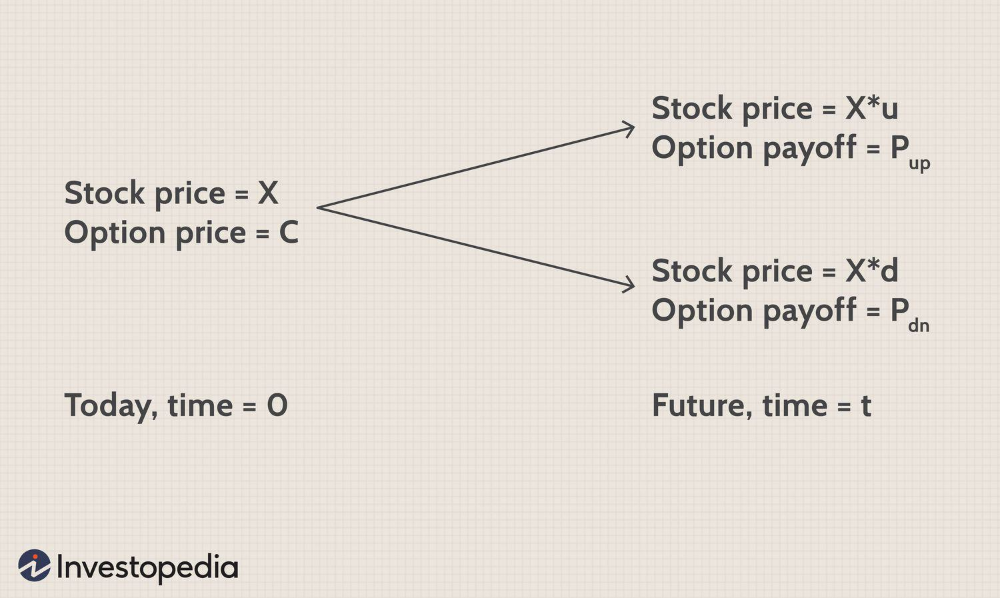

The stock market is a dynamic arena where trading is influenced by multiple factors including share pricing, financial markets, and algorithmic trading. This article examines the integral elements of the stock market, focusing on the mechanisms behind share price determination and the growing influence of algorithmic trading. Understanding share pricing dynamics is crucial for investors seeking to navigate the complexities of financial markets. Key factors involved in share pricing include Initial Public Offering (IPO) processes, supply and demand dynamics, and the impact of market news. IPOs are pivotal events where a company's shares are offered to the public for the first time, with investment banks playing a significant role in setting the initial prices through a rigorous evaluation of projected performance and net present value.

Furthermore, market forces such as supply and demand constantly influence the valuation of shares post-IPO. Economic indicators, investor behavior, and even market sentiment can cause fluctuations in share prices. These elements require investors to analyze various data points, facilitating more informed decision-making processes.

Parallelly, algorithmic trading has emerged as a transformative force within the stock market. By employing computer programs to execute trades based on pre-defined criteria, algo-trading enhances execution efficiency, mitigates emotional bias, and optimizes trade timing. Strategies like arbitrage, trend-following, and the use of moving averages are increasingly driven by algorithms, offering distinct advantages such as reduced transaction costs and the ability to conduct complex calculations swiftly.

Nonetheless, the rise of algorithmic trading is not without challenges. Issues such as market instability during flash crashes and dependence on robust technological infrastructure pose significant risks. Understanding both the advantages and challenges of algorithmic trading is essential to grasp its impact on today's markets. Embrace the journey to unravel the intricacies of share pricing and algorithmic trading within the ever-evolving financial landscape.

## Table of Contents

## Understanding Share Pricing in Financial Markets

Share pricing is influenced by a myriad of factors encompassing a company's financial health, prevailing market demand, and broader economic conditions. At the heart of understanding share pricing lies the mechanics of the initial public offering (IPO) and post-IPO market dynamics.

During an IPO, investment banks are pivotal in establishing the initial share prices. These financial institutions employ comprehensive valuation methods to determine a suitable price range. Key factors include the company’s projected financial performance and net present value (NPV). The NPV is calculated using the formula:

$$
NPV = \sum \left( \frac{R_t}{(1 + i)^t} \right) - C_0
$$

where $R_t$ represents the net cash inflow in time period $t$, $i$ is the discount rate, and $C_0$ is the initial investment cost. This calculation helps project potential returns and establish a price reflective of future growth expectations.

Post-IPO, the market dictates share pricing, primarily driven by supply and demand dynamics. If demand surpasses the available supply, share prices typically rise, and vice versa. External factors such as market news, economic indicators, and collective investor behavior, often referred to as herd instincts, can cause rapid shifts or [volatility](/wiki/volatility-trading-strategies) in share prices.

Effective interpretation of these elements equips investors with the ability to make well-informed decisions. By analyzing a company's financial statements, monitoring market trends, and understanding broader economic indicators, investors can better predict potential price movements. Overall, a comprehensive grasp of the aforementioned factors is crucial for navigating the complexities of share pricing within financial markets.

## The Role of Algorithmic Trading in the Stock Market

Algorithmic trading, commonly referred to as algo-trading, utilizes computer programs to execute trading strategies based on pre-defined criteria. These algorithms analyze various data inputs to identify optimal trading opportunities, providing significant advantages in terms of speed and precision. The primary goal of algo-trading is to achieve the best possible trade execution by minimizing human errors and emotional decision-making, thereby enhancing overall trading efficiency.

One prominent strategy within [algorithmic trading](/wiki/algorithmic-trading) is trend-following, where algorithms detect patterns and moving averages to guide buy or sell decisions. These algorithms can quickly analyze vast datasets to determine market trends, implementing trades in real-time without the delays inherent in manual trading.

High-frequency trading ([HFT](/wiki/high-frequency-trading-strategies)), a subset of algo-trading, emphasizes rapid trade execution, often completing numerous transactions within milliseconds. HFT algorithms are built to exploit minor price differentials and market inefficiencies, with substantial investment in technological infrastructure necessary to maintain the competitive edge. They rely on advanced computing power and network latency optimizations to perform efficiently in these microsecond-level operations.

Arbitrage is another technique prevalent in algorithmic trading. It exploits price discrepancies across different markets or securities. For instance, if a stock is undervalued in one market compared to another, an algorithm can simultaneously buy the stock at a lower price and sell it at a higher price, locking in profit margins too small for human traders to capture.

The benefits of algorithmic trading are manifold. It allows for reduced transaction costs through precise order execution and the ability to perform complex computations swiftly. Algorithms can manage vast amounts of information and execute trades based on detailed quantitative models, bringing a new level of efficiency to the market.

However, challenges persist. The heavy reliance on technology makes algorithmic trading susceptible to technical failures. Flash crashes, sharp market drops caused by trading algorithms interacting in unforeseen ways, highlight the potential for instability. Moreover, the dependency on advanced technological infrastructure means significant costs for development and maintenance.

In conclusion, algorithmic trading holds a transformative role in the stock market by combining speed, efficiency, and precision in executing trades, though it also necessitates robust systems and regulatory oversight to manage its associated risks effectively.

## Strategies and Techniques in Algorithmic Trading

Algorithmic trading employs various strategies to execute trades with minimal human intervention, optimizing performance and resources. Among the most prevalent strategies are trend-following, [arbitrage](/wiki/arbitrage), and market-making, each serving distinct purposes and utilizing different techniques to navigate market conditions.

Trend-following strategies are a cornerstone of algorithmic trading, leveraging moving averages and other technical indicators to identify [momentum](/wiki/momentum) in asset prices. These strategies predict that assets will continue to move in the same direction. For instance, if a security's short-term moving average crosses above a long-term moving average, this may signal a buying opportunity. Conversely, a crossover where the short-term moving average falls below the long-term average might indicate a selling opportunity. The algebraic representation of a simple moving average (SMA) is:

$$
\text{SMA} = \frac{\sum_{i=1}^{N} P_i}{N}
$$

where $P_i$ is the price of the asset at each interval $i$, and $N$ is the number of periods considered.

Arbitrage exploits price discrepancies across different markets or instruments, seeking risk-free profit. An arbitrage trader might simultaneously buy and sell an asset in two different markets to capitalize on minute price differences. Advanced algorithms can rapidly execute these trades, maintaining profitability even when margins are negligible. An example of arbitrage is triangular arbitrage in currency markets, where discrepancies among three currencies allow for profit without holding any position, by converting one currency to another and then back again.

Market-making algorithms enhance [liquidity](/wiki/liquidity-risk-premium) by continuously quoting buy and sell prices for the assets, profiting from the bid-ask spread. These algorithms must efficiently manage inventory and price risk while maintaining a competitive edge in pricing. Market-makers provide stability to the markets, reducing volatility and improving price discovery, though they must be precise to avoid holding assets during unfavorable price shifts.

More sophisticated strategies integrate [machine learning](/wiki/machine-learning), enabling models to evolve based on real-time data and historical market patterns. Machine learning algorithms can optimize decision-making, identifying profitable trades by understanding complex data sets and unearthing hidden patterns. These models adjust their strategy dynamically, learning from successes and failures to refine their predictive capabilities over time. 

Python, a preferred language in the algorithmic trading community, facilitates these operations with libraries like NumPy for numerical computations, pandas for data manipulation, and scikit-learn for implementing machine learning models.

Collectively, these strategies provide traders with tools to mitigate risks and improve efficiency. Whether through statistical analysis or leveraging computational power to react to market changes, algorithmic trading continues to evolve, incorporating new data-driven techniques and technological advancements to optimize market participation.

## Implications for Investors and Traders

Algorithmic trading has significantly transformed the landscape of investing and trading by providing broader access to advanced trading tactics. It offers significant benefits to investors, such as enhanced precision and reduced transaction costs. By automating the trading process, algorithmic trading helps minimize human intervention, which in turn decreases the chances of errors and emotional bias. This results in more consistent and predictable trading outcomes.

Investors, however, must not overlook the importance of understanding the regulatory environment governing algorithmic trading. Compliance with these regulations is crucial to mitigate the risks associated with automated trading systems. For instance, certain jurisdictions may have specific rules regarding market manipulation and the use of algorithms, which investors need to be aware of to avoid potential legal issues.

Moreover, successful implementation of algorithmic trading strategies requires traders to have a solid grasp of both technological aspects and market knowledge. This includes understanding the algorithms themselves, as well as the computational and network infrastructure needed to support high-frequency and algorithmic trading operations. Traders need to constantly update and refine their strategies in response to evolving market conditions and technological advancements.

As the financial markets continue to advance, algorithmic trading will likely become even more widespread, presenting both new opportunities and challenges for market participants. This evolution is expected to bring about innovations that will further enhance efficiency and offer novel trading possibilities. However, with these advancements come challenges, such as the need for increased cybersecurity measures and the ability to react swiftly to market anomalies.

To remain competitive, investors should stay informed about the latest developments in algorithmic trading and be willing to adapt their strategies as the market environment changes. Continued learning and adaptability will be paramount for investors and traders aiming to harness the full potential of algorithmic trading in an increasingly dynamic and complex financial market.

## Conclusion

The interplay between share pricing and algorithmic trading represents a significant evolution in financial markets. Understanding how stock prices are set through mechanisms such as supply and demand, market sentiment, and economic indicators is crucial for modern investors. This knowledge, coupled with an understanding of how algorithmic trading operates, can provide a competitive edge. Algorithmic trading enhances market efficiency by executing trades at optimal times and prices, minimizing transaction costs and human biases.

As technology continues to advance, the significance of algorithms in trading is expected to grow, influencing market behaviors and trends. Machine learning and [artificial intelligence](/wiki/ai-artificial-intelligence) are likely to further refine trading algorithms, allowing for more sophisticated strategies and better prediction models. For traders and investors, staying informed about these technological advancements and adapting to changing market signals are vital to harness the potential of algorithmic trading effectively.

This comprehensive exploration of share pricing and algorithmic trading serves as a foundation for future learning and engagement in the stock market. By understanding these concepts, investors can make informed decisions and potentially achieve better trading outcomes. Exploring these aspects will help in navigating the complexities of today's financial markets more effectively, ensuring that traders and investors can capitalize on new opportunities while mitigating associated risks.

## References & Further Reading

[1]: "Algorithmic Trading: Winning Strategies and Their Rationale" by Ernest P. Chan, Wiley Trading.

[2]: "Market Microstructure In Practice" by Larry Harris.

[3]: ["Advances in Financial Machine Learning"](https://www.amazon.com/Advances-Financial-Machine-Learning-Marcos/dp/1119482089) by Marcos Lopez de Prado.

[4]: ["The Impact of High-Frequency Trading on Markets"](https://www.oxjournal.org/assessing-the-impact-of-high-frequency-trading-on-market-efficiency-and-stability/) by Albert J. Menkveld, European Central Bank Working Paper No. 1350.

[5]: "Quantitative Finance For Dummies" by Steve Bell.

[6]: "Evidence-Based Technical Analysis: Applying the Scientific Method and Statistical Inference to Trading Signals" by David Aronson.

[7]: ["A History of the Global Stock Market: From Ancient Rome to Silicon Valley"](https://archive.org/details/historyofglobals0000smit) by B. Mark Smith.