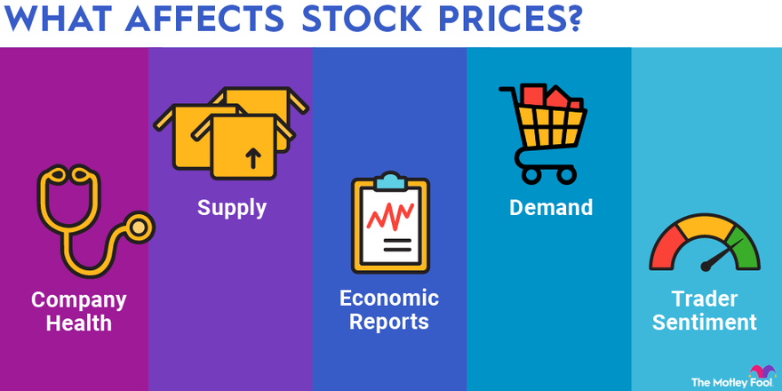

## Table of Contents

## What is a share price and why is it important?

A share price is the cost of one share of a company's stock. When you buy a share, you are buying a small piece of that company. The share price can go up or down based on many things, like how well the company is doing, what is happening in the world, and what people think about the company's future.

The share price is important because it shows what people think a company is worth. If the share price goes up, it means more people want to buy the company's stock, and they think the company will do well in the future. If the share price goes down, it might mean that people are worried about the company or think it will not do as well. Knowing the share price helps investors decide if they should buy, sell, or keep their shares in a company.

## What are the basic factors that influence share prices?

Share prices are affected by many things. One big factor is how well the company is doing. If a company makes more money and grows, people might want to buy its shares, which can make the share price go up. On the other hand, if a company is losing money or not doing well, people might sell their shares, which can make the share price go down. Another important factor is what is happening in the world or in the economy. If the economy is doing well, people might feel more confident about buying shares, which can push share prices up. But if there is a big problem, like a recession, people might be scared and sell their shares, making prices fall.

News and what people think about the future also play a big role. If there is good news about a company, like a new product or a big deal, the share price might go up because people think the company will do better. Bad news, like a lawsuit or a scandal, can make the share price drop because people might think the company will have problems. Finally, what other investors are doing can affect share prices too. If many people start buying a certain stock, the price can go up just because of the demand. If many people start selling, the price can go down because there are more shares for sale than people want to buy.

## How does supply and demand affect share prices?

Supply and demand is a big reason why share prices go up or down. When more people want to buy a company's shares than there are shares available, this is called high demand. When there's high demand, the share price goes up because people are willing to pay more to get the shares. On the other hand, if a lot of people want to sell their shares and there aren't many people wanting to buy them, this is called high supply. When there's high supply, the share price can go down because sellers might have to lower their prices to find someone to buy the shares.

This balance between how many shares people want to buy and how many are available to sell can change all the time. For example, if a company does really well and people think it will keep doing well, more people might want to buy its shares, increasing demand and pushing the price up. But if something bad happens, like the company losing money or bad news coming out, more people might want to sell their shares, increasing supply and pushing the price down. So, supply and demand are always at work, making share prices move based on what people are doing and thinking.

## What are the different methods used to determine share prices?

One way to determine share prices is by looking at how much money a company makes. This is called the fundamental analysis. People look at the company's profits, how much it grows, and how much it pays in dividends. If a company makes a lot of money and is expected to keep making more, people might think its shares are worth more, so the share price goes up. On the other hand, if a company is losing money or not doing well, people might think its shares are worth less, and the share price goes down.

Another method is called technical analysis. This method looks at past share prices and trading volumes to guess where the price might go next. People use charts and patterns to see if the share price is going up or down. They believe that past price movements can help predict future movements. This method doesn't look at the company's profits or news; it just focuses on the numbers and patterns in the share price itself.

Lastly, there's something called market sentiment. This is about what people feel and think about a company or the stock market in general. If people are feeling good and think the company will do well, they might buy more shares, which can push the price up. If people are worried or think the company will have problems, they might sell their shares, which can push the price down. Market sentiment can change quickly based on news, events, or even rumors, and it can have a big effect on share prices.

## Can you explain the concept of intrinsic value in share pricing?

Intrinsic value is like the true worth of a company's share, not just what people are willing to pay for it at the moment. It's a way to figure out what a share should be worth based on the company's real value. To find the intrinsic value, you look at things like how much money the company makes, how much it grows, and how much it pays in dividends. You might also think about things like the company's debts, how good its management is, and what the future might hold for the business. If the share price is lower than the intrinsic value, it could mean the share is a good deal because it's worth more than what you're paying for it.

Sometimes, the share price in the market can be different from the intrinsic value. This can happen because of things like what people feel about the company or the economy, or because of news and events that make people want to buy or sell shares quickly. If the share price is higher than the intrinsic value, some people might think the share is overpriced and not a good buy. On the other hand, if the share price is lower than the intrinsic value, some people might see it as a chance to buy a good share at a lower price. Understanding the intrinsic value helps investors make smarter choices about when to buy or sell shares.

## How do fundamental analysis techniques contribute to determining share prices?

Fundamental analysis is a way to figure out what a share should be worth by looking at the company's money matters. People use this method to check things like how much money the company makes, how fast it's growing, and how much it pays in dividends. They also look at the company's debts and how good its managers are. By adding up all these details, they can guess the company's real value, which is called the intrinsic value. If the share price is lower than this intrinsic value, it might be a good time to buy because the share could be worth more than what people are paying for it right now.

This method also helps people understand if a company is a good investment for the long run. For example, if a company is making more money every year and doesn't have a lot of debt, its shares might be worth more in the future. On the other hand, if a company is losing money or has a lot of debt, its shares might not be worth as much. By using fundamental analysis, investors can make smarter choices about which shares to buy or sell, based on the company's true health and not just what other people are doing in the market.

## What role does technical analysis play in share price determination?

Technical analysis is a way to guess where a share's price might go next by looking at past prices and how many shares were traded. People who use this method believe that past price movements can help predict future ones. They use charts and patterns to see if the share price is going up or down. For example, if they see a pattern that often means the price will go up, they might decide to buy the share. Technical analysis doesn't look at how much money the company makes or what's happening in the news; it just focuses on the numbers and patterns in the share price itself.

This method can help people make quick decisions about buying or selling shares. If the charts show that the share price is likely to go up soon, someone might buy the share hoping to sell it later at a higher price. On the other hand, if the charts show the price might go down, they might sell the share to avoid losing money. Technical analysis is all about using past data to make guesses about the future, which can be really helpful for people who trade shares a lot and need to make fast decisions.

## How do market sentiment and news impact share prices?

Market sentiment is all about what people feel and think about a company or the stock market. If people feel good and think a company will do well, they might buy more of its shares. This can make the share price go up because more people want to buy than sell. On the other hand, if people are worried or think a company will have problems, they might sell their shares. This can make the share price go down because more people want to sell than buy. Market sentiment can change quickly because of news, events, or even rumors, and it can have a big effect on share prices.

News also plays a big role in how share prices move. Good news, like a company making a new product or getting a big deal, can make people feel more confident about the company. This can make the share price go up because people think the company will do better in the future. Bad news, like a company losing money or getting into a lawsuit, can make people worried. This can make the share price go down because people think the company might have problems. So, both market sentiment and news can make share prices go up or down, depending on what people think and feel about the company.

## What are the key financial ratios used in share valuation?

Key financial ratios help people figure out if a share is a good buy. One important ratio is the Price-to-Earnings (P/E) ratio. This ratio shows how much you pay for each dollar of the company's earnings. If the P/E ratio is low, it might mean the share is a good deal because you're paying less for the company's profits. Another useful ratio is the Price-to-Book (P/B) ratio. This ratio compares the share price to the company's book value, which is what the company would be worth if it sold all its stuff and paid off its debts. A low P/B ratio might mean the share is undervalued.

Another ratio people look at is the Dividend Yield. This shows how much money you get back in dividends for each dollar you invest in the share. A high dividend yield can be good if you want to get money from your shares without selling them. The Debt-to-Equity (D/E) ratio is also important. It shows how much debt the company has compared to its equity, which is the money the company gets from its owners. A high D/E ratio might mean the company has a lot of debt, which could be risky. By looking at these ratios, people can get a better idea of a share's value and make smarter choices about buying or selling.

## How do economic indicators influence share prices?

Economic indicators are like signs that show how well the economy is doing. Things like the unemployment rate, inflation, and how much people are spending can tell us if the economy is growing or shrinking. When these signs show the economy is doing well, people might feel more confident about buying shares. They think that if the economy is good, companies will make more money, so share prices might go up. On the other hand, if the economic indicators show the economy is doing badly, people might get worried and sell their shares. This can make share prices go down because people think companies will not make as much money.

Interest rates are another big economic indicator that can affect share prices. When interest rates are low, it's cheaper for companies to borrow money, so they can grow and make more profits. This can make people want to buy shares, pushing the prices up. But when interest rates go up, borrowing money becomes more expensive, and companies might not grow as fast. This can make people sell their shares, which can push the prices down. So, economic indicators give people clues about the economy and help them decide if they should buy or sell shares.

## What advanced models are used by experts to predict share prices?

Experts use some fancy models to try and guess where share prices might go. One popular model is called the Discounted Cash Flow (DCF) model. This model tries to figure out what a share is worth by looking at how much money the company will make in the future. It takes all those future earnings and brings them back to today's value, using something called a discount rate. If the share price is lower than this calculated value, it might be a good buy. Another model is the Black-Scholes model, which is often used for pricing options, but can also help with share price predictions. It uses math to figure out the price of an option based on things like the share's current price, how much it moves around, and how long until the option expires.

Another advanced model is the Capital Asset Pricing Model (CAPM). This one helps figure out how much return you should expect from a share, based on how risky it is. It compares the share to the whole market and uses something called the beta to see how much the share's price moves with the market. If a share has a high beta, it moves a lot with the market, which means it's riskier but could give you a bigger return. There's also something called machine learning models, which use computers to find patterns in big sets of data. These models can look at tons of information, like past share prices, news, and economic indicators, to make guesses about where share prices might go next. They're really good at finding small details that people might miss, which can help make better predictions.

## How do global events and geopolitical factors affect share price determination?

Global events and geopolitical factors can have a big impact on share prices. When something big happens in the world, like a war, a natural disaster, or a big election, it can change how people feel about the economy and companies. If people think these events will hurt the economy, they might sell their shares, which can make share prices go down. For example, if there's a war in a country that makes a lot of oil, people might worry that oil prices will go up, which can hurt companies that need oil and make their share prices drop.

On the other hand, good global events can make share prices go up. If countries sign a big trade deal or if there's a breakthrough in technology, people might feel more confident about the future. They might buy more shares because they think companies will do better, pushing share prices up. Geopolitical factors like changes in government policies or international relations can also play a role. If a new law makes it easier for companies to do business, their share prices might go up. But if a new policy makes things harder, share prices might go down. So, what happens around the world can really move share prices, depending on how people think it will affect companies and the economy.

## How can one understand share pricing in financial markets?

Share pricing is influenced by a myriad of factors encompassing a company's financial health, prevailing market demand, and broader economic conditions. At the heart of understanding share pricing lies the mechanics of the initial public offering (IPO) and post-IPO market dynamics.

During an IPO, investment banks are pivotal in establishing the initial share prices. These financial institutions employ comprehensive valuation methods to determine a suitable price range. Key factors include the company’s projected financial performance and net present value (NPV). The NPV is calculated using the formula:

$$
NPV = \sum \left( \frac{R_t}{(1 + i)^t} \right) - C_0
$$

where $R_t$ represents the net cash inflow in time period $t$, $i$ is the discount rate, and $C_0$ is the initial investment cost. This calculation helps project potential returns and establish a price reflective of future growth expectations.

Post-IPO, the market dictates share pricing, primarily driven by supply and demand dynamics. If demand surpasses the available supply, share prices typically rise, and vice versa. External factors such as market news, economic indicators, and collective investor behavior, often referred to as herd instincts, can cause rapid shifts or [volatility](/wiki/volatility-trading-strategies) in share prices.

Effective interpretation of these elements equips investors with the ability to make well-informed decisions. By analyzing a company's financial statements, monitoring market trends, and understanding broader economic indicators, investors can better predict potential price movements. Overall, a comprehensive grasp of the aforementioned factors is crucial for navigating the complexities of share pricing within financial markets.

## What are the strategies and techniques used in algorithmic trading?

Algorithmic trading employs various strategies to execute trades with minimal human intervention, optimizing performance and resources. Among the most prevalent strategies are trend-following, [arbitrage](/wiki/arbitrage), and market-making, each serving distinct purposes and utilizing different techniques to navigate market conditions.

Trend-following strategies are a cornerstone of algorithmic trading, leveraging moving averages and other technical indicators to identify [momentum](/wiki/momentum) in asset prices. These strategies predict that assets will continue to move in the same direction. For instance, if a security's short-term moving average crosses above a long-term moving average, this may signal a buying opportunity. Conversely, a crossover where the short-term moving average falls below the long-term average might indicate a selling opportunity. The algebraic representation of a simple moving average (SMA) is:

$$
\text{SMA} = \frac{\sum_{i=1}^{N} P_i}{N}
$$

where $P_i$ is the price of the asset at each interval $i$, and $N$ is the number of periods considered.

Arbitrage exploits price discrepancies across different markets or instruments, seeking risk-free profit. An arbitrage trader might simultaneously buy and sell an asset in two different markets to capitalize on minute price differences. Advanced algorithms can rapidly execute these trades, maintaining profitability even when margins are negligible. An example of arbitrage is triangular arbitrage in currency markets, where discrepancies among three currencies allow for profit without holding any position, by converting one currency to another and then back again.

Market-making algorithms enhance [liquidity](/wiki/liquidity-risk-premium) by continuously quoting buy and sell prices for the assets, profiting from the bid-ask spread. These algorithms must efficiently manage inventory and price risk while maintaining a competitive edge in pricing. Market-makers provide stability to the markets, reducing volatility and improving price discovery, though they must be precise to avoid holding assets during unfavorable price shifts.

More sophisticated strategies integrate [machine learning](/wiki/machine-learning), enabling models to evolve based on real-time data and historical market patterns. Machine learning algorithms can optimize decision-making, identifying profitable trades by understanding complex data sets and unearthing hidden patterns. These models adjust their strategy dynamically, learning from successes and failures to refine their predictive capabilities over time. 

Python, a preferred language in the algorithmic trading community, facilitates these operations with libraries like NumPy for numerical computations, pandas for data manipulation, and scikit-learn for implementing machine learning models.

Collectively, these strategies provide traders with tools to mitigate risks and improve efficiency. Whether through statistical analysis or leveraging computational power to react to market changes, algorithmic trading continues to evolve, incorporating new data-driven techniques and technological advancements to optimize market participation.

## References & Further Reading

[1]: "Algorithmic Trading: Winning Strategies and Their Rationale" by Ernest P. Chan, Wiley Trading.

[2]: "Market Microstructure In Practice" by Larry Harris.

[3]: ["Advances in Financial Machine Learning"](https://www.amazon.com/Advances-Financial-Machine-Learning-Marcos/dp/1119482089) by Marcos Lopez de Prado.

[4]: ["The Impact of High-Frequency Trading on Markets"](https://www.oxjournal.org/assessing-the-impact-of-high-frequency-trading-on-market-efficiency-and-stability/) by Albert J. Menkveld, European Central Bank Working Paper No. 1350.

[5]: "Quantitative Finance For Dummies" by Steve Bell.

[6]: "Evidence-Based Technical Analysis: Applying the Scientific Method and Statistical Inference to Trading Signals" by David Aronson.

[7]: ["A History of the Global Stock Market: From Ancient Rome to Silicon Valley"](https://archive.org/details/historyofglobals0000smit) by B. Mark Smith.