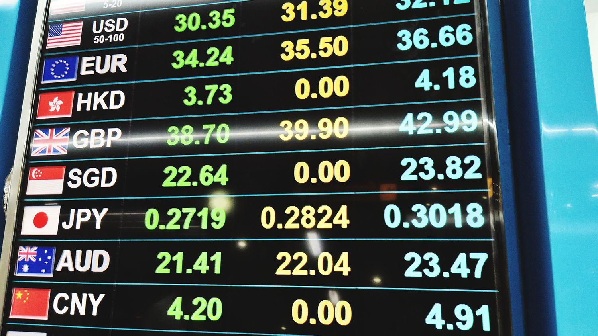

The foreign exchange market, commonly known as forex, stands as the largest financial market worldwide, boasting a staggering daily turnover of over $6.6 trillion. This market operates as a decentralized platform for the trading of currencies, where exchange rates fluctuate based on supply and demand dynamics, macroeconomic indicators, and geopolitical events. 

Accurate exchange rate forecasting is crucial for traders, investors, and businesses aiming to manage financial risks and enhance profitability. Changes in currency values can significantly impact profit margins, cross-border operations, and investment portfolios. Therefore, predicting these fluctuations aids in strategic decision-making and hedging against unfavorable exchange rate movements.



The introduction of machine learning and algorithmic trading technologies has significantly transformed currency forecasting. These advancements enable the processing and analysis of vast data sets, resulting in more precise and reliable predictions. Machine learning models, such as Long Short-Term Memory (LSTM) and Artificial Neural Networks (ANN), are particularly adept at recognizing complex patterns in historical price data and generating forecasts that traditional methods may overlook.

This article provides an overview of the significance of exchange rate predictions in the finance sector, elucidating the methodologies utilized in forecasting and examining the transformative impact of algorithmic trading on this domain. These insights are essential for understanding the evolving landscape of financial markets and the tools available to market participants for informed decision-making.

## Table of Contents

## The Importance of Exchange Rate Forecasting

Understanding exchange rate movements is pivotal for organizations aiming to make informed financial decisions. The foreign exchange market, known for its vast size and complexity, directly impacts global economics, and accurate forecasting of exchange rates is crucial for mitigating risks associated with currency fluctuations. Businesses, brokers, and governments heavily rely on these predictions to safeguard against adverse currency movements that can impact profitability and financial stability.

For brokers and financial institutions, precise exchange rate forecasts allow them to devise better trading strategies, optimize their portfolio allocations, and manage currency-related risks effectively. Companies engaged in international trade utilize exchange rate predictions to hedge against uncertain currency movements, ensuring stable pricing and profitability across borders.

Governments and policymakers consider exchange rate forecasts a critical component in economic planning and monetary policy formulation. Accurate predictions guide decisions on interest rates, foreign exchange reserves management, and economic interventions aimed at stabilizing the national currency.

In international trade, exchange rate fluctuations can significantly affect the cost competitiveness of exporting and importing goods. Businesses utilize currency forecasts to adjust their pricing strategies, negotiate contracts with currency clauses, and decide on the timing of transactions to capitalize on favorable exchange rates.

For investors, exchange rate movements influence the return on investments in foreign assets. Understanding these movements enables them to manage foreign exchange risk, diversify their portfolios, and make strategic investment decisions that maximize return on investments.

Thus, exchange rate forecasting serves as a fundamental tool for economic participants to manage risks, optimize capital allocation, and maintain financial stability in an unpredictable global economic landscape. This reliance underscores the importance of developing accurate and reliable forecasting models to navigate the intricacies of international finance efficiently.

## Fundamental Analysis Vs. Technical Analysis

Fundamental analysis and technical analysis serve as two principal methodologies for forecasting exchange rates, each offering distinct insights and approaches.

Fundamental analysis seeks to evaluate the intrinsic value of a currency by considering economic indicators and macroeconomic factors. Key elements include Gross Domestic Product (GDP), inflation rates, interest rates, employment figures, and balance of trade data. For instance, currencies of countries with higher GDP growth and stable inflation rates are typically stronger due to increased investor confidence and demand. Interest rates also significantly influence exchange rates; higher interest rates offer lenders a better return relative to other countries. This can boost a currency's value as investors seek higher returns, driving up demand. A comprehensive [fundamental analysis](/wiki/fundamental-analysis) might involve assessing the Purchasing Power Parity (PPP), which suggests that in the long run, exchange rates should adjust to equalize the price of identical goods and services in different economies.

In contrast, technical analysis examines historical price data to identify patterns and trends in exchange rate movements. This approach relies on chart patterns, technical indicators, and statistical measures to predict future price movements. Commonly used tools include moving averages, the Relative Strength Index (RSI), and the Moving Average Convergence Divergence (MACD). For example, a moving average can smooth out price data to identify the direction of a trend, while RSI measures the magnitude of recent price changes to assess overbought or oversold conditions. Technical analysis operates under the assumption that all market information is already reflected in the currency's price, thus dismissing the need for external data.

While each method has its strengths, integrating both fundamental and technical analyses often yields more accurate forecasts. A hybrid approach allows for a more comprehensive understanding of market dynamics by combining the long-term insights of fundamental data with the short-term predictive power of technical indicators. For instance, a trader might use fundamental analysis to assess the overall economic conditions influencing a currency and apply technical analysis to fine-tune entry and [exit](/wiki/exit-strategy) points in the market. 

Ultimately, both analyses can complement each other, providing a robust framework for currency forecasting and effective risk management.

## Common Methods in Currency Forecasting

Purchasing Power Parity (PPP), Relative Economic Strength, and Econometric Models are fundamental methods for forecasting currency exchange rates. These techniques leverage diverse approaches to analyze and predict market movements, each providing unique insights into the factors influencing currency values.

Purchasing Power Parity (PPP) is based on the idea that in the long run, exchange rates should adjust to equalize the price of identical goods and services in different countries. This method assumes that [arbitrage](/wiki/arbitrage) will eliminate price differences over time. If a basket of goods is cheaper in one country than another, the currency of the first country is expected to appreciate until price parity is restored. The formula used in PPP is typically:

$$
S = \frac{P_1}{P_2}
$$

Where $S$ is the exchange rate, and $P_1$ and $P_2$ are the prices of the basket of goods in the two respective countries. It's important to note that PPP is more reliable for long-term forecasts as short-term exchange rates can be influenced by other factors such as market sentiment and speculative actions.

Relative Economic Strength analyzes the economic growth prospects and [interest rate](/wiki/interest-rate-trading-strategies) differentials between countries to forecast currency movements. Generally, a country with a strong economic outlook and higher interest rates will have a more attractive currency. Investors seeking better returns will move capital into such economies, which can increase demand and thus the value of the currency. This method requires careful monitoring of macroeconomic indicators such as GDP growth rates, inflation, and employment [statistics](/wiki/bayesian-statistics) to assess economic strength.

Econometric Models use statistical methods to create models that consider a wide range of economic variables and their relationships to forecast trends. These models are often based on historical data to identify patterns and correlations between variables. An example of a simple econometric model is:

$$
E_{t+1} = \alpha + \beta_1 X_{1,t} + \beta_2 X_{2,t} + \ldots + \varepsilon_t
$$

Where $E_{t+1}$ is the predicted exchange rate, $\alpha$ is the intercept, $\beta_1, \beta_2, \ldots$ are coefficients, $X_{1,t}, X_{2,t}, \ldots$ are economic variables such as interest rates, trade balances, or foreign investments, and $\varepsilon_t$ is the error term.

Each of these methods offers a different perspective on exchange rate forecasting. PPP provides insights into long-term equilibrium values, while Relative Economic Strength focuses on medium-term trends driven by economic fundamentals. Econometric Models, on the other hand, allow for nuanced analysis using a multitude of variables, making them versatile tools in predicting currency movements. Despite their differences, combining these methods can yield a comprehensive understanding and more accurate predictions of future exchange rate dynamics.

## Algorithmic Trading and Machine Learning

Algorithmic trading leverages computer algorithms to automate trading processes by executing trades based on predefined strategies and complex data analysis. This automated approach increases efficiency and reduces the chances of human error, allowing traders to capitalize on favorable market conditions rapidly. Machine learning has become integral to enhancing [algorithmic trading](/wiki/algorithmic-trading), particularly with its ability to analyze large datasets and recognize intricate patterns that could signal profitable opportunities.

Among the [machine learning](/wiki/machine-learning) models, Long Short-Term Memory (LSTM) networks and Artificial Neural Networks (ANN) are widely used in [forex](/wiki/forex-system) market predictions. LSTM networks, a type of recurrent [neural network](/wiki/neural-network) (RNN), excel in learning from sequential data, making them suitable for predicting time-series data like exchange rates. They are designed to remember long-term dependencies, which is essential for capturing trends and cycles in forex data.

Artificial Neural Networks, inspired by the human brain's neuron structure, consist of interconnected nodes that process information through layers. ANNs are adept at capturing non-linear relationships in data, which are common in financial markets. They can be trained to predict future price movements by identifying patterns from historical data.

The capabilities of these models are enhanced by their ability to process vast amounts of historical and real-time data, including numerical data, news articles, and market sentiment. Advanced feature engineering and selection techniques help improve their accuracy by identifying the most relevant variables for predictions.

Here's a simple example of implementing a basic LSTM model in Python using the Keras library:

```python
from keras.models import Sequential
from keras.layers import LSTM, Dense
import numpy as np

# Sample data: Replace with actual exchange rate data
data = np.random.rand(100, 1)

# Preprocessing: Reshape data to 3D array for LSTM [samples, timesteps, features]
data = data.reshape((1, data.shape[0], data.shape[1]))

# Build LSTM model
model = Sequential()
model.add(LSTM(50, activation='relu', input_shape=(data.shape[1], data.shape[2])))
model.add(Dense(1))
model.compile(optimizer='adam', loss='mse')

# Train the model (sample example, replace with real data and parameters)
model.fit(data, np.random.rand(1, 100), epochs=300, verbose=0)

# Make predictions
predictions = model.predict(data)
```

Despite their efficacy, machine learning models require extensive computational resources and substantial datasets to train effectively. The unpredictability of market events can still lead to inaccuracies, underscoring the importance of combining technological prowess with traditional methods for more comprehensive analyses. The continuous evolution of AI techniques suggests a promising enhancement in the precision and efficiency of currency forecasting in the future.

## Challenges in Exchange Rate Forecasting

Forecasting exchange rates is inherently complex due to a multitude of interrelated factors. Political, economic, and social elements often introduce [volatility](/wiki/volatility-trading-strategies) and unpredictability into currency markets. Political events, such as elections or policy changes, can rapidly influence investor sentiment, thereby affecting currency values. Economic factors include rate changes, inflation, and GDP growth differentials, while social concerns might encompass shifts in consumer confidence or significant societal disruptions.

Machine learning models, while powerful, are not immune to these challenges. Such models necessitate vast amounts of high-quality data and substantial computational resources. Training these models involves processing large datasets to identify patterns and correlations, necessitating robust computational infrastructure.

Consider a Long Short-Term Memory (LSTM) neural network, often used for time series forecasting in forex markets. An LSTM model demands a well-calibrated architecture, including the number of layers and nodes, which directly impacts performance and computational load:

```python
from tensorflow.keras.models import Sequential
from tensorflow.keras.layers import LSTM, Dense

model = Sequential()
model.add(LSTM(50, return_sequences=True, input_shape=(timesteps, features)))
model.add(LSTM(50))
model.add(Dense(1))
model.compile(optimizer='adam', loss='mean_squared_error')
```

Despite technological strides, the inherent unpredictability of certain events can lead to inaccuracies in machine predictions. Sudden geopolitical tensions or unexpected economic data releases can lead to abrupt market movements that models may not account for. Thus, while machine learning offers advanced tools for currency forecasting, it remains an imperfect science fraught with challenges that stem from the dynamic nature of global markets. 

These challenges underscore the need for continually updated models that adapt to new information, integrating unexpected variables to enhance prediction accuracy. As these models evolve, they seek to balance the complexity and resource demands with the desired precision and reliability of forecasts.

## The Future of Currency Forecasting

Advancements in [artificial intelligence](/wiki/ai-artificial-intelligence) (AI) and big data analytics are poised to significantly enhance the accuracy and precision of currency forecasting. These technologies enable the processing and analysis of vast volumes of data at unprecedented speeds, offering insights that were previously unattainable. By leveraging AI, predictive models can become more sophisticated, capable of considering multiple variables and complex relationships simultaneously.

Real-time data processing has the potential to revolutionize currency forecasting by allowing models to update predictions dynamically as new data becomes available. This can be achieved through the implementation of technologies such as streaming analytics, where data is processed as it arrives, providing up-to-date insights for traders and financial analysts. The integration of blockchain technology, with its decentralized and immutable ledger system, could further enhance these models by providing reliable and transparent historical data, thereby improving the accuracy of forecasts.

Another promising direction for the future of currency forecasting is the integration of diverse datasets. Traditionally, forecasting models have relied heavily on economic indicators and historical financial data. However, the inclusion of non-traditional data sources such as news articles, social media activity, and geopolitical events could provide a more comprehensive view of market dynamics. By analyzing sentiment and emerging trends from these sources, models can potentially capture early signals of market movements that are not reflected in traditional datasets.

For instance, sentiment analysis can be employed to gauge market sentiment based on social media platforms like Twitter or news headlines. This involves utilizing natural language processing (NLP) techniques to assess the overall emotional tone, which can be an indicator of public perception and potential market behavior.

Moreover, the application of machine learning models, particularly those capable of handling time-series data such as Long Short-Term Memory (LSTM) networks and Attention mechanisms, can improve forecasts by capturing complex temporal patterns. Here is an example of how LSTM can be implemented in Python to forecast currency exchange rates:

```python
import numpy as np
import pandas as pd
from keras.models import Sequential
from keras.layers import LSTM, Dense
from sklearn.preprocessing import MinMaxScaler

# Load and preprocess the data
data = pd.read_csv('currency_data.csv')  # Example CSV file
scaler = MinMaxScaler(feature_range=(0, 1))
scaled_data = scaler.fit_transform(data['ExchangeRate'].values.reshape(-1, 1))

# Prepare data for LSTM
def create_dataset(data, time_step=1):
    x, y = [], []
    for i in range(len(data) - time_step - 1):
        a = data[i:(i + time_step), 0]
        x.append(a)
        y.append(data[i + time_step, 0])
    return np.array(x), np.array(y)

time_step = 60
x_train, y_train = create_dataset(scaled_data, time_step)
x_train = x_train.reshape(x_train.shape[0], x_train.shape[1], 1)

# Build the LSTM model
model = Sequential()
model.add(LSTM(units=50, return_sequences=True, input_shape=(x_train.shape[1], 1)))
model.add(LSTM(units=50))
model.add(Dense(1))
model.compile(loss='mean_squared_error', optimizer='adam')

# Train the model
model.fit(x_train, y_train, epochs=100, batch_size=64, verbose=1)

# Future predictions can be made using trained model
```

Looking forward, the integration of AI, real-time processing, blockchain, and diverse datasets heralds a promising future for currency forecasting. These advancements are expected to equip traders, investors, and policymakers with more robust tools, enhancing decision-making and risk management in financial markets.

## Conclusion

Exchange rate forecasting is essential for financial planning and risk management, as it directly influences global trade, investment decisions, and economic policies. The complexity of currency markets, driven by geopolitical events, economic indicators, and investor sentiment, necessitates advanced forecasting techniques for accurate predictions. While traditional methods like fundamental and technical analysis have been foundational, the advent of machine learning and algorithmic trading heralds a promising era for currency forecasting.

Machine learning models, such as Long Short-Term Memory (LSTM) and Artificial Neural Networks (ANN), have significantly enhanced the predictive capabilities by processing vast datasets and identifying intricate patterns that are difficult for human analysts to discern. These models, with their ability to learn from historical data and adapt to new information, offer significant improvements over conventional approaches. Algorithmic trading utilizes these models to execute trades swiftly and accurately, optimizing the timing and execution of trades based on predictive insights.

Despite these advances, challenges in forecasting remain, primarily due to the dynamic nature of financial markets. The unpredictability of geopolitical events, rapid shifts in economic policy, and sudden market sentiment changes can lead to inaccuracies in predictions, underscoring the need for continuous refinement of models. Furthermore, machine learning techniques demand substantial computational resources and high-quality data, which can be barriers for widespread adoption.

Looking into the future, the evolution of AI and big data analytics holds great potential to further refine currency forecasting models. Incorporating real-time data processing and advancements in blockchain technology could enhance the transparency and reliability of financial transactions, providing more robust inputs for predictive models. Additionally, integrating diverse data sources, such as real-time market news and social media sentiment analysis, could yield a more comprehensive understanding of the factors influencing currency markets.

Continuous innovation and development in machine learning, data analytics, and trading algorithms are set to provide financial markets with sophisticated tools for improved decision-making. These developments promise to enhance the resilience of financial institutions against market volatility and equip them with strategies to harness potential opportunities effectively.

## References & Further Reading

[1]: Bermingham, A., & D'Agostino, A. (2014). ["Forecasting exchange rates with model combinations: Can we beat the random walk in real time?"](https://papers.ssrn.com/sol3/papers.cfm?abstract_id=1894592) Journal of International Financial Markets, Institutions and Money, 33, 273-286.

[2]: Baillie, R. T., & Bollerslev, T. (1989). ["The message in daily exchange rates: A conditional-variance tale."](https://www.jstor.org/stable/1391527) Journal of Business & Economic Statistics, 7(3), 297-305.

[3]: Lopez de Prado, M. (2018). ["Advances in Financial Machine Learning."](https://books.google.com/books/about/Advances_in_Financial_Machine_Learning.html?id=oU9KDwAAQBAJ) Wiley.

[4]: Hull, J. C. (2018). ["Options, Futures, and Other Derivatives."](https://www.semanticscholar.org/paper/Options%2C-Futures%2C-and-Other-Derivatives-Hull/89bdee500c8623864fc9eb7a471546aa713acc44) Pearson.

[5]: Murphy, J. J. (1999). ["Technical Analysis of the Financial Markets: A Comprehensive Guide to Trading Methods and Applications."](https://archive.org/details/technicalanalysi0000murp) New York Institute of Finance.