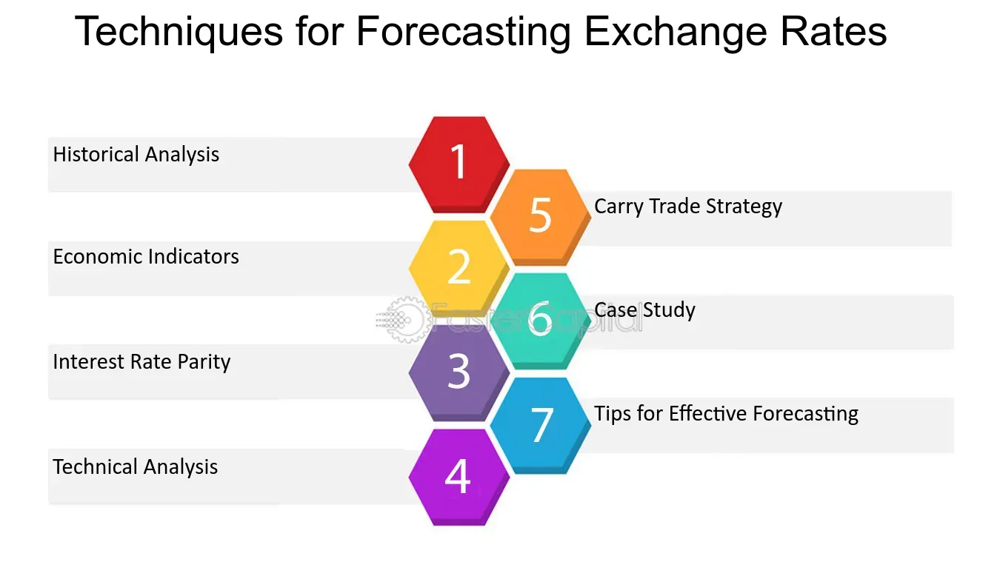

## Table of Contents

## What is currency exchange rate forecasting?

Currency exchange rate forecasting is about predicting how the value of one country's money will change compared to another country's money in the future. People and businesses use these predictions to make smart choices about buying or selling different currencies. For example, if someone thinks the U.S. dollar will become stronger compared to the Euro, they might buy dollars now before the exchange rate changes.

Forecasting exchange rates can be tricky because many things can affect currency values. These include things like a country's economy, interest rates, and even big world events. Experts use different methods to make their predictions. Some look at past data to find patterns, while others use economic theories or even news events to guess what might happen next. Despite the challenges, good forecasts can help people and businesses save money and reduce risks when dealing with foreign currencies.

## Why is forecasting currency exchange rates important for businesses and investors?

Forecasting currency exchange rates is really important for businesses and investors because it helps them make better decisions about money. If a business knows that the currency they use to buy things from another country might get weaker, they can buy that currency now before it loses value. This can save them a lot of money. For investors, knowing how currencies might change can help them decide when to buy or sell foreign investments. If they think a currency will get stronger, they might invest more in that country's stocks or bonds.

Also, good forecasts can help businesses and investors manage risks. If a company does a lot of business in different countries, changes in exchange rates can really affect their profits. By predicting these changes, they can use strategies to protect themselves, like buying insurance against currency changes or setting up deals that lock in current exchange rates. For investors, understanding currency movements can help them avoid big losses and make their investment portfolios safer. Overall, being able to predict exchange rates helps businesses and investors plan better and make smarter financial choices.

## What are the basic economic indicators used in currency exchange rate forecasting?

When people try to guess how currency exchange rates will change, they look at some important signs from a country's economy. These signs, called economic indicators, give clues about how strong or weak a country's money might become. Some of the main indicators people watch are things like how much a country's economy is growing, which is called Gross Domestic Product (GDP). If a country's GDP is going up, it usually means their money might get stronger. Another big indicator is the inflation rate, which shows how fast prices are going up. If prices are going up quickly, it might mean the currency will get weaker. Interest rates are also really important because they affect how much it costs to borrow money. If interest rates go up, it can make a country's currency more attractive to investors, making it stronger.

Besides these, people also look at how many people have jobs, which is called the unemployment rate. If more people are working, it's usually good for the currency. Another thing to watch is how much a country is buying and selling with other countries, known as the trade balance. If a country is selling more than it's buying, it can make its currency stronger. Lastly, people pay attention to how confident businesses and consumers feel about the economy, because this can affect spending and investment. All these indicators help people make educated guesses about where exchange rates might be headed, even though it's never an exact science.

## How does the purchasing power parity (PPP) theory help in forecasting exchange rates?

The purchasing power parity (PPP) theory is a way to guess how the value of different countries' money might change over time. It says that over the long run, the exchange rate between two countries should move so that a basket of goods costs the same in both places. For example, if a burger costs $5 in the U.S. and 4 euros in Europe, the exchange rate should be about 1.25 dollars per euro to make the burger's price the same in both countries. By comparing the prices of similar goods in different countries, people can predict if a currency will get stronger or weaker.

Even though PPP helps with long-term predictions, it's not perfect for short-term forecasts because many other things can affect exchange rates quickly. Things like interest rates, political events, and how much people trust a country's economy can cause the exchange rate to change a lot in the short term. Still, PPP gives a useful starting point for understanding how currencies might move over time, especially when looking at trends over several years. It helps businesses and investors plan for the future by giving them an idea of where exchange rates might be headed in the long run.

## What role do interest rates play in currency exchange rate predictions?

Interest rates are really important when people try to guess how the value of one country's money will change compared to another country's money. When a country's central bank raises interest rates, it makes borrowing money more expensive. This can attract more investors to that country because they can earn more from savings and investments. If lots of people want to invest in a country with high interest rates, they will need to buy that country's currency, which can make it stronger compared to other currencies. On the other hand, if a country lowers its interest rates, it might make its currency weaker because investors might take their money somewhere else where they can get a better return.

But interest rates don't work alone. They are just one piece of the puzzle. Other things like how fast prices are going up (inflation), how strong the country's economy is, and what's happening in the world can also affect exchange rates. For example, if a country's economy is doing well and its interest rates are high, its currency might get even stronger. But if the world is going through a tough time, even high interest rates might not be enough to keep the currency strong. So, when people try to predict exchange rates, they look at interest rates along with all these other factors to get a better idea of what might happen.

## Can you explain the use of technical analysis in forecasting currency exchange rates?

Technical analysis is a way people use to guess how the value of one country's money will change compared to another country's money. Instead of looking at things like a country's economy or interest rates, technical analysis focuses on past price movements and trading patterns. People who use this method believe that history can repeat itself, so they study charts and graphs to find patterns that might tell them what will happen next. They look at things like how the price has moved up and down over time, and use tools like moving averages and trend lines to help them make predictions.

Even though technical analysis doesn't look at the reasons behind price changes, it can still be useful for short-term predictions. Traders often use it to decide when to buy or sell currencies based on what they see in the charts. For example, if a currency's price has been going up and then starts to go down, a trader might think it's time to sell. But technical analysis isn't perfect, and it works best when combined with other methods like looking at economic indicators or news events. By using technical analysis along with other tools, traders can get a better idea of what might happen to exchange rates in the future.

## How do geopolitical events influence currency exchange rate forecasts?

Geopolitical events, like wars, elections, or trade agreements, can really shake up currency exchange rates. When something big happens in the world, it can make people feel unsure about the future. This uncertainty can make them want to move their money to safer places, like countries with stable governments and strong economies. If lots of people want to buy a certain currency because they think it's safe, that currency can get stronger. On the other hand, if a country is going through tough times because of a geopolitical event, its currency might get weaker because people might not want to invest there.

For example, if there's a war or a big political change in a country, it can scare investors away. They might sell off that country's currency, making it lose value compared to other currencies. Also, if countries can't agree on trade deals, it can hurt their economies and make their currencies weaker. People who try to predict exchange rates need to keep an eye on the news and understand how these events might affect different countries. By watching geopolitical events closely, they can make better guesses about where exchange rates might be headed.

## What are the differences between short-term and long-term exchange rate forecasting methods?

Short-term exchange rate forecasting focuses on predicting how currency values will change over a short period, like a few days or weeks. People who do this kind of forecasting often use technical analysis, which looks at past price movements and patterns in charts. They might also pay close attention to daily news and events, like economic reports or geopolitical happenings, because these can quickly affect exchange rates. Traders and investors who need to make quick decisions about buying or selling currencies find short-term forecasts very useful. However, short-term predictions can be tricky because exchange rates can be influenced by many sudden and unpredictable factors.

Long-term exchange rate forecasting, on the other hand, tries to predict how currency values will change over months or years. This type of forecasting often uses economic indicators like GDP growth, inflation rates, and interest rates to understand the bigger picture of a country's economy. Theories like purchasing power parity (PPP) are also used to make long-term predictions, as they help understand how currencies might adjust over time to reflect changes in the cost of living. Businesses and investors who are planning for the future, like those making long-term investments or setting up international operations, rely on these forecasts. While long-term predictions can be more stable, they still need to consider how major world events might change the [course](/wiki/best-algorithmic-trading-courses) of a country's economy over time.

## How do econometric models contribute to currency exchange rate forecasting?

Econometric models help people guess how the value of one country's money will change compared to another country's money by using math and statistics. These models look at a lot of data from the past, like how much a country's economy is growing, how fast prices are going up, and what interest rates are doing. By finding patterns in this data, econometric models can make predictions about what might happen to exchange rates in the future. They help make sense of all the different things that can affect currency values, like economic reports and interest rate changes, and turn them into numbers that can be used to make forecasts.

Even though econometric models are really helpful, they're not perfect. They can be tricky to use because they need a lot of good data, and if the data is wrong or old, the predictions might not be right. Also, these models might not be able to predict big surprises, like sudden political changes or unexpected world events, because they're based on what's happened before. But when used with other ways of guessing exchange rates, like looking at charts or news events, econometric models can give a fuller picture and help businesses and investors make better plans for the future.

## What advanced statistical techniques are used in sophisticated exchange rate forecasting models?

Sophisticated exchange rate forecasting models often use advanced statistical techniques to make their predictions more accurate. One common technique is time series analysis, which looks at how exchange rates have changed over time to find patterns. This method uses things like autoregressive integrated moving average (ARIMA) models to predict future values based on past data. Another technique is [machine learning](/wiki/machine-learning), which can learn from lots of data to find complex relationships that might be hard for people to see. For example, neural networks can be trained on historical exchange rates and economic indicators to make predictions.

Another advanced technique used in these models is vector autoregression (VAR), which looks at how several different economic variables affect each other over time. This helps to understand how changes in one country's economy might affect its currency compared to another country's currency. Additionally, some models use cointegration analysis to see if different currencies move together in the long run, even if they seem to go up and down a lot in the short term. By combining these advanced techniques, forecasters can create more detailed and potentially more accurate predictions about future exchange rates.

## How can machine learning and AI improve the accuracy of currency exchange rate forecasts?

Machine learning and AI can make guessing how currency values will change much better because they can look at a lot of information at once. They can learn from past data, like how the economy was doing or what interest rates were, and find patterns that might be hard for people to see. For example, AI can look at thousands of news articles and figure out how different events might affect exchange rates. This means it can make more accurate guesses about the future by understanding things that might not seem important at first.

Also, machine learning models can keep getting better over time. As they get more data, they can adjust their predictions to be more accurate. This is really helpful because the world is always changing, and what worked in the past might not work in the future. By using AI, people can get forecasts that are not just based on old data, but also on new information as it comes in. This makes the predictions more reliable and helps businesses and investors make smarter choices about money.

## What are the limitations and challenges faced in forecasting currency exchange rates?

Forecasting currency exchange rates is tricky because many things can affect how currencies change value. One big challenge is that the world is always changing, and unexpected events like wars, elections, or economic crises can shake up exchange rates in ways that are hard to predict. Also, the data used to make forecasts might not be perfect. Sometimes the numbers from the past might not be right, or they might not tell the whole story. This makes it hard to make accurate guesses about the future.

Another limitation is that different methods of forecasting can give different answers. For example, looking at past price patterns might suggest one thing, while studying economic indicators might suggest something else. It's tough to know which method to trust more, especially when short-term changes can be very different from long-term trends. Even with advanced tools like machine learning and AI, there's still a lot of uncertainty because these tools can only predict based on what they've learned from the past, and the future might not follow the same rules.

## What are the common methods in currency forecasting?

Purchasing Power Parity (PPP), Relative Economic Strength, and Econometric Models are fundamental methods for forecasting currency exchange rates. These techniques leverage diverse approaches to analyze and predict market movements, each providing unique insights into the factors influencing currency values.

Purchasing Power Parity (PPP) is based on the idea that in the long run, exchange rates should adjust to equalize the price of identical goods and services in different countries. This method assumes that [arbitrage](/wiki/arbitrage) will eliminate price differences over time. If a basket of goods is cheaper in one country than another, the currency of the first country is expected to appreciate until price parity is restored. The formula used in PPP is typically:

$$
S = \frac{P_1}{P_2}
$$

Where $S$ is the exchange rate, and $P_1$ and $P_2$ are the prices of the basket of goods in the two respective countries. It's important to note that PPP is more reliable for long-term forecasts as short-term exchange rates can be influenced by other factors such as market sentiment and speculative actions.

Relative Economic Strength analyzes the economic growth prospects and [interest rate](/wiki/interest-rate-trading-strategies) differentials between countries to forecast currency movements. Generally, a country with a strong economic outlook and higher interest rates will have a more attractive currency. Investors seeking better returns will move capital into such economies, which can increase demand and thus the value of the currency. This method requires careful monitoring of macroeconomic indicators such as GDP growth rates, inflation, and employment [statistics](/wiki/bayesian-statistics) to assess economic strength.

Econometric Models use statistical methods to create models that consider a wide range of economic variables and their relationships to forecast trends. These models are often based on historical data to identify patterns and correlations between variables. An example of a simple econometric model is:

$$
E_{t+1} = \alpha + \beta_1 X_{1,t} + \beta_2 X_{2,t} + \ldots + \varepsilon_t
$$

Where $E_{t+1}$ is the predicted exchange rate, $\alpha$ is the intercept, $\beta_1, \beta_2, \ldots$ are coefficients, $X_{1,t}, X_{2,t}, \ldots$ are economic variables such as interest rates, trade balances, or foreign investments, and $\varepsilon_t$ is the error term.

Each of these methods offers a different perspective on exchange rate forecasting. PPP provides insights into long-term equilibrium values, while Relative Economic Strength focuses on medium-term trends driven by economic fundamentals. Econometric Models, on the other hand, allow for nuanced analysis using a multitude of variables, making them versatile tools in predicting currency movements. Despite their differences, combining these methods can yield a comprehensive understanding and more accurate predictions of future exchange rate dynamics.

## References & Further Reading

[1]: Bermingham, A., & D'Agostino, A. (2014). ["Forecasting exchange rates with model combinations: Can we beat the random walk in real time?"](https://papers.ssrn.com/sol3/papers.cfm?abstract_id=1894592) Journal of International Financial Markets, Institutions and Money, 33, 273-286.

[2]: Baillie, R. T., & Bollerslev, T. (1989). ["The message in daily exchange rates: A conditional-variance tale."](https://www.jstor.org/stable/1391527) Journal of Business & Economic Statistics, 7(3), 297-305.

[3]: Lopez de Prado, M. (2018). ["Advances in Financial Machine Learning."](https://books.google.com/books/about/Advances_in_Financial_Machine_Learning.html?id=oU9KDwAAQBAJ) Wiley.

[4]: Hull, J. C. (2018). ["Options, Futures, and Other Derivatives."](https://www.semanticscholar.org/paper/Options%2C-Futures%2C-and-Other-Derivatives-Hull/89bdee500c8623864fc9eb7a471546aa713acc44) Pearson.

[5]: Murphy, J. J. (1999). ["Technical Analysis of the Financial Markets: A Comprehensive Guide to Trading Methods and Applications."](https://archive.org/details/technicalanalysi0000murp) New York Institute of Finance.