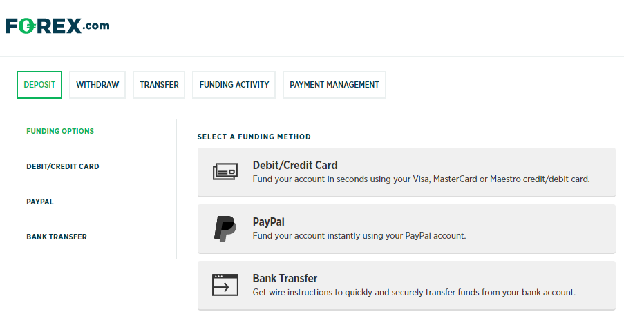

## Table of Contents

## What is a Forex account and why is funding it important?

A Forex account is a special type of account that people use to trade currencies on the foreign exchange market. It's like a bank account, but instead of just saving money, you use it to buy and sell different currencies. When you think one currency will become more valuable compared to another, you can use your Forex account to make a trade and hopefully earn some money.

Funding your Forex account is important because you need money in it to be able to make trades. Without enough funds, you won't be able to take advantage of trading opportunities when they come up. Also, having money in your account can help you manage the risks of trading, as you can use it to cover any losses you might have. So, keeping your Forex account funded is key to being able to trade and potentially make profits.

## What are the basic methods available for funding a Forex account?

There are several common ways to put money into your Forex account. One way is by using a bank transfer. This means you send money directly from your bank account to your Forex account. It's pretty straightforward, but it might take a few days for the money to show up in your Forex account. Another way is by using a credit or debit card. This is usually faster than a bank transfer, and you can often see the money in your Forex account right away or within a few hours.

Another method is through an online payment service like PayPal or Skrill. These services let you move money around online easily, and they're often quick and convenient. Some Forex brokers also let you use e-wallets, which are like digital wallets that hold your money online. You can transfer money from your bank or card to your e-wallet and then from there to your Forex account.

Lastly, some people use cryptocurrencies like Bitcoin to fund their Forex accounts. If your broker supports this, you can send [cryptocurrency](/wiki/cryptocurrency) from your digital wallet to your Forex account. This can be a fast way to fund your account, but you need to make sure your broker accepts cryptocurrencies and that you understand how they work. Each method has its own pros and cons, so it's good to pick the one that works best for you.

## How can I use a bank transfer to fund my Forex account?

To use a bank transfer to fund your Forex account, you first need to log into your Forex broker's platform. Look for the section that says something like "Deposit" or "Fund Your Account." There, you'll usually see an option for bank transfer. Click on it, and you'll be given the bank details where you need to send the money. This includes the bank name, account number, and sometimes a reference number or your Forex account number. Make sure to write down these details carefully.

Next, go to your own bank's website or app, and start a new transfer. Enter the Forex broker's bank details exactly as they were given to you. You'll also need to enter the amount of money you want to transfer. Double-check everything to make sure it's correct, then confirm the transfer. It might take a few days for the money to show up in your Forex account, so be patient. Once it's there, you'll get a notification from your broker, and you can start trading.

## What are the advantages and disadvantages of using credit/debit cards to fund a Forex account?

Using a credit or debit card to fund your Forex account has some good points. It's really quick and easy. You can put money into your account right away or within a few hours, so you don't have to wait days like you might with a bank transfer. It's also pretty simple to do, and you can usually do it right from your broker's website. Plus, if you use a credit card, you might get some rewards or cashback from your card company, which is a nice bonus.

But there are also some downsides to using credit or debit cards. Sometimes, your bank or card company might charge you a fee for the transaction, which can add to your costs. Also, there might be limits on how much money you can put in at one time, which could be a problem if you want to trade with a lot of money. And if you use a credit card, you need to be careful not to spend more than you can pay back, because the interest rates can be high. So, while it's convenient, you have to think about these extra costs and limits.

## Can I use e-wallets like PayPal or Skrill to fund my Forex account, and how?

Yes, you can use e-wallets like PayPal or Skrill to fund your Forex account. It's pretty easy to do. Just go to your Forex broker's website and find the section where you can add money to your account. Look for options like "Deposit" or "Fund Your Account." You'll see e-wallets listed as a way to add money. Click on the e-wallet you want to use, like PayPal or Skrill, and it will take you to their website. Log into your e-wallet account, enter the amount of money you want to transfer, and follow the steps to complete the transfer. The money should show up in your Forex account pretty quickly, usually within a few hours.

Using e-wallets has some good points. They're fast and easy to use, and you don't have to wait days like you might with a bank transfer. Plus, they're often more secure than using a credit or debit card because you don't have to share your card details with the broker. But there are some things to watch out for too. Sometimes, e-wallets might charge you a fee for the transaction, and there might be limits on how much money you can transfer at once. Also, not all Forex brokers accept all types of e-wallets, so you need to make sure your broker supports the one you want to use.

## What are the fees associated with different funding methods for a Forex account?

When you use a bank transfer to fund your Forex account, you might have to pay fees. Your bank might charge you for sending the money, and sometimes the Forex broker might also charge a fee for receiving it. These fees can add up, and they can vary a lot depending on your bank and where you live. Bank transfers can take a few days to go through, so if you need the money in your account fast, this might not be the best option for you.

Using a credit or debit card to fund your Forex account is usually quick, but there can be fees too. Your card company might charge you a transaction fee, and the Forex broker might also take a small percentage of the money you're putting in. If you use a credit card, remember that you'll have to pay back the money you spend, plus any interest if you don't pay it off right away. So, while it's fast and easy, you need to think about these extra costs.

E-wallets like PayPal or Skrill can be a good way to fund your Forex account, but they also come with fees. E-wallets might charge you a fee for sending the money, and the Forex broker might charge a fee for receiving it. These fees are often less than what you'd pay for a bank transfer, but they can still add up. It's a good idea to check what fees you'll have to pay before you choose how to fund your account, so you can pick the method that works best for you.

## How does the choice of funding method affect the speed of transaction processing?

When you choose how to put money into your Forex account, it can really change how fast the money gets there. If you use a bank transfer, it usually takes a few days for the money to show up in your account. That's because banks need time to process the transfer and make sure everything is okay. So, if you need to start trading right away, a bank transfer might not be the best choice.

On the other hand, using a credit or debit card to fund your Forex account is much quicker. Most of the time, the money will be in your account right away or within a few hours. It's fast because the card companies have systems set up to handle these transactions quickly. E-wallets like PayPal or Skrill are also really fast, usually taking just a few hours to get the money into your Forex account. So, if you want your money to be available to trade with as soon as possible, using a card or an e-wallet is a better option.

## What are third-party payment processors and how can they be used to fund a Forex account?

Third-party payment processors are companies that help you move money from one place to another. They act like a middleman between your bank or card and your Forex account. Some common third-party payment processors are PayPal, Skrill, and Neteller. They make it easier and sometimes faster to put money into your Forex account because they have their own systems set up to handle these kinds of transactions.

To use a third-party payment processor to fund your Forex account, you first need to have an account with the payment processor. Once you have that, you can go to your Forex broker's website and look for the section where you can add money to your account. Choose the option for the third-party payment processor you want to use, like PayPal or Skrill. You'll be taken to their website, where you can log in and enter the amount of money you want to transfer. Follow the steps to complete the transfer, and the money should show up in your Forex account pretty quickly, usually within a few hours.

## Are there any country-specific methods for funding a Forex account that I should be aware of?

Yes, there are some country-specific methods for funding a Forex account that you should know about. In some places, people use local payment methods that are popular and easy for them. For example, in India, you might use the Unified Payments Interface (UPI) to transfer money quickly and easily. In China, you might use WeChat Pay or Alipay, which are very common there. These methods can be faster and cheaper than other options, but they might only work if your Forex broker supports them.

In other countries, there might be special bank transfer services that are used a lot. For instance, in the UK, you might use the Faster Payments Service (FPS) to get money into your Forex account quickly. In Australia, you might use the New Payments Platform (NPP) for fast transfers. These services can be really helpful if you need to start trading right away. But remember, not all Forex brokers support these country-specific methods, so you need to check with your broker to see what options are available to you.

## How can I manage currency conversion when funding my Forex account from a different currency?

When you're putting money into your Forex account from a different currency, you need to think about currency conversion. This means changing your money from one type, like dollars, into another type, like euros. Your Forex broker will usually do this for you automatically when you make a deposit. But, they might charge you a fee for converting the currency, and the exchange rate they use might not be the best one you can find. So, it's a good idea to check what fees and rates your broker uses before you make the deposit.

One way to manage currency conversion better is to look at other services that might offer better exchange rates and lower fees. For example, you could use a currency exchange service or a specialized bank account that helps with international transfers. These might give you a better deal on converting your money. Once you've converted your money into the right currency, you can then use one of the funding methods like a bank transfer or an e-wallet to put the money into your Forex account. This way, you can save some money on fees and get a better exchange rate.

## What advanced strategies can be used to optimize the funding of a Forex account for trading?

To optimize the funding of your Forex account for trading, one advanced strategy is to use multiple funding methods to your advantage. For instance, you might use a credit card for quick deposits when you spot a trading opportunity that requires immediate action. At the same time, you can set up a regular bank transfer to keep your account topped up without the need for constant manual deposits. This way, you can have funds ready for trading at all times while also managing your costs, as bank transfers might have lower fees for larger amounts. Another strategy is to use e-wallets like PayPal or Skrill for their speed and convenience, but always keep an eye on the fees they charge, as these can add up over time.

Another strategy involves managing currency conversion to minimize losses due to exchange rates and fees. If you're funding your account from a different currency, consider using a specialized currency exchange service or a multi-currency bank account to get better exchange rates than what your Forex broker might offer. This can save you money on each transaction, which adds up over time. Additionally, you might want to time your deposits to take advantage of favorable exchange rates, which can be tracked using financial news and currency market analysis tools. By combining these strategies, you can keep your Forex account well-funded and ready for trading while also keeping your costs down.

## What are the regulatory considerations and compliance requirements when choosing a funding method for a Forex account?

When you're [picking](/wiki/asset-class-picking) a way to put money into your Forex account, you need to think about the rules and laws that apply. Different countries have different rules about how you can fund your account. For example, some places might not let you use credit cards for Forex trading, while others might have strict rules about using cryptocurrencies. It's important to make sure the method you choose follows the rules in your country and the country where your Forex broker is based. If you don't follow these rules, you might get into trouble, like having your account closed or even facing legal issues.

Also, Forex brokers have to follow a lot of rules to make sure they're doing things the right way. They need to check who you are and where your money is coming from to stop things like money laundering and fraud. This means you might need to give them some personal information and proof of where your money comes from. When you're choosing a way to fund your account, make sure it helps the broker follow these rules easily. For example, using a bank transfer might be easier for them to check than using a third-party payment processor. Always check with your broker about what they need from you to stay compliant with the law.

## What are the key considerations and best practices?

Maintaining an adequate balance in your [forex](/wiki/forex-system) trading account is essential to endure the natural fluctuations inherent in the forex market. A well-funded account provides the necessary buffer against adverse market events and price swings. Consider setting a margin to cushion against potential losses. For example, employing the formula:

$$
\text{Available Balance} = \text{Total Balance} - \text{Margin (Used and Required)}
$$

ensures you have sufficient funds to maintain open positions and avoid margin calls.

It is equally important to carefully review and comply with your broker's policies concerning deposits and withdrawals. These policies can vary significantly between brokers, impacting the [liquidity](/wiki/liquidity-risk-premium) of your trading funds. Understanding fee structures, such as commissions or withdrawal fees, helps avoid unexpected deductions from your trading account, thereby maximizing your investment.

Transaction transparency is critical for effective financial management. By diligently tracking all transactions, including deposits, trades, and withdrawals, you create a clear and comprehensive record of your trading activities. This documentation supports prudent financial management and aids in auditing your trading history when required.

Leveraging educational resources is a foundation for success in the forex market. Many brokers offer educational materials, such as webinars, articles, and tutorials, to enhance your trading knowledge. Utilizing demo accounts is particularly beneficial, allowing you to practice strategies and become familiar with the trading platform without risking real funds. This practice enables you to refine your skills, develop confidence, and transition smoothly to live trading environments.

By adhering to these best practices, you can enhance your forex trading experience, fostering both financial stability and improved decision-making in your trading activities.

## References & Further Reading

[1]: Bergstra, J., Bardenet, R., Bengio, Y., & Kégl, B. (2011). ["Algorithms for Hyper-Parameter Optimization."](https://papers.nips.cc/paper/4443-algorithms-for-hyper-parameter-optimization) Advances in Neural Information Processing Systems 24.

[2]: ["Advances in Financial Machine Learning"](https://www.amazon.com/Advances-Financial-Machine-Learning-Marcos/dp/1119482089) by Marcos Lopez de Prado

[3]: ["Evidence-Based Technical Analysis: Applying the Scientific Method and Statistical Inference to Trading Signals"](https://www.amazon.com/Evidence-Based-Technical-Analysis-Scientific-Statistical/dp/0470008741) by David Aronson

[4]: ["Machine Learning for Algorithmic Trading"](https://github.com/stefan-jansen/machine-learning-for-trading) by Stefan Jansen

[5]: ["Quantitative Trading: How to Build Your Own Algorithmic Trading Business"](https://www.amazon.com/Quantitative-Trading-Build-Algorithmic-Business/dp/1119800064) by Ernest P. Chan