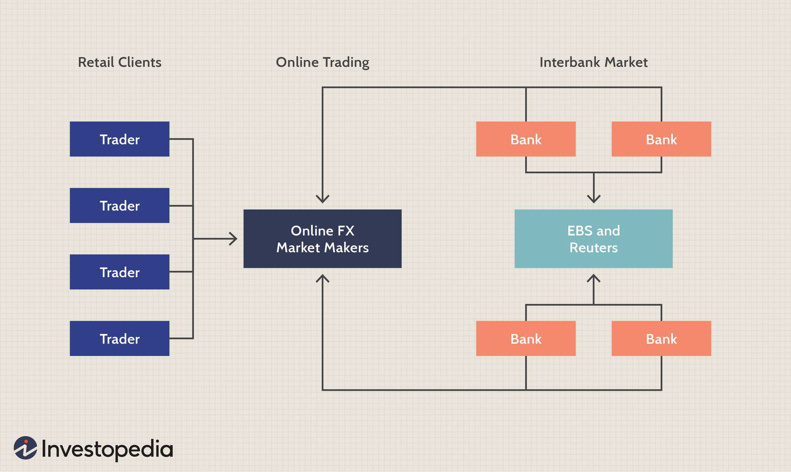

The forex market, commonly known as FX, is a vibrant platform where currencies from around the globe are traded continuously. Representing the largest financial market in the world, forex trades amount to trillions of dollars each day. This constant exchange is driven by various factors, including international trade, investments, and geopolitical events that influence currency values.

For traders, understanding how to fund their forex accounts efficiently is crucial. Whether you're a novice learning the ropes or a seasoned investor seeking to optimize your returns, the ability to deposit funds securely and effectively is fundamental. This process is not only about moving money but also about choosing the appropriate financial channels and tools that align with your trading strategy and risk management practices.



This guide sets out to explore the numerous methodologies available for depositing funds into your forex trading account. These methods can vary significantly in terms of transaction speed, security, fees, and convenience. As each trader has unique requirements and strategies, understanding these methods is vital for making informed decisions.

Beyond mere funding mechanisms, trading in the forex market requires strategic finesse. The annexation of algorithmic trading into forex is noteworthy, as it allows traders to execute trades based on pre-set configurations and predefined criteria, thereby minimizing potential human error and emotion-driven decisions.

Navigating the forex market also demands a keen insight into managing one's account efficiently and securely. By highlighting these aspects, this guide aims to simplify your trading endeavors, enabling you to maximize the potential of your forex investments while safeguarding your capital.

## Table of Contents

## How the Forex Market Works

Forex trading, also known as foreign exchange trading, entails the buying and selling of currencies in a global and decentralized market. Unlike traditional stock markets, the forex market operates across various time zones and lacks a centralized exchange, allowing for continuous trading 24 hours a day during weekdays. This inherent structure provides participants with the flexibility to engage in currency trades throughout the day.

### Currency Pairs and Trading Accounts
Forex trading revolves around pairs of currencies, such as EUR/USD or USD/JPY, wherein one currency is exchanged for another. Traders maintain [forex](/wiki/forex-system) accounts specifically designed to facilitate the buying and selling of these currency pairs. These accounts provide the infrastructure for holding positions in different currencies, with the goal of profiting from fluctuations in exchange rates.

### Leverage and its Implications
Leverage is a distinctive feature of forex trading that allows traders to control larger positions than their initial capital would otherwise permit. This is achieved through margin trading, where only a fraction of the trade's total value is required as collateral. For instance, with a leverage ratio of 100:1, a trader can manage a position worth $100,000 with just $1,000. While leverage amplifies potential profits, it also increases the risk of significant losses, necessitating prudent risk management strategies.

### Electronic Trading Platforms
The advent of electronic trading platforms has democratized access to the forex market, lowering barriers to entry for individual traders. These platforms offer user-friendly interfaces, real-time data, advanced charting tools, and automated trading capabilities, making it feasible for traders to participate with relatively small initial investments. Accessibility to market data and order execution with just a few clicks has empowered retail traders to engage more actively in forex trading.

### Complexity and Risk Management
Despite the accessibility and potential profitability of forex trading, it is a market characterized by significant complexity and risk. Currency prices are influenced by a myriad of factors, including economic indicators, geopolitical events, and market sentiment, all of which require careful analysis. Traders must develop and implement robust strategies to navigate these dynamics effectively. Technical and fundamental analyses play pivotal roles in forecasting currency movements and informing trading decisions.

In conclusion, understanding the mechanics of the forex market—encompassing decentralized trading, leverage, electronic platforms, and strategic analysis—equips traders to better manage their investments. To unlock the full potential of this market, traders are encouraged to continually educate themselves and refine their trading approaches.

## Funding Your Forex Account: Methods Explained

A variety of methods are available to fund your forex account, each with its pros and cons. The choice of method will often depend on a trader's specific needs, preferences, and regional restrictions. Here's a closer look at some of the most common funding methods:

**Wire Transfers**: Wire transfers are widely regarded as a secure method for depositing funds into a forex account. They are facilitated through banks and, therefore, involve stringent security protocols. However, one downside is the processing time, which can range from a few hours to several days, depending on the banks involved. Additionally, wire transfers can incur higher fees, which vary by bank and region. These fees can impact the initial capital and expected returns significantly.

**Credit/Debit Cards**: Using credit or debit cards to fund a forex account is a fast and convenient option. Most brokers support card transactions due to their widespread use and ability to facilitate nearly instant deposits. Despite the quick transaction times, traders should be aware of the potential for higher transaction fees compared to other methods. Furthermore, international card transactions may involve additional currency conversion fees, affecting the net amount received in the trading account.

**E-Wallets**: E-wallets such as PayPal, Skrill, and Neteller have gained popularity for their rapid transfer speeds and enhanced security measures. These platforms offer a solid alternative to traditional banking methods by providing additional layers of encryption and secure payment procedures. E-wallets often have lower transaction fees and, in some cases, brokers offer promotional bonuses for deposits via these services. However, traders must ensure that their brokers accept the specific e-wallet service they intend to use.

**Cryptocurrencies**: Cryptocurrencies are emerging as a viable method for funding forex accounts, primarily due to their low transaction costs and speed. They provide a decentralized option that is not bound by bank processing times, enabling nearly instant transfers across borders. The use of cryptocurrency can circumvent some regional banking restrictions, making forex trading more accessible globally. However, the volatility of cryptocurrency values can pose an additional risk, potentially affecting the real amount credited to a forex account.

When selecting a funding method, traders must weigh the transaction speed, security, associated fees, and overall convenience to ensure optimal account management and trading practice. Understanding the pros and cons of each option can lead to more informed decisions, enhancing the forex trading experience.

## Choosing the Right Payment Method

When selecting a payment method for your forex account, it is essential to weigh several critical factors to ensure that your trading experience remains smooth and efficient. These factors include transaction speed, security, fees, and convenience.

**Transaction Speed**: The speed at which funds are deposited into your trading account can significantly impact your ability to act quickly on trading opportunities. Credit and debit card transactions are among the fastest methods, often processing immediately or within a few hours. E-wallets like PayPal, Skrill, and Neteller also facilitate rapid transfers, usually within the same day. Conversely, wire transfers might take a few days to process, potentially causing delays in executing time-sensitive trades.

**Security**: Ensuring the security of your funds is paramount. E-wallets provide enhanced security measures, such as encryption and two-factor authentication, offering an additional layer of protection. Credit/debit cards also incorporate security features like fraud monitoring and chargeback options. While wire transfers are inherently secure due to their bank-to-bank nature, it is crucial to verify the security protocols of the institutions involved to avoid potential vulnerabilities.

**Fees**: The cost associated with different payment methods can vary considerably. Credit/debit cards may incur transaction fees or foreign exchange fees, which can add up over multiple transactions. Wire transfers generally have higher fees due to the involvement of financial institutions. E-wallets usually offer lower fees, making them a cost-effective option for frequent transactions. Cryptocurrencies, while increasingly popular for their low transaction costs, may involve exchange fees or differ in price between platforms due to volatility.

**Convenience**: The ease of use is another essential consideration. E-wallets provide a user-friendly experience, allowing you to manage funds seamlessly and often offering additional benefits such as promotional deposit bonuses from brokers. Credit and debit cards provide the convenience of widespread acceptance and ease of use. However, wire transfers, while being a universally accepted method, can be cumbersome due to the need to initiate the transfer through a bank.

Forex brokers may also impose different minimum deposit requirements, influencing your choice based on your available capital and trading objectives. Selecting a broker that aligns with your financial plans not only ensures a good fit with your trading strategy but also helps avoid potential issues related to insufficient funds.

In summary, by thoroughly assessing these factors, you can choose a payment method that optimally supports your trading activities, aligning with your security preferences, financial goals, and the operational nuances of your chosen broker.

## The Role of Algo Trading in Forex

Algorithmic trading, commonly referred to as algo trading, plays a pivotal role in modern forex markets by automating trading processes through advanced software and data analysis. At its core, this methodology utilizes pre-programmed trading instructions based on variables such as time, price, and [volume](/wiki/volume-trading-strategy). With the ability to execute thousands of trades per second, algo trading significantly enhances market efficiency and [liquidity](/wiki/liquidity-risk-premium).

A primary advantage of algo trading in forex is its ability to mitigate human errors and emotional biases, which can often disrupt trading decisions. By relying on algorithms, traders can ensure that trades are executed on predetermined criteria, reducing the influence of cognitive biases such as fear and greed. This objectivity is crucial in maintaining disciplined trading strategies, particularly in the highly volatile forex market.

Trading efficiency is also substantially improved through [algorithmic trading](/wiki/algorithmic-trading). Algorithms can swiftly analyze vast amounts of data to identify potential trading opportunities that align with a trader’s strategic goals. For instance, algorithms can be set to react instantaneously to market events, such as economic announcements, implementing trades faster than a human could manually. This ability to act quickly can provide a competitive edge in capturing profitable trades.

Moreover, algorithmic trading enables traders to backtest their strategies across historical data to evaluate potential performance. By simulating trades on past market conditions, traders can optimize their algorithms before deploying them in live markets. This process of [backtesting](/wiki/backtesting) and optimization reduces the risk of unforeseen losses and enhances the potential for successful trading outcomes.

Here's a simple example of a moving average crossover strategy implemented in Python, which is a common type of algo trading strategy used in forex:

```python
import pandas as pd

# Load forex data
data = pd.read_csv('forex_data.csv')  # Assume this file contains historical price data with 'Date' and 'Close' columns

# Calculate moving averages
short_window = 40
long_window = 100
data['Short_MA'] = data['Close'].rolling(window=short_window, min_periods=1).mean()
data['Long_MA'] = data['Close'].rolling(window=long_window, min_periods=1).mean()

# Generate trading signals
data['Signal'] = 0
data['Signal'][short_window:] = np.where(data['Short_MA'][short_window:] > data['Long_MA'][short_window:], 1, 0)

# Calculate position changes
data['Position'] = data['Signal'].diff()

# Display trading signals
print(data[['Date', 'Close', 'Short_MA', 'Long_MA', 'Signal', 'Position']].dropna())
```

This example demonstrates how a trader can utilize a simple algorithm to generate buy or sell signals based on the crossover of two moving averages. Such strategies can be more complex, incorporating additional variables and [machine learning](/wiki/machine-learning) models to enhance predictive accuracy and adaptability.

To maximize the potential of algo trading, it's essential for traders to understand the underlying algorithms they're implementing fully. Continuous education and adaptation to the evolving forex market trends are vital. By integrating technological advancements with robust trading strategies, traders can efficiently navigate the complex forex market landscape.

## Key Considerations and Best Practices

Maintaining an adequate balance in your forex trading account is essential to endure the natural fluctuations inherent in the forex market. A well-funded account provides the necessary buffer against adverse market events and price swings. Consider setting a margin to cushion against potential losses. For example, employing the formula:

$$
\text{Available Balance} = \text{Total Balance} - \text{Margin (Used and Required)}
$$

ensures you have sufficient funds to maintain open positions and avoid margin calls.

It is equally important to carefully review and comply with your broker's policies concerning deposits and withdrawals. These policies can vary significantly between brokers, impacting the liquidity of your trading funds. Understanding fee structures, such as commissions or withdrawal fees, helps avoid unexpected deductions from your trading account, thereby maximizing your investment.

Transaction transparency is critical for effective financial management. By diligently tracking all transactions, including deposits, trades, and withdrawals, you create a clear and comprehensive record of your trading activities. This documentation supports prudent financial management and aids in auditing your trading history when required.

Leveraging educational resources is a foundation for success in the forex market. Many brokers offer educational materials, such as webinars, articles, and tutorials, to enhance your trading knowledge. Utilizing demo accounts is particularly beneficial, allowing you to practice strategies and become familiar with the trading platform without risking real funds. This practice enables you to refine your skills, develop confidence, and transition smoothly to live trading environments.

By adhering to these best practices, you can enhance your forex trading experience, fostering both financial stability and improved decision-making in your trading activities.

## Conclusion

Successfully funding and managing your forex account is a cornerstone of effective trading. Selecting the appropriate payment methods tailored to your needs and security preferences can make a significant difference in your investment proceedings. Quick transaction times and minimal fees offer convenience and can enhance trading efficiency. Additionally, leveraging algorithmic trading enhances decision-making and strategy development. Algorithmic trading reduces emotional decision-making, allowing for precise execution of trades based on pre-set parameters. For example, using Python to automate and optimize your trading strategy, you could employ libraries such as NumPy for computational tasks or pandas for time-series analysis, ensuring your trades align with market conditions.

Continuously educating yourself is paramount. The forex market is dynamic, with ever-present fluctuations influenced by geopolitical events, economic indicators, and central bank policies. Staying informed about these factors and regularly updating your knowledge base can empower you to make informed decisions. Educational resources, ranging from online courses to trading forums, can provide valuable insights and enhance your understanding of market trends and analytical tools.

In conclusion, building a robust, well-managed forex account requires a consistent commitment to learning and adapting to market changes. By strategically selecting funding options and integrating algorithmic trading into your approach, you can optimize your investment potential in this fast-paced financial landscape.

## References & Further Reading

[1]: Bergstra, J., Bardenet, R., Bengio, Y., & Kégl, B. (2011). ["Algorithms for Hyper-Parameter Optimization."](https://papers.nips.cc/paper/4443-algorithms-for-hyper-parameter-optimization) Advances in Neural Information Processing Systems 24.

[2]: ["Advances in Financial Machine Learning"](https://www.amazon.com/Advances-Financial-Machine-Learning-Marcos/dp/1119482089) by Marcos Lopez de Prado

[3]: ["Evidence-Based Technical Analysis: Applying the Scientific Method and Statistical Inference to Trading Signals"](https://www.amazon.com/Evidence-Based-Technical-Analysis-Scientific-Statistical/dp/0470008741) by David Aronson

[4]: ["Machine Learning for Algorithmic Trading"](https://github.com/stefan-jansen/machine-learning-for-trading) by Stefan Jansen

[5]: ["Quantitative Trading: How to Build Your Own Algorithmic Trading Business"](https://www.amazon.com/Quantitative-Trading-Build-Algorithmic-Business/dp/1119800064) by Ernest P. Chan