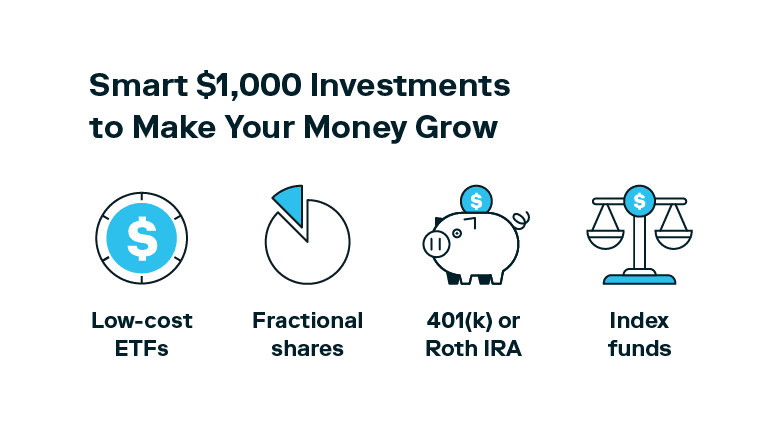

## Table of Contents

## What are the basic investment options available for $1,000?

With $1,000 to invest, you have several basic options to consider. One common choice is to invest in a savings account or a certificate of deposit (CD) at a bank. These options are very safe and insured by the government, but they usually offer lower returns. Another option is to invest in the stock market, either by buying individual stocks or by investing in mutual funds or exchange-traded funds (ETFs). This can potentially offer higher returns, but it also comes with more risk because the value of stocks can go up and down.

Another investment option is to put your money into a robo-advisor, which is an automated service that manages your investments for you. Robo-advisors typically invest your money in a diversified portfolio of stocks and bonds, and they often have low fees. You could also consider investing in real estate through real estate investment trusts (REITs), which allow you to invest in properties without having to buy them directly. Each of these options has its own level of risk and potential return, so it's important to think about what you're comfortable with and what your financial goals are before deciding where to put your money.

## How can beginners start investing with $1,000?

Starting to invest with $1,000 is a great way for beginners to dip their toes into the world of investing. One of the easiest and safest ways to begin is by opening a savings account or buying a certificate of deposit (CD) at a bank. These options are very secure because they are insured by the government, which means your money is protected. However, the returns on savings accounts and CDs are usually low, so you won't see your money grow very quickly. This can be a good starting point if you want to keep your money safe while you learn more about other investment options.

Another option for beginners is to invest in the stock market. You can do this by buying individual stocks, which means you pick specific companies to invest in, or by investing in mutual funds or exchange-traded funds (ETFs), which are collections of stocks that are managed by professionals. Investing in the stock market can offer higher returns than a savings account or CD, but it also comes with more risk because the value of stocks can go up and down. If you're new to investing, you might want to consider using a robo-advisor, which is a service that automatically manages your investments for you. Robo-advisors usually invest your money in a mix of stocks and bonds, and they often have low fees, making them a good choice for beginners.

## What are the risks associated with investing $1,000 in stocks?

When you invest $1,000 in stocks, one big risk is that the value of your stocks can go down. This means you could lose some or all of your money. Stocks go up and down because of things like the company's performance, the economy, or news events. If you need your money back quickly and the stock market is doing badly, you might have to sell your stocks for less than you paid for them.

Another risk is that you might not know enough about investing to make good choices. Picking the right stocks can be hard, and if you pick the wrong ones, you could lose money. Even if you invest in a mutual fund or an [ETF](/wiki/etf-trading-strategies), which are collections of stocks, there's still a risk that the overall market could go down and your investment could lose value. It's important to learn as much as you can and maybe talk to a financial advisor before you start investing.

## Can $1,000 be effectively invested in mutual funds or ETFs?

Yes, $1,000 can be effectively invested in mutual funds or ETFs. These are good choices for beginners because they let you invest in a lot of different stocks at once. This spreads out your risk, so if one stock goes down, the others might go up and balance it out. Mutual funds and ETFs are managed by professionals who pick the stocks for you, which can be helpful if you're new to investing.

However, there are some things to keep in mind. Even though mutual funds and ETFs spread out your risk, they can still go down in value if the overall market goes down. Also, these funds have fees that can eat into your returns. Make sure to look at the fees before you invest. If you choose wisely and keep your money invested for a long time, mutual funds and ETFs can be a good way to grow your $1,000.

## What are the potential returns from investing $1,000 in real estate?

Investing $1,000 in real estate can be tricky because it's hard to buy a whole property with such a small amount of money. However, you can invest in real estate investment trusts (REITs), which are companies that own and manage properties. With $1,000, you can buy shares of a REIT, which allows you to earn money from the rent and profits of the properties they own. The potential returns from REITs can vary a lot. On average, REITs have historically provided returns between 8% to 12% per year, but this can go up or down depending on the real estate market and the specific REIT you choose.

The main risk with investing in REITs is that the value of the shares can go down if the real estate market does badly. If you need to sell your shares quickly and the market is down, you might get less money back than you put in. Also, REITs often pay out a lot of their income as dividends, which can be good for getting regular income but might not help your investment grow as much over time. Overall, investing $1,000 in real estate through REITs can be a good way to get started, but it's important to understand the risks and do your research before you invest.

## How does investing $1,000 in a robo-advisor work?

Investing $1,000 in a robo-advisor is a simple way to start investing without having to pick stocks yourself. A robo-advisor is a computer program that manages your money for you. When you give your $1,000 to a robo-advisor, it will put your money into a mix of stocks and bonds based on your goals and how much risk you're okay with. This mix is called a portfolio. The robo-advisor will keep an eye on your portfolio and make changes if needed, so you don't have to do anything.

Robo-advisors are good for beginners because they usually have low fees and they do all the work for you. The fees might be around 0.25% to 0.50% of your money each year. This means if you have $1,000, you might pay $2.50 to $5 a year in fees. The returns you get will depend on how the stock and bond markets do. On average, you might expect to see your money grow by about 4% to 10% a year, but it could be more or less. Just remember, like any investment, there's a chance you could lose money if the markets go down.

## What are the tax implications of investing $1,000?

When you invest $1,000, you need to think about taxes. If you make money from your investments, like getting dividends from stocks or interest from a savings account, you might have to pay taxes on that money. The tax rate depends on how much money you make and where you live. For example, if you get dividends from stocks, you might pay a special tax rate on those dividends, which could be lower than your regular income tax rate. If you sell your investments for more than you paid for them, you might have to pay capital gains tax on the profit. How much you pay depends on how long you held the investment before selling it. If you held it for less than a year, you'll pay a higher rate than if you held it for more than a year.

Some investments have special tax rules. For example, if you invest in a retirement account like an IRA or a 401(k), you might not have to pay taxes on your earnings until you take the money out. This can help your money grow faster because you're not losing any to taxes each year. But when you do take the money out, you'll have to pay taxes on it. Also, some investments like municipal bonds can be tax-free, which means you don't have to pay federal taxes on the interest you earn from them. It's a good idea to talk to a tax advisor to understand how taxes might affect your $1,000 investment and to plan the best way to invest your money.

## How can one diversify a $1,000 investment portfolio?

Diversifying a $1,000 investment portfolio means spreading your money across different types of investments. This can help lower your risk because if one investment goes down, the others might go up and balance it out. With $1,000, you could put some of your money into a savings account or a certificate of deposit (CD) for safety. Then, you could invest the rest in stocks or mutual funds to try to grow your money more. You might choose a few different stocks or a mix of stock and bond mutual funds to spread out your risk even more.

Another way to diversify is by using a robo-advisor. A robo-advisor will automatically put your $1,000 into a mix of stocks and bonds based on your goals and how much risk you're okay with. This can be a good choice if you don't want to pick your investments yourself. You could also think about investing a small part of your money in real estate investment trusts (REITs), which let you earn money from properties without buying them directly. By spreading your $1,000 across different types of investments, you can try to protect your money and still have a chance to grow it.

## What advanced strategies can be used to invest $1,000?

One advanced strategy to invest $1,000 is to use dollar-cost averaging. This means you don't put all your money into the market at once. Instead, you split it up and invest a little bit each month. This can help you buy stocks at different prices and might lower your risk. Another strategy is to look into options trading. Options are contracts that let you buy or sell stocks at a certain price. They can be risky, but if you learn how they work, you might be able to make more money. Just remember, options trading is not for beginners and you could lose your money if you don't know what you're doing.

Another advanced strategy is to invest in peer-to-peer lending. This means you lend your money to other people through a website and they pay you back with interest. It can give you higher returns than a savings account, but it's also riskier because some people might not pay you back. You could also think about investing in a mix of assets, like stocks, bonds, and REITs, but with a focus on sectors you think will do well in the future. This needs a lot of research and understanding of the market, but it can help you grow your $1,000 more than just putting it all in one place.

## How can $1,000 be used for peer-to-peer lending investments?

Peer-to-peer lending lets you lend your $1,000 to other people through a website. You can pick who you want to lend to and how much you want to lend them. The people you lend to pay you back with interest, which can be more than what you'd get from a savings account. But it's riskier because some people might not pay you back. You can spread your $1,000 across many small loans to lower your risk. This way, if one person doesn't pay you back, you still get money from the others.

To start, you need to sign up on a peer-to-peer lending website. They will check your information and then let you start lending. You can choose loans based on how much risk you want to take and how much interest you want to earn. Remember, the higher the interest, the riskier the loan might be. By carefully [picking](/wiki/asset-class-picking) your loans and spreading your money out, you can try to grow your $1,000. Just make sure you understand the risks and do your research before you start.

## What are the considerations for investing $1,000 in cryptocurrencies?

Investing $1,000 in cryptocurrencies can be exciting, but it's important to understand the risks. Cryptocurrencies like Bitcoin and Ethereum are very new and can change a lot in value. One day, the price might go up a lot, and the next day, it might go down a lot. This means you could make a lot of money, but you could also lose your $1,000. It's a good idea to only invest money you can afford to lose because the price can be so unpredictable.

Before you invest in cryptocurrencies, you need to do some research. You should learn about different types of cryptocurrencies and how they work. You also need to think about how you will keep your cryptocurrencies safe. You can use a digital wallet, but you need to make sure it's secure because if someone steals your cryptocurrencies, you might not get them back. Remember, investing in cryptocurrencies is very risky, so it's important to understand what you're getting into before you start.

## How can one monitor and adjust a $1,000 investment over time?

To monitor and adjust a $1,000 investment over time, you need to keep an eye on how your investments are doing. You can do this by checking your account regularly, maybe once a month or once a quarter. Look at how much your investments are worth and see if they are going up or down. If you're using a website or an app to invest, they usually have tools that can help you see how your investments are doing. If you notice that one of your investments is not doing well, you might want to think about selling it and putting your money into something else.

Adjusting your investments can help you keep your money safe and growing. If the stock market goes down a lot, you might want to move some of your money into safer investments like a savings account or bonds. On the other hand, if the market is doing well, you might want to put more money into stocks to try to make more money. It's a good idea to think about your goals and how much risk you're okay with when you make changes to your investments. Talking to a financial advisor can also help you make smart choices about when and how to adjust your $1,000 investment.

## References & Further Reading

[1]: Bergstra, J., Bardenet, R., Bengio, Y., & Kégl, B. (2011). ["Algorithms for Hyper-Parameter Optimization."](https://dl.acm.org/doi/10.5555/2986459.2986743) Advances in Neural Information Processing Systems 24.

[2]: ["Advances in Financial Machine Learning"](https://www.amazon.com/Advances-Financial-Machine-Learning-Marcos/dp/1119482089) by Marcos Lopez de Prado

[3]: ["Evidence-Based Technical Analysis: Applying the Scientific Method and Statistical Inference to Trading Signals"](https://www.amazon.com/Evidence-Based-Technical-Analysis-Scientific-Statistical/dp/0470008741) by David Aronson

[4]: ["Machine Learning for Algorithmic Trading"](https://github.com/stefan-jansen/machine-learning-for-trading) by Stefan Jansen

[5]: ["Quantitative Trading: How to Build Your Own Algorithmic Trading Business"](https://www.amazon.com/Quantitative-Trading-Build-Algorithmic-Business/dp/1119800064) by Ernest P. Chan