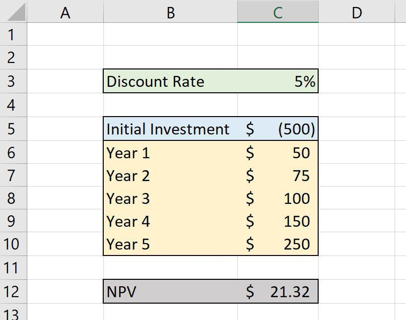

With a budget of only $1,000, investing can appear overwhelming. However, the emergence of algorithmic trading presents unique opportunities for both novice and seasoned investors. This article focuses on various investment strategies, particularly on initiating algorithmic trading (often referred to as algo trading) with just $1,000. 

Algorithmic trading involves using computer programs to automatically execute trades when certain market conditions are met. This automation can improve the efficiency of trading and potentially enhance returns. By employing algo trading, investors can explore options such as ETFs, stocks, and even options themselves, utilizing data-driven strategies to optimize their portfolios.



Investment strategies like ETFs (Exchange-Traded Funds) offer a means to diversify an investment portfolio and manage risks inherent in market trading. ETFs provide investors access to a diverse range of assets while often carrying lower fees compared to mutual funds, making them appealing for beginners. Stocks, albeit riskier, can be lucrative if approached with rigorous research and timing, whereas options present opportunities for various strategic plays within the financial markets.

Understanding different algo trading strategies can not only diversify one's portfolio but also streamline the trading process, making it more efficient and less reliant on emotional decision-making. An emphasis on accessible platforms and tools is crucial for beginners seeking to harness the power of algorithmic trading. Such tools often offer intuitive interfaces and support, minimizing the barrier to entry.

Furthermore, good education and implementing a disciplined strategy can empower investors significantly, allowing them to compete in markets that traditionally favored larger financial players. Algorithmic trading's rising accessibility means that even a modest sum of $1,000 can serve as a more effective starting point than ever before.

## Table of Contents

## Understanding Algorithmic Trading

Algorithmic trading entails the use of computer programs to automatically execute trades based on specified parameters or rules. This method seeks to mitigate emotional biases inherent in human trading behaviors while increasing the speed and efficiency of trading operations. By implementing pre-set criteria, algorithmic systems can analyze vast datasets quickly, identifying optimal entry and [exit](/wiki/exit-strategy) points that may be missed by human traders.

One of the primary advantages of [algorithmic trading](/wiki/algorithmic-trading) is its capacity to process and react to market data in real-time without the hesitation that can accompany manual trading. As the computational power of these algorithms allows for rapid execution, trades are typically made within milliseconds, ensuring the capture of beneficial market movements often before manual traders can react.

For those new to the field, several platforms provide user-friendly interfaces that do not require extensive programming skills. These platforms typically offer pre-built trading strategies, allowing beginners to engage in algorithmic trading with relative ease. Examples of such platforms include MetaTrader, QuantConnect, and TradeStation, which enable users to automate trades by utilizing various tools and analytics.

When considering the types of investments that align well with algorithmic trading, especially for those working with a modest budget of $1,000, it is essential to focus on those that offer [liquidity](/wiki/liquidity-risk-premium) and [volatility](/wiki/volatility-trading-strategies). Stocks, ETFs, and currency pairs are frequently used in algorithmic trading due to their high liquidity and the availability of historical data that can be analyzed for [backtesting](/wiki/backtesting) strategies.

The integration of data-driven strategies is imperative when engaging in algorithmic trading with limited capital. Algorithms can be formulated to exploit patterns and market inefficiencies, such as mean reversion strategies that capitalize on the tendency of asset prices to revert to an average level over time or [momentum](/wiki/momentum) strategies that look to profit from the continuation of existing trends. With the application of statistical models and backtesting tools, aspiring traders can refine these strategies, optimizing them for market conditions without risking their initial capital.

By utilizing algorithmic trading, investors can navigate the complexities of financial markets with efficiency and precision. The ability to execute numerous trades in fraction of a second, based on logical and optimized rules, allows even small-scale investors to engage in trading activities traditionally dominated by larger financial entities. As the technology behind these systems continues to advance, the accessibility and capability of algorithmic trading expand, offering more opportunities for strategic investment, even with limited resources.

## Investment Strategies for $1,000

When considering investment strategies for a limited budget of $1,000, diversification and cost-effectiveness become crucial. Below are several strategies well-suited to small-scale investors utilizing algorithmic trading methods:

1. **Invest in ETFs or Index Funds**: Exchange-Traded Funds (ETFs) and index funds are popular among beginners due to their ability to provide broad market exposure at a low cost. ETFs mirror the performance of specific indices, offering built-in diversification which helps reduce risk. Many ETFs have lower expense ratios than mutual funds, making them an appealing choice for those starting with modest funds.

2. **Target-Date Funds**: These mutual funds automatically adjust their asset allocation to become more conservative as they approach a specified target date. For small investors, target-date funds provide a hands-off approach to diversification and risk management. The automatic rebalancing requires minimal intervention, aligning the investments with the investor’s time horizon.

3. **Robo-Advisors**: Platforms such as Betterment and Acorns use algorithm-driven financial planning services with little to no human supervision. They are an optimal choice for small investors due to their low fees and minimum balance requirements. Robo-advisors use modern portfolio theory to allocate and periodically rebalance assets based on the investor's risk tolerance and goals.

4. **Low-Risk Debt Instruments**: U.S. Treasuries and savings bonds offer stable and low-risk returns, serving as a conservative investment approach. While the returns may be less lucrative compared to stocks, the predictability and security associated with government-backed debt make them a reliable foundation within a diversified portfolio.

5. **Buying Stocks**: Direct investment in individual stocks can lead to high returns but carries increased risk. Effective stock picking requires diligent research and timing. Investors can utilize basic algorithmic strategies such as mean reversion or momentum trading to capitalize on market inefficiencies. Implementing these strategies can potentially enhance returns while maintaining discipline in trades.

These strategies emphasize using algorithmic and automated processes to optimize investment returns, playing a crucial role in managing a portfolio even with a limited starting capital.

## Benefits of Algorithmic Trading for Beginners

Algorithmic trading offers a suite of advantages to beginners, making it an attractive entry point into the financial markets. One of the primary benefits is the speed and precision with which algorithms can execute trades. Unlike manual trading, algorithms can process information and enter orders within milliseconds. This rapid execution enables traders to capitalize on short-lived market opportunities that would be missed by slower, human-driven processes.

Another significant advantage is emotion-free trading. Human traders are often influenced by emotions such as fear and greed, which can lead to impulsive decisions and inconsistent trading outcomes. Algorithmic systems, however, operate strictly according to predefined rules and criteria. By removing emotional biases, these systems ensure discipline in trading strategies, paving the way for more consistent results.

Backtesting capabilities further enhance the appeal of algorithmic trading for beginners. Before deploying strategies with real capital, traders can run simulations using historical data to evaluate how their algorithms would have performed in different market conditions. This allows for refinement and optimization, providing valuable insights and increasing confidence in the chosen strategies without financial risk.

The accessibility of modern trading platforms is another compelling benefit. Today, numerous platforms are available that have democratized algorithmic trading, offering user-friendly interfaces and low-cost entry points. This accessibility allows retail investors and those with smaller budgets to engage in trading that was once confined to large financial institutions. The platforms provide tools and resources that support learning and strategy development, thus lowering the barrier to entry.

Finally, scalability is a key advantage. As traders become more adept at using algorithmic trading systems and gain confidence in their strategies, they can expand the complexity and size of their portfolios. This scalability means that traders can start small, with simple strategies and minimal capital, then gradually increase their involvement as they accumulate experience and expertise. Ultimately, algorithmic trading provides a structured, accessible pathway for beginners seeking to participate in the financial markets with the potential for efficient and profitable outcomes.

## How to Get Started with Algo Trading for $1,000

To start algorithmic trading with a budget of $1,000, it's essential to lay a solid foundation by learning the basic trading and algorithmic concepts. Understanding market movements, trading terminologies, and how different financial instruments work will provide a strong base. Start by exploring resources from online financial courses or free educational materials on platforms like Investopedia or Coursera. These resources can help beginners grasp fundamental trading principles and algorithmic strategies.

Once familiar with the basic concepts, selecting the right platform becomes crucial. Beginners should look for platforms designed to simplify algorithmic trading, such as Surmount. These platforms often offer user-friendly interfaces and tools that cater to novice traders, allowing them to implement and test their strategies without extensive programming experience.

Implementing basic coding skills is not mandatory but can significantly enhance the ability to customize and optimize trading strategies. Learning Python can be particularly beneficial as it is widely used in algorithmic trading due to its simplicity and the availability of numerous libraries like NumPy, Pandas, and matplotlib. These libraries help in data handling, analysis, and visualization, which are vital for algorithmic strategy development. For those new to coding, platforms like Codecademy or Python's official website can serve as useful starting points.

Choosing a simple strategy is essential when you're just beginning with a limited budget. Mean reversion and momentum trading are two straightforward strategies that beginners can start with. **Mean reversion** is based on the principle that prices and returns eventually move back toward the mean or average, offering opportunities when prices deviate significantly from their historical averages. On the other hand, **momentum trading** takes advantage of trends and assumes that assets which have been rising or falling will continue to do so.

Backtesting is a critical step before executing real trades. It involves testing your strategy against historical data to evaluate its effectiveness without risking actual capital. The ability to backtest ensures that traders can refine their strategies, optimizing them for better performance. Python allows easy backtesting, with libraries like Backtrader or Zipline offering built-in functions to simulate trading strategies across historical data. In Python, a simple backtest might look like this:

```python
import backtrader as bt

class SimpleStrategy(bt.Strategy):
    def __init__(self):
        self.sma = bt.indicators.SimpleMovingAverage(self.data.close, period=15)

    def next(self):
        if self.data.close[-1] < self.sma[-1] and self.data.close[0] > self.sma[0]:
            self.buy(size=100)
        elif self.data.close[-1] > self.sma[-1] and self.data.close[0] < self.sma[0]:
            self.sell(size=100)

cerebro = bt.Cerebro()
cerebro.addstrategy(SimpleStrategy)

# Add data, e.g., from Yahoo Finance

cerebro.run()
cerebro.plot()
```

This code demonstrates how to implement a simple moving average crossover strategy. The strategy buys securities when their prices cross above the average and sells when crossing below the average. Running such backtests helps refine parameters and test profitability, allowing traders to gain confidence in their strategies before deploying real money.

By following these steps—learning core concepts, selecting the appropriate platform, enhancing coding skills, choosing a simple strategy, and performing backtesting—those with a budget of $1,000 can effectively begin their journey in algorithmic trading.

## Risks and Considerations

When engaging in algorithmic trading, especially with a modest budget such as $1,000, several risks and considerations must be taken into account to safeguard investments and maximize potential returns. Understanding these elements is essential for both novice and seasoned traders.

### Hypothetical Performance

One fundamental principle in trading is that past performance does not guarantee future results. Algorithmic models often backtest strategies using historical data to evaluate potential profitability. However, these backtests may not accurately reflect actual trading conditions due to various market factors, such as liquidity and slippage. Traders should therefore interpret these results cautiously and remain aware that even well-performing historical strategies can underperform in the future.

### Financial Risk

Despite the precision and speed offered by algorithmic trading, inherent financial risks remain due to market volatility. The swift execution of trades by algorithms can exacerbate losses if market predictions are incorrect. Proper risk management strategies, such as setting stop-loss orders and position sizing, are crucial to mitigate potential losses. Additionally, diversification across various assets or strategies can help buffer against significant losses by spreading risk.

### Overfitting

Overfitting occurs when an algorithm is excessively tailored to past data, capturing noise instead of underlying patterns. This customization might lead to favorable results in backtesting but perform poorly in live trading conditions. To combat overfitting, algorithms should be designed to generalize well and tested with out-of-sample data, ensuring they can adapt to new market situations. Techniques such as cross-validation can assist in verifying the robustness of a trading strategy.

### Choosing Reliable Platforms

Selecting a reputable trading platform is critical for successful algorithmic trading. Platforms should offer user-friendly interfaces, comprehensive support, and transparent fee structures. Reliability is particularly important, as technical issues or downtime can lead to missed opportunities or unintended trades. Researching platform reviews and testing them with demo accounts before committing real capital is advisable. Additionally, platforms should provide robust security measures to protect personal and financial information from cyber threats.

In conclusion, while algorithmic trading presents numerous advantages for investors, careful attention to these risks and considerations can help mitigate losses and enhance the probability of achieving desired financial outcomes. By staying informed and prudent, traders can better navigate the complexities of algorithmic trading.

## Conclusion

Algorithmic trading offers an effective and efficient method for investors seeking to make the most out of a $1,000 investment. This approach harnesses the power of computer algorithms to make trading decisions, providing the ability to execute trades with precision and speed that would be unachievable through traditional methods. While challenges exist, such as understanding market dynamics and the intricacies of algorithmic strategies, these can be addressed through proper education and meticulously implemented strategies.

By taking advantage of technology and automation, even novice investors can tap into opportunities that were once exclusive to institutional and larger-scale investors. Algorithmic trading platforms have significantly democratized the market, enabling individuals with smaller budgets to engage in intricate trading strategies with minimal manual intervention. This technological advancement has reduced the entry barriers, allowing a $1,000 starting investment to have a more substantial impact than previously possible.

As algorithmic trading becomes increasingly accessible, it empowers investors by providing tools that enhance decision-making efficiency and offer a structured approach to handling investments. With the right mix of education, strategy, and technological support, algorithmic trading can be a realistic and profitable pathway for investors looking to optimize their capital allocation.

## References & Further Reading

[1]: Bergstra, J., Bardenet, R., Bengio, Y., & Kégl, B. (2011). ["Algorithms for Hyper-Parameter Optimization."](https://dl.acm.org/doi/10.5555/2986459.2986743) Advances in Neural Information Processing Systems 24.

[2]: ["Advances in Financial Machine Learning"](https://www.amazon.com/Advances-Financial-Machine-Learning-Marcos/dp/1119482089) by Marcos Lopez de Prado

[3]: ["Evidence-Based Technical Analysis: Applying the Scientific Method and Statistical Inference to Trading Signals"](https://www.amazon.com/Evidence-Based-Technical-Analysis-Scientific-Statistical/dp/0470008741) by David Aronson

[4]: ["Machine Learning for Algorithmic Trading"](https://github.com/stefan-jansen/machine-learning-for-trading) by Stefan Jansen

[5]: ["Quantitative Trading: How to Build Your Own Algorithmic Trading Business"](https://www.amazon.com/Quantitative-Trading-Build-Algorithmic-Business/dp/1119800064) by Ernest P. Chan