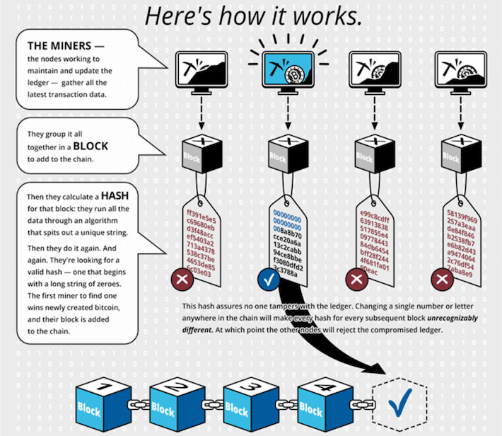

Cryptocurrency mining serves as a fundamental component of the digital currency ecosystem, operating at the heart of creating and verifying digital tokens. Among the myriad of cryptocurrencies available, Litecoin (LTC) has emerged as a prominent choice for miners. Often dubbed the 'silver to Bitcoin's gold,' Litecoin offers distinctive attributes that make it appealing to both novices and seasoned miners. These attributes include faster transaction times and a more accessible mining process, which contribute to its potential profitability.

The mining of Litecoin, unlike that of Bitcoin, utilizes the Scrypt hashing algorithm, which facilitates a more democratic mining process. This allows a broader range of participants to engage in mining activities, reducing the dominance of entities with extensive resources. As a result, Litecoin presents an avenue for enthusiasts and investors to tap into its potential within the crypto market.

Furthermore, the world of cryptocurrency mining is evolving with technological advancements and the integration of algorithmic trading (algo trading). This integration plays a crucial role in optimizing mining operations by improving decision-making processes and enhancing financial returns. The strategic use of algo trading can increase both the efficiency and profitability of mining ventures, making it a noteworthy consideration for participants.

For anyone involved in the cryptocurrency sphere, understanding Litecoin mining offers valuable insights. Whether you're just starting out as a miner or hold substantial experience in trading, the exploration of Litecoin's unique features and the impact of algo trading can offer significant opportunities for success in the ever-changing landscape of digital currencies.

## Table of Contents

## Understanding Cryptocurrency Mining

Cryptocurrency mining is a foundational process within digital currency systems, aimed at ensuring the secure and decentralized validation of transactions on a blockchain. This process involves miners, who are essential participants in maintaining the operation and integrity of these networks. They contribute computational power to solve intricate mathematical puzzles known as proof-of-work (PoW), which is critical in validating transactions and securing the blockchain against potential threats.

When a transaction is initiated, it is grouped with others to form a block. Miners compete to solve the PoW puzzle associated with this block, a task that requires substantial computational resources due to the cryptographic algorithms involved. For most cryptocurrencies, including Bitcoin and Litecoin, the puzzle is based on the SHA-256 and Scrypt hashing algorithms, respectively. Solving this puzzle involves finding a nonce, a random number that, when hashed with the block's data, produces a hash that meets a predefined difficulty target. This target adjusts periodically to ensure that the average time it takes to find a block remains stable, usually around 10 minutes for Bitcoin and 2.5 minutes for Litecoin.

Upon successfully solving the puzzle, the miner's block is added to the blockchain, and the miner is rewarded with a fixed number of coins, known as block rewards, along with any fees from the transactions included in the block. This acts as both an incentive for miners and as a mechanism for introducing new coins into circulation.

The decentralization of mining operations is one of the critical aspects that contribute to the security and integrity of [cryptocurrency](/wiki/cryptocurrency) networks. Since mining is distributed across numerous nodes around the world, it minimizes the risks of centralization, where a single entity could potentially manipulate the network. This decentralized approach makes it difficult for any individual or group to gain control over the entire mining process, thus preserving the trustless nature of cryptocurrencies.

Some common mining terminologies include hash rate, block height, difficulty, and pool mining. Hash rate refers to the speed at which a miner can complete the hashing operation, essentially measuring their mining power. Block height indicates the number of blocks in the chain between any given block and the first one, known as the genesis block, or block height zero. Difficulty is a measure of how hard it is to find a new block—the higher the difficulty, the more computational energy is required. Pool mining involves miners combining their resources to increase their chances of solving the block, distributing the rewards among participants according to the amount of work they contributed.

Litecoin, in particular, uses the Scrypt algorithm, which was intentionally designed to be more memory-intensive than Bitcoin’s SHA-256, somewhat reducing the likelihood that specialized hardware (ASICs) could dominate mining. This allows greater participation from individual miners using consumer-grade hardware, thereby supporting a more decentralized mining landscape.

Overall, cryptocurrency mining is a critical component of blockchain technology, enabling secure transaction validation and maintaining the decentralized ethos of digital currencies. Each cryptocurrency, including Litecoin, utilizes unique properties and parameters that define their mining processes, contributing to the diverse ecosystem of digital assets.

## What Makes Litecoin Unique?

Litecoin stands out in the cryptocurrency landscape due to several distinct features that differentiate it from Bitcoin, despite their shared origins. Created by Charlie Lee in 2011 as a Bitcoin fork, Litecoin was designed to address specific issues in Bitcoin's functionality, primarily focusing on transaction speed and mining accessibility.

One of the core distinctions lies in Litecoin's hashing algorithm, Scrypt. Unlike Bitcoin's SHA-256 algorithm, Scrypt is memory-intensive, making it somewhat resistant to the development of ASICs (Application-Specific Integrated Circuits) used extensively in Bitcoin mining. This ASIC resistance lowers the barrier to entry for individual miners who may not have access to expensive, specialized hardware, thereby promoting a more decentralized network. Scrypt's design relies on fast access to large amounts of memory rather than pure processing power, which means that powerful GPUs can effectively participate in mining.

Litecoin also features quicker transaction confirmation times. While Bitcoin's block generation time averages around 10 minutes, Litecoin reduces this to approximately 2.5 minutes. This fourfold reduction offers several advantages, including faster processing of transactions and a potentially enhanced capacity for real-time applications.

Moreover, Litecoin is known for its lower transaction fees, which are typically a fraction of Bitcoin's. This attribute, combined with its higher supply cap—84 million Litecoins compared to Bitcoin's 21 million—makes it a viable option for everyday transactions. The increased total supply helps maintain a lower per-unit price, potentially reducing [volatility](/wiki/volatility-trading-strategies) relative to Bitcoin. The larger availability also appeals to a broader audience of users and investors, further fostering its adoption.

These unique properties position Litecoin as an attractive alternative to Bitcoin, both for casual users engaging in daily transactions and for miners seeking a more accessible entry point into cryptocurrency mining. The blend of a more approachable mining algorithm and transactional efficiency underscores Litecoin's role as the “silver” complement to Bitcoin's “gold.”

## Getting Started with Litecoin Mining

To start mining Litecoin effectively, one must have the appropriate hardware setup. A specialized mining rig or a powerful graphics card is crucial due to the computational demands of mining. Litecoin utilizes the Scrypt hashing algorithm, which, in contrast to Bitcoin’s SHA-256, is more memory-intensive and was initially designed to be ASIC-resistant. This resistance allows mining to remain more accessible to individuals with standard hardware.

The right mining software is equally vital. This software must be compatible with the Scrypt algorithm, which governs the mining process and the resolution of mathematical problems to verify transactions. Miners can choose from a range of software options, including CGMiner and EasyMiner, each offering unique features suitable for different setups and expertise levels.

Joining a mining pool is often advantageous for individual miners. In a mining pool, miners combine their computational power to increase the chances of solving blocks and receiving rewards. The rewards are then distributed among the members according to their contributed computational effort. This collaborative approach mitigates the risks associated with the high variance and unpredictability of solo mining, providing a more stable and predictable income stream.

Profitability in Litecoin mining hinges on several factors: 

1. **Hash Rate**: The computational speed at which a miner can complete the mining process. Higher hash rates increase the likelihood of earning rewards.

2. **Energy Consumption**: Mining operations consume significant electricity, impacting overall profitability. Miners must calculate the energy cost relative to potential earnings.

3. **Market Value**: Miners should monitor Litecoin’s market price, as fluctuations directly affect profitability. The equation for calculating profit can be represented as:

    \[ \text{Daily Profit} = (\text{Daily Litecoin Mined} \times \text{Current Litecoin Price}) - \text{Daily Energy Cost}
$$

4. **Network Difficulty**: This variable adjusts approximately every 3.5 days to maintain a consistent block production rate. As more miners join the network, the difficulty increases, requiring greater computational power to mine the same amount of Litecoin.

To remain profitable, miners need to stay updated with network changes and adapt accordingly. This includes monitoring difficulty adjustments and ensuring their equipment remains efficient and up-to-date. Understanding these variables and maintaining a balance between them is key to successfully mining Litecoin.

## The Role of Algo Trading in Optimizing Mining

Algorithmic trading, commonly known as algo trading, is a technique that uses automated and pre-programmed instructions to execute trades at high speeds. In the context of cryptocurrency, particularly Litecoin (LTC) mining, algo trading can significantly enhance profitability and operational efficiency by leveraging price differentials and market volatility.

Synergies between mining and algo trading emerge from the ability to automate and optimize trading decisions, turning mined currencies into profitable assets. Miners often face challenges like market volatility and price fluctuations. Algo trading helps mitigate these risks by allowing miners to automate the selling of mined Litecoin at predefined price levels, thereby securing profits or cutting losses swiftly. This automated strategy is particularly beneficial when reacting to sudden market changes.

Various algo trading strategies can be employed by miners to complement their crypto investment plans. Common strategies include [arbitrage](/wiki/arbitrage), where traders exploit price discrepancies across different exchanges, and trend-following, which involves buying or selling based on upward or downward trends. Another strategy is mean reversion, where traders assume that the price will revert to its average over time. Implementing such strategies enables miners to potentially increase their return on investment by systematically taking advantage of market inefficiencies.

Staying informed about market trends is crucial for ensuring the effectiveness of algo trading. This involves not only understanding the technical aspects but also keeping abreast of news that may affect market dynamics. Many traders use data analysis tools and financial news feeds to stay updated. Trading bots are essential in this context, as they can continuously monitor market conditions and execute trades without human intervention. By configuring these bots to align with specific strategies and risk appetites, miners can enhance their trading results while concentrating on their mining operations.

Algorithmic trading necessitates continuous observation and adjustment. As market conditions evolve, the parameters of trading algorithms should be fine-tuned to optimize performance. Traders should also be aware of transaction fees and the [liquidity](/wiki/liquidity-risk-premium) of the markets they are operating within, as these factors can significantly impact overall profitability.

In conclusion, utilizing algo trading provides Litecoin miners with a mechanism to systematically maximize profits and manage risks. By combining robust mining efforts with strategic algo trading, traders can optimize their financial outcomes in the ever-changing cryptocurrency environment.

## Common Challenges and How to Overcome Them

Mining Litecoin, as with other cryptocurrencies, poses several challenges due to the inherent complexities of the process and the volatile nature of the cryptocurrency market. Understanding and addressing these challenges is crucial for maintaining profitability and ensuring sustainable operations.

### Hardware Costs and Energy Consumption
One of the primary challenges faced by Litecoin miners is the significant investment required in hardware. Efficient mining demands specialized mining rigs or high-performance graphics cards capable of handling Litecoin's Scrypt algorithm. Additionally, these setups often require continuous upgrades to stay competitive, further escalating costs.

Energy consumption presents another significant hurdle. Mining operations are notoriously energy-intensive, leading to substantial electricity bills that can erode profit margins. Miners can address this issue by adopting energy-efficient mining hardware and optimizing their mining setups. For instance, utilizing renewable energy sources, such as solar or wind power, can drastically reduce costs and mitigate environmental impacts. Moreover, many miners opt for regions with lower electricity rates to further minimize expenses.

### Market Volatility and Diversification
Cryptocurrency markets are highly volatile, with prices subject to rapid fluctuations. This volatility affects the profitability of mining operations, as the value of mined coins can vary significantly over short periods.

Diversifying one's crypto portfolio is a prudent strategy to mitigate this risk. By spreading investments across various cryptocurrencies, miners can reduce their exposure to the price volatility of a single asset. This approach not only balances risk but also capitalizes on potential growth opportunities in other digital currencies.

### Staying Informed: Technological and Regulatory Changes
Continuous advancements in technology and evolving regulatory landscapes require miners to remain well-informed to sustain their operations and preserve profitability. Staying updated with the latest technological innovations, such as new mining hardware or software optimizations, can give miners a competitive edge.

Regulatory developments also play a critical role in determining the feasibility and legality of mining activities. Changes in legislation can impact electricity costs, tax implications, and operational permissions. Therefore, it is essential for miners to monitor regulatory trends and adapt their strategies accordingly. Engaging with industry forums, webinars, and news platforms can provide valuable insights into these developments.

By addressing these challenges through strategic planning and adaptation, Litecoin miners can enhance their efficiency and profitability in an ever-evolving landscape.

## Future of Litecoin Mining and Crypto Trading

The future of Litecoin mining and crypto trading holds the promise of significant advancements, driven by technological innovation and a rapidly evolving market landscape. As the cryptocurrency ecosystem matures, several potential trends and challenges are anticipated for Litecoin mining operations.

One of the key aspects of Litecoin's future relates to potential technical upgrades that could enhance its mining efficiency. For instance, blockchain scaling solutions such as the Lightning Network could play a critical role in improving transaction throughput and reducing costs. These advancements would make Litecoin more attractive for both users and miners, potentially driving increased network usage and mining profitability. Furthermore, ongoing research and development in energy-efficient mining technologies could help reduce the environmental impact of mining operations, making them more sustainable and economically viable.

In addition to technological advancements, regulatory frameworks will significantly influence the future of Litecoin mining and crypto trading. Legal regulations on cryptocurrencies are becoming increasingly stringent across various jurisdictions, impacting mining operations through taxation, energy usage restrictions, and compliance demands. Miners and traders must stay abreast of regulatory developments to ensure their operations remain legal and profitable. The introduction of clear regulations could also provide legitimacy and stability to the crypto market, encouraging broader institutional investment and acceptance.

Technological innovations, particularly in blockchain scaling solutions, are expected to further enhance the efficiency and capacity of Litecoin mining. These solutions aim to address issues of scalability and network congestion, allowing for faster and more cost-effective transactions. Such improvements would not only benefit the immediate Litecoin ecosystem but also contribute to the broader cryptocurrency infrastructure.

Looking ahead, Litecoin miners and traders are presented with opportunities to capitalize on the ongoing growth and innovation in the cryptocurrency space. As technology continues to evolve, new tools and strategies for optimizing mining and trading will emerge, offering potential for increased profitability. Miners and traders who remain adaptable and embrace these changes will be well-positioned to succeed in an ever-changing market.

In conclusion, the future of Litecoin mining and crypto trading is poised for dynamic shifts, fueled by technological advancements and regulatory changes. While challenges remain, the potential for growth and innovation offers exciting opportunities for those engaged in the cryptocurrency sector. As the landscape continues to evolve, staying informed and agile will be key to realizing these opportunities, paving the way for a more robust and efficient cryptocurrency ecosystem.

## Conclusion

In summary, Litecoin mining and strategic [algorithmic trading](/wiki/algorithmic-trading) offer a complementary approach to maximizing returns in the cryptocurrency ecosystem. Litecoin, due to its unique Scrypt hashing algorithm and faster transaction times, provides distinct advantages for miners seeking profitability and accessibility. These characteristics, coupled with Litecoin's lower transaction fees and larger supply, make it particularly appealing for both everyday use and mining endeavors.

Algorithmic trading enhances the profitability of Litecoin mining by enabling high precision and speed in trading decisions, allowing miners and traders to optimize their earnings. Strategies such as automated trading bots and market trend analysis can provide systematic profit-taking opportunities, thereby stabilizing returns amidst market volatility.

As the cryptocurrency landscape is constantly evolving, continued learning and adaptation are essential. Miners and traders should stay informed about technological advancements, regulatory changes, and energy optimization strategies to maintain competitiveness and efficiency.

We invite readers to actively engage with the community by sharing their mining experiences and insights. By exchanging knowledge, both novice and experienced participants can benefit from a collective understanding, further enhancing the vibrancy and innovation of the cryptocurrency space.

## References & Further Reading

[1]: Garzik, J. (2011). ["Anatomy of a Litecoin."](https://www.semanticscholar.org/paper/Anatomy-and-Physiology-of-the-Skin-Kolarsick-Kolarsick/e438ad9b53321bc162acd89e0d057a8db0f4d67d) Medium.

[2]: Courtois, N. T., & Naik, R. (2014). [“Cryptographic Vulnerabilities in Bitcoin and Litecoin.”](https://link.springer.com/content/pdf/10.1007/978-3-662-44893-9_12.pdf) IACR Cryptology ePrint Archive.

[3]: Nakamoto, S. (2008). ["Bitcoin: A Peer-to-Peer Electronic Cash System."](https://nakamotoinstitute.org/library/bitcoin/) Bitcoin.org.

[4]: Franco, P. (2014). ["Understanding Bitcoin: Cryptography, Engineering and Economics."](https://onlinelibrary.wiley.com/doi/book/10.1002/9781119019138) Wiley.

[5]: Bonneau, J., Miller, A., Clark, J., Narayanan, A., Kroll, J. A., & Felten, E. W. (2015). ["Sok: Research perspectives and challenges for bitcoin and cryptocurrencies."](https://ieeexplore.ieee.org/document/7163021) 2015 IEEE Symposium on Security and Privacy.