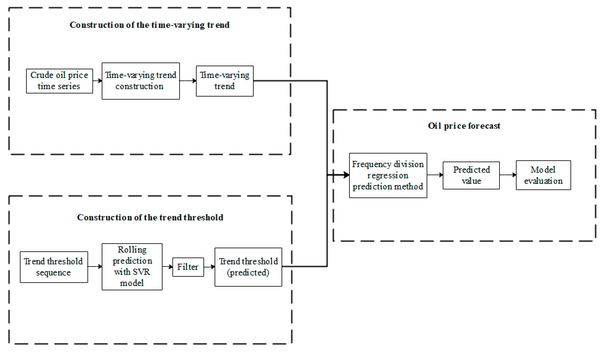

## Table of Contents

## What is oil price forecasting and why is it important for companies?

Oil price forecasting is when experts try to guess what the price of oil will be in the future. They use things like past prices, how much oil is being used, and what's happening in the world to make their guesses. It's a bit like trying to predict the weather, but instead of rain or sunshine, they're predicting if oil will be cheap or expensive.

This is really important for companies because many of them need oil to make their products or to run their machines. If a company can guess the oil price correctly, they can plan better. They might buy oil when it's cheap and store it, or they might wait if they think it will get cheaper. This helps them save money and not lose money if oil prices go up suddenly.

## What are the basic methods used for oil price forecasting?

One basic method for oil price forecasting is looking at past prices. Experts study how oil prices have changed over time and use this information to guess what might happen next. They look for patterns, like if prices go up in the summer because more people are driving, or if they drop when there's a big new oil find. This method is called technical analysis, and it's a bit like trying to predict the weather by looking at old weather reports.

Another method is called fundamental analysis. This involves looking at things that affect oil supply and demand. For example, if a big oil-producing country is having political problems, it might produce less oil, which could make prices go up. Or, if the world economy is growing fast, more people might be buying cars and using more oil, which could also push prices up. Experts gather all this information and use it to make their forecasts.

Sometimes, experts also use a mix of both methods, along with computer models and math formulas, to make their predictions more accurate. These models can take in a lot of data and spit out a forecast, kind of like how a weather app uses data from satellites and weather stations to predict if it will rain. By combining different methods, forecasters hope to get a clearer picture of where oil prices might be headed.

## How do companies use historical data in oil price forecasting?

Companies use historical data to look at how oil prices have changed over time. They study old prices to find patterns, like if prices usually go up in the summer when more people are driving, or if they drop when there's a new oil discovery. This helps them guess what might happen next. By looking at the past, they can see if there are times of the year when oil is usually more expensive or cheaper, and they can plan their buying and selling around these patterns.

This method is called technical analysis. It's like trying to predict the weather by looking at old weather reports. Companies use charts and graphs to see how oil prices have moved in the past and use this information to make their forecasts. If they see that oil prices have gone up every time a certain event happens, like a big meeting of oil-producing countries, they might expect prices to go up again the next time that event happens. This helps them make smarter decisions about when to buy or sell oil.

## What role do economic indicators play in oil price forecasting?

Economic indicators are like clues that help people guess what will happen to oil prices. These clues tell us about how well the economy is doing. For example, if a country's economy is growing fast, people might buy more cars and use more oil, which can make oil prices go up. On the other hand, if the economy is not doing well, people might not buy as much oil, and prices could go down. So, by looking at things like how many jobs there are, how much money people are making, and how much stuff people are buying, experts can get a good idea of what might happen to oil prices.

Another important economic indicator is the strength of the currency. If a country's money is strong, it might be cheaper for them to buy oil from other countries, which can affect oil prices around the world. Also, things like interest rates and inflation can play a role. If interest rates go up, it might be more expensive for companies to borrow money to buy oil, which could make them buy less and push prices down. By keeping an eye on all these economic indicators, companies can make better guesses about where oil prices are headed and plan their actions accordingly.

## How can companies incorporate geopolitical events into their oil price forecasts?

Geopolitical events are things like wars, elections, or agreements between countries that can change how much oil is produced or how it's sold. Companies need to keep an eye on these events because they can make oil prices go up or down really fast. For example, if there's a war in a country that makes a lot of oil, it might produce less oil, which can make prices go up. Or if countries agree to produce less oil on purpose, that can also push prices higher.

To use geopolitical events in their oil price forecasts, companies watch the news and gather information about what's happening around the world. They might use experts who know a lot about different countries and how they affect oil. These experts can help predict if an event will make oil prices go up or down. By understanding how these events might change the supply of oil, companies can make better guesses about future prices and plan their buying and selling to save money or avoid losing it.

## What are the advantages and limitations of using statistical models for oil price forecasting?

Statistical models are tools that use math and past data to guess what oil prices will be in the future. One big advantage of using these models is that they can look at a lot of information at once. They can take in things like past oil prices, how much oil is being used, and even what's happening in the world, and then use all this to make a forecast. This can help companies make better decisions because the models can find patterns that people might miss. Also, these models can be updated quickly with new data, so they can keep their forecasts fresh and accurate.

But, statistical models also have some limitations. They are only as good as the data they use, so if the data is wrong or missing important information, the forecasts can be off. Also, these models can have a hard time predicting big, sudden changes, like a war or a new law that changes how much oil is produced. These events can make oil prices jump in ways that the models didn't expect. So, while statistical models are really helpful, companies need to use them along with other methods, like listening to experts and watching the news, to get the best guesses about future oil prices.

## How do machine learning algorithms enhance oil price forecasting?

Machine learning algorithms help make oil price forecasting better by learning from a lot of data. They can look at things like past oil prices, how much oil people are using, and even news about what's happening in the world. By finding patterns in all this information, machine learning can make guesses about what oil prices will do next. It's like having a smart computer that gets better at predicting the future the more it learns.

But machine learning isn't perfect. It can still make mistakes, especially if the data it's learning from is wrong or if something unexpected happens, like a war or a new law that changes how much oil is made. So, while machine learning can help a lot, companies still need to use other ways to guess oil prices, like listening to experts and watching the news. By using machine learning along with these other methods, companies can make the best guesses about where oil prices are headed.

## What are the key differences between short-term and long-term oil price forecasting methods?

Short-term oil price forecasting looks at what might happen to oil prices in the next few days or weeks. It uses things like daily changes in oil supply and demand, news about what's happening in the world, and even the weather. For example, if there's a big storm that might stop oil from being shipped, short-term forecasts can guess that prices might go up because there's less oil available. These forecasts are important for companies that need to buy or sell oil quickly, so they can make fast decisions to save money or avoid losing it.

Long-term oil price forecasting tries to guess what will happen to oil prices over months or years. It looks at bigger trends, like how the world's economy is growing, new technology that might change how much oil we use, and big projects to find new oil. For example, if a country is building a lot of new factories, long-term forecasts might guess that oil prices will go up because more oil will be needed. These forecasts help companies plan for the future, like deciding if they should invest in new oil wells or switch to other kinds of energy.

## How can scenario analysis be used in oil price forecasting?

Scenario analysis is a way to guess what might happen to oil prices by thinking about different things that could happen in the future. Companies use it to imagine different stories about what could affect oil prices, like if there's a war in an oil-producing country or if a new technology makes oil less important. They create different scenarios, like a "best case" where everything goes well and oil prices stay low, or a "worst case" where things go badly and prices shoot up. By thinking about these different stories, companies can be ready for whatever might happen and plan their actions accordingly.

This method helps companies see how sensitive oil prices can be to changes in the world. For example, if they think about a scenario where a big new oil field is discovered, they can guess that oil prices might drop because there's more oil available. Or, if they imagine a scenario where countries agree to produce less oil, they can predict that prices might go up. By looking at all these different possibilities, companies can make better decisions about when to buy or sell oil, and how to protect themselves from big price changes.

## What are some advanced techniques like time series analysis used in oil price forecasting?

Time series analysis is a fancy way of looking at how oil prices have changed over time to guess what they might do next. It's like trying to predict the weather by looking at old weather reports, but instead of rain or sunshine, we're looking at oil prices. This method uses math to find patterns in the past prices, like if prices go up every summer because more people are driving, or if they drop when there's a new oil find. By understanding these patterns, experts can make better guesses about where oil prices might be headed in the future.

Another advanced technique is called econometric modeling. This method uses math and statistics to look at how different things, like the economy or what's happening in the world, affect oil prices. It's like trying to solve a puzzle where each piece is something that can change oil prices, like how many jobs there are or if there's a war in an oil-producing country. By putting all these pieces together, econometric models can help predict what might happen to oil prices. These models are really helpful because they can take in a lot of information and use it to make smart guesses about the future.

## How do companies integrate real-time data into their oil price forecasting models?

Companies use real-time data to make their oil price forecasts better by looking at what's happening right now. They can get information like how much oil is being used today, what the weather is like, or if there's news about something that might change oil prices. This helps them see if there are any sudden changes that could affect prices, like a big storm that stops oil from being shipped. By adding this real-time data to their models, companies can make quicker and more accurate guesses about what oil prices might do next.

Using real-time data is a bit like trying to predict the weather but with the latest updates. If a company sees that oil use is going up right now, they might guess that prices will go up too. Or if there's breaking news about a problem in an oil-producing country, they can quickly change their forecast to expect higher prices. By keeping their models up to date with the latest information, companies can make smarter decisions about when to buy or sell oil, helping them save money or avoid losing it.

## What are the best practices for evaluating and improving the accuracy of oil price forecasts?

To make oil price forecasts more accurate, companies need to keep checking how well their guesses are doing. They do this by comparing their forecasts to what actually happens to oil prices. If their guesses are often wrong, they need to figure out why and fix their methods. One good way to do this is by using different methods together, like looking at past prices, studying what's happening in the world, and using computer models. By mixing these methods, companies can get a better picture of what might happen to oil prices and make their forecasts more reliable.

Another important thing is to always update the data they use. Oil prices can change quickly because of new events or news, so using the latest information helps keep forecasts accurate. Companies should also try out new ways of guessing oil prices, like using machine learning or more advanced math models. By testing these new methods and seeing if they work better, companies can keep improving their forecasts. It's like trying different tools to see which one works best for fixing a problem.

## What are Machine Learning and Pattern Recognition Approaches?

Machine learning has transformed the landscape of oil price forecasting by leveraging advanced computational techniques to decipher complex and non-linear patterns within the data. Among these, neural networks and support vector machines (SVMs) are particularly prominent due to their ability to handle intricate, high-dimensional datasets.

Neural networks, inspired by the human brain's architecture, consist of layers of interconnected nodes or "neurons." Each node processes input data and contributes to the network's overall output through weights adjusted via training. For oil price forecasting, neural networks can model complex relationships by adjusting these weights based on historical price data, thereby capturing non-linear trends that might elude simpler statistical techniques. For instance, a basic [neural network](/wiki/neural-network) model can be represented mathematically as:

$$
y = f\left(\sum_{i=1}^n w_i x_i + b\right)
$$

where $y$ is the output (predicted oil price), $x_i$ are the input features, $w_i$ are the weights assigned to each input, $b$ is the bias, and $f$ is the activation function such as ReLU or sigmoid.

Deep learning models, which are an advanced subset of neural networks, push these capabilities further. Long Short-Term Memory networks (LSTMs), a type of recurrent neural network (RNN), are especially useful in oil price forecasting due to their ability to learn temporal dependencies in sequential data. LSTMs are designed to overcome the vanishing gradient problem typical in traditional RNNs and have proven effective in capturing long-term dependencies in time-series data.

Convolutional Neural Networks (CNNs), although primarily used in image processing, have found applications in examining spatial hierarchies in data that can be invaluable for multivariate time series such as those in oil markets. By applying layered convolution operations, CNNs can extract and synthesize features from raw datasets, enabling the identification of subtle patterns that might go unnoticed by other models.

Support Vector Machines (SVMs) offer another robust approach in the machine learning toolkit, particularly for classification problems. In the context of oil price forecasting, SVMs can be used to classify different market conditions or predict directional movements in prices by finding the optimal hyperplane that separates decision classes in a high-dimensional space.

Machine learning models also offer dynamic predictive capabilities, adapting as new information becomes available. This adaptability is crucial, as oil markets are highly volatile and influenced by a range of diverse factors. With continual learning, these models recalibrate their parameters with new incoming data, maintaining their predictive accuracy over time.

In practical terms, implementing these machine learning models involves using frameworks like PyTorch or TensorFlow, which facilitate building and training complex neural network architectures. A basic example of an LSTM implementation in Python might look like this:

```python
import torch
import torch.nn as nn

class LSTMModel(nn.Module):
    def __init__(self, input_size, hidden_layer_size, output_size):
        super(LSTMModel, self).__init__()
        self.hidden_layer_size = hidden_layer_size
        self.lstm = nn.LSTM(input_size, hidden_layer_size)
        self.linear = nn.Linear(hidden_layer_size, output_size)

    def forward(self, input_seq):
        lstm_out, _ = self.lstm(input_seq)
        predictions = self.linear(lstm_out.view(len(input_seq), -1))
        return predictions

# Model configuration
model = LSTMModel(input_size=1, hidden_layer_size=100, output_size=1)
```

This code snippet lays out a basic structure of an LSTM model, showcasing the ease with which neural networks can be constructed and integrated into forecasting systems to improve the accuracy and reliability of oil price predictions. As the field evolves, these models continue to benefit from advancements in computational power and algorithmic sophistication.

## References & Further Reading

[1]: Hamilton, J. D. (2009). ["Understanding Crude Oil Prices."](https://www.nber.org/papers/w14492) National Bureau of Economic Research.

[2]: Kilian, L., & Murphy, D. P. (2014). ["The Role of Inventories and Speculative Trading in the Global Market for Crude Oil."](https://deepblue.lib.umich.edu/bitstream/handle/2027.42/106955/jae2322.pdf?sequence=1) American Economic Review, 104(3), 453-483.

[3]: Alquist, R., & Kilian, L. (2010). ["What Do We Learn from the Price of Crude Oil Futures?"](https://onlinelibrary.wiley.com/doi/abs/10.1002/jae.1159) Journal of Applied Econometrics, 25(4), 539-573.

[4]: Hyndman, R. J., & Athanasopoulos, G. (2018). ["Forecasting: Principles and Practice."](https://otexts.com/fpp2/) OTexts.

[5]: Zhang, G. P. (2003). ["Time Series Forecasting Using a Hybrid ARIMA and Neural Network Model."](https://dl.icdst.org/pdfs/files/2c442c738bd6bc178e715f400bec5d5f.pdf) Neurocomputing, 50, 159-175.

[6]: Zhang, Y., Wang, L., & Liu, C. (2020). ["Oil Price Forecasting Using a Hybrid Model."](https://www.sciencedirect.com/science/article/pii/S1385894724092106) Energy, 195, 117076.

[7]: Hu, Y., & Kowalewski, O. (2020). ["Algorithmic Trading and Price Impact: Evidence from the Oil Markets."](https://www.cambridge.org/core/journals/journal-of-financial-and-quantitative-analysis/article/abs/algorithmic-trading-and-market-quality-international-evidence/4B96E916E3E13AFF1DF9B5FCC188F4E0) Journal of Financial Markets, 48, 100536.