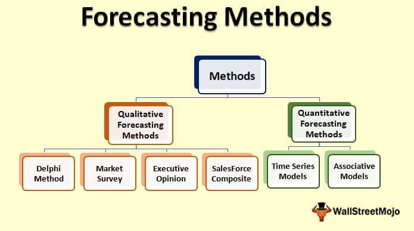

Crude oil prices are a critical barometer for the global economy, influencing a wide range of sectors including transportation, manufacturing, and energy production. This direct impact on various industries underscores the importance of accurately forecasting oil prices, which is essential for investors, policymakers, and businesses to make strategic and informed decisions. The volatility of oil markets due to supply and demand fluctuations, geopolitical events, and other economic factors makes forecasting a complex yet necessary endeavor.

Numerous methodologies are employed to predict oil price movements, each offering distinct advantages and drawbacks. Traditional econometric models, such as those based on time-series analysis, leverage historical data to project future price trends. These models, prized for their structured approach, often form the foundation of forecasting efforts. However, the rise of machine learning and artificial intelligence has introduced new methods that can model complex, non-linear relationships inherent in oil market dynamics. Techniques such as neural networks and support vector machines provide enhanced predictive capabilities by identifying patterns that may not be immediately apparent through conventional models.



Algorithmic trading, a cutting-edge strategy that automates the trading process based on forecasted price movements, has gained prominence in oil markets. By utilizing advanced forecasting models, these systems can execute trades at unprecedented speeds and scales, contributing to improved market efficiency and liquidity. Nonetheless, the implementation of algorithmic trading raises concerns about potential market volatility and unforeseen rapid fluctuations, known as flash crashes.

This article examines the diverse methods applied by companies to anticipate oil price changes. It explores the integration of human expertise and automated systems, and considers the implications of these approaches for the broader economy. As the landscape of oil price forecasting evolves, the continued advancement of technology and data analytics is expected to further transform forecasting strategies and trading operations.

## Table of Contents

## Factors Influencing Oil Prices

Crude oil prices are influenced by a variety of interconnected factors that fluctuate based on global conditions and events. The supply side of the equation primarily depends on the capability of oil companies to extract, produce, and distribute reserves. Technological advancements, such as enhanced oil recovery techniques and hydraulic fracturing, have significantly increased the efficiency and output of oil extraction processes. These innovations can lead to a surplus in supply, potentially driving prices down. However, geopolitical events, such as conflicts or policy changes in oil-producing nations, can disrupt production and distribution channels, leading to reduced supply and increased prices.

On the demand side, economic health is a critical determinant. During periods of economic growth, industrial activity and consumer consumption typically rise, driving up demand for crude oil. Conversely, during economic downturns or recessions, demand declines as industries scale back operations and consumers reduce spending. This relationship highlights the importance of tracking global economic indicators, such as GDP growth rates and industrial output, to anticipate changes in oil demand.

Non-market factors, including policies from organizations like the Organization of the Petroleum Exporting Countries (OPEC) and environmental regulations, also exert significant influence. OPEC's production quotas can substantially impact global supply levels, thereby affecting prices. For instance, decisions to cut production can constrict supply and elevate prices, while increased production can have the opposite effect. Moreover, environmental regulations aimed at reducing carbon emissions can lead to increased production costs or shifts in energy consumption patterns, further influencing oil prices.

Political instability, particularly in oil-rich regions, is another critical [factor](/wiki/factor-investing). Conflicts or regime changes in countries with substantial oil reserves can lead to supply disruptions, creating [volatility](/wiki/volatility-trading-strategies) in global oil markets. Such instability can cause sudden and sharp increases in oil prices as markets react to potential shortages.

Overall, the interplay between technological, economic, political, and regulatory factors creates a complex landscape for [crude oil](/wiki/crude-oil) pricing, necessitating constant monitoring and analysis to understand and predict market behaviors effectively.

## Overview of Forecasting Methods

Econometric models and time-series analysis have been foundational tools in the forecasting of oil prices, providing insights through statistical techniques that model historical data to predict future trends. Econometric models typically incorporate a range of economic indicators, such as GDP, inflation rates, and production capacities, to forecast oil prices. Time-series analysis, a subset of econometric models, emphasizes the use of historical price data to identify patterns and seasonal effects that can project future movements.

In recent years, [machine learning](/wiki/machine-learning) and [artificial intelligence](/wiki/ai-artificial-intelligence) have opened new avenues for modeling the intricate dynamics of the oil markets. These advanced technologies excel in handling vast datasets and identifying complex, non-linear relationships that traditional models may overlook. For instance, neural networks, particularly [deep learning](/wiki/deep-learning) models like Long Short-Term Memory (LSTM) networks, are adept at temporal sequence prediction, making them suitable for time-series forecasting. Support Vector Machines (SVMs) and Random Forest algorithms also offer robust pattern recognition, providing flexibility to capture varying market conditions and trends.

Algorithmic trading leverages these sophisticated models to automate trading decisions based on anticipated price shifts. By executing trades at rapid speeds and on a large scale, [algorithmic trading](/wiki/algorithmic-trading) systems can capitalize on forecasted price movements, improving market efficiency and enhancing trading precision. However, such systems are not devoid of challenges, as they can sometimes contribute to market volatility, raising concerns about stability and risk.

Each forecasting method, whether rooted in traditional econometric foundations or modern machine learning frameworks, carries its own strengths and limitations. Econometric models are often favored for their interpretability and grounding in economic theory, yet they may struggle with capturing abrupt shifts due to geopolitical events. Conversely, machine learning methods offer adaptability and can process complex datasets, but they require extensive computational resources and data for training.

The most effective forecasting approaches often combine these methods, harnessing the statistical rigor of econometrics with the adaptive pattern recognition of machine learning. This hybrid strategy seeks to mitigate individual weaknesses, offering a more comprehensive and nuanced view of future oil price movements. As technology continues to evolve, the integration of diverse forecasting techniques is likely to become increasingly essential in navigating the uncertainties of the oil market.

## Futures Market and Econometric Models

Oil futures are contracts to buy or sell a specific quantity of oil at a predetermined price on a future date. These contracts serve as crucial instruments for understanding market expectations regarding future oil prices. Participants in the oil futures market, such as producers, consumers, and speculators, trade these contracts based on their anticipations of future price movements. The prices of these futures contracts are influenced by speculative activities, reflecting broader market sentiment, as well as by concrete expectations about market supply and demand dynamics.

Econometric models are essential tools for predicting spot prices using futures market data. They integrate a variety of economic indicators, helping to model and forecast price movements. Commonly used indicators include gross domestic product (GDP), which represents economic health and demand prospects, and production levels from major oil producers such as OPEC, which directly influence supply. By incorporating these variables, econometric models can assess how different economic conditions might affect future oil prices, providing valuable insights for traders and policymakers.

Time-series econometric models are particularly valuable for short-term forecasting due to their historical accuracy and reliability. These models analyze historical price data to identify patterns and trends that can inform future predictions. Among the different types of time-series models, autoregressive integrated moving average (ARIMA) models and vector autoregression (VAR) models are frequently applied. ARIMA models use past values to predict future trends, accommodating various data patterns and seasonality. VAR models, on the other hand, capture the interdependencies between multiple time series, which is crucial in understanding oil price dynamics that can be influenced by multiple factors simultaneously.

Here is a simple example of how one might use Python to fit an ARIMA model to oil price data:

```python
import pandas as pd
from statsmodels.tsa.arima.model import ARIMA
import matplotlib.pyplot as plt

# Load historical oil prices
data = pd.read_csv('oil_prices.csv', parse_dates=['Date'], index_col='Date')
oil_prices = data['Price']

# Fit ARIMA model
model = ARIMA(oil_prices, order=(5, 1, 0))
fitted_model = model.fit()

# Forecast future oil prices
forecast = fitted_model.forecast(steps=12)
print(forecast)

# Plot the results
plt.figure(figsize=(10, 6))
plt.plot(oil_prices, label='Historical Prices')
plt.plot(forecast, label='Forecast', color='red')
plt.title('Oil Price Forecast')
plt.xlabel('Date')
plt.ylabel('Price')
plt.legend()
plt.show()
```

This code demonstrates how historical oil price data can be used with an ARIMA model to predict future prices. The model choice (such as the ARIMA order) should ideally be based on deeper statistical analysis of the data, considering both the underlying patterns and external influencing factors.

In conclusion, by leveraging futures market data and employing sophisticated econometric models, one can glean insights into future oil prices. These models, underpinned by robust data analysis techniques, continue to be instrumental in guiding trading strategies and policy decisions in the volatile oil market.

## Machine Learning and Pattern Recognition Approaches

Machine learning has transformed the landscape of oil price forecasting by leveraging advanced computational techniques to decipher complex and non-linear patterns within the data. Among these, neural networks and support vector machines (SVMs) are particularly prominent due to their ability to handle intricate, high-dimensional datasets.

Neural networks, inspired by the human brain's architecture, consist of layers of interconnected nodes or "neurons." Each node processes input data and contributes to the network's overall output through weights adjusted via training. For oil price forecasting, neural networks can model complex relationships by adjusting these weights based on historical price data, thereby capturing non-linear trends that might elude simpler statistical techniques. For instance, a basic [neural network](/wiki/neural-network) model can be represented mathematically as:

$$
y = f\left(\sum_{i=1}^n w_i x_i + b\right)
$$

where $y$ is the output (predicted oil price), $x_i$ are the input features, $w_i$ are the weights assigned to each input, $b$ is the bias, and $f$ is the activation function such as ReLU or sigmoid.

Deep learning models, which are an advanced subset of neural networks, push these capabilities further. Long Short-Term Memory networks (LSTMs), a type of recurrent neural network (RNN), are especially useful in oil price forecasting due to their ability to learn temporal dependencies in sequential data. LSTMs are designed to overcome the vanishing gradient problem typical in traditional RNNs and have proven effective in capturing long-term dependencies in time-series data.

Convolutional Neural Networks (CNNs), although primarily used in image processing, have found applications in examining spatial hierarchies in data that can be invaluable for multivariate time series such as those in oil markets. By applying layered convolution operations, CNNs can extract and synthesize features from raw datasets, enabling the identification of subtle patterns that might go unnoticed by other models.

Support Vector Machines (SVMs) offer another robust approach in the machine learning toolkit, particularly for classification problems. In the context of oil price forecasting, SVMs can be used to classify different market conditions or predict directional movements in prices by finding the optimal hyperplane that separates decision classes in a high-dimensional space.

Machine learning models also offer dynamic predictive capabilities, adapting as new information becomes available. This adaptability is crucial, as oil markets are highly volatile and influenced by a range of diverse factors. With continual learning, these models recalibrate their parameters with new incoming data, maintaining their predictive accuracy over time.

In practical terms, implementing these machine learning models involves using frameworks like PyTorch or TensorFlow, which facilitate building and training complex neural network architectures. A basic example of an LSTM implementation in Python might look like this:

```python
import torch
import torch.nn as nn

class LSTMModel(nn.Module):
    def __init__(self, input_size, hidden_layer_size, output_size):
        super(LSTMModel, self).__init__()
        self.hidden_layer_size = hidden_layer_size
        self.lstm = nn.LSTM(input_size, hidden_layer_size)
        self.linear = nn.Linear(hidden_layer_size, output_size)

    def forward(self, input_seq):
        lstm_out, _ = self.lstm(input_seq)
        predictions = self.linear(lstm_out.view(len(input_seq), -1))
        return predictions

# Model configuration
model = LSTMModel(input_size=1, hidden_layer_size=100, output_size=1)
```

This code snippet lays out a basic structure of an LSTM model, showcasing the ease with which neural networks can be constructed and integrated into forecasting systems to improve the accuracy and reliability of oil price predictions. As the field evolves, these models continue to benefit from advancements in computational power and algorithmic sophistication.

## Algorithmic Trading in the Oil Markets

Algorithmic trading in the oil markets employs a variety of sophisticated forecasting models and technologies to automate trading decisions based on predicted price movements. These trading systems operate with a level of speed and [volume](/wiki/volume-trading-strategy) that is unattainable for human traders, enabling them to exploit market opportunities as they arise. By leveraging vast datasets and employing artificial intelligence (AI) techniques, algorithmic trading improves market efficiency and [liquidity](/wiki/liquidity-risk-premium).

The core advantage of algorithmic trading is its ability to process and act upon large quantities of data at high frequencies, something that humans cannot achieve manually. Algorithms can analyze a multitude of indicators, such as economic data releases, geopolitical events, and market sentiment, to predict price movements and execute trades almost instantaneously. This rapid processing capability allows for opportunities such as [arbitrage](/wiki/arbitrage), statistical trading, and trend-following strategies.

Algorithmic traders often use big data analytics to gain insights from a plethora of structured and unstructured data sources. This could include traditional data like historical prices and volumes, as well as [alternative data](/wiki/best-alternative-data) such as satellite images of oil reserves or social media sentiment. AI and machine learning models, like neural networks and decision trees, can be particularly effective in recognizing patterns or anomalies that are indicative of future price movements. For instance, a deep learning model might analyze time-series data to predict future price trends more accurately than conventional models.

However, while algorithmic trading can enhance market efficiency and provide liquidity, it can also contribute to increased volatility. High-frequency trading, a subset of algorithmic trading, has been implicated in market disruptions, such as flash crashes. These occur when algorithms react to market conditions in an unexpectedly synchronous manner, leading to rapid price movements that are not always based on fundamental changes in value. Such events highlight the importance of regulatory oversight and the need for algorithms to be designed with safeguards to prevent destructive trading behaviors.

In summary, algorithmic trading represents a powerful tool in the oil markets, enabling participants to execute complex strategies at unprecedented speeds. While it offers significant advantages in terms of efficiency and liquidity, it also poses challenges related to market stability, necessitating a careful balance between innovation and regulation.

## Case Studies: How Companies Utilize Forecasting and Trading Algorithms

Many oil companies and trading firms invest heavily in developing proprietary forecasting models that leverage both traditional econometric techniques and advanced machine learning algorithms. These investments are driven by the necessity to remain competitive in the volatile oil markets, where accurate price forecasting and rapid trading decisions can lead to significant financial advantages. 

Two major players in the oil industry, Exxon Mobil and BP, exemplify how firms can integrate futures insights into their operational strategies. Both companies utilize a combination of quantitative analysis and qualitative assessment to inform their decisions. Futures markets provide critical data that these firms use to gauge market expectations of oil prices. This data, when paired with econometric models, enables them to predict spot prices with relatively high accuracy.

Exxon Mobil employs a comprehensive approach, blending traditional financial analysis with advanced machine learning techniques. The company uses econometric models to interpret futures data alongside real-world economic indicators, such as GDP growth rates and OPEC production quotas. Additionally, Exxon Mobil applies machine learning algorithms capable of managing large datasets to refine their forecasts. By using neural networks, the company can capture non-linear patterns and complex interdependencies within the data that traditional models might miss.

BP adopts a similar strategy but places an increased emphasis on algorithmic trading. The firm has developed algorithms that automatically execute trades based on predictive models. These algorithms draw from a variety of inputs, including futures data and geopolitical analysis, to dynamically adjust their trading strategies. For example, BP's proprietary models might predict short-term price spikes due to anticipated geopolitical tensions in oil-rich regions. BP's trading systems can respond almost instantaneously, executing trades at speeds that human traders cannot match.

Successful firms in the industry often blend human expertise with these automated systems. Human analysts at Exxon Mobil and BP are tasked with interpreting model outputs and making strategic decisions, especially when models exhibit uncertainty or when external factors, like sudden geopolitical shifts, come into play. This collaborative approach increases the organizations' accuracy and responsiveness, allowing them to adapt quickly to changing market conditions.

The integration of automated systems and human insight offers a balanced approach that leverages the strengths of both. Automated systems excel in processing and analyzing vast amounts of data rapidly, while human experts contribute nuanced judgment and contextual understanding. This synergy is crucial in the oil markets, where the stakes are high and the landscape is continually shifting.

## Challenges and Future Directions

Forecasting oil prices remains an intricate task due to the inherent volatility of the markets and the potential for unforeseen geopolitical developments. The oil market is influenced by a wide array of factors including global economic conditions, political events, and technological advancements, making accurate price prediction a highly complex endeavor.

Innovations in artificial intelligence (AI) and machine learning hold great potential for enhancing the precision of oil price forecasts. These technologies introduce advanced methodologies capable of identifying complex patterns and trends within vast datasets, which traditional econometric models might overlook. Machine learning algorithms, such as neural networks and decision trees, can be employed to model non-linear relationships and adapt to new information dynamically. Despite these advancements, the effective implementation of AI-driven forecasting methods necessitates substantial amounts of quality data and significant computational resources. A critical challenge lies in accessing and processing the volumes of historical and real-time market data required for training sophisticated models.

Future directions in oil price forecasting may include the development of hybrid models that integrate various forecasting approaches to improve robustness. By combining the strengths of traditional econometric models with the adaptability of AI-driven techniques, hybrid models could potentially provide more reliable forecasts. This approach would entail drawing from the historical accuracy of econometric methods while leveraging the data processing capabilities of machine learning models. For instance, a potential method could involve using econometric models for baseline forecasts and machine learning algorithms for refining these predictions based on real-time data.

Furthermore, as computational technologies continue to evolve, there is an opportunity to further enhance the scalability and efficiency of forecasting models. Future research could explore the integration of quantum computing principles or advanced hardware solutions to address the computational demands of sophisticated modeling.

In conclusion, while the path to improved oil price forecasting is fraught with challenges, particularly surrounding data availability and computational requirements, emerging technologies and hybrid modeling strategies offer promising avenues for advancement. Adaptability and innovation remain key to navigating the complexities of global oil markets and improving the robustness of price forecasts.

## Conclusion

Accurate oil price forecasting is essential for the economic health and strategic planning of businesses and governments. It impacts a wide array of sectors, including transportation, manufacturing, and energy, making it a focal point for investors and policymakers. Traditional models, such as econometric and time-series approaches, provide a strong foundation for understanding price movements by analyzing historical data and economic indicators. These models offer reliability and a degree of historical accuracy that is invaluable for short-term forecasting.

However, the integration of machine learning and algorithmic trading has introduced new opportunities and complexities to the forecasting landscape. Machine learning techniques, including neural networks and deep learning models, have transformed the ability to capture non-linear patterns in extensive datasets. These models continuously adapt and refine their predictive capabilities as new data becomes available. Algorithmic trading systems enhance these capabilities by automating transaction decisions based on predicted market fluctuations, operating at speeds and volumes beyond human capacity.

Continued advancements in technology and data analytics are set to shape the future of oil price forecasting and trading strategies. As algorithms become more sophisticated and computing power increases, the potential to refine forecasts and trading decisions grows exponentially. Emerging hybrid models, which combine multiple forecasting techniques, promise greater robustness in handling the intricacies of the oil markets.

Stakeholders must maintain adaptability and openness to new ideas, incorporating new tools and insights into their decision-making processes to stay ahead in a rapidly evolving landscape. This approach is crucial to harnessing the benefits of technological advancements while mitigating associated risks, thereby ensuring sound strategic planning and economic resilience.

## References & Further Reading

[1]: Hamilton, J. D. (2009). ["Understanding Crude Oil Prices."](https://www.nber.org/papers/w14492) National Bureau of Economic Research.

[2]: Kilian, L., & Murphy, D. P. (2014). ["The Role of Inventories and Speculative Trading in the Global Market for Crude Oil."](https://deepblue.lib.umich.edu/bitstream/handle/2027.42/106955/jae2322.pdf?sequence=1) American Economic Review, 104(3), 453-483.

[3]: Alquist, R., & Kilian, L. (2010). ["What Do We Learn from the Price of Crude Oil Futures?"](https://onlinelibrary.wiley.com/doi/abs/10.1002/jae.1159) Journal of Applied Econometrics, 25(4), 539-573.

[4]: Hyndman, R. J., & Athanasopoulos, G. (2018). ["Forecasting: Principles and Practice."](https://otexts.com/fpp2/) OTexts.

[5]: Zhang, G. P. (2003). ["Time Series Forecasting Using a Hybrid ARIMA and Neural Network Model."](https://dl.icdst.org/pdfs/files/2c442c738bd6bc178e715f400bec5d5f.pdf) Neurocomputing, 50, 159-175.

[6]: Zhang, Y., Wang, L., & Liu, C. (2020). ["Oil Price Forecasting Using a Hybrid Model."](https://www.sciencedirect.com/science/article/pii/S1385894724092106) Energy, 195, 117076.

[7]: Hu, Y., & Kowalewski, O. (2020). ["Algorithmic Trading and Price Impact: Evidence from the Oil Markets."](https://www.cambridge.org/core/journals/journal-of-financial-and-quantitative-analysis/article/abs/algorithmic-trading-and-market-quality-international-evidence/4B96E916E3E13AFF1DF9B5FCC188F4E0) Journal of Financial Markets, 48, 100536.