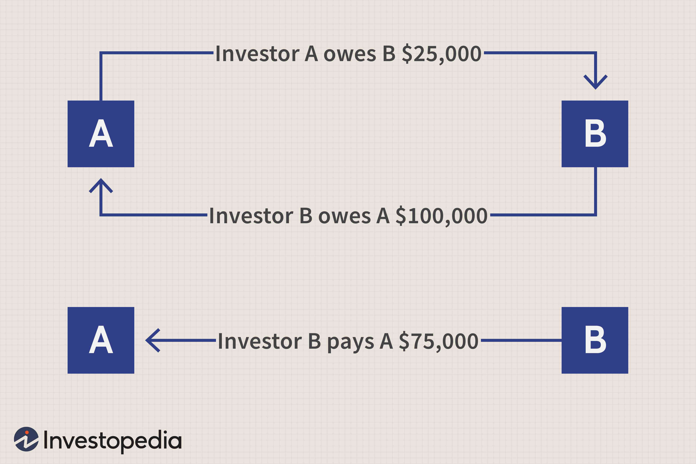

Forex trading operates in a highly dynamic and fast-paced environment where speed and accuracy are paramount. To succeed, traders must possess not only profound market knowledge but also access to efficient transactional methods. Broker payment methods are integral to this aspect, playing a critical role in ensuring smooth and hassle-free trading experiences for participants. 

A comprehensive understanding of different payment methods is crucial for traders aiming to make informed decisions. Payment methods vary widely, each with distinct characteristics, advantages, and drawbacks. This diversity can significantly influence a trader's strategy and overall trading outcomes. Effective payment solutions facilitate quick fund transfers, enabling traders to respond promptly to market movements and maintain trading positions with minimal disruptions.

In this article, we will explore various payment methods employed by forex brokers, examining their pros and cons, and analyzing their impact on different trading strategies, including algorithmic trading. Algorithmic trading, in particular, places a premium on speed and efficiency, necessitating seamless and rapid payment solutions.

By gaining insights into these payment options, traders can select methods that align with their trading objectives and preferences. This informed selection process can enhance their trading experience and improve overall profitability.

## Table of Contents

## Understanding Forex Broker Payment Methods

Forex brokers utilize an array of payment methods to accommodate the diverse needs of the global trading community. Bank wire transfers, credit and debit cards, and e-wallets such as Skrill and Neteller are among the most common methods employed. Additionally, cryptocurrencies like Bitcoin are increasingly being adopted due to their enhanced security features and rapid transaction capabilities.

Each of these payment methods comes with distinct attributes regarding transaction times, fees, and security measures. Bank wire transfers are often perceived as secure, yet they typically involve lengthy processing times, which can delay access to funds. Transactions generally take several business days to complete, and fees can vary depending on the bank and the countries involved. Credit and debit card transactions offer convenience and faster processing times, usually within minutes or hours. However, users may incur higher fees, both from the brokers and the card issuers.

E-wallets, such as Skrill and Neteller, provide an efficient alternative by facilitating almost instant transactions. These platforms are particularly advantageous for traders who require quick access to funds to respond to market shifts rapidly. Although e-wallets generally have lower fees compared to credit cards, users may still encounter charges associated with currency conversions and withdrawal processes.

The adoption of cryptocurrencies, notably Bitcoin, as a payment method is gaining traction for its ability to offer both speed and security. Cryptocurrency transactions are processed quickly and often involve lower fees than traditional banking methods. Bitcoin and other cryptocurrencies are also less susceptible to fraud and chargebacks due to their decentralized nature. However, their [volatility](/wiki/volatility-trading-strategies) can be a concern for users who are not well-versed in managing [cryptocurrency](/wiki/cryptocurrency) risks.

Security considerations are paramount across all payment methods. Financial institutions and payment service providers implement various security protocols, such as encryption and two-[factor](/wiki/factor-investing) authentication, to protect users' funds and personal information. Traders must understand the security features associated with each payment method to ensure their financial data remains secure.

In summary, [forex](/wiki/forex-system) brokers provide a variety of payment options to meet the diverse needs of their clients. Each method presents unique benefits and drawbacks in terms of speed, cost, and security. Traders are advised to evaluate these factors carefully when selecting a payment method that aligns with their trading needs and strategies.

## Impact of Payment Methods on Forex Trading

The choice of payment method in forex trading can significantly impact the efficiency and profitability of trading activities. Traders aiming to capitalize on split-second market movements rely on instant transaction methods for quick fund availability. Payment methods such as credit cards and e-wallets like Skrill and Neteller facilitate rapid deposits, allowing traders to initiate or extend trades without delay. This immediacy is crucial in the highly volatile forex market, where favorable conditions can change rapidly.

On the other hand, bank wire transfers, although secure, may take several days to process, potentially causing traders to miss timely opportunities. Hence, selecting a payment method with minimal processing time can bolster trading strategies by ensuring funds are available when market conditions are favorable.

Fees associated with payment transactions are another critical consideration for traders. High fees can erode trading profits, particularly in high-frequency trading scenarios where numerous transactions occur. Traders must carefully evaluate the cost structure of their preferred payment methods. It involves understanding both fixed fees and percentage-based charges imposed by brokers or payment service providers.

For instance, if a trader deposits $1,000 using a payment method that charges a 2% fee, the cost is $20, impacting the amount available for trading. Over multiple transactions, such costs can accumulate, thereby affecting net profitability. Conversely, choosing payment methods with lower fees can reduce this financial burden, optimizing the capital that remains available for trading.

In summary, the selection of a payment method is a strategic decision in forex trading. Speedy transaction capabilities enable traders to respond promptly to market conditions, while cost-effective methods help preserve the capital and ensure greater profitability. As such, traders should weigh the benefits and drawbacks of each payment option in alignment with their trading objectives and frequency.

## Algorithmic Trading and Broker Payments

Algorithmic trading, a key component in modern financial markets, thrives on speed, precision, and efficiency. In this context, broker payment methods play a pivotal role. Rapid and dependable fund transfers are critical to maintain and optimize trading strategies that largely operate with minimal human intervention.

Automated trading systems, which execute buy and sell orders based on predetermined algorithms, require immediate access to funds to sustain trading positions. Delayed transactions could result in missed trading opportunities or liquidated positions, especially in high-frequency trading environments. This necessity underscores why algorithmic traders favor brokers offering fast and trustworthy payment solutions.

Speed is particularly crucial because [algorithmic trading](/wiki/algorithmic-trading) often involves executing numerous trades per second. A delay of even milliseconds can impact the profitability of an algorithmic trading strategy. Therefore, brokers that facilitate instant transaction methods, such as credit cards and e-wallets, are preferred due to their ability to process payments in real-time, ensuring that funds are always available to meet trading demands.

Moreover, the security of the payment method cannot be compromised, as the frequent and large magnitude of transfers in algorithmic trading could be attractive targets for cyber threats. Reliable brokers offer robust security measures such as two-factor authentication and encryption technologies to safeguard transaction integrity while maintaining speed. 

In essence, the alignment of payment methods with the demands of algorithmic trading is not merely a convenience but a necessity for traders to maintain algorithm efficiency and operational success.

## Popular Forex Brokers and Their Payment Options

Exness, Pepperstone, and XM are prominent names in the forex trading industry, known for their extensive range of payment options. These brokers facilitate smooth transactions by supporting various methods such as credit/debit cards and e-wallets like Skrill and Neteller. Such options offer traders rapid and flexible funding solutions, crucial for timely market engagement.

Exness is renowned for allowing deposits and withdrawals through a multitude of channels, ensuring low fees and speed, critical for a global clientele. Similarly, Pepperstone accentuates its service by integrating multiple e-wallet and card systems, enabling traders to select a convenient payment avenue that best suits their geographical location and transactional needs. XM stands out by offering competitive pricing structures along with diverse payment methods, which are essential for cost-effective trading operations.

Brokers like Axi and Tickmill are favored for their transparent fee structures, a significant consideration for traders who prioritize cost efficiency in their trading activities. Transparency in fees allows traders to plan and manage their trading costs efficiently, minimizing unexpected charges that can affect profitability.

Additionally, these brokers are increasingly accommodating traders interested in using cryptocurrency as a payment method. The incorporation of cryptocurrencies such as Bitcoin reflects a growing trend in financial transactions, characterized by enhanced security and swift processing times. This move is aligned with the evolving demands of traders who value privacy and short transaction durations. 

Overall, the selection of a forex broker based on their payment options involves evaluating the variety, flexibility, and cost-effectiveness of these methods. Each broker's offerings can significantly influence a trader's experience, thus making it essential to align payment options with one's trading strategy and requirements.

## Choosing the Right Forex Broker Based on Payment Methods

When selecting a forex broker, traders must assess several criteria related to payment methods to ensure the most efficient and secure trading experience. A critical factor is the variety and flexibility of payment options available. Brokers that offer multiple payment methods, such as bank wire transfers, credit/debit cards, e-wallets, and cryptocurrencies, provide traders with the flexibility to choose the option that best aligns with their personal preferences and financial strategies.

Evaluating transaction fees is essential as these costs can substantially impact trading profitability. Each payment method may incur different fees, either as fixed charges or a percentage of the transferred amount. It is crucial for traders to calculate these fees in relation to the [volume](/wiki/volume-trading-strategy) and frequency of their transactions to avoid eroding their profits. A simple calculation to compare fees might look like this:

$$

\text{Total Transaction Cost} = \text{Transaction Volume} \times \text{Fee Percentage} + \text{Fixed Charge}
$$

In addition to fees, processing times for deposits and withdrawals are vital considerations. Instantaneous or near-instantaneous transaction methods like credit cards and e-wallets can be advantageous for traders who need to quickly capitalize on market opportunities. Conversely, methods with longer processing times, such as bank wire transfers, may impede timely investments and withdrawals.

Security is another paramount concern when selecting a payment method. Brokers and traders should ensure that there are robust security measures in place, such as encryption and two-factor authentication, to protect against fraud and unauthorized transactions. The security of a payment method can often determine the level of trust and comfort a trader has when dealing with a broker.

Ultimately, traders should align their chosen broker’s payment offerings with their specific trading strategies and needs. For example, a trader focusing on high-frequency trading may prioritize brokers with low transaction fees and fast processing times, whereas a trader prioritizing investment security might opt for brokers that offer highly secure payment methods. By comprehensively evaluating these factors, traders can enhance their trading efficiency and overall success.

## Conclusion

The choice of payment method in forex trading is a strategic decision that plays a crucial role in both trading performance and profitability. Selecting the appropriate payment method is not just about convenience; it directly influences the efficiency of trading operations and the overall trading experience.

Traders should be proactive in exploring forex brokers that offer a wide array of payment options. A diverse selection ensures that traders can pick methods that align with their financial strategies and operational requirements. Efficient payment solutions can enhance the speed and ease with which traders can deposit and withdraw funds, thereby allowing them to capitalize on market opportunities swiftly. Fast and reliable payment methods are particularly beneficial for algorithmic trading where speed is paramount.

Additionally, understanding the specifics of different payment methods helps traders make informed decisions. Factors such as transaction fees, processing times, and security measures vary among payment methods and can significantly impact the net profitability of trading activities. For example, while credit cards and e-wallets might provide instant fund transfers, they may come with higher fees than other methods like bank wire transfers. Therefore, traders need to weigh the pros and cons of each method in relation to their trading strategies.

The process of selecting the right payment methods also involves assessing the security protocols provided by brokers. Ensuring that funds are safeguarded through robust security measures is vital to prevent financial loss and maintain trust in the trading platform.

By thoroughly understanding and choosing the right payment methods, traders can enhance their trading experiences, optimize their trading strategies, and ultimately achieve better outcomes. A well-considered approach to broker payment methods not only streamlines financial transactions but also contributes to the trader's overall success in the forex market.

## References & Further Reading

[1]: Bergstra, J., Bardenet, R., Bengio, Y., & Kégl, B. (2011). ["Algorithms for Hyper-Parameter Optimization."](https://dl.acm.org/doi/10.5555/2986459.2986743) Advances in Neural Information Processing Systems 24.

[2]: ["Advances in Financial Machine Learning"](https://www.amazon.com/Advances-Financial-Machine-Learning-Marcos/dp/1119482089) by Marcos Lopez de Prado

[3]: ["Evidence-Based Technical Analysis: Applying the Scientific Method and Statistical Inference to Trading Signals"](https://www.amazon.com/Evidence-Based-Technical-Analysis-Scientific-Statistical/dp/0470008741) by David Aronson

[4]: ["Machine Learning for Algorithmic Trading"](https://github.com/stefan-jansen/machine-learning-for-trading) by Stefan Jansen

[5]: ["Quantitative Trading: How to Build Your Own Algorithmic Trading Business"](https://www.amazon.com/Quantitative-Trading-Build-Algorithmic-Business/dp/1119800064) by Ernest P. Chan