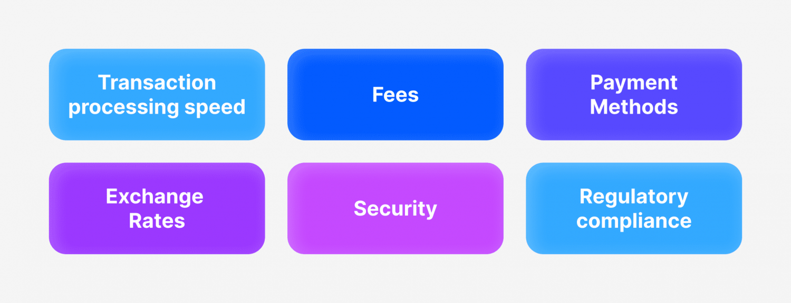

## Table of Contents

## What is a Forex broker and why is it important to understand payment methods?

A Forex broker is a company that helps people buy and sell currencies on the foreign exchange market. They provide a platform where traders can make these transactions easily. The broker makes money by charging a small fee or a difference in the buying and selling price of the currency. Using a Forex broker is important because it allows people to trade currencies without needing to handle large sums of money directly.

Understanding payment methods is important when working with a Forex broker. Different brokers accept different ways to deposit and withdraw money, like bank transfers, credit cards, or electronic wallets. Knowing these methods helps traders choose a broker that fits their needs and avoids any surprises or delays in moving money. It also helps traders manage their money better and keep their trading account safe and secure.

## What are the most common methods for paying Forex brokers?

The most common ways to pay Forex brokers are through bank transfers, credit cards, and electronic wallets. Bank transfers are popular because they are secure and can handle large amounts of money. People often use this method to move money in and out of their trading accounts. Credit cards are also widely used because they are quick and easy. Traders can deposit money into their accounts almost instantly, which is great for taking advantage of trading opportunities.

Electronic wallets, like PayPal or Skrill, are another common method. They are convenient because they let you move money quickly and easily between your trading account and other places. Some traders like electronic wallets because they can keep their bank details private. Each method has its own advantages, so it's good to understand them to choose the best one for your needs.

## How do credit and debit card payments work with Forex brokers?

When you want to use a credit or debit card to pay a Forex broker, you usually go to the deposit section of their trading platform. You enter your card details like the card number, expiration date, and the security code. After you enter this information, you choose how much money you want to put into your trading account. The money is taken from your card and added to your trading account almost right away. This is good because it lets you start trading without waiting for the money to arrive.

Some Forex brokers might charge a small fee for using a credit or debit card, so it's a good idea to check this before you make a deposit. Also, when you want to take money out of your trading account and back to your card, it can take a few days. This is because the broker needs to make sure everything is okay before sending the money back. Using a credit or debit card is easy and quick, but it's important to know about any fees and how long withdrawals might take.

## What are the benefits and risks of using bank wire transfers for Forex broker payments?

Using bank wire transfers to pay Forex brokers has several benefits. One big benefit is that they are very secure. When you send money through a bank, it goes straight from your bank account to the broker's account. This makes it hard for anyone to steal your money. Another benefit is that bank wire transfers can handle large amounts of money. If you want to put a lot of money into your trading account, a bank wire transfer is a good choice. Also, many traders like using bank wire transfers because they feel more comfortable with traditional banking methods.

However, there are also some risks to consider. One big risk is that bank wire transfers can take a few days to complete. This means you might have to wait before you can start trading. Another risk is that banks might charge you fees for sending and receiving the money. These fees can add up, especially if you are making a lot of transfers. It's important to check with your bank to see how much they will charge you. Also, if you make a mistake with the bank details, it can be hard to get your money back, so you need to be very careful when entering the information.

## Can you explain how e-wallets function as a payment method for Forex brokers?

E-wallets, like PayPal or Skrill, are a popular way to pay Forex brokers because they are fast and easy to use. When you want to deposit money into your trading account, you just log into your e-wallet, choose how much money you want to send, and the money moves to your broker almost right away. This is great for traders who want to start trading quickly without waiting for the money to arrive. E-wallets also let you keep your bank details private, which can make you feel safer when you're moving money around.

However, there are some things to watch out for when using e-wallets. Some Forex brokers might charge a small fee for using an e-wallet, so it's good to check this before you make a deposit. Also, not all brokers accept every type of e-wallet, so you need to make sure your broker works with the one you want to use. When you want to take money out of your trading account and back to your e-wallet, it usually happens pretty fast, but it can still take a little bit of time. Overall, e-wallets are a handy way to pay your Forex broker, but it's important to know about any fees and which e-wallets your broker accepts.

## What are cryptocurrencies and how can they be used to pay Forex brokers?

Cryptocurrencies are digital or virtual currencies that use encryption techniques to secure their transactions. They are not controlled by any government or bank, which makes them different from regular money. Popular cryptocurrencies include Bitcoin, Ethereum, and Litecoin. People can buy, sell, or trade them on special platforms called cryptocurrency exchanges. They are stored in digital wallets, which can be online or on your computer or phone.

Some Forex brokers let you use cryptocurrencies to pay for your trading account. If a broker accepts cryptocurrencies, you can send them from your digital wallet to the broker's wallet address. This can be quick and easy, and it lets you keep your bank details private. However, not all brokers accept cryptocurrencies, so you need to check first. Also, the value of cryptocurrencies can go up and down a lot, which can be risky. But if you're comfortable with that, using cryptocurrencies can be a good way to pay your Forex broker.

## How do payment processing fees vary among different Forex broker payment methods?

Payment processing fees can be different depending on how you pay your Forex broker. If you use a credit or debit card, some brokers might charge you a small fee for each deposit. This fee can be a percentage of the amount you're putting in, like 1% or 2%, or it might be a fixed amount, like $5 or $10. Bank wire transfers can also have fees. Your bank might charge you to send the money, and the broker's bank might charge a fee to receive it. These fees can add up, especially if you're moving a lot of money.

E-wallets like PayPal or Skrill might have their own fees too. Some brokers charge a fee for using an e-wallet, and the e-wallet service itself might charge you for sending or receiving money. Cryptocurrencies can be a bit different. Some brokers don't charge any fees for using cryptocurrencies, but you might have to pay a small fee to the cryptocurrency network for the transaction. It's a good idea to check all the fees before you choose how to pay your Forex broker, so you know what to expect.

## What security measures should be considered when choosing a payment method for Forex brokers?

When picking a way to pay your Forex broker, it's important to think about security. One good thing to do is to use payment methods that have strong security, like bank wire transfers or e-wallets with two-factor authentication. Two-factor authentication means you need to enter a code sent to your phone or email before you can move money. This makes it harder for someone else to get into your account. Also, make sure the broker uses encryption to keep your information safe. Encryption is like a secret code that keeps your data private while it's being sent.

Another thing to think about is how much control you have over your money. With bank wire transfers, you can see exactly where your money is going, and it's hard for anyone to steal it. E-wallets can be good too because they let you keep your bank details private. But, you need to be careful with your e-wallet login information. If someone gets your username and password, they might be able to take your money. Cryptocurrencies can be secure, but they can also be risky if you don't know how to keep your digital wallet safe. Always check if the Forex broker is regulated by a trusted authority, as this can help make sure your money is safe.

## How can the speed of transaction processing impact your choice of payment method with Forex brokers?

The speed of how fast you can move money can really change which way you choose to pay your Forex broker. If you want to start trading right away, you might pick a method like using a credit card or an e-wallet. These ways let you put money into your trading account almost right away. This is great if you see a good chance to trade and don't want to wait. But, if you're okay with waiting a bit longer, you might go with a bank wire transfer. Bank transfers can take a few days, but they're very secure and good for moving big amounts of money.

Sometimes, how fast you need your money back from your trading account can also matter. If you need your money quickly, e-wallets and some cryptocurrencies can be faster for taking money out than bank transfers or credit cards. But, it's good to remember that even fast methods can take a little time because the broker needs to check everything before sending your money back. So, thinking about how fast you need to move your money in and out can help you pick the best way to pay your Forex broker.

## What are the regulatory considerations for different payment methods used with Forex brokers?

When you use different ways to pay your Forex broker, there are rules you need to know about. These rules can be different depending on where you live and where the broker is based. For example, if you use a credit or debit card, the rules from the card company and the country's financial rules can affect how you pay. Some countries have strict rules to make sure your money is safe when you use cards. Also, banks have their own rules for wire transfers, and these rules can change how fast and how much it costs to move your money. It's a good idea to know these rules so you don't have any surprises.

Another thing to think about is e-wallets and cryptocurrencies. E-wallets like PayPal or Skrill have their own rules, and these can be different in each country. Some places have special rules for using e-wallets with Forex brokers to make sure your money is safe. Cryptocurrencies are a bit different because they are not controlled by any government or bank. This means the rules can be less clear, and some countries might not let you use them to pay Forex brokers at all. Always check the rules in your country and with your broker to make sure you're doing everything right.

## How can advanced traders optimize their payment strategies with Forex brokers for better efficiency and cost management?

Advanced traders can make their payment strategies with Forex brokers better by choosing the right payment methods for their needs. If they trade a lot and need to move money quickly, using e-wallets or credit cards can be a good choice. These methods are fast, which means traders can put money into their accounts and start trading right away. But, they need to watch out for fees. Some brokers charge extra for using these methods, so traders should compare the costs and pick the one that saves them money. For big trades, bank wire transfers might be better because they can handle large amounts of money securely, even if they take a bit longer.

Also, traders can save money by understanding the fees for each payment method and planning their moves carefully. For example, if a trader knows they will be making a lot of deposits and withdrawals, they might choose a broker with low or no fees for their preferred method. Some traders might even use different payment methods for different purposes, like using e-wallets for quick trades and bank transfers for bigger, less urgent moves. By keeping an eye on the rules and regulations in their country and the broker's location, traders can make sure they're using the most efficient and cost-effective ways to manage their money.

## What future trends might influence the methods of paying Forex brokers?

In the future, new technology might change how people pay Forex brokers. One big trend could be more people using cryptocurrencies. Right now, some brokers already let you use Bitcoin or other digital currencies, but this could become even more common. Cryptocurrencies can move money quickly and let you keep your bank details private. But, their value can go up and down a lot, so traders will need to be careful. Another trend might be using smart contracts. These are like digital agreements that can handle payments automatically when certain things happen. This could make paying brokers easier and faster.

Also, new rules and laws might change how people pay Forex brokers. Governments around the world are starting to make more rules about using cryptocurrencies and other new payment methods. These rules could make some ways of paying safer and more trusted, but they might also make it harder to use certain methods. Traders will need to keep up with these changes to make sure they are following the rules. Overall, as technology keeps getting better and rules keep changing, the ways people pay Forex brokers will probably keep changing too.

## How do you choose the right Forex broker based on payment methods?

When selecting a forex broker, traders must assess several criteria related to payment methods to ensure the most efficient and secure trading experience. A critical factor is the variety and flexibility of payment options available. Brokers that offer multiple payment methods, such as bank wire transfers, credit/debit cards, e-wallets, and cryptocurrencies, provide traders with the flexibility to choose the option that best aligns with their personal preferences and financial strategies.

Evaluating transaction fees is essential as these costs can substantially impact trading profitability. Each payment method may incur different fees, either as fixed charges or a percentage of the transferred amount. It is crucial for traders to calculate these fees in relation to the [volume](/wiki/volume-trading-strategy) and frequency of their transactions to avoid eroding their profits. A simple calculation to compare fees might look like this:

$$

\text{Total Transaction Cost} = \text{Transaction Volume} \times \text{Fee Percentage} + \text{Fixed Charge}
$$

In addition to fees, processing times for deposits and withdrawals are vital considerations. Instantaneous or near-instantaneous transaction methods like credit cards and e-wallets can be advantageous for traders who need to quickly capitalize on market opportunities. Conversely, methods with longer processing times, such as bank wire transfers, may impede timely investments and withdrawals.

Security is another paramount concern when selecting a payment method. Brokers and traders should ensure that there are robust security measures in place, such as encryption and two-factor authentication, to protect against fraud and unauthorized transactions. The security of a payment method can often determine the level of trust and comfort a trader has when dealing with a broker.

Ultimately, traders should align their chosen broker’s payment offerings with their specific trading strategies and needs. For example, a trader focusing on high-frequency trading may prioritize brokers with low transaction fees and fast processing times, whereas a trader prioritizing investment security might opt for brokers that offer highly secure payment methods. By comprehensively evaluating these factors, traders can enhance their trading efficiency and overall success.

## References & Further Reading

[1]: Bergstra, J., Bardenet, R., Bengio, Y., & Kégl, B. (2011). ["Algorithms for Hyper-Parameter Optimization."](https://dl.acm.org/doi/10.5555/2986459.2986743) Advances in Neural Information Processing Systems 24.

[2]: ["Advances in Financial Machine Learning"](https://www.amazon.com/Advances-Financial-Machine-Learning-Marcos/dp/1119482089) by Marcos Lopez de Prado

[3]: ["Evidence-Based Technical Analysis: Applying the Scientific Method and Statistical Inference to Trading Signals"](https://www.amazon.com/Evidence-Based-Technical-Analysis-Scientific-Statistical/dp/0470008741) by David Aronson

[4]: ["Machine Learning for Algorithmic Trading"](https://github.com/stefan-jansen/machine-learning-for-trading) by Stefan Jansen

[5]: ["Quantitative Trading: How to Build Your Own Algorithmic Trading Business"](https://www.amazon.com/Quantitative-Trading-Build-Algorithmic-Business/dp/1119800064) by Ernest P. Chan