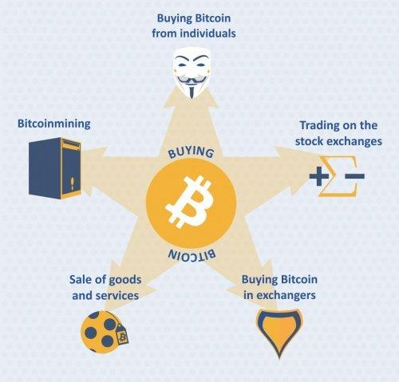

## Table of Contents

## What is Bitcoin and why would someone want to purchase it?

Bitcoin is a type of digital money that you can use to buy things online. It's different from regular money because it's not controlled by a bank or a government. Instead, it uses a technology called blockchain, which is like a big, public record book that keeps track of all Bitcoin transactions. Anyone can use Bitcoin, and you can send it to anyone else who has a Bitcoin address, kind of like sending an email.

People might want to buy Bitcoin for a few reasons. One reason is that they believe its value might go up in the future, so they see it as an investment. Just like some people buy gold or stocks, they buy Bitcoin hoping to sell it later for more money. Another reason is that some people like using Bitcoin because it's private and secure. They can buy things online without giving out their personal information, which some people find more convenient and safer than using credit cards or bank accounts.

## What are the basic steps to start buying Bitcoin?

To start buying Bitcoin, first, you need to choose a place to buy it from. These places are called exchanges, and they are like online marketplaces where you can trade your regular money for Bitcoin. Some popular exchanges are Coinbase, Binance, and Kraken. You'll need to create an account on one of these exchanges by giving them some personal information and setting up a password. Make sure to pick an exchange that is safe and easy for you to use.

Once your account is set up, you'll need to add money to it. This is called depositing funds. You can usually do this by linking your bank account or using a credit card. After your money is in the exchange, you can use it to buy Bitcoin. Just choose how much Bitcoin you want to buy, and the exchange will handle the rest. After you buy it, you can keep your Bitcoin in the exchange or move it to a special wallet that you control, which is like a digital safe for your Bitcoin.

## What are the different methods to purchase Bitcoin?

There are several ways to buy Bitcoin. One common way is through a [cryptocurrency](/wiki/cryptocurrency) exchange, which is like an online store where you can trade your regular money for Bitcoin. You sign up for an account on the exchange, add money to it from your bank or credit card, and then use that money to buy Bitcoin. Popular exchanges include Coinbase, Binance, and Kraken. Another way to buy Bitcoin is through a Bitcoin ATM. These are special machines where you can insert cash and get Bitcoin sent to your digital wallet.

Another method is through peer-to-peer (P2P) platforms, where you can buy Bitcoin directly from another person. Websites like LocalBitcoins and Paxful connect buyers and sellers, and you can choose to pay with cash, bank transfer, or even gift cards. This can be more private but requires you to trust the other person. Lastly, some people buy Bitcoin through brokers, who are like middlemen that help you buy Bitcoin for a fee. Brokers can make the process easier, especially if you're new to buying Bitcoin, but they might charge more than using an exchange directly.

## How can I buy Bitcoin using a cryptocurrency exchange?

To buy Bitcoin using a cryptocurrency exchange, first, you need to choose a reliable exchange like Coinbase, Binance, or Kraken. Sign up for an account on the exchange's website. You'll need to provide some personal information, like your name and email address, and set up a strong password. After you've created your account, you'll need to verify your identity. This usually involves sending a copy of your ID, like a driver's license or passport, to the exchange. Once your identity is verified, you're ready to add money to your account.

To add money to your exchange account, you can usually link your bank account or use a credit card. This process is called depositing funds. Once your money is in the exchange, you can use it to buy Bitcoin. On the exchange's website, look for the option to buy Bitcoin. You can choose how much Bitcoin you want to buy, and the exchange will handle the trade for you. After you've bought the Bitcoin, you can keep it in the exchange's wallet or move it to your own personal wallet for added security.

## What are peer-to-peer (P2P) platforms and how do I use them to buy Bitcoin?

Peer-to-peer (P2P) platforms are websites where you can buy Bitcoin directly from other people. They are like online marketplaces that connect buyers and sellers. Some popular P2P platforms are LocalBitcoins and Paxful. When you use a P2P platform, you can choose how you want to pay the seller. You might pay with cash, a bank transfer, or even gift cards. It's more private than using an exchange, but you need to trust the person you're buying from.

To use a P2P platform to buy Bitcoin, first, you need to sign up for an account on the platform's website. You'll need to provide some basic information and set up a password. Once your account is ready, you can browse through the listings to find someone selling Bitcoin. You can see how much they're asking for it and what payment methods they accept. When you find a seller you like, you can start a trade with them. You'll send them the money using the payment method you agreed on, and once they confirm they've received it, they'll send the Bitcoin to your digital wallet.

## Can I buy Bitcoin directly with cash, and if so, how?

Yes, you can buy Bitcoin directly with cash. One way to do this is by using a Bitcoin ATM. These are special machines where you can put in cash, and the machine will send Bitcoin to your digital wallet. You'll need to find a Bitcoin ATM near you, which you can do by searching online. Once you're at the ATM, follow the instructions on the screen to insert your cash and enter your Bitcoin wallet address. The ATM will then send the Bitcoin to your wallet.

Another way to buy Bitcoin with cash is through peer-to-peer (P2P) platforms like LocalBitcoins or Paxful. On these websites, you can find people who are willing to sell Bitcoin and accept cash as payment. You'll need to sign up for an account on the platform, find a seller who accepts cash, and agree on a place to meet. Once you meet the seller and give them the cash, they'll send the Bitcoin to your wallet. This method can be more private, but you need to be careful and only meet in safe, public places.

## What are Bitcoin ATMs and how do they work?

Bitcoin ATMs are special machines that let you buy Bitcoin with cash or sometimes a debit card. They look a bit like regular ATMs but are set up just for buying Bitcoin. To use a Bitcoin ATM, you first need to find one near you. You can search online to see where they are located. Once you're at the ATM, you'll see a screen with instructions. You'll need to put in your cash and enter your Bitcoin wallet address. The ATM will then send the Bitcoin to your wallet.

These machines make it easy for people to buy Bitcoin without needing to use a computer or a smartphone app. They're helpful if you want to buy Bitcoin quickly and don't want to go through the process of setting up an account on an exchange. Just remember that using a Bitcoin ATM might cost you more in fees than other ways of buying Bitcoin, so it's good to check the fees before you use one.

## How can I use a Bitcoin broker to purchase Bitcoin?

A Bitcoin broker is someone who helps you buy Bitcoin. They act like a middleman between you and the Bitcoin market. To use a broker, you first need to find one you trust. You can search online for Bitcoin brokers in your area. Once you've chosen a broker, you'll need to contact them and tell them how much Bitcoin you want to buy. They will usually ask for some personal information and might need to verify your identity, just like an exchange does.

After you've given the broker your information, you'll need to send them money. You can usually do this by bank transfer or sometimes with a credit card. Once the broker gets your money, they'll buy the Bitcoin for you and send it to your digital wallet. Using a broker can be easier if you're new to buying Bitcoin, but they might charge more in fees than if you bought it directly from an exchange. So, it's good to compare the costs before you decide to use a broker.

## What are the risks associated with each method of buying Bitcoin?

When you buy Bitcoin through a cryptocurrency exchange, there are a few risks to keep in mind. One big risk is that exchanges can be hacked. If hackers break into the exchange, they might steal your Bitcoin or your personal information. Another risk is that the exchange might not be trustworthy. Some exchanges have gone out of business suddenly, taking people's money with them. Also, using an exchange means you have to share your personal information, which can be a privacy concern for some people.

Buying Bitcoin through peer-to-peer (P2P) platforms also comes with its own set of risks. Since you're dealing directly with another person, there's a chance they might not send you the Bitcoin after you've paid them. This is called a scam. Meeting someone in person to exchange cash for Bitcoin can also be risky if you don't meet in a safe place. P2P platforms can be more private, but you need to be careful and trust the person you're buying from.

Using Bitcoin ATMs and brokers has its own risks too. Bitcoin ATMs can charge high fees, which means you might end up paying more than you would through other methods. There's also a risk that the ATM might be out of service or not working properly. When using a broker, you're relying on them to buy the Bitcoin for you, and they might charge high fees as well. If the broker isn't trustworthy, they could take your money and not give you the Bitcoin. So, it's important to do your research and choose a reliable broker.

## How can I ensure the security of my Bitcoin transactions and storage?

To keep your Bitcoin safe, you need to be careful about where you store it. One good way is to use a hardware wallet. This is like a special USB drive that keeps your Bitcoin offline, making it harder for hackers to steal it. Another way is to use a software wallet on your computer or phone, but these can be riskier because they're connected to the internet. Always make sure to use strong passwords and enable two-[factor](/wiki/factor-investing) authentication on any wallet or exchange you use. This adds an extra layer of security, making it harder for someone to get into your account.

When you're buying or selling Bitcoin, it's important to use trusted platforms. Stick to well-known exchanges and brokers that have a good reputation for keeping their users' information and money safe. Be careful with peer-to-peer platforms and always check the seller's reviews before you buy. If you're using a Bitcoin ATM, make sure it's in a safe place and check the fees before you use it. Also, never share your private keys or wallet information with anyone. These are like the secret codes to your Bitcoin, and if someone else gets them, they can take your Bitcoin.

## What are the tax implications of buying and selling Bitcoin?

When you buy and sell Bitcoin, you need to think about taxes. In many places, Bitcoin is treated like property, not money. This means if you sell your Bitcoin for more than you paid for it, you might have to pay capital gains tax on the profit. The tax rate can be different depending on how long you held the Bitcoin before selling it. If you held it for less than a year, it's usually taxed at a higher rate than if you held it for more than a year.

You also need to report any income you get from Bitcoin. If you get paid in Bitcoin for work or if you mine Bitcoin, that's considered income and you have to pay taxes on it. The value of the Bitcoin at the time you receive it is what you report as income. It's important to keep good records of all your Bitcoin transactions, including when you bought it, sold it, and how much you paid or received. This will help you when it's time to file your taxes and make sure you're following the rules.

## What advanced strategies can I use to optimize my Bitcoin purchases?

To optimize your Bitcoin purchases, one good strategy is called dollar-cost averaging. This means you buy a little bit of Bitcoin regularly, like every month, instead of spending a lot of money all at once. By doing this, you can buy Bitcoin at different prices over time. Sometimes the price will be high, and sometimes it will be low. This can help you avoid buying all your Bitcoin when the price is at its highest. Another strategy is to do your research and watch the market closely. Look at what's happening in the news and how it might affect Bitcoin's price. This can help you decide when might be a good time to buy more Bitcoin.

Another advanced strategy is to use limit orders on exchanges. Instead of buying Bitcoin at whatever price it's at right now, you can set a specific price you want to buy it at. If the price of Bitcoin drops to your limit, the exchange will automatically buy it for you. This can help you get a better deal. Also, consider using different exchanges and payment methods to compare fees and find the best deal. Some exchanges might charge less than others, and some payment methods, like bank transfers, might be cheaper than using a credit card. By trying out different options, you can save money and get more Bitcoin for your dollars.

## References & Further Reading

[1]: Nakamoto, Satoshi. ["Bitcoin: A Peer-to-Peer Electronic Cash System."](https://nakamotoinstitute.org/library/bitcoin/) Bitcoin.org.

[2]: Narayanan, A., Bonneau, J., Felten, E., Miller, A., & Goldfeder, S. (2016). ["Bitcoin and Cryptocurrency Technologies."](https://press.princeton.edu/books/hardcover/9780691171692/bitcoin-and-cryptocurrency-technologies) Princeton University Press.

[3]: Chuen, D.L.K., Guo, L., & Wang, Y. (Eds.). (2017). ["Handbook of Blockchain, Digital Finance, and Inclusion, Volume 1."](https://www.sciencedirect.com/book/9780128104415/handbook-of-blockchain-digital-finance-and-inclusion-volume-1) Academic Press.

[4]: Gandal, N., & Halaburda, H. (2016). ["Can We Predict the Winner in a Market with Network Effects? Competition in Cryptocurrency Market."](https://papers.ssrn.com/sol3/papers.cfm?abstract_id=2506463) CEPR Discussion Paper No. 10477.

[5]: "Artificial Intelligence and Blockchain" Advances in Computers, Volume 111, "Algorithmic Trading Strategies Evolution in Cryptocurrency Markets", ISBN 978-0-12-812807-0, Chapter 8.

[6]: Hull, J. C. (2021). ["Options, Futures, and Other Derivatives."](https://www.semanticscholar.org/paper/Options%2C-Futures%2C-and-Other-Derivatives-Hull/89bdee500c8623864fc9eb7a471546aa713acc44) Pearson Education.