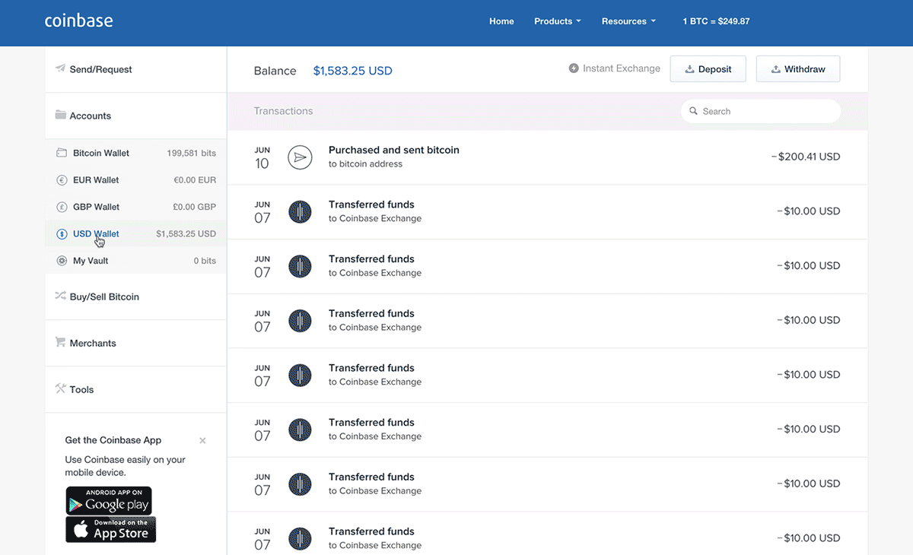

Bitcoin is a decentralized digital currency that has dramatically transformed the financial landscape since its inception in 2008 by an anonymous entity known as Satoshi Nakamoto. Unlike traditional currencies governed by central banks, Bitcoin operates on a peer-to-peer network using blockchain technology to facilitate transactions without intermediaries. Its significance in the cryptocurrency space stems from its pioneering role in introducing the concept of decentralized, secure, and transparent digital transactions, which have paved the way for thousands of alternative cryptocurrencies.

A key trend observed in recent years is the increasing interest in purchasing and acquiring Bitcoin. This rising trend is driven by several factors, including Bitcoin's potential as a hedge against inflation, its adoption by mainstream financial institutions, and its role as a digital asset in diversified investment portfolios. Bitcoin's capped supply of 21 million coins adds to its allure, as scarcity could potentially drive up value over time. Moreover, the ease of access to Bitcoin via platforms like cryptocurrency exchanges and wallets has contributed to its widespread adoption.

Algorithmic trading has becoming an integral part of the Bitcoin market. This form of trading uses computer algorithms to execute trades based on predefined criteria, such as price, timing, and volume. In the context of Bitcoin, algorithmic trading offers the advantage of speed and accuracy, enabling traders to capitalize on market inefficiencies and volatility. In addition to traditional trading strategies, these algorithms can also factor in Bitcoin's unique characteristics, such as mining difficulty and network metrics, to make informed trading decisions.

The primary goal of this article is to equip readers with insights and practical guidance on purchasing Bitcoin. Understanding the nuances of the Bitcoin market, the mechanisms of algorithmic trading, and the strategies for effective acquisition can empower individuals to make informed decisions. As the cryptocurrency ecosystem continues to expand and evolve, acquiring Bitcoin is more pertinent than ever. The speculative nature of cryptocurrency, combined with its growing acceptance and integration into financial systems, makes it a focal point for modern investors. Cryptocurrency acquisition stands out as a hot topic in today's financial landscape due to its potential for substantial returns, its role in promoting financial inclusivity, and the continuous innovations that drive the market forward. Through this article, we aim to provide a comprehensive understanding of the current state of Bitcoin acquisition, the tools available to investors, and strategies for maximizing potential gains while mitigating risks.

## Table of Contents

## Understanding Bitcoin and Its Market Dynamics

Bitcoin is a decentralized digital currency, proposed in 2008 by an anonymous person or group using the pseudonym Satoshi Nakamoto. It introduced the concept of a peer-to-peer network to validate and record transactions on a public ledger called the blockchain. By eliminating the need for intermediaries like banks, Bitcoin revolutionized digital currency by allowing secure, anonymous transactions directly between users. This innovation sparked the development of numerous other cryptocurrencies and laid the groundwork for a financial system that operates outside of traditional banking frameworks.

One principal [factor](/wiki/factor-investing) influencing Bitcoin's value is its limited supply. Bitcoin's code caps its total supply at 21 million coins, introducing scarcity that can pressure prices upward as demand increases. Additionally, factors like technological advancements, regulatory developments, macroeconomic trends, and changes in public perception play significant roles in determining Bitcoin's market value. For example, institutional adoption or a favorable regulatory environment can drive demand, thereby influencing prices.

Bitcoin's price history is marked by remarkable [volatility](/wiki/volatility-trading-strategies). It has experienced several boom-and-bust cycles, where prices have surged to new highs before abruptly plummeting. In 2017, Bitcoin's price reached nearly $20,000 before falling below $4,000 the following year. In late 2020 and early 2021, Bitcoin again soared to unprecedented levels, surpassing $60,000, fueled by growing institutional interest and wider acceptance. Such volatility is indicative of the speculative nature of the Bitcoin market, high market [liquidity](/wiki/liquidity-risk-premium), and the relatively nascent stage of digital currencies.

Market demand and supply dynamics are crucial to Bitcoin pricing. High demand can push prices upwards in a scenario where supply remains constant or grows more slowly due to Bitcoin's capped supply. Conversely, if more Bitcoins enter circulation or if demand diminishes, prices may drop. Bitcoin halving events, which occur approximately every four years, reduce the reward miners receive for processing transactions from 12.5 to 6.25 bitcoins, effectively decreasing the supply growth and potentially affecting prices.

Bitcoin also serves a pivotal role in the broader [cryptocurrency](/wiki/cryptocurrency) market. Acting as a benchmark, its price movements often influence other cryptocurrencies due to its substantial market capitalization and historical primacy. Additionally, Bitcoin is frequently utilized as a trading pair with other cryptocurrencies, facilitating trade and liquidity within the market. Consequently, shifts in Bitcoin's market dynamics can have wide-ranging effects across the entire cryptocurrency ecosystem.

## The Process of Purchasing Bitcoin

Purchasing Bitcoin, the foremost cryptocurrency, involves several steps and considerations crucial for beginners. It is essential to approach the acquisition process carefully to ensure security and cost-effectiveness. Here, we outline the necessary steps and provide a comparison of different avenues for purchasing Bitcoin.

### Steps to Acquire Bitcoin for Beginners

1. **Educate Yourself**: Understanding what Bitcoin is and how the market operates is crucial. This foundational knowledge will aid in making informed decisions.

2. **Select a Cryptocurrency Exchange**: Choose a platform that allows users to buy, sell, and store Bitcoin. Exchanges differ in their offerings, fees, and security protocols.

3. **Create an Account**: Sign up on the chosen exchange. This usually requires providing personal information and completing identity verification to comply with financial regulations.

4. **Deposit Funds**: Transfer fiat currency (e.g., USD, EUR) into your exchange account. This is typically done via a bank transfer or credit card payment.

5. **Buy Bitcoin**: Once funds are available, purchase Bitcoin by placing an order on the exchange. You can select between a market order for immediate purchase or a limit order to buy at a specific price.

6. **Store Bitcoin Securely**: Transfer the purchased Bitcoin to a secure wallet. Holding Bitcoin on an exchange can expose your assets to potential security breaches.

### A Comparison of Popular Cryptocurrency Exchanges

Different platforms offer varied features, catering to diverse user needs:

- **Coinbase**: Known for its user-friendly interface, it is ideal for beginners. However, it has higher fees compared to other platforms.
- **Binance**: Offers a wide range of cryptocurrencies and advanced trading features. It has lower fees but might be complex for new users.
- **Kraken**: Provides robust security measures and a good mix of low fees and usability.
- **Gemini**: Emphasizes regulatory compliance and security, suitable for U.S. residents.

### Security Measures to Consider When Buying Bitcoin

Security is paramount in cryptocurrency transactions. Consider the following:

- **Enable Two-Factor Authentication (2FA)**: Enhances the security of your exchange and wallet accounts.
- **Use Secure Connections**: Always access your accounts over a secure, private internet connection, avoiding public Wi-Fi networks.
- **Regularly Monitor Accounts**: Check transactions and account activity frequently to detect any unauthorized access early.

### Understanding Bitcoin Wallets and Their Importance

Bitcoin wallets store the private keys needed to access your Bitcoin. They come in various types:

- **Hot Wallets**: Online wallets that are convenient for frequent transactions but are more vulnerable to hacks.
- **Cold Wallets**: Offline wallets like hardware devices, offering superior security for long-term storage.

### Transaction Fees and Their Impact on Bitcoin Purchases

Transaction fees can affect the cost-effectiveness of buying Bitcoin. They are usually a percentage of the transaction amount and vary across exchanges. For instance:

- **Exchange Fees**: Comprise trading and withdrawal fees, which differ between platforms.
- **Network Fees**: Costs associated with processing the transaction on the Bitcoin blockchain.

Being aware of these fees and choosing an exchange with a competitive fee structure can significantly impact the efficiency of your investment.

## Utilizing Algorithmic Trading for Bitcoin Acquisition

Algorithmic trading is a method of executing orders using automated pre-programmed trading instructions accounting for variables such as time, price, and [volume](/wiki/volume-trading-strategy). In the cryptocurrency market, [algorithmic trading](/wiki/algorithmic-trading) is vital due to its ability to manage the vast volume of data and execute orders at speeds beyond human capacity. This becomes particularly important given the 24/7 nature of crypto exchanges and the high volatility associated with Bitcoin trading.

Algorithmic trading strategies in Bitcoin acquisition involve automated decisions about buying and selling Bitcoin, often based on various quantitative models. These strategies can include market-making, where algorithms continuously buy and sell to capture the bid-ask spread, and [arbitrage](/wiki/arbitrage), where discrepancies in Bitcoin prices across different exchanges are exploited for profit. Other strategies like trend-following or mean reversion also make algorithmic decisions on when to buy or sell based on price patterns.

The primary benefits of using algorithmic trading in cryptocurrency acquisition are enhanced efficiency and the elimination of human error. Algorithms can process vast datasets and operate continuously without fatigue, executing trades as soon as set conditions are met. This precision and speed often lead to improved pricing and reduced transaction costs, especially in a highly fragmented market like cryptocurrency.

Popular platforms and tools for algorithmic trading in Bitcoin include MetaTrader 4 (MT4), which offers robust algorithmic crafting capabilities, and platforms such as 3Commas and HaasOnline, which allow traders to automate their strategies across multiple exchanges. These platforms provide a user-friendly interface and advanced tools that help traders with strategy testing, optimization, and execution in real-time.

However, there are inherent risks and considerations when employing algorithmic trading strategies. One major risk is the possibility of system failures or glitches, which can result in significant trading losses. Additionally, the practice of "flash crashes," where algorithms exacerbate rapid market declines, is a noted risk. It is also crucial to consider market liquidity, as high-frequency trading can lead to slippage in low-liquidity environments, adversely affecting expected returns.

Investors must ensure robust risk management practices are in place, regularly update algorithms to adapt to changing market conditions, and perform thorough [backtesting](/wiki/backtesting) before live deployment. It is advisable to remain cautious and thoroughly understand both the potential advantages and pitfalls when leveraging algorithmic trading for Bitcoin acquisition.

## Strategies for Effective Cryptocurrency Acquisition

Understanding Bitcoin investment strategies is crucial for maximizing potential returns and minimizing risks. The following are key strategies that can be employed for effective cryptocurrency acquisition:

### Long-term vs. Short-term Bitcoin Holding: Pros and Cons

**Long-term Holding (HODLing):**

- **Pros:**
  1. **Potential for High Returns:** Bitcoin has shown significant price appreciation over the years, benefiting patient investors who can weather price fluctuations.
  2. **Lower Transaction Costs:** Fewer transactions mean lower transaction fees and less exposure to taxation on capital gains.
  3. **Resilience against Short-term Volatility:** Holding Bitcoin for the long haul can smooth out the volatility that often characterizes cryptocurrency markets.

- **Cons:**
  1. **Opportunity Cost:** Capital is tied up for extended periods, potentially missing out on other investment opportunities.
  2. **Market Risk:** Long-term holders are subject to prolonged market downturns which can affect their portfolios.

**Short-term Holding (Trading):**

- **Pros:**
  1. **Profit from Volatility:** Quick buying and selling allow traders to take advantage of price swings.
  2. **Flexibility:** Short-term trading can react swiftly to market news and trends.

- **Cons:**
  1. **Higher Transaction Costs:** Frequent trading incurs more transaction fees and potential tax implications.
  2. **Increased Risk:** Requires constant market monitoring and can lead to substantial losses if not managed carefully.

### Diversifying Your Cryptocurrency Portfolio

Diversification involves spreading investments across various cryptocurrencies to mitigate risks. This strategy reduces the impact of a poor-performing asset on the overall portfolio. By including assets like Ethereum, Cardano, or Solana alongside Bitcoin, investors can capture growth from different sectors within the blockchain space, such as smart contracts or decentralized finance (DeFi).

### Tips for Minimizing Risks in Bitcoin Investment

1. **Conduct Thorough Research:** Before investing, understand the fundamentals of Bitcoin and related market dynamics.
2. **Use Secure Platforms:** Choose reputable exchanges and secure wallets to protect assets from hacks.
3. **Set Stop-Loss Orders:** This automated trading tool limits potential losses by selling a security when it reaches a certain price.
4. **Invest What You Can Afford to Lose:** Cryptocurrency is inherently volatile, and it's vital that any investment made isn't necessary for immediate financial obligations.

### Staying Informed About Market Trends and Bitcoin News

Constantly updated information is crucial for an agile response to market changes. Investors should regularly follow:

- **Cryptocurrency News Outlets:** Websites like CoinDesk or CoinTelegraph provide news on market trends, regulations, and technological advancements.
- **Market Analysis Reports:** These offer insights into technical and fundamental analyses of Bitcoin and other cryptocurrencies.
- **Social Media and Forums:** Platforms like Twitter, Reddit, and dedicated Discord channels can provide real-time updates and community sentiments.

By implementing these strategies, investors can better navigate the complexities of Bitcoin acquisition and enhance their ability to achieve their financial goals within the cryptocurrency market.

## Conclusion

In summary, buying Bitcoin involves understanding the dynamics of the cryptocurrency market, recognizing the potential benefits and risks of different acquisition strategies, and considering the technological advantages of algorithmic trading. Algorithmic trading offers efficiency and strategic advantages for Bitcoin acquisition, allowing investors to leverage automated processes for more precise and timely purchases.

Looking ahead, Bitcoin and broader cryptocurrency acquisition could significantly influence future financial systems by enhancing decentralized finance, increasing financial inclusion, and reshaping traditional banking structures. As these digital currencies become more integrated into everyday commerce and global economies, their impact could lead to more secure and accessible financial solutions.

A successful Bitcoin investment strategy should be built on thorough research, a clear understanding of market trends, and a balanced assessment of both short-term opportunities and long-term growth prospects. Diversifying investments and employing risk management techniques are essential for maximizing returns while minimizing potential losses.

As always, staying informed is crucial in the cryptocurrency world. The landscape is constantly evolving, driven by technological advancements, regulatory changes, and market sentiment. It is advisable for investors to remain vigilant, continually educate themselves, and be cautious about emerging trends and the inherent risks associated with cryptocurrencies.

For those seeking further learning and exploration, resources such as online courses, forums, financial news outlets, and cryptocurrency research platforms can provide valuable insights into Bitcoin and algorithmic trading. Engaging with expert communities and leveraging educational tools can deepen one's understanding and enhance decision-making capabilities in this rapidly changing market.

## References & Further Reading

[1]: Nakamoto, Satoshi. ["Bitcoin: A Peer-to-Peer Electronic Cash System."](https://nakamotoinstitute.org/library/bitcoin/) Bitcoin.org.

[2]: Narayanan, A., Bonneau, J., Felten, E., Miller, A., & Goldfeder, S. (2016). ["Bitcoin and Cryptocurrency Technologies."](https://press.princeton.edu/books/hardcover/9780691171692/bitcoin-and-cryptocurrency-technologies) Princeton University Press.

[3]: Chuen, D.L.K., Guo, L., & Wang, Y. (Eds.). (2017). ["Handbook of Blockchain, Digital Finance, and Inclusion, Volume 1."](https://www.sciencedirect.com/book/9780128104415/handbook-of-blockchain-digital-finance-and-inclusion-volume-1) Academic Press.

[4]: Gandal, N., & Halaburda, H. (2016). ["Can We Predict the Winner in a Market with Network Effects? Competition in Cryptocurrency Market."](https://papers.ssrn.com/sol3/papers.cfm?abstract_id=2506463) CEPR Discussion Paper No. 10477.

[5]: "Artificial Intelligence and Blockchain" Advances in Computers, Volume 111, "Algorithmic Trading Strategies Evolution in Cryptocurrency Markets", ISBN 978-0-12-812807-0, Chapter 8.

[6]: Hull, J. C. (2021). ["Options, Futures, and Other Derivatives."](https://www.semanticscholar.org/paper/Options%2C-Futures%2C-and-Other-Derivatives-Hull/89bdee500c8623864fc9eb7a471546aa713acc44) Pearson Education.