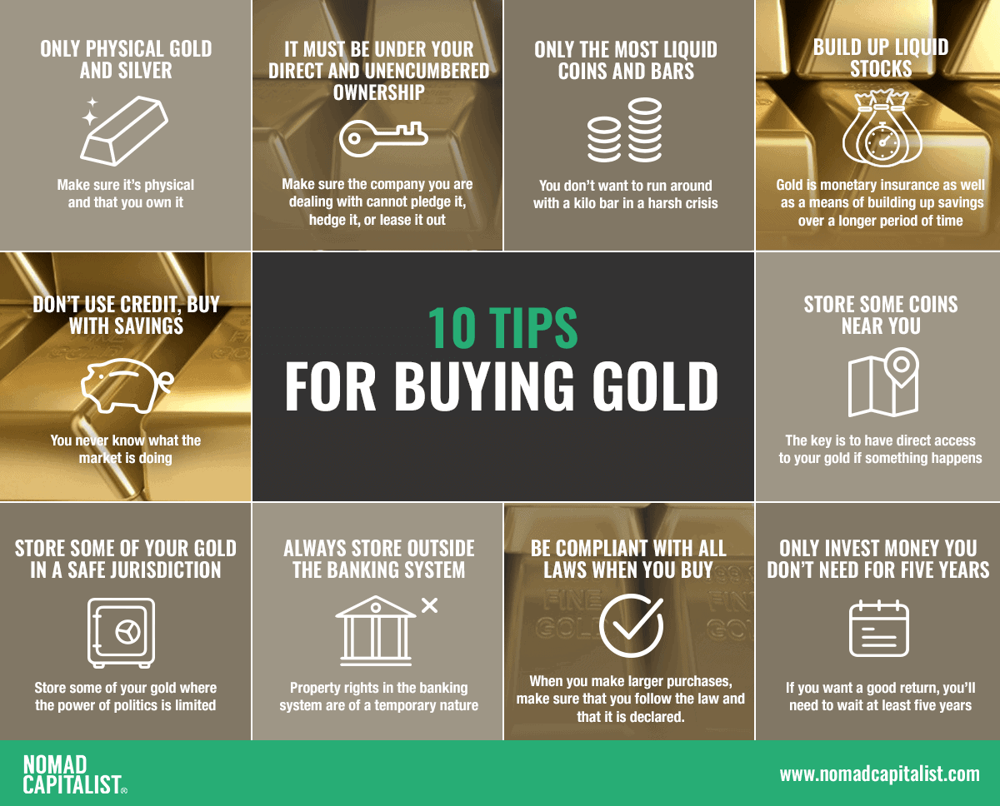

## Table of Contents

## What are the basic reasons someone might want to purchase gold?

People might want to buy gold for a few main reasons. One reason is that gold can be a safe place to put money. When the economy is not doing well, gold often keeps its value better than other things like stocks or money in the bank. This makes it a good choice for people who want to keep their money safe during tough times.

Another reason people buy gold is to protect against inflation. Inflation means that the price of things goes up over time, which can make money worth less. Gold often goes up in price when inflation happens, so it can help keep the value of a person's savings. Some people also like gold because it is something they can hold and see, which can make them feel more secure about their investment.

## What is the difference between buying physical gold and investing in gold-related financial products?

When you buy physical gold, you get actual gold in the form of coins, bars, or jewelry. You can hold it, store it, and even sell it later. The good thing about physical gold is that you own something real that you can see and touch. But, it also means you need a safe place to keep it, like a safe or a bank's safety deposit box. Also, when you want to sell physical gold, you might need to find a buyer, which can take time and might not give you the best price.

Investing in gold-related financial products, like gold ETFs (exchange-traded funds) or gold mining stocks, is different. These are not actual gold, but they are linked to the price of gold. With these products, you don't have to worry about storing gold or finding a buyer when you want to sell. You can buy and sell these products easily through a broker or online trading platform. The downside is that these products can be affected by other things, like the performance of the company that manages the fund or the success of the gold mining company, which can make them riskier than owning physical gold.

## How can someone buy gold from a local dealer?

To buy gold from a local dealer, first, you need to find a reputable dealer in your area. You can search online or ask friends and family for recommendations. Once you find a dealer, visit their store or website to see what types of gold they sell, like coins, bars, or jewelry. It's a good idea to call ahead and ask about their prices and any minimum purchase requirements they might have.

When you go to the dealer, bring enough money to cover the cost of the gold you want to buy. Gold can be expensive, so make sure you know how much you can afford. At the store, you can look at different gold items and choose what you like. The dealer will weigh the gold and tell you the final price. Make sure to check the gold's purity, which is usually marked in karats or as a percentage. After you pay, the dealer will give you a receipt and the gold. Keep the receipt safe, as you might need it if you decide to sell the gold later.

## What are the steps to purchase gold online?

To buy gold online, first find a trusted website that sells gold. You can search for online gold dealers and read reviews to see which ones are good. Once you choose a website, look at the different types of gold they sell, like coins or bars. Decide how much gold you want to buy and make sure you have enough money. Most websites will show you the price and any extra fees, so check those carefully.

After you pick the gold you want, add it to your online shopping cart and go to checkout. You will need to enter your payment information, like a credit card or bank transfer details. Make sure the website is secure before you enter your information. Once you pay, the website will tell you how they will send the gold to you. They might use a special delivery service to make sure it arrives safely. Keep an eye on your email for updates about your order and when it will be delivered.

## What should beginners know about the risks and benefits of buying gold?

When beginners think about buying gold, they should know that it can be a good way to keep their money safe. Gold often keeps its value when other things like stocks or money in the bank go down. This makes it a good choice during tough economic times. Also, gold can help protect against inflation, which is when the price of things goes up and money becomes worth less. If you buy gold, you own something real that you can see and touch, which can make you feel more secure about your investment.

But there are also risks to buying gold. The price of gold can go up and down a lot, so you might lose money if you need to sell it when the price is low. If you buy physical gold, you need a safe place to keep it, and finding a good price when you want to sell can be hard. If you invest in gold-related financial products like ETFs or stocks, they can be affected by other things, like how well the company is doing, which can make them riskier. So, it's important to think about these risks and maybe talk to a financial advisor before you decide to buy gold.

## How do gold ETFs work and how can one invest in them?

Gold ETFs, or Exchange Traded Funds, are a way to invest in gold without actually owning physical gold. These funds are traded on stock exchanges, just like stocks. When you buy shares of a gold [ETF](/wiki/etf-trading-strategies), you're buying into a fund that holds gold or gold-related assets. The value of the ETF goes up and down with the price of gold, so you can make money if the price of gold goes up. But if the price of gold goes down, the value of your ETF shares will go down too.

To invest in a gold ETF, you need to open a brokerage account if you don't already have one. You can do this online with many different companies. Once your account is set up, you can search for the gold ETF you want to buy. There are many different gold ETFs, so you might want to read about them to see which one is best for you. Once you pick an ETF, you can buy shares just like you would buy a stock. You can hold onto the shares as long as you want, and sell them whenever you think it's a good time. Just remember that you'll need to pay some fees to the brokerage company for buying and selling the shares.

## What are gold futures and options, and how are they used in gold purchasing?

Gold futures and options are financial contracts that let people bet on what they think the price of gold will do in the future. A gold future is an agreement to buy or sell gold at a set price on a certain date. If you think the price of gold will go up, you can buy a future and make money if it does. If you think the price will go down, you can sell a future and make money that way. But, if the price goes the other way than you thought, you could lose money. Futures are traded on special markets, and they can be risky because you have to pay a lot if the price moves against you.

Gold options are a bit different. An option gives you the right, but not the obligation, to buy or sell gold at a set price before a certain date. There are two types of options: calls and puts. A call option lets you buy gold at the set price, and a put option lets you sell it. Options can be less risky than futures because you don't have to buy or sell the gold if the price doesn't go your way. You just lose the money you paid for the option. People use options to protect their other investments or to make money if they guess the price of gold correctly. Both futures and options can be complicated, so it's good to learn about them or talk to a financial advisor before you start using them.

## How does one evaluate the purity and authenticity of gold?

To evaluate the purity and authenticity of gold, you can start by checking the markings on the gold item. Most gold items have a stamp that shows the purity, like "24K" for pure gold or "14K" for gold that is 14 parts gold out of 24. If the item doesn't have a stamp, or if you're not sure about the stamp, you might want to take it to a professional jeweler or a gold dealer. They have special tools and knowledge to test the gold and tell you if it's real and how pure it is.

Another way to check gold is by using a magnet. Real gold is not magnetic, so if a magnet sticks to the item, it's not pure gold. You can also do a simple acid test at home, but be careful because it involves chemicals. You put a small drop of gold testing acid on the item, and if the acid changes color, it can tell you about the gold's purity. However, the acid test is not always 100% accurate, so it's best to get a professional opinion if you're not sure.

## What are the tax implications of buying and selling gold?

When you buy gold, you usually don't have to pay any taxes right away. But when you sell gold, you might have to pay taxes on any profit you make. If you hold onto the gold for more than a year before selling it, any profit is considered a long-term capital gain. In the United States, long-term capital gains are taxed at a lower rate than regular income, which can be 0%, 15%, or 20% depending on your income. If you sell the gold within a year of buying it, the profit is a short-term capital gain, and it's taxed as regular income, which can be higher.

There are some exceptions and special rules to know about. For example, if you sell gold coins or bullion that are considered collectibles, the long-term capital gains tax rate can be as high as 28%. Also, if you use gold in your business, like a jeweler, you might be able to deduct the cost of the gold as a business expense. It's a good idea to keep good records of when you buy and sell gold, and how much you paid and received, so you can figure out your taxes correctly. Talking to a tax professional can help you understand all the rules and make sure you're doing everything right.

## How can gold be used as a hedge against inflation?

Gold can be a good way to protect your money when prices of things go up, which is called inflation. When inflation happens, the value of money goes down, so the same amount of money can buy less stuff. But gold often goes up in price during inflation. This means if you have gold, its value can go up when other things like money in the bank lose value. So, by having some of your savings in gold, you can keep more of your money's worth even when prices are rising.

People use gold as a hedge against inflation because it has a history of keeping its value over time. When the cost of living goes up, gold usually follows. This makes it a good choice for people who want to make sure their savings don't lose value. By putting some money into gold, you can balance out the effects of inflation and keep your wealth safer. It's like having a safety net for your money during times when everything else is getting more expensive.

## What advanced strategies can experts use when buying gold in large quantities?

Experts who want to buy gold in large amounts can use different strategies to get the best deals and manage their risks. One way is to buy gold in bulk from wholesalers or directly from mints. This can be cheaper than buying smaller amounts from regular dealers. Experts might also use their knowledge to time their purchases, buying when the price of gold is low and selling when it's high. They might keep an eye on economic news and trends to guess when prices will change. Another strategy is to diversify where they buy gold from, like buying from different countries or dealers, to spread out the risk and maybe get better prices.

Another advanced strategy is to use financial tools like gold futures and options. These let experts bet on the future price of gold without having to store physical gold. By using futures and options, they can protect themselves against big price swings or even make money if they guess the price right. Experts might also use gold ETFs or gold mining stocks to invest in gold without holding the metal itself. This can be easier to manage and sell, but it comes with its own risks because these investments can be affected by more than just the price of gold. By mixing these strategies, experts can make the most of their large gold purchases and handle the risks that come with them.

## How does the global market affect gold prices and purchasing strategies?

The global market plays a big role in deciding the price of gold. When things are not going well in the world, like during a war or a big economic problem, people often want to buy more gold because it's seen as a safe place to keep money. This demand can make the price of gold go up. On the other hand, if the world economy is doing well, people might not feel the need to buy as much gold, and the price can go down. Also, the value of the U.S. dollar can affect gold prices. If the dollar gets weaker, gold usually becomes more expensive, and if the dollar gets stronger, gold can become cheaper.

Because the global market can change gold prices, people who buy gold need to think about these changes when making their plans. If someone thinks a big problem is coming, they might want to buy gold before the price goes up. But if they think the world economy will get better, they might wait to buy gold when the price is lower. People who buy a lot of gold might also look at what's happening in different countries to decide where to buy from. They might buy gold from places where it's cheaper or where they think the price will go up less. By watching the global market, people can make smarter choices about when and where to buy gold.

## References & Further Reading

[1]: Baur, D. G., & McDermott, T. K. (2010). ["Is gold a safe haven? International evidence."](https://www.sciencedirect.com/science/article/pii/S0378426609003343) Journal of Banking & Finance, 34(8), 1886-1898.

[2]: World Gold Council. ["The Relevance of Gold as a Strategic Asset."](https://www.gold.org/goldhub/research/relevance-of-gold-as-a-strategic-asset)

[3]: Chan, E. P. (2008). ["Algorithmic Trading: Winning Strategies and Their Rationale."](https://github.com/ftvision/quant_trading_echan_book) Wiley.

[4]: Fabozzi, F. J., & Focardi, S. M., & Kolm, P. N. (2010). ["Quantitative Equity Investing: Techniques and Strategies."](https://www.semanticscholar.org/paper/Quantitative-Equity-Investing%3A-Techniques-and-Fabozzi-Focardi/1c49a2a53919f7e65cb96f16691b8ff726fd3cd7) Wiley.

[5]: Shapiro, R. J. (2020). ["The economic impact of gold: A report for the World Gold Council."](https://haas.berkeley.edu/wp-content/uploads/WP305.pdf)

[6]: Hull, J. (2018). ["Options, Futures, and Other Derivatives."](https://books.google.com/books/about/Options_Futures_and_Other_Derivatives.html?id=vpIYvgAACAAJ) Pearson.

[7]: Jorion, P. (2007). ["Value at Risk: The New Benchmark for Managing Financial Risk."](https://link.springer.com/article/10.1007/s11408-007-0057-3) McGraw-Hill Education.

[8]: LBMA. ["Good Delivery List."](https://www.lbma.org.uk/good-delivery/gold-current-list) London Bullion Market Association.