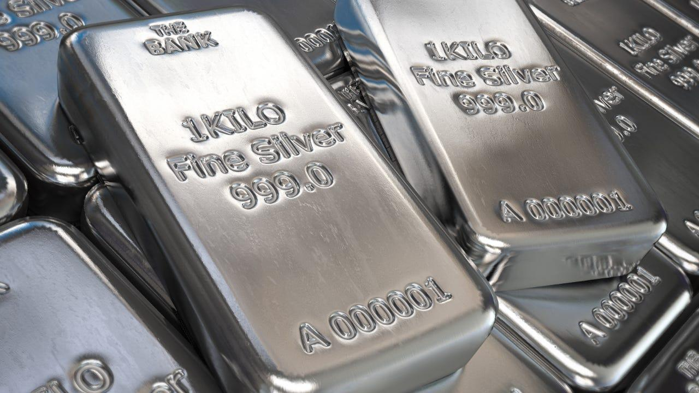

## Table of Contents

## What is silver and why is it valuable?

Silver is a shiny metal that people have used for a long time. It is found in the ground and is often mixed with other metals. Silver is soft and easy to shape, so people can make it into jewelry, coins, and other things. It is also a good conductor of electricity, which means it helps electricity move easily. This makes it useful in things like computers and batteries.

Silver is valuable for a few reasons. First, it is not very common, so there is not a lot of it to go around. When something is rare, people usually want it more, which makes it more valuable. Second, silver has been used as money for thousands of years. Many old coins were made of silver, and even today, some countries still make silver coins. Lastly, because silver is used in so many important things, like electronics and medicine, people always need it, which keeps its value high.

## What are the different forms of silver available for purchase?

Silver comes in many different forms that you can buy. One common form is silver coins. These are made by governments and often have a special design on them. They are usually round and easy to carry. Another form is silver bars. These are bigger pieces of silver that are often used by people who want to save a lot of silver. They come in different sizes, from small ones that weigh just a few ounces to big ones that weigh many pounds.

Silver also comes in the form of jewelry. This includes things like rings, necklaces, and bracelets. Jewelry is not just for wearing; it can also be a way to own silver. Another form is silver rounds, which are similar to coins but are not made by governments. They often have different designs and can be a fun way to collect silver. Lastly, there are silver ingots, which are like bars but can have unique shapes and sizes. Each of these forms has its own use and appeal, depending on what you want to do with your silver.

## How can a beginner start investing in silver?

If you're new to investing in silver, a good way to start is by buying silver coins or bars. You can find these at a local coin shop or online. Silver coins are easy to buy and sell, and they often come in small sizes like one ounce. This makes them a good choice for beginners because you don't have to spend a lot of money at once. Silver bars are another option, and they come in different sizes. If you want to save more silver, you might choose a bigger bar, but remember, bigger bars cost more money.

Another way to invest in silver is through a silver exchange-traded fund ([ETF](/wiki/etf-trading-strategies)). This is like buying a piece of a big pool of silver without actually holding the metal. ETFs are traded on stock markets, so you can buy and sell them easily through a broker. This can be a good choice if you don't want to store physical silver. No matter which way you choose, it's important to do some research first. Learn about the prices, where to buy, and how to keep your silver safe. Starting small and learning as you go can help you become a better investor in silver.

## What are the pros and cons of buying physical silver?

Buying physical silver has some good things about it. One good thing is that you can hold it in your hand and feel safe knowing you own it. Physical silver, like coins or bars, can be a good way to save money because it keeps its value over time. Also, if you buy silver coins, they can be pretty to look at and fun to collect. Another good thing is that physical silver is not affected by what happens in banks or the stock market. This means you can feel more secure because you have something real.

But, there are also some not-so-good things about buying physical silver. One problem is that you need a safe place to keep it. If you don't have a safe or a secure place, your silver could get stolen or lost. Another problem is that buying and selling physical silver can be harder than other types of investments. You might need to go to a special store or find someone who wants to buy it from you. Also, when you buy physical silver, you often have to pay extra for things like shipping and insurance, which can make it more expensive.

## How do silver ETFs work and are they a good investment option?

Silver exchange-traded funds (ETFs) are a way to invest in silver without actually holding the metal. When you buy a silver ETF, you are buying shares in a fund that owns a lot of silver. The price of the ETF goes up and down with the price of silver. You can buy and sell these shares easily through a stockbroker, just like you would with stocks. This makes silver ETFs a convenient option because you don't have to worry about storing or insuring physical silver.

Silver ETFs can be a good investment option for some people. They are easy to buy and sell, which means you can quickly change your mind if you need to. Also, they let you invest in silver without having to spend a lot of money at once, because you can buy just a few shares. But, there are some things to think about. ETFs have fees that you have to pay, and these can add up over time. Also, even though you own shares in silver, you don't have the metal itself, so you might feel less secure than if you had physical silver. It's important to think about these things before deciding if a silver ETF is right for you.

## What should I know about silver futures and options?

Silver futures and options are ways to invest in silver that are a bit more complicated than buying physical silver or ETFs. When you buy a silver future, you are agreeing to buy or sell a certain amount of silver at a set price on a future date. This can be useful if you think the price of silver will go up or down, because you can make money from the difference. But, futures are risky because the price of silver can change a lot, and if it doesn't go the way you thought, you could lose money. Options are similar, but they give you the right, not the obligation, to buy or sell silver at a set price. This means you can choose not to buy or sell if the price isn't good for you, but you still have to pay for the option, which can be expensive.

These kinds of investments are usually for people who know a lot about the market and are willing to take big risks. They can be a good way to make money if you guess right about where the price of silver is going, but they can also lead to big losses if you guess wrong. It's important to understand how futures and options work before you start using them. You might want to talk to a financial advisor to help you decide if they are right for you.

## How can I assess the purity and authenticity of silver?

To check if silver is pure and real, you can use a few simple methods. One way is to use a magnet. Silver is not magnetic, so if a magnet sticks to it, it's not pure silver. Another way is to look at the color. Pure silver is a shiny white color, but if it looks yellow or has a different color, it might be mixed with other metals. You can also use a special test called an acid test. You put a drop of acid on the silver, and if it turns a certain color, it means the silver is pure. 

Another method is to weigh the silver and compare it to what it should weigh. Pure silver has a certain weight, so if it's lighter or heavier, it might not be pure. You can also check for hallmarks, which are small stamps on the silver that show how pure it is. These stamps are usually found on jewelry and silverware. If you're still not sure, you can take the silver to a professional who can use special tools to test it. They can tell you if it's real and how pure it is.

## What are the tax implications of investing in silver?

When you invest in silver, you need to know about taxes. If you buy and sell silver for a profit, you might have to pay capital gains tax. This tax depends on how long you owned the silver. If you owned it for less than a year, it's a short-term capital gain, and you pay tax on it like regular income. If you owned it for more than a year, it's a long-term capital gain, and the tax rate is usually lower. 

Also, if you buy silver as a collectible, like coins or bars, the tax rules can be different. The IRS might treat these as collectibles, and the tax rate on profits can be as high as 28%. But if you use silver in your business, like in jewelry making or electronics, you might be able to deduct the cost of the silver as a business expense. It's a good idea to talk to a tax professional to understand how these rules apply to you and your investments.

## How does the spot price of silver affect purchasing decisions?

The spot price of silver is the current price you would pay to buy silver right now. It changes all the time because it depends on things like how much people want silver and how much there is to buy. When you are thinking about buying silver, the spot price is important because it tells you how much you will have to pay. If the spot price is low, you might want to buy silver because it could be a good deal. But if the spot price is high, you might want to wait and see if it goes down before you buy.

The spot price can also affect what you decide to do with the silver you already own. If the spot price goes up a lot, you might want to sell your silver because you could make a profit. But if the spot price goes down, you might want to keep your silver and wait for the price to go back up. Watching the spot price can help you make smart choices about when to buy or sell silver, but remember, it can be hard to guess what will happen next, so it's good to think carefully before you make a decision.

## What are the best strategies for storing and insuring silver?

When you store silver, you want to keep it safe and secure. A good way to do this is by using a safe or a safe deposit box at a bank. A safe at home can be good if you have a strong one that is hard to break into. A safe deposit box at a bank is even safer because it's in a secure place that is watched all the time. Make sure to keep your silver in a dry place because moisture can make it tarnish. Also, it's a good idea to keep a list of what you have and where it is, so you know what you own and can find it easily.

Insuring your silver is important to protect your investment. You can get insurance from your home insurance company, but you might need to add extra coverage for valuable items like silver. This is called a rider, and it makes sure your silver is covered if something bad happens, like a fire or theft. Another option is to get separate insurance just for your silver. This can be more expensive, but it might give you better protection. Always read the insurance policy carefully to know what is covered and what you have to pay if something happens.

## How can I use silver as a hedge against inflation?

Silver can be a good way to protect your money when prices go up, which is called inflation. When inflation happens, the value of money goes down, but the value of silver often stays the same or goes up. This means if you have silver, it can help keep your money's value safe. For example, if you save money in a bank and inflation makes everything more expensive, your money won't buy as much. But if you have silver, you can sell it for more money because its value goes up with inflation.

To use silver as a hedge against inflation, you can buy physical silver like coins or bars. You can keep them safe in a secure place and sell them when you need money. Another way is to invest in silver ETFs, which are like buying a piece of a big pool of silver without holding it yourself. Both ways can help protect your money from losing value because of inflation. Just remember to keep an eye on the price of silver and think about when to buy or sell to get the most benefit.

## What advanced techniques can expert investors use to maximize returns from silver investments?

Expert investors can use a few advanced techniques to get the most out of their silver investments. One way is by trading silver futures and options. This means they agree to buy or sell silver at a certain price in the future. If they think the price of silver will go up, they can buy a future or an option now and sell it later for a profit. But this is risky because if the price goes down, they could lose money. Another technique is using leverage, which means borrowing money to buy more silver than they could with their own money. This can make their profits bigger if the price goes up, but it also makes their losses bigger if the price goes down.

Another advanced technique is called dollar-cost averaging. This means buying a little bit of silver at regular times, no matter what the price is. Over time, this can help lower the average price they pay for silver. Expert investors might also use technical analysis to try to predict where the price of silver is going. They look at charts and patterns to make smart guesses about when to buy or sell. All these techniques need a lot of knowledge and experience, so it's important for investors to learn a lot and be careful when they use them.

## What are some practical buying tips and strategies?

Investors aiming to maximize their silver investments should maintain an awareness of prevailing market trends and key economic indicators. This vigilance aids in timing purchases more effectively, thereby enhancing potential returns. Silver prices are influenced by a multitude of factors, including inflation rates, currency fluctuation, industrial demand, and geopolitical tensions. Understanding these drivers can help in predicting price movements and making informed purchase decisions.

Diversification is a crucial strategy for mitigating risks and optimizing gains in silver investments. This can be achieved by allocating assets across various forms of silver, such as physical silver (coins and bars), silver ETFs, and silver mining stocks. Each asset type carries distinct risk-reward profiles and [liquidity](/wiki/liquidity-risk-premium) considerations. For example, physical silver provides direct ownership but requires secure storage, while silver ETFs offer ease of transaction and liquidity without the need for physical possession. By spreading investments across multiple types of silver assets, investors can reduce the impact of market [volatility](/wiki/volatility-trading-strategies) on their portfolio.

Utilizing a dollar-cost averaging (DCA) approach can further manage the risks associated with silver's price volatility. DCA involves investing a fixed amount of money at regular intervals, regardless of the asset's current price. This strategy minimizes the risk of investing a large sum at an inopportune time, such as when prices are peaking. Over time, DCA lowers the average cost per unit of the investment, potentially increasing profits during price rallies. The mathematical principle behind DCA can be expressed as:

$$
\text{Average Cost per Unit} = \frac{\sum (\text{Investment Amount})}{\sum (\text{Units Acquired})}
$$

Implementing a DCA strategy requires discipline and patience, as the benefits are realized over the long-term, thereby smoothing out the effects of short-term market fluctuations.

In conclusion, staying informed about market dynamics, diversifying investment types, and employing dollar-cost averaging can significantly strengthen an investor's position in the silver market. These strategies provide a comprehensive approach to navigating the complexities of silver investments, optimizing returns while managing associated risks.

## References & Further Reading

[1]: ["The Silver Institute"](https://silverinstitute.org/) - Industry resource providing comprehensive information on silver applications, market trends, and statistics.

[2]: ["Guide to Investing in Gold and Silver"](https://www.investopedia.com/how-to-invest-in-gold-and-silver-7369625) by Michael Maloney - A comprehensive book on investing in precious metals.

[3]: ["Advances in Financial Machine Learning"](https://www.amazon.com/Advances-Financial-Machine-Learning-Marcos/dp/1119482089) by Marcos Lopez de Prado - Discusses sophisticated data analysis and machine learning techniques relevant to algorithmic trading.

[4]: ["Quantitative Trading: How to Build Your Own Algorithmic Trading Business"](https://www.amazon.com/Quantitative-Trading-Build-Algorithmic-Business/dp/1119800064) by Ernest P. Chan - A practical guide to developing quantitative trading strategies.

[5]: ["Machine Learning for Algorithmic Trading"](https://github.com/stefan-jansen/machine-learning-for-trading) by Stefan Jansen - Explores the application of machine learning to develop algorithmic trading strategies.