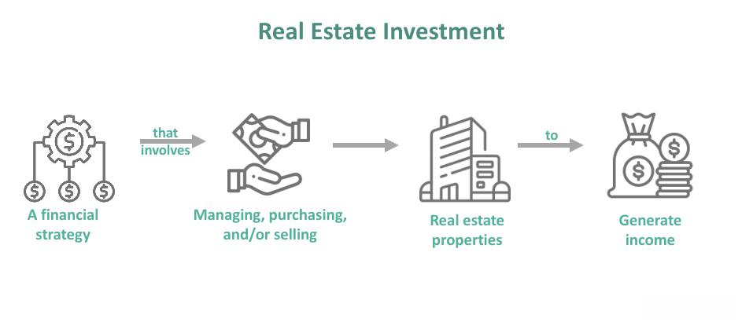

Real estate investment has transformed remarkably over the years due to the adoption of innovative strategies and the rapid pace of technological progress. Among the most significant advancements is the application of algorithmic trading—an approach traditionally used in stock markets—to real estate. This integration has opened new avenues for optimizing investment decisions, harnessing large datasets, and enhancing returns.

Real estate investment is a substantial component of a diversified portfolio, often serving as a hedge against inflation and providing potential for capital appreciation. As stakeholders strive for better financial outcomes, the role of advanced technologies like algorithmic trading becomes increasingly central. Algorithmic trading improves decision-making by leveraging sophisticated algorithms and data analytics. Such approaches facilitate swift execution of trades and enable investors to exploit market inefficiencies more effectively.



In this article, we discuss various real estate investment strategies and highlight how algorithmic trading can be utilized to optimize these processes. By examining this intersection, we provide valuable insights into maximizing returns, whether for seasoned investors or those new to the field. Understanding these concepts can significantly enhance investment outcomes and provide a competitive edge in the modern investment landscape.

## Table of Contents

## Understanding Real Estate Investment

Real estate investment involves acquiring, owning, managing, renting, or selling properties to generate profit. Investors benefit from this type of investment through portfolio diversification, protection against inflation, and potential capital appreciation. The incorporation of real estate assets into an investment portfolio reduces risk by diversifying exposure across different asset classes, balancing out volatility in other market sectors. Moreover, real estate often acts as a hedge against inflation because property values and rental income typically rise with inflation.

Various methods are available for investing in real estate, each carrying its own risk-to-reward profile, catering to different investor objectives and financial capacities:

1. **Rental Properties**: Purchasing residential or commercial properties to lease them out to tenants provides a steady income stream while allowing property owners to benefit from property appreciation over time. Investors must manage these properties actively, dealing with tenant relations, maintenance, and regulatory compliance.

2. **Real Estate Investment Trusts (REITs)**: These are companies that own, operate, or finance real estate that generates income. By investing in REITs, investors can add real estate to their portfolios without dealing with direct property management. REITs allow investors to access diversified real estate holdings with relatively low capital requirements, offering liquidity similar to stocks. However, like any investment in publicly traded entities, they come with market volatility risks.

3. **Real Estate Crowdfunding**: This method allows investors to pool their resources to invest in large real estate projects, thus lowering the barrier to entry for individual investors. It provides access to a variety of property types and locations, along with detailed insights into each investment opportunity. However, crowdfunding platforms can involve high fees, and projects may have less liquidity compared to traditional investments.

To build a successful real estate investment strategy, understanding these methods is crucial. Investors should assess their financial goals, risk tolerances, and management capacities to choose the most suitable investment approach. By comprehensively analyzing each method's potential risks and rewards, investors can better position themselves to achieve their desired investment outcomes.

## What is Algorithmic Trading?

Algorithmic trading involves employing complex algorithms combined with mathematical models to make informed trading decisions. This approach was initially popularized in stock markets, where speed and precision are crucial for gaining competitive advantages. Algorithmic trading has expanded its reach, finding applications across various investment fields, including real estate, due to its potential to revolutionize traditional investment strategies.

At its core, [algorithmic trading](/wiki/algorithmic-trading) utilizes algorithms capable of processing large datasets quickly. This ability to handle extensive volumes of data allows for the swift execution of trades, ultimately optimizing returns on investments. By automating the trading process, investors can eliminate human errors often associated with manual trading. Additionally, automation facilitates the execution of intricate trading strategies that may be impractical to undertake manually.

Investors use algorithmic trading to scrutinize market trends and project future property values. This analytical power aids in identifying favorable investment opportunities that might otherwise go unnoticed. For example, algorithms can track real-time data on property values, interest rates, and market demand to predict price movements accurately. This capability is particularly beneficial in volatile or rapidly changing markets, where timely decisions are paramount.

Moreover, the integration of [machine learning](/wiki/machine-learning) methods in algorithmic trading enhances its efficacy. Machine learning algorithms can adapt and improve over time, learning from historical market data to refine future predictions. This adaptability ensures that trading strategies remain robust even amidst fluctuating market conditions. Consider this basic Python snippet that showcases a simple moving average strategy, often used in algorithmic trading:

```python
import numpy as np

def simple_moving_average(prices, window_size):
    """
    Calculate Simple Moving Average (SMA)

    :param prices: List or array of prices
    :param window_size: Number of periods for the SMA
    :return: Array of SMA values
    """
    sma = np.convolve(prices, np.ones(window_size)/window_size, mode='valid')
    return sma

# Example usage:
prices = [100, 102, 101, 103, 104, 105]
window_size = 3
sma_values = simple_moving_average(prices, window_size)
print(sma_values) 
```

This example demonstrates calculating a simple moving average, a foundational technique for identifying trends and making buy or sell decisions based on crossing averages or trend reversals.

In conclusion, by merging advanced computational methods with financial strategies, algorithmic trading serves as a powerful tool for investors across various sectors. For those involved in real estate investment, understanding and leveraging these algorithmic techniques can provide substantial insights and competitive advantages in optimizing their investment portfolios.

## Integrating Algo Trading in Real Estate Investment

The convergence of real estate investment and algorithmic trading harnesses the power of data analytics and automation to transform traditional investment approaches. Algorithmic trading in real estate entails the deployment of sophisticated algorithms to scrutinize vast datasets, enhancing the accuracy of market trend predictions. This capability is crucial, given the dynamic nature of real estate markets, where trends can shift rapidly due to economic, political, or social factors.

Investors utilizing algorithmic strategies can automate property transactions by setting predefined criteria for purchases and sales. This automation ensures that decisions are made based on data-driven insights rather than emotional biases, thereby optimizing investment returns. For instance, an algorithm can be programmed to execute a purchase when certain market indicators, such as property price indices or rental yields, meet specified thresholds.

Moreover, scenario analysis through algorithmic trading allows investors to simulate various market conditions and outcomes. This predictive modeling capability aids in risk management by evaluating the potential financial impacts of different investment strategies. Investors can test scenarios such as [interest rate](/wiki/interest-rate-trading-strategies) changes or economic downturns to understand how these factors might influence their portfolios.

Successful integration of algorithmic trading in real estate demands a comprehensive understanding of both real estate market dynamics and the technical aspects of algorithm development. Knowledge of real estate markets includes recognizing factors like location desirability, regulatory changes, and housing supply-demand dynamics. On the technical side, proficiency in algorithmic programming, data science, and machine learning is essential to create effective trading models.

To illustrate, consider a Python-based approach for integrating algo trading in real estate:

```python
import pandas as pd
from sklearn.linear_model import LinearRegression

# Load real estate data
data = pd.read_csv('real_estate_data.csv')

# Define predictive features and target
features = data[['location_score', 'economic_index', 'rental_yield']]
target = data['property_value']

# Train a simple linear regression model
model = LinearRegression()
model.fit(features, target)

# Predict future property values
predicted_values = model.predict(features)
data['predicted_value'] = predicted_values

# Automate transactions based on predicted conditions
buy_properties = data[data['predicted_value'] > data['property_value'] * 1.1]  # 10% potential gain
sell_properties = data[data['predicted_value'] < data['property_value'] * 0.9]  # 10% downturn risk

print("Recommended Purchases:\n", buy_properties)
print("Recommended Sales:\n", sell_properties)
```

This code uses linear regression to predict property values based on factors like location score and economic index, allowing investors to make informed buy or sell decisions. Through such integrations, algorithmic trading offers the potential to revolutionize real estate investment, providing a competitive edge in an ever-evolving market landscape.

## Advantages and Risks of Algorithmic Real Estate Investment

Algorithmic trading in real estate investment offers several notable advantages. Primarily, it enhances efficiency by allowing for the rapid analysis of vast troves of real estate data. Automated systems can execute trades with significantly increased speed compared to human counterparts, providing investors with the ability to capitalize on fleeting opportunities. The precision afforded by algorithmic tools surpasses that of traditional methods, minimizing human errors and reducing transaction costs.

A fundamental advantage is the ability to process real-time data, which empowers investors to make informed decisions swiftly. By evaluating live market conditions, investors can react promptly to changes, gaining a competitive edge in volatile markets. Algorithms can constantly parse through data feeds to detect trends or anomalies that could suggest lucrative investment opportunities, executing trades often at optimal moments without delay.

Despite the clear benefits, there are inherent risks associated with algorithmic trading in real estate. One significant risk is the over-reliance on technology. Algorithms, while powerful, are only as good as the data they analyze and the parameters they operate within. Any errors in the data or flawed assumptions in the algorithm's design can lead to significant losses. System failures or technical glitches pose additional threats, especially when real-time trading decisions are subject to such dependability on systems' uptime and reliability.

Furthermore, markets are unpredictable, and algorithms might not always anticipate abrupt economic shifts or unprecedented market conditions. Such market [volatility](/wiki/volatility-trading-strategies) could lead to decisions that a human investor might approach more cautiously. Thus, it's crucial for investors to strike a balance between algorithm-driven insights and traditional due diligence. Human intuition and strategic oversight remain indispensable components of successful investment practices.

To effectively leverage technology while managing its inherent risks, investors must cultivate a deep understanding of both the algorithmic tools and the real estate market. By doing so, they can interpret algorithmic outputs more contextually and make adjustments as needed to align with comprehensive investment strategies. This balance between cutting-edge technology and traditional judgement equips investors to maximize their potential returns while safeguarding against unforeseen risks.

## Steps to Implement Algorithmic Trading in Real Estate

Identifying investment goals and risk tolerance is the foundational step when implementing algorithmic trading in real estate. This clarity ensures that the strategy aligns with personal financial objectives and comfort levels with potential losses. Goals may range from seeking steady rental income to pursuing value appreciation. Once these parameters are established, they guide the entire algorithmic trading strategy.

Selecting the appropriate software or platforms is crucial. Different platforms offer varying capabilities, with some specifically tailored for real estate investments. Factors to consider include the platform’s compatibility with diverse data feeds, integration capabilities with existing systems, and the scalability to handle large datasets. Platforms like QuantConnect or Amibroker can offer a good starting point, providing robust frameworks for algorithmic trading strategies.

The next step involves collecting and analyzing large sets of real estate data, which might include property prices, rental rates, vacancy rates, and macroeconomic indicators. Utilizing tools like Python libraries (e.g., pandas, NumPy, scikit-learn) can assist in handling and preprocessing these datasets. Data sources can include real estate websites, public databases, or purchasing data feeds from specialized providers. An important aspect of this phase is data cleaning and normalization to ensure accuracy and consistency.

Engaging with technology experts is often necessary to develop customized algorithms that align with your investment strategies. These experts can design algorithms capable of processing large datasets and performing complex analyses to inform trading decisions. For instance, machine learning models can predict market trends based on historical data. Algorithms might involve regression models, decision trees, or neural networks to identify profitable trading opportunities.

Continuous monitoring and adjustment of algorithms are critical for maintaining their efficacy. Real estate market dynamics can shift rapidly due to economic changes, policy shifts, or unexpected events. Therefore, algorithms require periodic tuning to remain relevant. This might involve re-training models with new data, adjusting parameters, or altering the strategy based on recent performance. Implementing a feedback loop to evaluate algorithm performance using [backtesting](/wiki/backtesting) methods ensures that the applied models remain aligned with market realities.

By following these steps, investors can effectively harness the power of algorithmic trading in the real estate sector, optimizing their investment strategies for improved outcomes.

## Conclusion

The fusion of real estate investment and algorithmic trading represents a pivotal advancement for discerning investors. This synergy allows for the employment of sophisticated technologies to refine investment strategies, thereby enhancing decision-making processes and bolstering returns. Algorithmic trading methods facilitate the analysis of large datasets to uncover market trends and identify lucrative investment opportunities with greater accuracy than traditional methods.

To stand out in today's competitive marketplace, it's essential for investors to grasp and implement these advanced techniques. The integration of technology in real estate investment not only streamlines operations but also furnishes investors with a competitive edge. By automating processes and utilizing predictive analytics, investors can reduce human error, manage risk more effectively, and react swiftly to market changes. 

However, as technologies continue to advance, remaining informed and flexible is vital for achieving and sustaining growth. This necessitates a commitment to continuous learning and adaptation to leverage technological innovations effectively. By doing so, investors can unlock the full potential of algorithmic real estate investment, ensuring a dynamic and prosperous future characterized by significant returns on investment. The incorporation of these innovative strategies makes the field of real estate investment not only promising but also dynamic, signaling a new era of investment opportunities.

## References & Further Reading

[1]: Bergstra, J., Bardenet, R., Bengio, Y., & Kégl, B. (2011). ["Algorithms for Hyper-Parameter Optimization."](https://papers.nips.cc/paper/4443-algorithms-for-hyper-parameter-optimization) Advances in Neural Information Processing Systems 24.

[2]: ["Advances in Financial Machine Learning"](https://www.amazon.com/Advances-Financial-Machine-Learning-Marcos/dp/1119482089) by Marcos Lopez de Prado

[3]: ["Evidence-Based Technical Analysis: Applying the Scientific Method and Statistical Inference to Trading Signals"](https://www.amazon.com/Evidence-Based-Technical-Analysis-Scientific-Statistical/dp/0470008741) by David Aronson

[4]: ["Machine Learning for Algorithmic Trading"](https://github.com/PacktPublishing/Machine-Learning-for-Algorithmic-Trading-Second-Edition) by Stefan Jansen

[5]: ["Quantitative Trading: How to Build Your Own Algorithmic Trading Business"](https://books.google.com/books/about/Quantitative_Trading.html?id=j70yEAAAQBAJ) by Ernest P. Chan