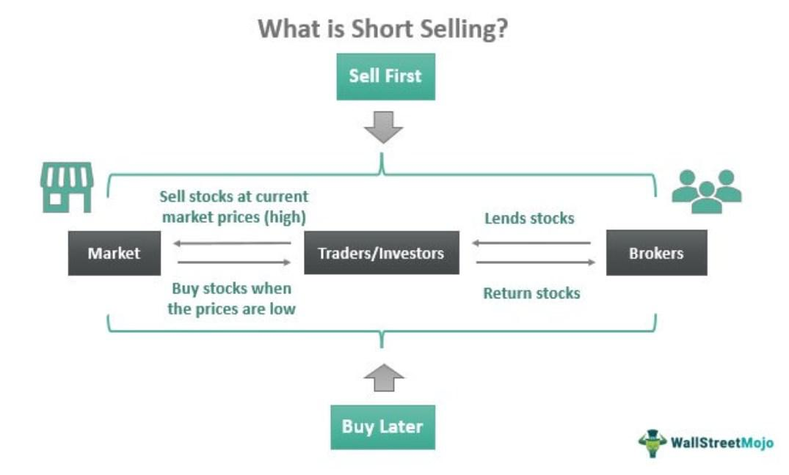

Global investment strategies have evolved significantly, reflecting the complexities and opportunities within modern financial markets. The integration of diverse financial instruments and innovative technologies has led to efficient portfolio management and greater return potentials. Among these strategies, short selling stands out as a robust tool employed by investors aiming to profit from declining asset prices. By selling borrowed securities with the intention of buying them back at lower prices, investors can generate returns even in bearish markets. This strategy, while potentially lucrative, involves significant risks, such as unlimited losses if prices rise instead of falling.

China has emerged as a dominant force in global financial markets. Its rapid economic growth, coupled with liberalization of financial policies, has opened the door for foreign investment and financial innovation. China's stock exchanges, notably the Shanghai and Shenzhen Stock Exchanges, are now among the largest in the world, providing vast opportunities for investors. The Chinese government's openness to integrating with global markets further enhances its significance as a player on the world stage.



The rise of algorithmic trading has reshaped investment portfolios across the globe. By leveraging advanced algorithms and data analytics, investors can execute trades at optimal times and prices, reducing human error and maximizing efficiency. Algorithmic trading involves using models and formulas to make decisions about buying or selling stocks. This technological advancement is crucial for managing large volumes of data and executing complex trading strategies, such as short selling, at speeds unattainable by humans. The sophistication of algorithmic trading continues to grow, incorporating elements of artificial intelligence and machine learning to predict market movements and adapt to changing conditions.

The objective of this article is to explore how short selling can be effectively integrated with algorithmic trading within China's burgeoning financial markets. By examining the interplay between these elements, we aim to uncover potential opportunities and challenges, thereby offering insights into optimizing investment strategies in this dynamic environment. This exploration underscores the necessity for investors to stay informed and adaptable, capitalizing on the synergy between traditional and modern financial practices.

## Table of Contents

## Understanding Short Selling

Short selling is an investment strategy where an investor borrows a security and sells it on the open market, planning to buy it back later at a lower price. The primary objective is to profit from a decline in the security's price. The process involves borrowing shares from a brokerage firm and selling them in the market. Later, the investor purchases the shares back at the reduced price and returns them to the lender, pocketing the difference as profit. If the price ends up higher than the selling price, however, the investor will incur losses.

Historically, short selling has been a contentious yet pivotal element of financial markets. The concept dates back several centuries, with its roots traceable to the early 17th century. In 1609, Dutch merchant Isaac Le Maire became one of the first recorded short sellers, betting against the Dutch East India Company. Over time, short selling has evolved, with regulations increasingly established to balance market stability and fair trading practices.

The benefits of short selling include the potential for high profits, especially in bearish markets where securities see sharp declines. It also adds [liquidity](/wiki/liquidity-risk-premium) to markets and helps in the price discovery process. However, short selling is fraught with risks. Unlike traditional investing where losses are limited to the invested capital, short selling carries the risk of unlimited losses since, theoretically, a security’s price can rise indefinitely. This strategy also involves other risks like margin calls, where the investor might be required to provide additional capital if the market moves against their position.

Numerous successful short selling strategies have left their mark in financial history. One significant example is the bet made by George Soros against the British pound in 1992, known as Black Wednesday. Soros predicted that the pound was overvalued and, by shorting it, made a profit estimated at $1 billion. Similarly, during the 2008 financial crisis, John Paulson's [hedge fund](/wiki/hedge-fund-trading-strategies) made a fortune by short selling subprime mortgage-backed securities, anticipating the collapse of the housing market.

Formulaically, the profit from short selling can be expressed as: 
$$
\text{Profit} = P_{\text{sell}} \times Q - P_{\text{buy}} \times Q - \text{Interest}
$$
where $P_{\text{sell}}$ is the selling price, $P_{\text{buy}}$ is the buying price, $Q$ is the number of shares, and Interest accounts for borrowing costs.

Here is a simple Python example to calculate profit from short selling:

```python
def short_selling_profit(sell_price, buy_price, quantity, interest):
    return (sell_price - buy_price) * quantity - interest

# Example
sell_price = 100  # Price at which security is sold
buy_price = 90    # Price at which security is bought back
quantity = 1000   # Number of shares
interest = 500    # Borrowing costs

profit = short_selling_profit(sell_price, buy_price, quantity, interest)
print("Profit from short selling:", profit)
```

Understanding short selling requires comprehending both its lucrative potential and inherent risks. Its historical significance and high-profile strategies affirm its role as a robust instrument for seasoned investors, especially in markets displaying clear downturn trends.

## China's Financial Markets and Short Selling

China's financial markets have experienced rapid development over the past few decades, transitioning from a closed and state-controlled system to one that is increasingly open and integrated with global financial markets. This transformation has been marked by the establishment of major stock exchanges, such as the Shanghai Stock Exchange, Shenzhen Stock Exchange, and the Hong Kong Stock Exchange, which collectively serve as critical hubs for securities trading, listing some of the world's largest companies. The Chinese bond market has also grown substantially, offering a diverse range of government and corporate bonds.

Investment opportunities within China are vast, driven by the country's massive economic scale, burgeoning middle class, and rapid technological advancements. Industries such as technology, healthcare, and consumer goods present high growth potential. However, investing in China comes with challenges, including transparency issues, unique market dynamics, and geopolitical risks. Investors must navigate a regulatory landscape that can be unpredictable, as government policies can significantly impact market performance.

Short selling in China's markets has been subject to strict regulations, primarily aimed at maintaining market stability. Initially, short selling was not permitted within mainland China's stock exchanges. However, reforms introduced the practice in a controlled manner, allowing institutional investors to engage in short selling under specific conditions. The securities lending facilities established by the China Securities Regulatory Commission (CSRC) facilitate this process, but access is usually limited to qualified foreign institutional investors (QFIIs) and local brokers with robust risk management frameworks.

Despite regulatory constraints, short selling can be an effective tool for enhancing market efficiency and providing liquidity. High-profile short selling cases in China illustrate this potential. A notable example occurred in 2015 when Muddy Waters Research shorted Luckin Coffee, exposing fraudulent activities. This move led to significant market corrections and showcased short selling’s role in uncovering corporate malfeasance. Similarly, the case of Sino-Forest Corporation in 2011 demonstrated how foreign short sellers could impact Chinese companies listed abroad, highlighting cross-border implications.

Nevertheless, the Chinese regulatory environment remains cautious, often adjusting rules to prevent excessive market speculation and [volatility](/wiki/volatility-trading-strategies). Adjustments in margin financing and refinancing regulations, as well as the temporary suspension of short selling during periods of market turmoil, reflect this cautious stance. As China's financial markets continue to mature, the balance between enabling market practices like short selling and ensuring stability will be crucial in shaping future investment dynamics.

## Algorithmic Trading: The Modern Approach

Algorithmic trading refers to the utilization of computer algorithms to automate trading decisions and processes in financial markets. These algorithms are designed to assess market data, execute trades, and manage portfolios with minimal human intervention. The practice of [algorithmic trading](/wiki/algorithmic-trading) has grown exponentially as technological advancements and data accessibility have increased, enabling more sophisticated and efficient trading strategies.

At its core, algorithmic trading depends on a set of rules and models that dictate when, how, and why trades are made. These models are built on historical data, statistical analysis, and market behavior theories. By leveraging vast amounts of data and executing trades at high speed, algorithmic trading can identify and capitalize on market inefficiencies that may be imperceptible to human traders.

The impact of technology and data analytics on trading strategies has been transformative. With the rise of big data, [machine learning](/wiki/machine-learning), and high-frequency trading platforms, traders can now analyze market trends in real-time and execute trades with incredible speed and precision. Data analytics allows traders to back-test strategies using historical data, optimize algorithms for changing market conditions, and improve decision-making processes. The ability to process large volumes of data quickly provides a competitive edge in the financial markets, enabling the discovery of patterns and signals that inform trading strategies.

One of the significant advantages of using algorithms in executing short selling strategies is the ability to react swiftly to market movements. Algorithms can execute trades within milliseconds, a speed unmatched by human traders, enabling the capture of transient opportunities in market pricing. This rapid execution is particularly advantageous in short selling, where timing is crucial to capitalize on declining asset prices.

Some key algorithms popular in today's trading landscape include trend-following algorithms, statistical [arbitrage](/wiki/arbitrage) algorithms, and mean-reversion algorithms. Trend-following algorithms are designed to identify and exploit trends in market prices, buying assets that show an upward trend and selling those on a downward trajectory. Statistical arbitrage algorithms involve simultaneous buying and selling of correlated securities to profit from pricing inefficiencies. Mean-reversion algorithms are based on the assumption that prices will revert to their historical mean over time, and they seek to profit from deviations from this mean.

A simplified representation of a mean-reversion trading strategy can be illustrated with Python code:

```python
import numpy as np
import pandas as pd

# Example data: historical price series
prices = pd.Series([105, 103, 98, 95, 97, 100, 102, 101, 98, 96])

# Calculate the rolling mean
rolling_mean = prices.rolling(window=3).mean()

# Identify buying and selling signals
buy_signals = np.where(prices < rolling_mean)[0]
sell_signals = np.where(prices > rolling_mean)[0]

# Print the signals
print("Buy Signals:", buy_signals)
print("Sell Signals:", sell_signals)
```

This code calculates a simple moving average to find buy signals where the price is below the average and sell signals where the price is above the average. While simplistic, this example highlights how algorithms can process data to inform trading actions.

Algorithmic trading has undeniably reshaped modern financial markets. Its integration into investment strategies such as short selling offers considerable advantages, primarily the ability to process and react to market information faster and more effectively than traditional methods. As technology and data analytics continue to evolve, so too will the algorithms that drive these transformative trading strategies.

## Integrating Short Selling with Algorithmic Trading in China

Integrating short selling with algorithmic trading in the Chinese market involves a strategic blend of financial acumen and technological innovation. As China's financial markets continue to mature, there emerges a robust opportunity for leveraging algorithmic trading to execute short selling strategies effectively.

Strategies for combining short selling and algorithmic trading in this context focus on identifying market inefficiencies and capitalizing on information asymmetry. For instance, one prevalent approach is the development of sophisticated algorithms that can analyze vast datasets to predict stock price movements. These algorithms utilize machine learning techniques to assess historical price trends, macroeconomic indicators, and market sentiment captured through news analytics. By doing so, they can identify overvalued stocks, enabling investors to sell short with a degree of statistical confidence.

The technological infrastructure for effective algorithmic trading in China requires a confluence of high-performance computing systems, low-latency data feeds, and robust trading platforms. High-frequency trading ([HFT](/wiki/high-frequency-trading-strategies)) systems, characterized by their ability to process thousands of transactions per second, play a critical role. Additionally, access to comprehensive financial data, both structured and unstructured, is essential to refine algorithms continually. Cloud computing services offer scalable solutions for data storage and processing, while advancements in GPU (Graphics Processing Unit) technology enhance the speed of algorithmic computations.

Executing short selling strategies through algorithmic trading in China involves navigating specific risks and considerations. One principal challenge is the regulatory environment; China's financial regulations are evolving, and compliance with these rules is paramount. Investors must stay informed about any restrictions on short selling and adhere to margin requirements established by regulatory bodies such as the China Securities Regulatory Commission (CSRC).

Market volatility represents another significant risk, potentially leading to increased transaction costs and unexpected losses. Algorithmic strategies must incorporate risk management protocols, such as stop-loss orders and hedging techniques, to mitigate these effects. Furthermore, the reliance on data accuracy and system reliability necessitates robust cybersecurity measures to protect against data breaches and system failures.

Several real-world examples highlight the successful integration of short selling and algorithmic trading in China. Hedge funds and proprietary trading firms have developed and deployed algorithms specifically tailored to the unique characteristics of Chinese markets. For instance, some traders use sentiment analysis algorithms that parse social media and news articles to gauge public sentiment towards listed companies and make informed short selling decisions. Others have created specialized arbitrage algorithms that exploit pricing discrepancies between the Shanghai and Shenzhen stock exchanges.

In conclusion, the synergy between short selling and algorithmic trading in China is promising but requires meticulous planning and execution. By utilizing advanced technology and maintaining vigilance over regulatory and market conditions, investors can harness these strategies to achieve significant returns in China's dynamic financial markets.

## Challenges and Risks

Executing short selling strategies in China presents unique challenges that stem from regulatory, market volatility, and risk management issues. Understanding these complexities is essential for investors aiming to leverage short selling effectively within Chinese markets.

Regulatory hurdles and compliance issues in China are considerable. The Chinese regulatory environment is characterized by stringent controls and periodic updates, designed to maintain stability and prevent excessive market speculation. Short selling, traditionally viewed with skepticism, has been subject to tight regulations, including restrictions on which stocks can be shorted and the need for regulatory approval. For instance, the China Securities Regulatory Commission (CSRC) periodically revises short selling rules, affecting which firms can participate and which instruments are eligible. Adhering to these regulatory frameworks requires investors to stay informed about frequent changes and ensure compliance, particularly as the Chinese government continues to assert significant control over financial markets.

Market volatility is another critical [factor](/wiki/factor-investing) impacting short selling and algorithmic trading strategies in China. The Chinese stock market is notorious for its periodic price swings, driven by rapid changes in investor sentiment, economic policy shifts, and external economic pressures. Such volatility can amplify the risks associated with short selling, where market behavior contrary to expectations can lead to significant losses. Algorithms designed for trading must account for such volatility to avoid undue risk, necessitating sophisticated models capable of adjusting to abrupt market shifts.

To mitigate these risks, investors can adopt several strategies. One approach involves utilizing advanced algorithmic systems equipped with real-time data analytics to monitor market conditions and execute trades swiftly. These systems can be programmed to recognize patterns indicative of volatility, enabling traders to take preemptive actions. Risk management also involves diversification of portfolios, spreading investments across various sectors and geographies to buffer against localized volatility. Additionally, maintaining a conservative leverage ratio ensures that exposure remains manageable even in tumultuous market conditions.

Moreover, continuous research and an adaptive mindset are vital when navigating the intricacies of China's financial markets. Staying updated with regulatory adjustments, technological advancements, and market trends allows investors to adjust their strategies accordingly. Collaborations with local financial entities can also provide valuable insights and facilitate compliance with Chinese market norms.

In conclusion, while short selling in China comes with substantial challenges, a strategic approach that prioritizes regulatory compliance, volatility management, and adaptive risk mitigation can improve the prospects of success. Investors need to maintain a vigilant and flexible stance to navigate the complexities of the Chinese financial landscape effectively.

## Future Outlook for Investment Strategies in China

China's financial markets are poised for significant evolution as they continue to open up to global investors and integrate advanced technological developments. With reforms aimed at liberalizing capital markets and enhancing regulatory frameworks, China's financial infrastructure is becoming more robust, offering numerous opportunities for both domestic and international investors.

Emerging trends in short selling and algorithmic trading are reshaping the financial landscape not just globally, but also within China. Traditionally, short selling in China was tightly controlled due to regulatory concerns over market stability. However, there is a gradual relaxation of these restrictions, allowing for more dynamic trading strategies. This shift presents a substantial opportunity for leveraging short selling in a way that was not previously possible within Chinese markets.

Algorithmic trading, which utilizes complex mathematical models and high-speed computing to execute trades, is gaining [momentum](/wiki/momentum) in China. The increasing availability of high-frequency trading capabilities and improved access to market data are facilitating the rise of algorithmic trading. This trend underscores a significant shift towards more automated and efficient trading practices, potentially leading to increased market liquidity and reduced transaction costs.

Innovation in trading strategies is being driven by the incorporation of [artificial intelligence](/wiki/ai-artificial-intelligence) (AI) and big data analytics. These technologies offer unprecedented capabilities in analyzing vast datasets to identify trading patterns and predict market movements. For example, machine learning models can be applied to historical price data to uncover trends that inform short selling and algorithmic strategies. The potential use of AI in financial modeling could significantly enhance predictive accuracy and operational efficiency.

Python, as a programming language, provides various libraries such as `numpy`, `pandas`, and `scikit-learn` that are instrumental for implementing machine learning in trading strategies. A simple linear regression model can be constructed to predict future prices based on historical data, showcasing the power of AI in trading:

```python
import numpy as np
import pandas as pd
from sklearn.model_selection import train_test_split
from sklearn.linear_model import LinearRegression

# Simulated historical price data
data = pd.DataFrame({
    'Price': np.random.randn(100) * 20 + 100
})

# Feature and target variable
X = data.index.values.reshape(-1, 1)
y = data['Price'].values

# Train-test split
X_train, X_test, y_train, y_test = train_test_split(X, y, test_size=0.2, random_state=42)

# Linear regression model
model = LinearRegression()
model.fit(X_train, y_train)

# Prediction
predicted_prices = model.predict(X_test)
```

Staying adaptable and informed is crucial for investors navigating these dynamic markets. Continuous regulatory updates, advancements in technology, and shifts in market sentiment require investors to maintain a proactive approach. Keeping abreast of these developments will ensure that investment strategies remain relevant and effective.

In conclusion, the future of investment strategies in China appears promising, with ongoing market reforms, technological integration, and a growing acceptance of innovative trading techniques. Investors who can adeptly navigate these changes, leveraging AI and big data, are likely to reap substantial rewards. Staying informed and adaptable will be essential for success amidst these evolving market conditions.

## Conclusion

In conclusion, the integration of short selling, algorithmic trading, and China's financial markets presents a distinctive set of opportunities and challenges for contemporary investors. Short selling has demonstrated its efficacy as a strategic tool under appropriate market conditions, offering potential profits from declining asset prices. China's burgeoning financial landscape provides a fertile ground for employing such strategies, especially given its rapid economic growth and increasing market sophistication. Algorithmic trading, driven by technological advancements and data analytics, enhances the precision and efficiency of executing investment strategies, including short selling, thereby maximizing returns and minimizing risks.

The potential of these methodologies lies in their ability to be combined synergistically. Algorithmic models allow investors to navigate the complexities of China's regulatory environment and market dynamics with agility and precision. The blend of these elements holds promise for lucrative outcomes, provided that investors remain cognizant of the inherent risks and regulatory stipulations unique to China. As market volatility is an ever-present challenge, the ability to swiftly adapt and respond through algorithmic means becomes a competitive advantage.

Investors are encouraged to rigorously explore these opportunities, approaching them with informed caution and strategic foresight. The importance of due diligence cannot be understated, as a comprehensive understanding of market regulations, economic indicators, and technological capabilities is essential for success. Continued research and staying abreast of market developments will be crucial for capitalizing on emerging trends and sustaining competitive advantage. Engaging with these innovative strategies will not only enrich portfolio performance but also prepare investors for the evolving landscape of global finance.

## References & Further Reading

[1]: Tang, F. & Zhu, Z. (2012). ["Short Selling in China"](https://www.sciencedirect.com/science/article/pii/S1059056023001429). Social Science Research Network.

[2]: Meng, L. & Chen, Z. (2011). ["Short Selling: The Good, The Bad, and The Ugly."](https://link.springer.com/article/10.1007/s11766-024-3790-8) Journal of Financial Economic Policy.

[3]: Cao, Y., Li, Y., & Zhu, H. (2019). ["Algorithmic Trading in China’s Stock Market"](https://scholar.google.com/citations?user=IzgBiHYAAAAJ) Economic Systems Journal.

[4]: Chan, E. P. (2013). ["Algorithmic Trading: Winning Strategies and Their Rationale"](https://github.com/ftvision/quant_trading_echan_book) John Wiley & Sons.

[5]: Lo, A.W. (2016). ["Adaptive Markets: Financial Evolution at the Speed of Thought"](https://www.jstor.org/stable/j.ctvc77k3n) Princeton University Press.