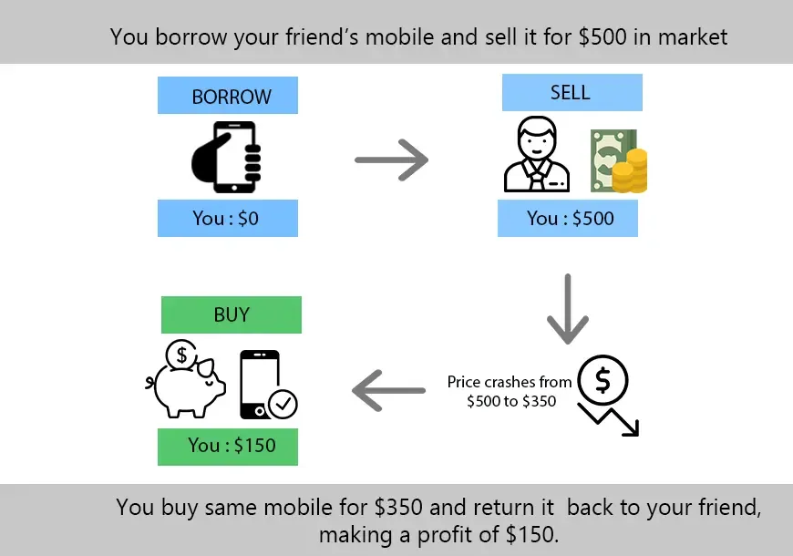

## Table of Contents

## What does it mean to short Ether?

To short Ether means to bet that the price of Ether, which is a type of cryptocurrency, will go down. When you short Ether, you borrow Ether from someone else and then sell it at the current market price. Later, if the price of Ether goes down as you expected, you buy it back at the lower price and return the borrowed Ether to the person you borrowed it from. The difference between the price you sold it at and the price you bought it back at is your profit.

However, shorting Ether can be risky. If the price of Ether goes up instead of down, you will lose money. You will have to buy back the Ether at a higher price to return it, and the difference between the price you sold it at and the higher price you bought it back at will be your loss. This loss can be much larger than the amount you initially invested, which is why shorting is considered a high-risk strategy.

## Why would someone want to short Ether?

Someone might want to short Ether if they think its price will go down soon. They could have seen news or heard rumors that might make Ether's price drop. Or maybe they studied the market and think Ether is overvalued right now. By shorting Ether, they can make money if their guess is right and the price does go down.

But shorting Ether is risky. If the price goes up instead, the person who shorted it will lose money. They might lose more money than they put in at the start. So, people usually short Ether only if they are pretty sure the price will go down, and they are okay with the risk of losing a lot if they are wrong.

## What are the basic risks involved in shorting Ether?

Shorting Ether can be risky because if the price of Ether goes up instead of down, you will lose money. When you short Ether, you borrow it and sell it at the current price. If the price goes up, you have to buy it back at a higher price to give it back to the person you borrowed it from. The difference between the price you sold it at and the higher price you bought it back at is how much money you lose. This loss can be a lot more than the money you started with, which makes shorting Ether very risky.

Another risk is that there might not be enough Ether to borrow when you want to short it. If a lot of people are trying to short Ether at the same time, it can be hard to find someone to lend it to you. This can make it difficult to start your short position. Also, if the price of Ether goes up a lot very quickly, you might get a "margin call," which means you have to put in more money to keep your short position open. If you can't add more money, you might have to close your position at a loss.

## What is the simplest method to short Ether for beginners?

The simplest way for beginners to short Ether is by using a trading platform that offers margin trading. You can sign up for an account on a platform like Binance or Coinbase, which allows you to borrow Ether and sell it right away. After you sell the borrowed Ether, you wait for the price to drop. Once it does, you buy back the same amount of Ether at the lower price and return it to the platform. The difference between the price you sold it at and the price you bought it back at is your profit.

However, shorting Ether can be risky. If the price of Ether goes up instead of down, you will lose money. You'll have to buy back the Ether at a higher price to return it, and the difference between the price you sold it at and the higher price you bought it back at will be your loss. This loss can be a lot more than the money you started with, so it's important to be careful and only short Ether if you're okay with the risk of losing money.

## How can you short Ether using futures contracts?

To short Ether using futures contracts, you can sign up for a platform that offers Ether futures, like Binance or Bybit. On these platforms, you can buy a futures contract that lets you agree to sell Ether at a certain price on a certain date in the future. If you think the price of Ether will go down, you can buy a futures contract to sell Ether at today's price. If the price does go down by the date on the contract, you can buy Ether at the lower price and then sell it at the price you agreed on in the futures contract. The difference between the price you agreed to sell at and the lower price you bought at is your profit.

Shorting Ether with futures contracts can be risky, though. If the price of Ether goes up instead of down, you will lose money. You'll have to buy Ether at the higher price to sell it at the price you agreed on in the futures contract. The difference between the price you agreed to sell at and the higher price you bought at will be your loss. This loss can be a lot more than the money you started with, so it's important to be careful and only short Ether if you're okay with the risk of losing money.

## What are the key differences between shorting Ether via CFDs and futures?

Shorting Ether via Contracts for Difference (CFDs) and futures both let you bet that the price of Ether will go down, but they work a bit differently. With CFDs, you agree to exchange the difference in the price of Ether between when you open and close your position. You don't actually buy or sell Ether; you just get money if the price goes down or lose money if it goes up. CFDs can be easier to use because they often don't have an expiration date, so you can keep your position open as long as you want.

Futures contracts, on the other hand, have a set expiration date. When you short Ether with futures, you agree to sell Ether at a certain price on a specific date in the future. If the price of Ether goes down by that date, you buy it at the lower price and sell it at the price you agreed on in the contract, making a profit. Futures can be more complex because you have to think about the timing of when the price might go down, and you need to close your position by the expiration date or roll it over into a new contract.

Both methods have risks. If the price of Ether goes up instead of down, you'll lose money with either CFDs or futures. The loss can be a lot more than what you started with, so it's important to understand these risks and be careful when shorting Ether.

## How does margin trading on crypto exchanges work for shorting Ether?

Margin trading on crypto exchanges lets you borrow money from the exchange to short Ether. When you want to short Ether, you borrow Ether from the exchange and then sell it at the current price. If the price of Ether goes down like you expect, you buy it back at the lower price and return it to the exchange. The difference between the price you sold it at and the price you bought it back at is your profit. But if the price goes up, you lose money because you have to buy it back at a higher price to return it.

Margin trading can be risky. If the price of Ether goes up a lot, you might get a "margin call." This means you need to add more money to your account to keep your position open. If you can't add more money, the exchange might close your position, and you could lose more money than you started with. So, it's important to understand the risks and only short Ether if you're okay with losing money.

## What are the regulatory considerations when shorting Ether?

When you short Ether, you need to think about the rules that govern [cryptocurrency](/wiki/cryptocurrency) trading. Different countries have different rules about what you can do with cryptocurrencies. Some places might not let you short Ether at all, or they might have special rules you need to follow. It's important to check the rules in your country before you start shorting Ether so you don't break any laws.

Also, the exchanges where you trade Ether have their own rules. They might ask you to fill out forms or give them information about yourself before you can start shorting Ether. They might also have rules about how much money you need to have in your account to keep your position open. Make sure you understand the exchange's rules so you can trade safely and legally.

## How can options be used to short Ether, and what are the associated strategies?

Options can be used to short Ether by buying a "put option." A put option gives you the right, but not the obligation, to sell Ether at a certain price, called the strike price, before a certain date. If you think the price of Ether will go down, you can buy a put option. If the price does go down below the strike price, you can buy Ether at the lower market price and then sell it at the higher strike price, making a profit. If the price doesn't go down, you only lose the money you paid for the option.

There are a few strategies you can use with options to short Ether. One common strategy is called a "naked put." With a naked put, you sell a put option instead of buying one. If the price of Ether stays above the strike price, you keep the money you got from selling the option. But if the price goes down below the strike price, you have to buy Ether at the lower market price and sell it at the higher strike price, which can lead to a loss. Another strategy is a "bear put spread," where you buy one put option and sell another put option with a lower strike price. This can limit your potential profit but also limits your risk if the price of Ether doesn't go down as expected.

## What advanced techniques exist for shorting Ether, such as using decentralized finance (DeFi) platforms?

Advanced techniques for shorting Ether can be found on decentralized finance (DeFi) platforms. One way to do this is by using lending and borrowing protocols. You can borrow Ether from a DeFi platform, sell it at the current market price, and then wait for the price to drop. Once it does, you buy back the same amount of Ether at the lower price and return it to the platform. The difference between the price you sold it at and the price you bought it back at is your profit. This method can be more flexible than traditional exchanges because DeFi platforms often let you borrow Ether without needing to go through a lot of checks.

Another advanced technique is using DeFi options protocols. These platforms let you buy put options on Ether, which gives you the right to sell Ether at a certain price before a certain date. If you think the price of Ether will go down, you can buy a put option. If the price does go down, you can buy Ether at the lower market price and then sell it at the higher strike price, making a profit. If the price doesn't go down, you only lose the money you paid for the option. DeFi options can be more accessible than traditional options because they don't always require you to go through a centralized exchange.

## How do you manage and mitigate risks when shorting Ether at an expert level?

When shorting Ether at an expert level, one key way to manage and mitigate risks is by setting strict stop-loss orders. A stop-loss order is like a safety net that automatically closes your position if the price of Ether goes up to a certain level you set. This helps limit how much money you can lose if the price goes against you. Another way is to keep a close eye on the market and news. If something big happens that might make the price of Ether go up, you can close your position quickly to avoid losing too much money. It's also smart to not put all your money into one short position. By spreading your money across different investments, you can lower the risk of losing everything if one bet goes wrong.

Another important strategy is to use leverage carefully. Leverage lets you borrow money to short more Ether than you could with just your own money, but it can also make your losses bigger if the price goes up. Experts often use less leverage to keep their risks under control. They might also use hedging strategies, like buying options or other financial products, to protect themselves from big losses. For example, if you're shorting Ether, you could buy a call option that lets you buy Ether at a certain price if it goes up a lot. This can help limit your losses. By combining these strategies, experts can short Ether while keeping their risks as low as possible.

## What are the long-term trends and market analysis techniques used by experts to decide when to short Ether?

Experts look at long-term trends and use special techniques to decide when to short Ether. They study big charts that show how the price of Ether has moved over a long time. They look for patterns that might tell them if the price is going to go down soon. They also pay attention to things like how many people are using the Ethereum network, how much Ether is being bought and sold, and what new rules or laws might affect the price. By putting all this information together, experts can make a guess about whether the price of Ether will go down in the future.

Another thing experts do is use something called technical analysis. This means they look at numbers and charts to find signs that the price might go down. They might use tools like moving averages, which show the average price of Ether over a certain time, or the Relative Strength Index (RSI), which tells them if Ether is overbought or oversold. They also look at what other people in the market are doing, like if a lot of people are selling Ether, it might be a sign that the price will go down. By using these techniques, experts can make better decisions about when to short Ether and manage their risks.

## References & Further Reading

[1]: Bergstra, J., Bardenet, R., Bengio, Y., & Kégl, B. (2011). ["Algorithms for Hyper-Parameter Optimization."](https://papers.nips.cc/paper/4443-algorithms-for-hyper-parameter-optimization) Advances in Neural Information Processing Systems 24.

[2]: ["Advances in Financial Machine Learning"](https://www.amazon.com/Advances-Financial-Machine-Learning-Marcos/dp/1119482089) by Marcos Lopez de Prado

[3]: ["Evidence-Based Technical Analysis: Applying the Scientific Method and Statistical Inference to Trading Signals"](https://www.amazon.com/Evidence-Based-Technical-Analysis-Scientific-Statistical/dp/0470008741) by David Aronson

[4]: ["Machine Learning for Algorithmic Trading"](https://github.com/stefan-jansen/machine-learning-for-trading) by Stefan Jansen

[5]: ["Quantitative Trading: How to Build Your Own Algorithmic Trading Business"](https://www.amazon.com/Quantitative-Trading-Build-Algorithmic-Business/dp/1119800064) by Ernest P. Chan