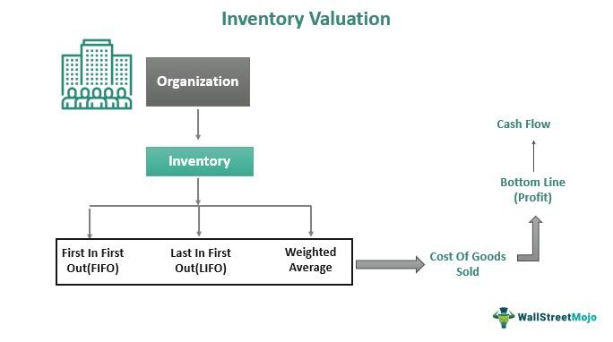

In today's financial markets, successful investing requires a thorough understanding of stock evaluation and analysis. Recent advancements have introduced new methods to streamline this complex process, significantly impacting market strategies. Traditional approaches such as fundamental and technical analysis continue to play pivotal roles, yet technological innovations, particularly algorithmic trading, are reshaping how investors approach the market. 

Stock evaluation techniques are essential tools that enable investors to assess the intrinsic value of a stock, facilitating informed investment decisions. Fundamental analysis examines the financial health of a company, evaluating its balance sheets, income statements, and other economic indicators. On the other hand, technical analysis focuses on historical market data, utilizing price trends and trading volumes to predict future movements. These methods, when applied correctly, can optimize portfolio construction and enhance investment returns.



Algorithmic trading has transformed investment landscapes by enabling the execution of trades at remarkable speed and precision. As computer algorithms process massive volumes of data, they allow investors to capitalize on market inefficiencies with greater accuracy. The integration of advanced algorithms and machine learning models has further refined stock evaluation processes, offering more sophisticated tools for decision-making.

Understanding these concepts and their interplay is crucial for investors aiming to navigate the complexities of modern markets effectively. Mastering both traditional stock evaluation methods and cutting-edge algorithmic strategies can provide a strong foundation for building a resilient and optimized investment portfolio.

## Table of Contents

## What is Stock Analysis?

Stock analysis entails a detailed examination of a trading instrument or market with the objective of forecasting future activities. By assessing a variety of market data, investors aim to determine a stock's intrinsic value, which is the perceived true worth of a company based on its fundamentals rather than market price fluctuations.

To achieve accurate stock evaluation, there are two predominant approaches: fundamental and technical analysis. Fundamental analysis focuses on evaluating a company's financial statements, such as balance sheets and income statements, alongside wider economic indicators, to assess its financial health. This method examines aspects like revenue, expenses, assets, and liabilities, thereby determining potential intrinsic value. It operates under the assumption that securities markets may misprice securities in the short term but will reflect true value in the long term.

On the other hand, technical analysis relies on examining past market data, primarily price and [volume](/wiki/volume-trading-strategy), to identify patterns and predict future price movements. This approach assumes that all known information about a security is already factored into its current price, therefore emphasizing the analysis of trends and patterns rather than intrinsic value. Common techniques used in technical analysis include moving averages, oscillators, and various chart patterns.

Both methods offer unique insights and, when used concurrently, can provide a comprehensive picture of a stock's potential performance. Understanding these approaches is essential for informed investment decisions, enabling the development of effective strategies tailored to individual financial goals.

## Methods for Evaluating Stocks

Evaluating stocks refers to assessing the potential and value of a stock to make informed investment decisions. Two primary methodologies are employed for this purpose: [fundamental analysis](/wiki/fundamental-analysis) and technical analysis. Each approach offers distinct insights and tools for investors.

**Fundamental Analysis:**

Fundamental analysis involves examining financial statements and economic indicators to appraise a stock's intrinsic value. This method considers several factors, including the company's overall financial health, profitability, and growth prospects. Key components of fundamental analysis include:

1. **Financial Statements:** Fundamental analysts scrutinize a company's balance sheet, income statement, and cash flow statement. These documents offer a comprehensive view of a company's financial condition. Investors look for earnings per share (EPS), price-to-earnings (P/E) ratio, and return on equity (ROE) to judge the stock's value.

2. **Economic Indicators:** Broader economic conditions, such as interest rates, inflation, and GDP growth, are factored into a stock's potential performance. Macro-economic trends can significantly influence a company’s prospects and industry positioning.

3. **Qualitative Analysis:** Beyond numbers, fundamental analysis also examines management quality, brand strength, competitive advantage, and corporate governance. These qualitative factors can influence long-term success.

**Technical Analysis:**

Technical analysis evaluates securities based on price movements and trading volumes. It suggests that historical performance can give clues to future price trajectories. Central components of technical analysis include:

1. **Price Trends:** Identifying patterns like head and shoulders, double tops/bottoms, and triangles. These patterns help predict potential breakout or reversal points.

2. **Volume Analysis:** Volume can often precede price changes. Analysts look for volume spikes that confirm trends or signal impending shifts.

3. **Technical Indicators:** Tools such as moving averages, relative strength index (RSI), and MACD (Moving Average Convergence Divergence) aid in analyzing price movements. For instance, a 50-day moving average crossing above a 200-day moving average indicates a potential bullish trend.

**Relative Valuation Models:**

Relative valuation models involve comparing a company's valuation metrics to those of its peers. Key metrics such as the price-to-earnings (P/E) ratio, enterprise value-to-EBITDA (EV/EBITDA) ratio, and price-to-book (P/B) ratio are used to determine whether a stock is overvalued or undervalued relative to its industry group.

By employing these methodologies, investors can gain a well-rounded understanding of a stock's potential, helping them make strategic buy, sell, or hold decisions. Fundamental and technical analyses, when used collectively, can provide comprehensive insights, balancing the qualitative, quantitative, and psychological aspects of market behavior.

## Fundamental vs. Technical Analysis

Fundamental analysis involves evaluating a company's financial health by examining key financial documents such as balance sheets, income statements, and cash flow statements. This method provides insights into a company's intrinsic value by analyzing its earnings potential and growth indicators. Investors employing fundamental analysis focus on factors like revenue, expenses, assets, liabilities, and overall profitability to assess whether a stock is undervalued or overvalued compared to its market price.

For example, the price-to-earnings (P/E) ratio is a commonly used metric in fundamental analysis. It is calculated by dividing the market price per share by the earnings per share (EPS):

$$
\text{P/E Ratio} = \frac{\text{Market Price per Share}}{\text{Earnings per Share (EPS)}}
$$

A lower P/E ratio might indicate that a stock is undervalued, while a higher ratio could suggest overvaluation, though this interpretation can vary across different industries.

In contrast, technical analysis concentrates on the statistical analysis of market data, such as price and volume, to identify trends and patterns that can forecast future price movements. It is based on the premise that all market information is reflected in the stock price and that prices move in trends. Tools utilized in technical analysis include moving averages, relative strength index (RSI), and candlestick patterns.

A fundamental difference between these two approaches is their time horizon: fundamental analysis tends to be long-term oriented, as it focuses on the company's financial health and growth potential over extended periods, while technical analysis often targets short-term market movements. 

Ultimately, the decision to use fundamental or technical analysis depends on individual investment strategies and market conditions. Some investors prefer a fundamental analysis for its comprehensive examination of financial health, while others might opt for technical analysis to capitalize on short-term market fluctuations. A combination of both methods can also offer a more holistic approach to stock evaluation, balancing intrinsic value assessment with market trend insights.

## Algorithmic Trading

Algorithmic trading employs computer algorithms to execute trades based on predefined criteria. By leveraging advanced computational techniques, [algorithmic trading](/wiki/algorithmic-trading) enhances the decision-making process and significantly expedites the execution of trades. One of the core advantages of algorithmic trading is its ability to process massive volumes of data with remarkable speed and precision. This capability allows for the rapid analysis of market conditions, enabling traders to capitalize on fleeting opportunities that manual trading could miss.

Common strategies implemented in algorithmic trading include trend-following, [arbitrage](/wiki/arbitrage), and market-making. Trend-following strategies involve identifying and exploiting trends in market prices, where algorithms track price movements to determine optimal entry and [exit](/wiki/exit-strategy) points. Arbitrage strategies take advantage of price discrepancies across different markets or instruments, executing simultaneous buy and sell orders to lock in profits. Market-making strategies, on the other hand, involve placing limit orders to buy and sell a security, profiting from the spread between the bid and the ask prices. These strategies enhance [liquidity](/wiki/liquidity-risk-premium) in the market, providing smoother transactions for other participants.

Despite enhancing trading efficiency, algorithmic trading carries inherent risks, primarily associated with market [volatility](/wiki/volatility-trading-strategies) and technological dependencies. Algorithms, while fast and precise, can sometimes amplify market volatility, especially during periods of rapid market changes. This occurs when multiple algorithms respond to the same event, causing a cascade of orders that can lead to significant market swings. Additionally, over-reliance on technology presents risks such as system failures, technical glitches, and cybersecurity threats. Therefore, effective risk management is crucial, involving measures such as rigorous [backtesting](/wiki/backtesting) of algorithms, implementation of circuit breakers to halt trading during extreme market conditions, and establishing robust cybersecurity protocols.

In conclusion, while algorithmic trading offers substantial benefits in terms of speed, precision, and processing capability, careful consideration of the associated risks is essential to effectively harness its potential in modern financial markets.

## Benefits and Risks of Algo Trading

Algorithmic trading, or algo trading, significantly enhances the efficiency and effectiveness of modern financial markets. One of its primary benefits is improved trade execution speed. As algorithms are capable of processing information and executing trades in fractions of a second, they have a clear advantage over manual trading. This swift execution reduces the likelihood of losing opportunities due to market fluctuations that occur during the delay of human decision-making.

Additionally, algo trading significantly reduces transaction costs. By automating processes, investment firms can lower the personnel expenses associated with research and trading operations. Furthermore, algorithms are designed to identify optimal entry and exit points, potentially enhancing profitability and minimizing slippage—the difference between the expected price of a trade and the actual price.

Another crucial advantage is the elimination of emotional biases from trading decisions. Human traders are often influenced by psychological factors such as fear and greed, which can lead to irrational decisions. Algorithms, being emotionless, follow predetermined rules and are unaffected by market sentiment, thus ensuring a more consistent and disciplined approach to trading.

Despite these advantages, algorithmic trading presents several risks. One of the major concerns is over-reliance on technology. System failures, whether due to software bugs or hardware issues, can lead to significant financial losses. Additionally, algorithms, if not carefully programmed and monitored, may behave unpredictably under certain market conditions, triggering large-scale market disruptions.

Market disruptions can also result from high-frequency trading strategies, which can lead to excessive volatility. Algorithmic trading has been associated with events such as the "Flash Crash" of 2010, where rapid, automated trades led to a massive and sudden market sell-off.

Regulatory challenges further complicate algo trading. As these strategies evolve, so do the rules governing them, with regulatory bodies striving to maintain market fairness and integrity. Traders must consistently ensure their algorithms comply with current regulations, requiring ongoing adjustments and oversight.

Effective risk management is essential to maximizing the benefits of algorithmic trading while minimizing its drawbacks. Strategies need regular updates and backtesting to account for changing market conditions. Moreover, incorporating safeguards within algorithms, such as circuit breakers and limit orders, can control the adverse impacts of unexpected market movements. 

Overall, while algorithmic trading offers significant advantages in terms of speed, cost-efficiency, and rational decision-making, it requires meticulous programming, continuous monitoring, and robust risk management practices to mitigate its inherent risks.

## Integrating Valuation and Algo Trading

Combining stock valuation methods with algorithmic trading presents a dynamic approach to optimizing investment strategies. This synergy leverages the analytical depth of stock evaluation and the precision of algorithmic processes, facilitating rapid and informed decision-making.

Algorithms automate the repetitive and complex tasks of stock evaluations, allowing for quick responses to changing market conditions. Traditional valuation techniques, such as discounted cash flow (DCF) analysis or Price-to-Earnings (P/E) ratios, provide foundational insights into a stock's intrinsic value. These methodologies can be encoded into algorithms, which systematically process market data, company financials, and economic indicators.

For instance, a simple algorithm for stock evaluation might re-calculate the intrinsic value of a stock based on the DCF model whenever there is a new financial report. Python, with libraries such as pandas for data manipulation and NumPy for numerical calculations, can automate DCF calculations efficiently. Here is a basic outline of a Python function implementing the DCF model:

```python
import numpy as np

def calculate_dcf(cash_flows, discount_rate):
    """Calculate the discounted cash flow (DCF) of a series of cash flows."""
    dcf_value = sum(cf / (1 + discount_rate)**i for i, cf in enumerate(cash_flows))
    return dcf_value

cash_flows = [1000, 1100, 1210]  # Example cash flows for the next three years
discount_rate = 0.1  # Example discount rate
dcf = calculate_dcf(cash_flows, discount_rate)
print(f"Calculated DCF: ${dcf:.2f}")
```

Machine learning models add an additional layer of sophistication, enhancing the predictive capabilities of algorithmic trading. By training models on historical data, [machine learning](/wiki/machine-learning) algorithms can identify patterns and forecast future price movements, thus refining stock valuations. Techniques such as regression analysis, decision trees, and neural networks offer varied approaches to predict stock performance with increased accuracy.

Integrating machine learning into stock valuation can involve complex models that incorporate large datasets, capturing nuances that traditional methods might overlook. For example, a regression model could predict a stock's future price by considering multiple features like earnings reports, market sentiment, and macroeconomic indicators. 

In summary, integrating valuation methods with algorithmic trading enables investors to capitalize on computational prowess, ensuring quick and intelligent trading decisions. The rapid processing and analysis ensure that investment portfolios are continuously optimized, maintaining a competitive edge in fast-paced markets.

## Conclusion

In the rapidly evolving landscape of financial markets, stock evaluation, financial analysis, and algorithmic trading emerge as pivotal components for achieving investment success. These elements collectively provide a solid framework for crafting informed investment decisions and optimizing market strategies, ensuring that investors can effectively navigate market complexities.

Stock evaluation, through both fundamental and technical analysis, empowers investors to understand the intrinsic value of stocks, assess a company's financial health, and interpret market trends. This analytical prowess lays the groundwork for evaluating investment opportunities with precision and depth, thereby optimizing portfolio construction.

The integration of algorithmic trading into investment strategies brings several advantages, such as enhanced speed and execution precision. By automating the trading process based on predefined criteria, algorithms remove emotional biases and improve efficiency. Although this presents potential challenges, such as technological over-reliance and regulatory risks, effective risk management can mitigate these concerns, transforming algo trading into a valuable asset for investors.

Through mastering stock evaluation and algorithmic trading, investors can better anticipate market movements, adjusting their strategies in real-time to align with evolving market conditions. This proficiency not only aids in minimizing risks but also in leveraging opportunities, ultimately enhancing portfolio performance.

In conclusion, the amalgamation of stock evaluation techniques, comprehensive financial analysis, and algorithmic trading capabilities is indispensable for modern investors. By mastering these critical tools, investors are equipped to navigate the inherent complexities of the financial markets, thus achieving better investment outcomes and sustained portfolio growth.

## References & Further Reading

[1]: Bergstra, J., Bardenet, R., Bengio, Y., & Kégl, B. (2011). ["Algorithms for Hyper-Parameter Optimization."](https://papers.nips.cc/paper/4443-algorithms-for-hyper-parameter-optimization) Advances in Neural Information Processing Systems 24.

[2]: ["Advances in Financial Machine Learning"](https://www.amazon.com/Advances-Financial-Machine-Learning-Marcos/dp/1119482089) by Marcos Lopez de Prado

[3]: ["Evidence-Based Technical Analysis: Applying the Scientific Method and Statistical Inference to Trading Signals"](https://www.amazon.com/Evidence-Based-Technical-Analysis-Scientific-Statistical/dp/0470008741) by David Aronson

[4]: ["Machine Learning for Algorithmic Trading"](https://github.com/stefan-jansen/machine-learning-for-trading) by Stefan Jansen

[5]: ["Quantitative Trading: How to Build Your Own Algorithmic Trading Business"](https://www.amazon.com/Quantitative-Trading-Build-Algorithmic-Business/dp/1119800064) by Ernest P. Chan