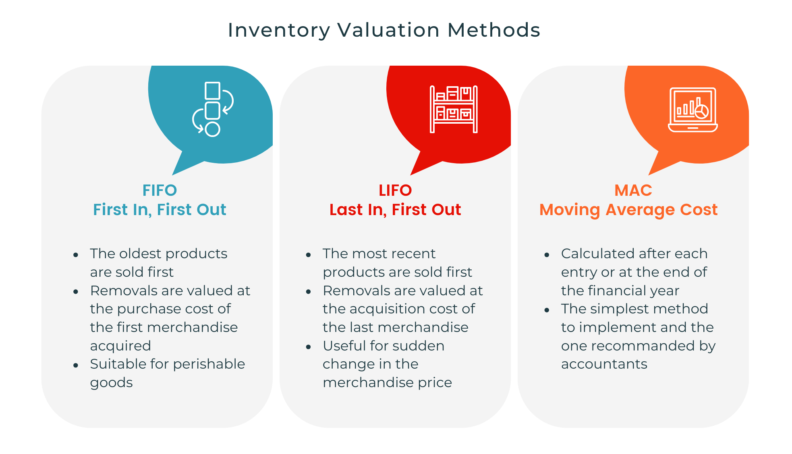

## Table of Contents

## What is stock evaluation and why is it important for investors?

Stock evaluation is when investors look at a company's financial information and other details to decide if its stock is a good buy. They check things like how much money the company makes, its debts, and how it's doing compared to other companies. This helps investors figure out if the stock's price is fair or if it's too high or too low.

It's important for investors to do stock evaluation because it helps them make smarter choices about where to put their money. By understanding a company's value, investors can pick stocks that are likely to grow in value over time. This can lead to better returns on their investment and help them avoid losing money on stocks that might not do well.

## What are the basic financial ratios used in stock evaluation?

When investors evaluate stocks, they often use several basic financial ratios to understand a company's health and value. One important ratio is the Price-to-Earnings (P/E) ratio, which compares a company's stock price to its earnings per share. A lower P/E might mean the stock is a good deal, but it's important to compare it with other companies in the same industry. Another key ratio is the Debt-to-Equity (D/E) ratio, which shows how much debt a company has compared to its equity. A high D/E ratio can mean the company is risky because it has a lot of debt.

Another useful ratio is the Return on Equity (ROE), which measures how well a company is using the money its shareholders have invested to generate profit. A higher ROE usually means the company is doing a good job at turning investment into profit. The Price-to-Book (P/B) ratio is also important, as it compares the market value of a company to its book value. A lower P/B ratio might suggest that the stock is undervalued. By looking at these ratios, investors can get a clearer picture of a company's financial health and make better decisions about buying or selling stocks.

## How can fundamental analysis be used to evaluate stocks?

Fundamental analysis is a way to look at a company's basic information to decide if its stock is a good buy. It involves studying things like the company's earnings, how much it's growing, and its financial health. Investors use this information to figure out what the company is really worth, which is called its intrinsic value. If the stock's price is lower than its intrinsic value, it might be a good time to buy because the stock could be undervalued.

To do fundamental analysis, investors look at financial statements like the income statement, balance sheet, and cash flow statement. They also check out the company's industry and the overall economy to see how these might affect the company's future. By comparing the company's financial ratios, like the P/E ratio or ROE, with those of other companies in the same industry, investors can see if the company is doing better or worse than its competitors. This helps them make smarter choices about whether to buy, hold, or sell the stock.

## What role does technical analysis play in stock evaluation?

Technical analysis is a way to look at stock prices and trading volumes to predict what might happen next. It's different from fundamental analysis because it doesn't look at a company's financial health or earnings. Instead, it uses charts and patterns to see how the stock has moved in the past and tries to guess where it might go in the future. People who use technical analysis believe that all the important information about a company is already included in its stock price, so they focus on price movements and trends.

One of the main tools in technical analysis is looking at charts. These charts show how the stock price has changed over time, and they can help spot patterns like "head and shoulders" or "double tops." Technical analysts also use indicators like moving averages, which smooth out price data to see the overall trend, and the Relative Strength Index (RSI), which shows if a stock is overbought or oversold. By studying these patterns and indicators, investors can decide when to buy or sell a stock based on what the charts are telling them.

## Can you explain the difference between growth investing and value investing?

Growth investing is when investors look for companies that are growing fast. They want to buy stocks of companies that are expected to make more money in the future. These companies might not pay dividends because they use their money to grow even more. Growth investors are okay with paying a higher price for the stock because they believe the company's earnings will go up a lot. They focus on things like how fast the company is growing, new products, and how big the market could be.

Value investing is different. It's about finding companies that are selling for less than they're really worth. Value investors look for stocks that are "on sale." They check the company's financials to see if the stock price is lower than what the company is actually worth. These investors might buy stocks that other people are ignoring or that have had some bad news. They hope to buy low and then sell high when the stock price goes back up. Value investors often look at ratios like the P/E ratio to find these deals.

Both growth and value investing have their own risks and rewards. Growth stocks can give big returns if the company keeps growing, but they can also drop a lot if the growth slows down. Value stocks might be safer because they're cheaper, but sometimes a stock is cheap for a reason, and it might not go back up. Investors need to think about their own goals and how much risk they're willing to take when choosing between growth and value investing.

## How do dividend discount models work in stock valuation?

Dividend discount models are a way to figure out what a stock is worth by looking at the money it pays out to shareholders, called dividends. The basic idea is that the value of a stock is the total of all the future dividends it will pay, but you have to figure out what those future dividends are worth today. This is done by using a discount rate, which is like an interest rate that shows how much you value money now compared to money in the future. If a company is expected to pay steady dividends, you can use a simple formula to add up all those future dividends, discounted back to today's value.

There are different types of dividend discount models, but the most common one is the Gordon Growth Model. This model assumes that dividends will grow at a steady rate forever. You take the next year's expected dividend, divide it by the difference between the discount rate and the growth rate, and that gives you the stock's value. For example, if a company is expected to pay a $2 dividend next year, and you think dividends will grow by 3% each year with a discount rate of 8%, the stock's value would be $2 divided by (8% - 3%), which is $40. This model is simple but works best for companies with stable and predictable growth.

## What are the key components of a discounted cash flow (DCF) analysis?

A discounted cash flow (DCF) analysis is a way to figure out what a company is worth by looking at the money it will make in the future. The main idea is to add up all the future cash flows the company is expected to have, but you have to figure out what those future cash flows are worth today. This is done by using a discount rate, which is like an interest rate that shows how much you value money now compared to money in the future. The discount rate takes into account things like how risky the company is and what other investments you could make instead.

To do a DCF analysis, you start by making a guess about how much money the company will make each year in the future. This is called forecasting the cash flows. You then use the discount rate to figure out what those future cash flows are worth today. You add up all these discounted cash flows to get the total value of the company. Sometimes, you also add a value for the cash flows that will happen way into the future, which is called the terminal value. This gives you a complete picture of what the company might be worth, helping investors decide if the stock is a good buy.

## How can qualitative factors influence stock evaluation?

Qualitative factors are important when looking at a company's stock because they tell you about things that numbers can't show. Things like how good the company's leaders are, what people think about the company's brand, and how well it treats its workers can all make a big difference. If a company has a strong leader who makes smart choices, it might do better than a company with a weak leader. Also, if people really like the company's products and trust its brand, they'll keep buying, which helps the company make more money.

These qualitative factors can also change how investors feel about a company. For example, if a company is known for being good to the environment or treating its workers well, some investors might want to buy its stock more, even if it doesn't make as much money as other companies. On the other hand, if a company is in the news for bad reasons, like a scandal, investors might sell its stock, making the price go down. So, looking at both the numbers and the qualitative factors gives investors a fuller picture of what a company is really like and helps them make better choices about buying or selling its stock.

## What advanced metrics should an expert consider when evaluating stocks?

When experts evaluate stocks, they look at advanced metrics that give them a deeper understanding of a company's performance and potential. One important metric is the Economic Value Added (EVA), which shows how much value a company creates beyond the cost of its capital. A positive EVA means the company is generating more profit than it costs to run the business, which is good for shareholders. Another useful metric is the Free Cash Flow to Equity (FCFE), which tells investors how much cash is left after the company pays for its operations and investments. This cash can be used to pay dividends or buy back shares, making it a key indicator of a company's financial health and ability to reward investors.

Experts also pay attention to the Quality of Earnings (QoE), which looks at how reliable a company's earnings are. High-quality earnings come from the company's main business activities and are more sustainable, while low-quality earnings might come from one-time events or accounting tricks. Another advanced metric is the PEG Ratio, which combines the Price-to-Earnings (P/E) ratio with the company's expected growth rate. A lower PEG ratio can suggest that a stock is undervalued given its growth prospects, helping investors find stocks that might be good buys. By considering these advanced metrics, experts can make more informed decisions about which stocks to invest in.

## How do macroeconomic factors affect stock evaluation?

Macroeconomic factors are big things that affect the whole economy, and they can change how investors think about stocks. Things like interest rates, inflation, and how fast the economy is growing can all make a difference. If interest rates go up, it can make borrowing money more expensive for companies, which might slow down their growth and make their stocks less attractive. On the other hand, if the economy is growing quickly, people might feel more confident and spend more money, which can help companies make more profit and push their stock prices up.

Investors also look at things like unemployment rates and government policies when they evaluate stocks. If a lot of people are out of work, they might not have as much money to spend, which can hurt companies that sell things to consumers. Government policies, like tax changes or new laws, can also affect how much money companies make and how much they have to spend on things like healthcare or environmental rules. By keeping an eye on these big economic factors, investors can get a better idea of whether a stock is a good buy or if it might be riskier than it seems.

## What are some common pitfalls to avoid in stock evaluation?

One common pitfall in stock evaluation is relying too much on past performance. Just because a stock did well before doesn't mean it will keep doing well. Things change, and what worked in the past might not work in the future. Another mistake is ignoring the bigger picture, like what's happening in the economy or the industry. If the economy is doing badly or the industry is struggling, even a good company might have a hard time.

Another pitfall is getting too caught up in short-term changes. Stock prices can go up and down a lot in a short time, but it's the long-term trends that really matter. It's easy to panic and sell when the price drops a bit, but that might mean missing out on gains later. Also, many people make the mistake of not doing enough research. It's important to look at all the information, not just the easy-to-find stuff. By understanding the company's financials, its industry, and the economy, you can make better choices about buying and selling stocks.

## How can one integrate multiple methods of stock evaluation for a comprehensive analysis?

To get a full picture of a stock, you need to use different ways of looking at it together. Start with fundamental analysis to see how healthy the company is. Look at its financial statements and ratios like the P/E ratio and ROE to understand its value. Then, add in technical analysis to see how the stock's price has been moving. Check the charts and patterns to guess where the price might go next. Don't forget about qualitative factors too, like how good the company's leaders are and what people think about its brand. These can tell you a lot about the company that numbers alone can't show.

Also, think about macroeconomic factors that can affect the stock. Things like interest rates, inflation, and how the economy is doing can change how well a company does. By putting all these pieces together, you can see if the stock is a good buy or not. It's like putting together a puzzle. Each piece gives you part of the picture, and when you fit them all together, you can see the whole thing clearly. This way, you can make smarter choices about buying or selling stocks.

## What are the differences between Fundamental and Technical Analysis?

Fundamental analysis involves evaluating a company's financial health by examining key financial documents such as balance sheets, income statements, and cash flow statements. This method provides insights into a company's intrinsic value by analyzing its earnings potential and growth indicators. Investors employing fundamental analysis focus on factors like revenue, expenses, assets, liabilities, and overall profitability to assess whether a stock is undervalued or overvalued compared to its market price.

For example, the price-to-earnings (P/E) ratio is a commonly used metric in fundamental analysis. It is calculated by dividing the market price per share by the earnings per share (EPS):

$$
\text{P/E Ratio} = \frac{\text{Market Price per Share}}{\text{Earnings per Share (EPS)}}
$$

A lower P/E ratio might indicate that a stock is undervalued, while a higher ratio could suggest overvaluation, though this interpretation can vary across different industries.

In contrast, technical analysis concentrates on the statistical analysis of market data, such as price and volume, to identify trends and patterns that can forecast future price movements. It is based on the premise that all market information is reflected in the stock price and that prices move in trends. Tools utilized in technical analysis include moving averages, relative strength index (RSI), and candlestick patterns.

A fundamental difference between these two approaches is their time horizon: fundamental analysis tends to be long-term oriented, as it focuses on the company's financial health and growth potential over extended periods, while technical analysis often targets short-term market movements. 

Ultimately, the decision to use fundamental or technical analysis depends on individual investment strategies and market conditions. Some investors prefer a fundamental analysis for its comprehensive examination of financial health, while others might opt for technical analysis to capitalize on short-term market fluctuations. A combination of both methods can also offer a more holistic approach to stock evaluation, balancing intrinsic value assessment with market trend insights.

## References & Further Reading

[1]: Bergstra, J., Bardenet, R., Bengio, Y., & Kégl, B. (2011). ["Algorithms for Hyper-Parameter Optimization."](https://papers.nips.cc/paper/4443-algorithms-for-hyper-parameter-optimization) Advances in Neural Information Processing Systems 24.

[2]: ["Advances in Financial Machine Learning"](https://www.amazon.com/Advances-Financial-Machine-Learning-Marcos/dp/1119482089) by Marcos Lopez de Prado

[3]: ["Evidence-Based Technical Analysis: Applying the Scientific Method and Statistical Inference to Trading Signals"](https://www.amazon.com/Evidence-Based-Technical-Analysis-Scientific-Statistical/dp/0470008741) by David Aronson

[4]: ["Machine Learning for Algorithmic Trading"](https://github.com/stefan-jansen/machine-learning-for-trading) by Stefan Jansen

[5]: ["Quantitative Trading: How to Build Your Own Algorithmic Trading Business"](https://www.amazon.com/Quantitative-Trading-Build-Algorithmic-Business/dp/1119800064) by Ernest P. Chan