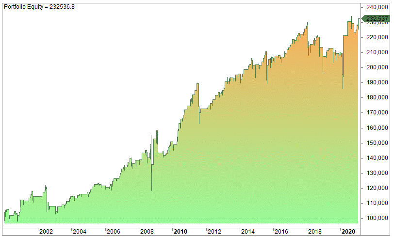

The world of investing and trading is fraught with uncertainties. One of the key instruments used to navigate this landscape is the VIX, or the Volatility Index, often referred to as the "Fear Index." The VIX plays a crucial role in providing insights into market sentiment by gauging investors' anticipation of market volatility over the next 30 days. Derived from the prices of S&P 500 index options, this index is valued for its ability to reflect the collective expectations of market participants regarding future market fluctuations.

In the financial market, the VIX is not just a measure of uncertainty but also a valuable tool for investors looking to strategize their trading activities. A deep understanding of the VIX, its calculation, and associated trading strategies can empower investors to better manage risk and capitalize on market movements. By leveraging the VIX, traders aim to gauge periods of heightened volatility and potential market downturns, allowing them to make informed decisions about their investments.



This article explores the intricacies of the VIX, its significance in the market, and the various strategies traders employ to leverage the VIX for effective trading. By mastering these aspects, investors can enhance their ability to predict market trends, ultimately leading to more strategic investment decisions and better risk management.

While navigating the complexities of the VIX may seem daunting, gaining a robust understanding of this index can be instrumental in optimizing trading strategies and improving portfolio resilience in the face of volatility. Hence, the VIX acts as both a barometer of market fear and a strategic instrument in the trader's toolkit for managing investment risks.

## Table of Contents

## Understanding the VIX

The VIX, or Volatility Index, is an integral component of financial markets, serving as a quantitative measure of anticipated volatility over the forthcoming 30 days. It is derived from the prices of S&P 500 index options. The VIX calculation uses a wide array of strike prices. The methodology captures both near-term and next-month expiration options that are weighted to provide a constant, 30-day measure of expected volatility. This mathematical approach allows the VIX to serve as a real-time gauge of investor sentiment and market expectations.

The VIX calculation is rooted in a complex formula, primarily relying on the implied volatilities of S&P 500 index options. A simplified representation is:

$$

VIX = 100 \times \sqrt{\text{Variance}} 
$$

where the Variance is computed from the option prices and amounts to the market's estimation of the annualized volatility.

As a real-time sentiment indicator, the VIX is often called the "Fear Index." A rising VIX indicates increasing fear and uncertainty among investors about future market conditions, which typically corresponds with declining asset prices. Conversely, a lower VIX suggests market stability and confidence, generally associated with bullish trends.

Moreover, the VIX's behavior provides insights into market psychology. It is historically observed to have an inverse relationship with stock market performance, particularly during periods of financial stress. This makes it a valuable tool for signaling potential market downturns. When equity markets experience sharp declines, the VIX tends to spike upwards, reflecting heightened concerns about the prospect of further declines.

The utility of the VIX extends beyond observing market sentiment; it also aids in predicting potential reversals or continuations in market trends. By understanding how the VIX correlates with market movement, traders and investors can better anticipate and respond to changes in market dynamics.

## VIX Trading Instruments

Trading the VIX directly is not possible; however, investors can engage in trading various derivatives linked to it, such as futures, options, exchange-traded funds (ETFs), and exchange-traded notes (ETNs). These derivatives offer a practical approach for investors to gain exposure to [volatility](/wiki/volatility-trading-strategies) without directly interacting with the VIX itself.

One prominent derivative is the VIX futures contract, which allows traders to bet on the future direction of the VIX. These contracts are standardized agreements to buy or sell the VIX at a predetermined price on a specific date in the future. Futures offer high leverage and potential for substantial returns, but they also come with significant risks due to price swings and the volatile nature of the VIX.

Options on VIX futures provide another avenue for trading volatility. Options are financial derivatives that grant the holder the right, but not the obligation, to buy (call) or sell (put) the underlying futures contract at a specified price before a certain expiration date. These instruments enable investors to construct complex strategies tailored to specific market outlooks on volatility.

ETFs and ETNs linked to the VIX facilitate easier access for retail investors to participate in volatility trading. For instance, popular products like the iPath Series B S&P 500 VIX Short-Term Futures ETN (VXX) and the ProShares VIX Short-Term Futures [ETF](/wiki/etf-trading-strategies) (VIXY) offer exposure to short-term VIX futures. These instruments aim to reflect the performance of a specific VIX futures index, often focusing on short-term contracts to capture the most immediate expectations of market volatility.

These VIX-related trading instruments serve dual purposes: they allow investors to speculate on future volatility and hedge against potential downturns in equity markets. By investing in volatility, market participants can offset losses in traditional equity investments during periods of market stress, thus enhancing portfolio resilience.

In summary, while direct trading of the VIX is not feasible, a wide array of derivatives exists that enables investors to gain exposure to volatility. These instruments provide a versatile toolkit for speculating on market conditions and managing risk, though they require a keen understanding of both the mechanics of the products and the intricacies of market dynamics.

## VIX Trading Strategies

VIX trading strategies often leverage the inverse correlation between the VIX and the stock market, with a common approach being buying equities when the VIX is high and selling when it is low. This strategy is based on the mean reversion principle, which suggests that high VIX levels are often followed by market stabilization and potentially rising asset prices, whereas low VIX levels might precede increased market volatility or downturns.

To enhance the execution of this strategy, traders may develop algorithms that use real-time VIX data to trigger automatic buying or selling decisions. These algorithms often integrate both VIX levels and broader market trends to identify optimal trading opportunities. For instance, an algorithm could be programmed to buy stocks or stock indices when the VIX crosses a certain high threshold and sell when it falls below a specific lower threshold.

Moreover, technical indicators like Bollinger Bands and the Relative Strength Index (RSI) are frequently used in conjunction with VIX observations. Bollinger Bands, for example, can help identify periods of high volatility by displaying upper and lower bands around a moving average, which expand and contract with volatility changes. If the VIX is at a high level and the price breaks through the upper band, it might signal an overbought condition, suggesting a potential market reversal.

Similarly, the RSI is a [momentum](/wiki/momentum) oscillator that measures the speed and change of price movements, typically over a 14-day period. When paired with VIX data, the RSI can provide additional confirmation of entry and [exit](/wiki/exit-strategy) points. An RSI reading above 70, in conjunction with a high VIX, could signal an overbought market ripe for a downturn, while an RSI below 30 with a low VIX might suggest an oversold market poised for a rebound.

Implementing these strategies requires meticulous [backtesting](/wiki/backtesting) to validate their effectiveness in various market conditions. This involves applying the strategy to historical data to assess performance and refine parameters. In Python, traders can employ libraries such as pandas for data manipulation and backtesting tools to simulate trades, ensuring that strategies are robust and adaptable to live trading scenarios.

```python
import pandas as pd
import numpy as np

# Example pseudocode for a simple backtest setup
# Load historical VIX and market data
vix_data = pd.read_csv("vix_data.csv")
market_data = pd.read_csv("market_data.csv")

# Calculate RSI
def calculate_rsi(data, window=14):
    delta = data['Close'].diff()
    gain = (delta.where(delta > 0, 0)).rolling(window=window).mean()
    loss = (-delta.where(delta < 0, 0)).rolling(window=window).mean()
    rs = gain / loss
    rsi = 100 - (100 / (1 + rs))
    return rsi

market_data['RSI'] = calculate_rsi(market_data)

# Define trading strategy
def trading_signal(vix_value, rsi_value):
    if vix_value > 30 and rsi_value > 70:
        return "Sell"
    elif vix_value < 20 and rsi_value < 30:
        return "Buy"
    return "Hold"

# Apply strategy to data
market_data['Signal'] = [trading_signal(vix, rsi) for vix, rsi in zip(vix_data['VIX'], market_data['RSI'])]

# Analyze performance
performance = market_data['Signal'].value_counts()
print(performance)
```

By employing algorithm-driven strategies and technical indicators, traders can effectively leverage VIX-based strategies to optimize their trade timing and enhance portfolio performance. However, a thorough understanding of the associated risks and continuous strategy refinement remains crucial for success in volatility trading.

## Algorithmic Trading and VIX

Algorithmic trading using the VIX involves leveraging computational algorithms to execute trades based on predefined volatility conditions. These algorithms are designed to interpret the Volatility Index's movements and predict market behavior swiftly and accurately. The goal is to capitalize on the rapidly changing market conditions triggered by fluctuations in the VIX, which acts as a proxy for market sentiment and expected volatility.

One of the key advantages of [algorithmic trading](/wiki/algorithmic-trading) is the capacity for rapid execution. By automating the trading process, algorithms can respond to VIX-driven market signals faster than a human trader. This speed is crucial in volatile markets, where opportunities can arise and dissipate within seconds. Algorithms can be programmed to enter or exit positions as soon as the VIX reaches certain thresholds, ensuring timely trades that capitalize on market dynamics.

Another critical aspect of algorithmic trading with VIX is the validation of these algorithms through rigorous backtesting on historical data. Backtesting involves applying an algorithm to past market data to assess how well it would have performed. This process helps identify strengths and weaknesses in the trading strategy before deploying it in a live trading environment. A well-backtested algorithm can provide confidence in its potential efficacy, though it’s important to recognize past performance does not guarantee future results.

The use of specific programming languages like Python enables traders and developers to create sophisticated algorithms efficiently. Python, for example, offers libraries such as NumPy and pandas for data manipulation, as well as dedicated packages like zipline and PyAlgoTrade for backtesting and algorithm development. These tools facilitate the development, testing, and execution of complex trading algorithms, allowing traders to customize their strategies around VIX volatility metrics.

Algorithmic trading inherently requires a robust risk management framework due to the rapid decision-making and execution it facilitates. As VIX can indicate market stress and instability, algorithms should be equipped to handle extreme market conditions and unforeseen events that might drastically impact trade outcomes. Effective risk management strategies can include setting stop-loss limits, diversifying across different asset classes, and continuously monitoring algorithm performance to adjust strategies as needed.

In conclusion, leveraging algorithmic trading strategies using the VIX presents unique trading opportunities by harnessing the predictive power of volatility metrics. However, it necessitates comprehensive algorithm validation and prudent risk management to optimize performance within the volatility-dependent environment of financial markets.

## Risks and Challenges

Trading VIX-related instruments brings a set of distinct risks and challenges, primarily tied to the complex nature of volatility products and the futures markets they often leverage. A significant aspect to consider is the potential for losses caused by contango or backwardation. In futures markets, contango occurs when the futures price is above the expected future spot price, and this is typical in markets with storage costs or carrying costs. In contrast, backwardation happens when the futures price is below the expected future spot price, often due to current shortages or increased demand. 

For VIX futures, the market generally experiences contango, as forward-looking volatility is usually expected to be higher than current volatility levels. This can lead to a situation where rolling over futures contracts — selling contracts that are about to expire and purchasing new ones — results in a negative roll yield, leading to losses over time even if the VIX remains unchanged. 

Moreover, VIX-related products, such as ETFs and ETNs, may not track the spot VIX accurately. These instruments are constructed using VIX futures rather than the spot index itself, leading to discrepancies in performance. The rolling of futures contracts, especially during contango scenarios, can result in significant deviations between the return of the VIX and the return of VIX-related products. 

Additionally, market-specific risks are inherent in trading volatility instruments. These include [liquidity](/wiki/liquidity-risk-premium) risks, where rapid market changes can exacerbate difficulties in executing trades at desired prices. Structural risks, such as those associated with product design — whether involving leverage or other exotic features — can amplify both potential returns and losses. 

Investors engaging with VIX instruments must develop a deep understanding of these dynamics and employ effective risk management strategies. They need to be vigilant about factors like changes in the term structure of volatility and the broader implications of market movements that might affect futures prices. By considering such variables, investors can aim to mitigate risks and make informed trading decisions.

## Conclusion

The VIX represents a critical element within a trader's toolkit, offering valuable insights into market sentiment and the potential for upcoming price volatility. With its ability to reflect the prevailing mood of the market, the VIX serves as a barometer for gauging fear and uncertainty among investors. It effectively informs strategic decision-making, signaling periods where risk management is paramount and guiding investors through the complexities of financial markets.

Despite the opportunities the VIX presents for profit, engaging with VIX-related instruments demands a comprehensive understanding of market dynamics and meticulous risk management. These instruments, including futures, options, ETFs, and ETNs based on VIX, provide diverse avenues for navigating market conditions. However, the inherent risks, such as the potential for losses due to contango or backwardation in futures markets, necessitate a cautious and informed approach.

Incorporating VIX-based strategies into a well-diversified portfolio can significantly enhance performance. By strategically leveraging VIX insights, investors can balance the dual objectives of risk mitigation and profit generation in volatile markets. This balanced approach not only aids in optimizing returns but also strengthens the resilience of the investment portfolio against abrupt market swings. As such, the VIX remains an indispensable tool for those seeking to master the art of trading amidst market turbulence.

## References & Further Reading

[1]: Whaley, R.E. (1993). ["Derivatives on Market Volatility: Hedging Tools Long Overdue."](https://www.pm-research.com/content/iijderiv/1/1/71) The Journal of Finance.

[2]: Simon, D.P. (2003). ["The Nasdaq Volatility Index During and After the Bubble"](https://www.pm-research.com/content/iijderiv/11/2/9.full.pdf). Journal of Derivatives.

[3]: ["The VIX Index and Volatility-Based Global Indexes and Trading Instruments"](https://papers.ssrn.com/sol3/papers.cfm?abstract_id=3668983) by Chicago Board Options Exchange (CBOE).

[4]: ["Option Volatility and Pricing: Advanced Trading Strategies and Techniques"](https://www.amazon.com/Option-Volatility-Pricing-Strategies-Techniques/dp/0071818774) by Sheldon Natenberg

[5]: Burghardt, G. (2011). ["Volatility as an Asset Class: Holding Volatility."](https://www.academia.edu/89006995/Volatility_as_an_Asset_Class_Holding_VIX_in_a_Portfolio) Research Foundation of CFA Institute.