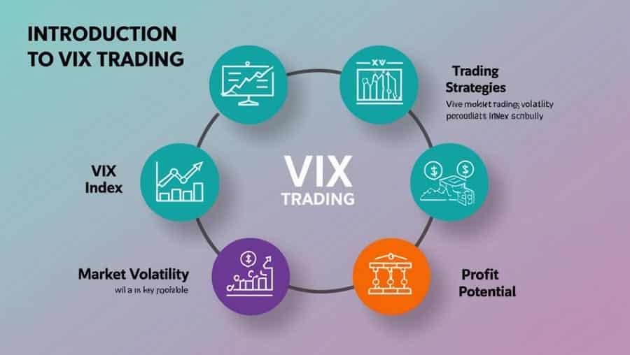

## Table of Contents

## What is the VIX and why is it important for traders?

The VIX, or the CBOE Volatility Index, is a measure that shows how much the stock market expects prices to change over the next 30 days. It's often called the "fear gauge" because it goes up when people are worried and think the market will move a lot, and it goes down when people are calm and expect less change. The VIX is calculated using the prices of options on the S&P 500, which are financial tools that people can buy to protect against big price swings.

The VIX is important for traders because it helps them understand how nervous or confident other people in the market are feeling. If the VIX is high, it might mean that a big event or a lot of uncertainty is coming, so traders might decide to be more careful with their investments. On the other hand, if the VIX is low, traders might feel more comfortable taking risks because the market seems stable. By keeping an eye on the VIX, traders can make better decisions about when to buy or sell, and how to protect their money.

## How is the VIX calculated and what does it measure?

The VIX is calculated by looking at the prices of options on the S&P 500. Options are like bets on whether the stock market will go up or down. The CBOE, which is the group that makes the VIX, uses a special math formula to figure out the VIX. This formula looks at the prices of many different options to see how much people are willing to pay to protect against big changes in the market. The more people are willing to pay, the higher the VIX will be.

The VIX measures how much the market expects stock prices to move over the next 30 days. It's like a guess about how wild or calm the market will be. If the VIX is high, it means people think there will be big changes and they're worried. If it's low, it means people think the market will stay pretty steady and they're not too worried. This helps traders understand what might happen next in the market and make smarter choices with their money.

## What are the basic trading instruments available for trading the VIX?

The main way to trade the VIX is through futures contracts. These are agreements to buy or sell the VIX at a certain price on a future date. They let traders bet on where they think the VIX will be in the future. If a trader thinks the VIX will go up, they can buy a futures contract. If they think it will go down, they can sell one.

Another way to trade the VIX is through options. Options on the VIX give traders the right, but not the obligation, to buy or sell the VIX at a set price before a certain date. They can be used to make money if the VIX moves a lot, or to protect other investments from big swings in the market.

There are also exchange-traded products (ETPs) like ETFs and ETNs that track the VIX. These are like stocks that you can buy and sell easily. They let traders get exposure to the VIX without using futures or options. However, these products can be complex and might not always move exactly like the VIX itself.

## Can you explain the difference between VIX futures and VIX options?

VIX futures are agreements to buy or sell the VIX at a certain price on a future date. They let traders bet on where they think the VIX will be in the future. If a trader thinks the VIX will go up, they can buy a futures contract. If they think it will go down, they can sell one. Futures contracts are straightforward and give traders a direct way to make money if they guess right about the VIX's future value.

VIX options, on the other hand, give traders the right, but not the obligation, to buy or sell the VIX at a set price before a certain date. This means traders can use options to make money if the VIX moves a lot, or to protect other investments from big swings in the market. Options can be a bit more complex because they offer more flexibility, but they also come with more strategies and potential outcomes depending on how the VIX moves.

## What are the key strategies for trading VIX futures?

One key strategy for trading VIX futures is to use them as a hedge. If you think the market might get very volatile soon, you can buy VIX futures. This can help protect your other investments from big drops. If the VIX goes up because the market gets wild, the money you make from the VIX futures can help cover losses in your other investments. It's like buying insurance for your portfolio.

Another strategy is to trade VIX futures based on your predictions about future market volatility. If you think the VIX will go up because of upcoming events like elections or economic reports, you can buy VIX futures. If you think the VIX will go down because things are calming down, you can sell VIX futures. This is more like betting on where you think the VIX will be in the future. It can be risky, but if you guess right, you can make money.

A third strategy involves using VIX futures to take advantage of the difference between the current VIX and the futures price, known as the VIX term structure. Sometimes, the futures price is higher than the current VIX (contango), and sometimes it's lower (backwardation). Traders can buy and sell VIX futures at different times to profit from these changes. This strategy requires understanding how the VIX and its futures move over time and can be more complex but potentially rewarding.

## How can VIX options be used to hedge a portfolio?

VIX options can be used to hedge a portfolio by buying call options on the VIX. If you think the market might get very volatile soon, you can buy VIX call options. These options give you the right to buy the VIX at a set price if it goes up. If the market does get wild and the VIX goes up, the value of your VIX call options will go up too. This can help offset any losses in your other investments caused by the market's big swings. It's like having insurance that pays out when the market gets really bumpy.

Another way to use VIX options for hedging is to buy put options on stocks or ETFs and then buy VIX call options. If the market drops, the value of your stock or ETF put options will go up, helping to protect your portfolio. At the same time, if the market drop causes the VIX to rise, your VIX call options will also increase in value. This double protection can be a smart way to guard your investments against both falling prices and rising volatility.

## What are the common pitfalls and risks when trading the VIX?

Trading the VIX can be tricky because it's not a direct investment like a stock. The VIX itself can't be bought or sold like a regular asset; you're really trading futures or options based on it. This means you're betting on what you think the VIX will do in the future, not what it's doing right now. If you guess wrong, you could lose money. Also, the VIX can be very unpredictable. It can spike suddenly because of big news or events, and if you're not ready for that, it can catch you off guard.

Another big risk is something called "contango." This happens when the price of VIX futures is higher than the current VIX. If you hold onto VIX futures while they're in contango, you might lose money as the futures get closer to their expiration date and their price drops to match the VIX. The opposite, called "backwardation," can also be risky because it can mean the market is expecting a big drop in volatility, which might not happen. Both situations can make it hard to make money from trading VIX products, especially if you're not watching the market closely.

## How does the VIX react to market events and how can traders anticipate these movements?

The VIX often goes up when big news or events happen that make the stock market nervous. Things like elections, big economic reports, or sudden world events can make people worried about what will happen next. When people get scared, they buy more options to protect their money, and this makes the VIX go up. On the other hand, if good news comes out and people feel more sure about the market, the VIX might go down because people don't feel the need to protect their money as much.

Traders can try to guess how the VIX will move by keeping an eye on the news and understanding how the market usually reacts to certain events. If they know an important event is coming up, like a big election or an important economic report, they can think about how that might make people feel and how it might change the VIX. By looking at past events and how the VIX moved then, traders can make better guesses about what might happen next and plan their trades accordingly.

## What advanced technical analysis tools are effective for VIX trading?

One useful tool for trading the VIX is the moving average. Traders often use moving averages to see the general direction of the VIX over time. A short-term moving average, like a 10-day moving average, can show quick changes in the VIX. A longer-term moving average, like a 50-day or 200-day moving average, can show bigger trends. When the short-term average crosses above the long-term average, it might mean the VIX is starting to go up, which could be a sign to buy VIX futures or options. When the short-term average crosses below the long-term average, it might mean the VIX is going down, which could be a sign to sell.

Another helpful tool is the Relative Strength Index (RSI). The RSI helps traders see if the VIX is overbought or oversold. If the RSI is above 70, it might mean the VIX has gone up too fast and could be due for a drop. If the RSI is below 30, it might mean the VIX has gone down too fast and could be due for a rise. Traders can use this information to decide when to buy or sell VIX products. By watching the RSI, traders can get a sense of when the VIX might be ready to change direction.

## How can algorithmic trading be applied to VIX strategies?

Algorithmic trading can be a smart way to trade the VIX. Traders can use computers to watch the VIX all the time and make trades based on special rules they set up. For example, a trader might tell the computer to buy VIX futures when the VIX goes above a certain number, or to sell them when it drops below another number. This can help traders catch quick changes in the VIX without having to watch the market every second. The computer can also look at many different pieces of information at once, like moving averages or the RSI, to make better guesses about where the VIX might go next.

Another way to use algorithmic trading with the VIX is to make the computer do something called "mean reversion" trading. This means the computer looks for times when the VIX is a lot higher or lower than it usually is. If the VIX is much higher than normal, the computer might guess it will come back down and sell VIX futures. If the VIX is much lower than normal, the computer might guess it will go back up and buy VIX futures. This can help traders make money when the VIX goes back to its normal levels. By using these computer programs, traders can try to take advantage of the VIX's ups and downs without having to do everything by hand.

## What are the regulatory considerations and compliance issues when trading the VIX?

When trading the VIX, there are important rules and laws that traders need to follow. These rules come from groups like the Commodity Futures Trading Commission (CFTC) and the Securities and Exchange Commission (SEC). They make sure that trading is fair and that everyone follows the same rules. For example, traders need to make sure they have enough money to cover their trades, which is called meeting margin requirements. They also need to report their trades and follow rules about how much they can trade, which helps prevent big problems in the market.

Another thing to think about is how different countries might have their own rules for trading the VIX. If you're trading from outside the U.S., you need to know the rules in your own country too. Also, using computer programs for trading, called algorithmic trading, can have extra rules to follow. These rules are there to make sure that the computers don't cause big swings in the market. By understanding and following all these rules, traders can stay out of trouble and trade the VIX safely.

## How do expert traders integrate VIX trading into a broader investment strategy?

Expert traders often use VIX trading as a way to protect their other investments. They know that the stock market can get wild sometimes, and when it does, the VIX usually goes up. So, they might buy VIX futures or options when they think the market might get bumpy. This can help them make money from the VIX going up, which can cover any losses they might have in their other investments. It's like having an insurance policy that pays out when the market gets scary. By doing this, they can feel safer about their overall investment plan and not worry as much about big drops in the market.

Another way expert traders use the VIX is to make money from guessing where it will go next. They watch the news and look at things like elections or big economic reports that might make the market nervous. If they think the VIX will go up because of these events, they might buy VIX futures or options. If they think it will go down because things are calming down, they might sell them. This can be a bit risky, but if they guess right, they can make money. By mixing these VIX trades with their other investments, expert traders can try to make money no matter what the market does.

## What is the VIX and how can it be understood?

The VIX, or Volatility Index, is an integral component of financial markets, serving as a quantitative measure of anticipated volatility over the forthcoming 30 days. It is derived from the prices of S&P 500 index options. The VIX calculation uses a wide array of strike prices. The methodology captures both near-term and next-month expiration options that are weighted to provide a constant, 30-day measure of expected volatility. This mathematical approach allows the VIX to serve as a real-time gauge of investor sentiment and market expectations.

The VIX calculation is rooted in a complex formula, primarily relying on the implied volatilities of S&P 500 index options. A simplified representation is:

$$

VIX = 100 \times \sqrt{\text{Variance}} 
$$

where the Variance is computed from the option prices and amounts to the market's estimation of the annualized volatility.

As a real-time sentiment indicator, the VIX is often called the "Fear Index." A rising VIX indicates increasing fear and uncertainty among investors about future market conditions, which typically corresponds with declining asset prices. Conversely, a lower VIX suggests market stability and confidence, generally associated with bullish trends.

Moreover, the VIX's behavior provides insights into market psychology. It is historically observed to have an inverse relationship with stock market performance, particularly during periods of financial stress. This makes it a valuable tool for signaling potential market downturns. When equity markets experience sharp declines, the VIX tends to spike upwards, reflecting heightened concerns about the prospect of further declines.

The utility of the VIX extends beyond observing market sentiment; it also aids in predicting potential reversals or continuations in market trends. By understanding how the VIX correlates with market movement, traders and investors can better anticipate and respond to changes in market dynamics.

## References & Further Reading

[1]: Whaley, R.E. (1993). ["Derivatives on Market Volatility: Hedging Tools Long Overdue."](https://www.pm-research.com/content/iijderiv/1/1/71) The Journal of Finance.

[2]: Simon, D.P. (2003). ["The Nasdaq Volatility Index During and After the Bubble"](https://www.pm-research.com/content/iijderiv/11/2/9.full.pdf). Journal of Derivatives.

[3]: ["The VIX Index and Volatility-Based Global Indexes and Trading Instruments"](https://papers.ssrn.com/sol3/papers.cfm?abstract_id=3668983) by Chicago Board Options Exchange (CBOE).

[4]: ["Option Volatility and Pricing: Advanced Trading Strategies and Techniques"](https://www.amazon.com/Option-Volatility-Pricing-Strategies-Techniques/dp/0071818774) by Sheldon Natenberg

[5]: Burghardt, G. (2011). ["Volatility as an Asset Class: Holding Volatility."](https://www.academia.edu/89006995/Volatility_as_an_Asset_Class_Holding_VIX_in_a_Portfolio) Research Foundation of CFA Institute.