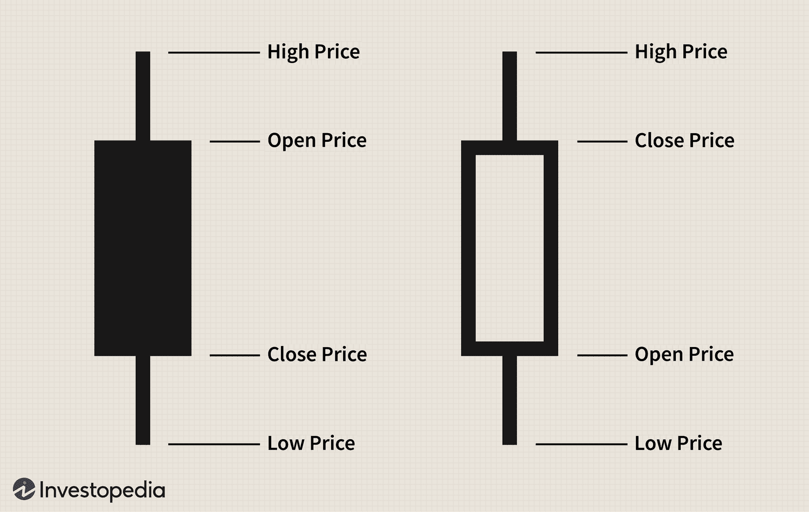

Trading in the forex market can be a complex yet fulfilling pursuit, particularly for those engaging on a part-time basis. The forex market, being the largest and most liquid financial market globally, offers numerous opportunities but equally poses challenges due to its volatile nature and the necessity for substantial knowledge and strategy development. Part-time traders often face the challenge of balancing market engagement with time constraints, necessitating the adoption of strategies that enable them to navigate these complexities efficiently.

The advent of advanced technology has revolutionized trading across various financial markets, including forex, with algorithmic trading (algo trading) emerging as a pivotal facet of modern trading strategies. Algo trading involves using computer algorithms to execute trades based on pre-established criteria, allowing for increased precision, speed, and the ability to manage multiple trades simultaneously without significant human intervention. This automation is particularly advantageous for part-time traders, as it mitigates the challenges of constant market monitoring while providing the ability to seize opportunities that align with their pre-set trading strategies.



Through this article, we will explore various strategies that forex traders can employ to optimize their trading activities, especially when trading part-time. By integrating algorithmic trading into their processes, traders can significantly enhance their trading efficiency and effectiveness. This approach not only enables the execution of trades with reduced emotional bias but also facilitates the strategic allocation of time and resources, allowing part-time traders to maximize their success in the ever-evolving forex market.

## Table of Contents

## Understanding Forex Trading

Forex trading, or foreign exchange trading, is the process of buying and selling currency pairs on the foreign exchange market. As one of the most liquid financial markets globally, the forex market facilitates an average daily trading volume exceeding $6 trillion, making it a crucial component of international trade and financial systems. 

Currency pairs are the core elements of forex trading. They consist of a base currency and a quote currency, exemplified by the pair EUR/USD, where the euro (EUR) is the base, and the U.S. dollar (USD) is the quote currency. The exchange rate indicates how much of the quote currency is necessary to purchase one unit of the base currency.

A fundamental concept in forex trading is the "pip," short for "percentage in point." A pip typically represents the smallest price movement in the exchange rate of a currency pair. In most currency pairs, a pip is equal to 0.0001, though for currency pairs that include the Japanese yen, a pip is equivalent to 0.01 due to the yen's lower value compared to other major currencies.

Leverage is another critical element of [forex](/wiki/forex-system) trading that allows traders to control larger positions with a relatively small amount of invested capital. For example, with a leverage ratio of 50:1, a trader can control $50,000 worth of currency with only $1,000 in their trading account. While leverage amplifies potential gains, it also increases the potential risk as losses are also magnified.

The forex market's round-the-clock operation is one of its distinctive features, structured around major financial centers: Sydney, Tokyo, London, and New York. This 24-hour availability offers both opportunities and challenges. Part-time traders benefit from the flexibility to trade at convenient times, but must remain vigilant about market [volatility](/wiki/volatility-trading-strategies), news events, and time zone differences which can affect currency values.

A solid understanding of these concepts—currency pairs, pips, leverage, and the market's continuous operation—is crucial for anyone engaging in forex trading, ensuring they can make informed decisions and manage risks effectively.

## Strategies for Part-Time Forex Traders

Part-time trading in the forex market requires strategies that optimize limited trading hours and leverage market availability to make informed decisions. One fundamental approach is to focus on specific currency pairs that exhibit high volatility during the trader's available trading windows. This can be achieved by correlating trading times with the operational hours of major financial centers such as New York, London, or Tokyo. Such synchronization ensures engagement with the most active sessions, where [liquidity](/wiki/liquidity-risk-premium) is abundant and price movement is significant. For instance, trading EUR/USD is typically favorable during the overlap between the London and New York sessions, providing ample opportunities for part-time traders to capitalize on pronounced market shifts.

Automated trading platforms are pivotal for efficiently managing trades within constrained time blocks. These platforms can execute pre-set strategies, allowing traders to engage with the market without real-time supervision actively. For example, automated systems can open or close positions based on specific criteria, such as the crossing of moving averages. Through the use of software like MetaTrader or TradeStation, part-time traders can automate their strategies, reducing the burden of manual intervention and ensuring that no market opportunity is missed due to time restrictions.

Implementing price action trading is also recommended as it focuses on historical price movements. This method allows traders to predict future market movements based on the patterns and trends visible in price charts. Utilizing candlestick patterns, support and resistance levels, and trend lines, traders can make informed decisions without requiring complex indicator setups. This straightforward approach is particularly advantageous for part-time traders who may lack the time to analyze multiple complex indicators.

Risk management remains a critical component of any trading strategy. For part-time traders, setting stop-loss orders is a non-negotiable practice to protect against unfavorable market movements. Stop-loss orders automatically close a losing position once the market reaches a specified price level, thus capping potential losses without the need for constant monitoring. Properly placed stop-losses should achieve a balance between allowing the natural ebb and flow of price movements and preventing significant capital drawdown. For instance, placing a stop-loss at a recent support or resistance level can effectively protect a trading position while accommodating normal market fluctuations.

By focusing on these strategies — including selecting optimal currency pairs, utilizing automation, adhering to price action principles, and enforcing stringent risk management practices such as stop-loss orders — part-time forex traders can position themselves favorably, making the most of their limited trading hours.

## Overview of Algorithmic Trading in Forex

Algorithmic trading in the forex market utilizes computer programs to execute trades when specific predefined conditions are met. This approach capitalizes on computational efficiency and precision, allowing traders to implement strategies without the interference of human emotion, thereby enhancing trading success and efficiency. In the context of forex trading, [algorithmic trading](/wiki/algorithmic-trading) streamlines the process by automating trading strategies and continuously monitoring the market, making it particularly advantageous for part-time traders who may not always be able to actively engage with the market.

One significant advantage of algorithmic trading is its ability to execute trades at remarkable speeds, leveraging advanced algorithms to process vast amounts of market data in real time. This capability ensures that traders can capitalize on fleeting opportunities that might be missed during manual trading. For part-time traders, algorithmic trading offers the benefit of executing trades even when they are not actively monitoring the market, which is particularly useful given the 24-hour nature of the forex market.

The automation of trading strategies via algorithms also substantially reduces the emotional bias that can accompany manual trading decisions. Human traders are often susceptible to emotions such as fear and greed, which can lead to impulsive decisions and inconsistent trading performance. By predefining trading criteria within an algorithm, these emotional influences are mitigated, leading to more disciplined and objective trading.

Moreover, algorithmic trading enhances the scalability of strategies. Traders can simultaneously monitor and execute orders across multiple currency pairs and markets, something that would be challenging and time-consuming if done manually. This broadened capacity provides traders with more significant opportunities for diversification and risk management.

Algorithmic trading systems also come with the advantage of continuous market surveillance. They can operate around the clock, which is particularly beneficial for the forex market that never closes. This continuous monitoring allows algorithms to react swiftly to market changes, ensuring that trades are executed with optimal timing.

In essence, algorithmic trading equips part-time forex traders with the tools to maintain an edge in a fast-paced trading environment. By harnessing technology to automate and enhance their trading strategies, traders can ensure consistent and efficient market engagement, leading to potentially improved trading outcomes.

## Popular Algo Trading Strategies

Trend following, [arbitrage](/wiki/arbitrage), and mean reversion are popular algorithmic trading strategies employed in forex trading. Each strategy involves analyzing market data and executing trades when predefined conditions are fulfilled, allowing traders to capitalize on market movements efficiently.

### Trend Following

Trend following is predicated on the notion that prices of currencies will continue moving in their current direction. Traders identify a trend and make trading decisions in the direction of this trend. This strategy uses technical indicators like moving averages, trend lines, and the Average Directional Index (ADX) to spot trends. The moving average crossover strategy is a common method where a buy signal is initiated when a short-term moving average crosses above a long-term moving average.

Python code example for moving average crossover:

```python
# Import necessary libraries
import pandas as pd
import numpy as np

# Load data
data = pd.read_csv('forex_data.csv')  # Ensure 'forex_data.csv' is your dataset

# Calculate moving averages
data['Short_MA'] = data['Close'].rolling(window=10).mean()  # Short-term moving average
data['Long_MA'] = data['Close'].rolling(window=50).mean()  # Long-term moving average

# Generate signals
data['Signal'] = 0
data['Signal'][10:] = np.where(data['Short_MA'][10:] > data['Long_MA'][10:], 1, 0)
data['Position'] = data['Signal'].diff()
```

### Arbitrage

Arbitrage takes advantage of price discrepancies in different markets or forms. Forex traders can engage in triangular arbitrage, which involves trading currency pairs that lead to a profit due to exchange rate discrepancies. Traders require sophisticated algorithms to execute arbitrage opportunities since price disparities are typically short-lived.

Mathematical representation of triangular arbitrage:

Assuming three currencies: USD, EUR, and JPY, and exchange rates such as USD/EUR, EUR/JPY, and USD/JPY, the arbitrage condition can be expressed as:
$$
\frac{\text{USD/EUR} \times \text{EUR/JPY}}{\text{USD/JPY}} > 1
$$
This condition suggests a profitable arbitrage opportunity if greater than 1.

### Mean Reversion

Mean reversion assumes that currency prices will revert to their historical averages. This strategy detects currencies significantly deviating from their average price and assumes they will return to it. Bollinger Bands and the Relative Strength Index (RSI) are often used to identify mean reversion opportunities.

For example, if a currency price dips below the lower Bollinger Band, it could be an indicator for buying, anticipating a move back toward the mean. Backtesting is essential for mean reversion strategies to confirm their potential effectiveness and resilience across varying conditions.

The use of historical data in [backtesting](/wiki/backtesting) ensures that strategies are built on reliable foundations. By simulating the performance of a trading strategy on historical data, traders can evaluate its prospective success and adaptability to diverse transaction scenarios, ensuring that the chosen algo-trading strategy is robust and effective for the targeted forex market conditions.

## Benefits of Algorithmic Trading

Algorithmic trading, commonly known as algo trading, provides significant advantages in the forex market, particularly concerning speed and efficiency in executing trades. One of the primary benefits is its ability to process large volumes of market data and execute trades at speeds that are beyond human capability. This rapid execution minimizes the risk of price fluctuations that can occur between the decision to trade and the actual execution, ensuring that trades are carried out at the most favorable prices available.

Furthermore, algo trading reduces errors stemming from human emotions. Traders often fall victim to psychological biases such as fear and greed, which can lead to poor decision-making. By using predefined algorithms, traders can eliminate these emotional influences, ensuring that each trade is consistent and based on logical criteria rather than impulse. This systematic approach allows for improved risk management, as strategies can be designed to adapt to changing market conditions while adhering to predetermined risk parameters.

Algo trading also facilitates participation in multiple markets simultaneously, offering a significant diversification benefit. By deploying algorithms across various currency pairs and markets, traders can spread their exposure, mitigating the risk associated with concentration in a single market. This multi-market operation enhances the potential for returns and reduces overall portfolio risk through diversification.

In addition, these strategies often include built-in risk management tools such as stop-loss orders and trailing stops which automatically limit losses and lock in profits. This automated feature ensures that trades are exited at optimal points, preserving capital, and maximizing returns. Algorithmic trading's systematic approach ensures that these protective mechanisms are consistently applied without the oversight necessary from human traders.

In summary, algorithmic trading allows for faster trade execution, reduces the impact of human emotion, and enables diversified trading across multiple markets. These benefits combine to provide a robust platform for enhancing trading efficiency and effectiveness, especially crucial for part-time traders who may not always be able to monitor the market closely.

## Implementing Algo Trading for Part-Time Trading

Selecting the appropriate trading platform is a crucial step for part-time traders looking to implement algorithmic trading strategies effectively. Platforms such as MetaTrader 4 (MT4), MetaTrader 5 (MT5), and NinjaTrader offer support for automated trading, providing tools and resources that enable traders to develop and deploy algorithms without requiring constant oversight.

One key aspect of implementing algorithmic trading is gaining proficiency in programming languages commonly used in developing trading algorithms. Python, with its extensive libraries like NumPy, pandas, and TA-Lib, is particularly popular due to its ease of use and versatility. Here is a simple example of a Python script using pandas for data manipulation:

```python
import pandas as pd

# Load forex data
data = pd.read_csv('forex_data.csv')

# Calculate moving averages
data['MA5'] = data['Close'].rolling(window=5).mean()
data['MA20'] = data['Close'].rolling(window=20).mean()

# Define a basic trading strategy
data['Signal'] = 0
data['Signal'][data['MA5'] > data['MA20']] = 1
data['Position'] = data['Signal'].diff()

# Display signals
print(data[['MA5', 'MA20', 'Signal', 'Position']].dropna())
```

For those who may not have programming expertise, many platforms offer pre-built algorithms that can be tailored to fit individual trading strategies. These tools allow traders to customize existing templates to align with their risk profiles and market goals.

Setting up automated alerts is another critical component. These alerts can be configured to monitor market conditions and notify traders when specific criteria are met. This proactive approach ensures that trades are executed promptly, capitalizing on market opportunities as they arise.

Risk management in algorithmic trading involves setting rules that govern trade sizes, stop-loss levels, and take-profit thresholds. By programming these parameters into the algorithm, traders mitigate potential losses and secure profits. For instance, utilizing Python, traders can incorporate risk management as follows:

```python
# Risk management parameters
initial_capital = 10000
risk_per_trade = 0.02  # 2% of the capital

# Calculate stop-loss and take-profit levels
stop_loss = current_price - (risk_per_trade * initial_capital / position_size)
take_profit = current_price + (2 * risk_per_trade * initial_capital / position_size)
```

In summary, the adoption of algorithmic trading by part-time traders involves selecting a robust trading platform, acquiring necessary programming skills, or utilizing customizable algorithms, and integrating alerts and risk management practices. By leveraging these tools and strategies, traders can enhance their ability to respond to market dynamics efficiently and effectively.

## Conclusion

The combination of strategic part-time trading and algorithmic trading can significantly enhance trading outcomes for forex traders. By utilizing algorithmic strategies, part-time traders can monitor the market efficiently, executing trades based on precise criteria without the need for constant screen time. This technological advantage allows them to capitalize on market opportunities that align with their available time and trading goals.

With the right tools and strategies, part-time forex traders are empowered to navigate the complexities of the forex market adeptly. Automated trading platforms enable them to set predefined conditions for trade execution, effectively managing risk and emotional bias. For instance, integrating stop-loss orders and automated alerts ensures that traders are promptly informed of significant market movements, allowing for swift action when necessary.

Moreover, algorithmic trading facilitates diversification across different currency pairs and markets, thereby spreading risk. This capability is critical in a market that operates 24 hours a day, allowing traders to participate in trading sessions that fit their schedules without being confined to a desk. By leveraging technology, they can design and implement comprehensive strategies that respond effectively to market dynamics.

The synergy between strategic part-time trading and algorithmic processes represents an evolution in forex trading practices. As traders continue to harness these tools, they enhance their ability to make informed decisions, optimize their trading efficiencies, and ultimately improve their success in the competitive forex market.

## References & Further Reading

[1]: Bergstra, J., Bardenet, R., Bengio, Y., & Kégl, B. (2011). ["Algorithms for Hyper-Parameter Optimization."](https://dl.acm.org/doi/10.5555/2986459.2986743) Advances in Neural Information Processing Systems 24.

[2]: ["Advances in Financial Machine Learning"](https://www.amazon.com/Advances-Financial-Machine-Learning-Marcos/dp/1119482089) by Marcos Lopez de Prado

[3]: ["Evidence-Based Technical Analysis: Applying the Scientific Method and Statistical Inference to Trading Signals"](https://books.google.com/books/about/Evidence_Based_Technical_Analysis.html?id=jbD47VkOHAEC) by David Aronson

[4]: ["Machine Learning for Algorithmic Trading"](https://github.com/stefan-jansen/machine-learning-for-trading) by Stefan Jansen

[5]: ["Quantitative Trading: How to Build Your Own Algorithmic Trading Business"](https://github.com/LucindaYa/quant-resources/blob/master/Quantitative%20Trading%20How%20to%20Build%20Your%20Own%20Algorithmic%20Trading%20Business.pdf) by Ernest P. Chan