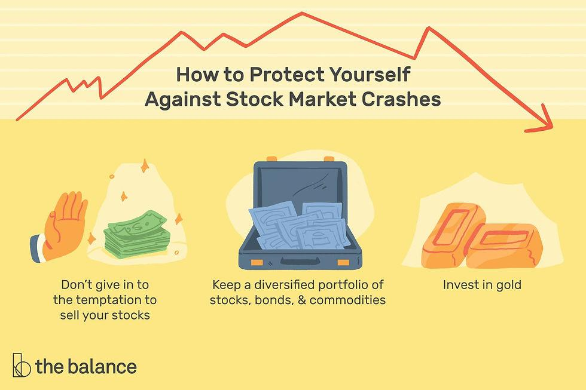

Market crashes can unsettle even seasoned investors, but with the right strategies, these downturns can present opportunities. In times of market volatility, investors often face the challenge of protecting their assets while seeking new growth avenues. This article explores various investment strategies designed to navigate and potentially benefit from market crashes, focusing on diversification, financial preparation, and algorithmic trading.

Understanding and preparing for market crashes not only helps safeguard investments but also reveals pathways for growth. Historical events, such as past financial crises, highlight the dangers of a lack of preparedness, emphasizing the need for proactive planning. By analyzing previous market behaviors, investors can develop a framework that mitigates risk and identifies potential gains.



Key themes focus on the significance of diversification, which spreads investment risk across a range of asset classes, thus reducing the impact of any single market downturn. Strategic financial planning is another pillar, involving the allocation of resources to ensure liquidity and stability during economic uncertainties. Additionally, algorithmic trading offers advanced tools for rapid decision-making and execution, allowing investors to respond swiftly to market changes.

By employing these strategies, investors can maintain a balanced approach and make informed decisions during periods of market volatility. The alignment of diversified investments, sound financial planning, and the integration of modern trading systems equips investors to not only withstand market downturns but also capitalize on the opportunities they present.

## Table of Contents

## Understanding Market Crashes

Market crashes are characterized by sharp, sudden declines in stock prices, typically triggered by panic and systemic breakdowns within the financial markets. These dramatic downturns are often exacerbated by a combination of investor sentiment, economic pressures, and technological factors such as algorithmic trading. Understanding the dynamics of market crashes requires a review of historical events that have shaped modern financial strategies.

Three significant historical instances exemplify market crashes: the dot-com bubble of 2000, the 2008 financial crisis, and the COVID-19 pandemic. Each of these events has unique characteristics but shares common underlying themes of excessive speculation and eventual market correction.

The dot-com bubble, which peaked in March 2000, was driven by speculative investments in internet-based companies. Investors' excessive optimism about the potential of these companies led to inflated stock prices, which were not sustainable based on actual profitability. When reality set in, the resulting market crash wiped out approximately $5 trillion in market value, highlighting the necessity of skeptical analysis and diversified investment strategies.

The 2008 financial crisis was rooted in the collapse of the housing market, influenced by high-risk mortgage lending and the proliferation of complex financial derivatives. As housing prices plummeted, major financial institutions faced insolvency, leading to a global credit crunch. This exemplified how interconnected systemic failures could lead to widespread economic impact, emphasizing the need for robust risk management practices.

The COVID-19 pandemic presented a different scenario, where an external health crisis triggered an unprecedented economic shutdown. The initial market crash in March 2020 resulted from both panic and uncertainty surrounding the global impact of the virus. However, swift policy responses and technological advancements in trading and communication led to a rapid recovery, underscoring the importance of adaptive strategies in volatile situations.

In analyzing these past events, it becomes clear that [algorithmic trading](/wiki/algorithmic-trading) systems play a significant role in modern market dynamics. Automated trading, which executes orders based on algorithms and predefined conditions, can lead to rapid sell-offs during market stress, amplifying downward movements. For example, during the 2010 "Flash Crash," high-frequency trading systems contributed to a massive, momentary market plunge. As these technologies become more prevalent, understanding their mechanics and potential impacts is crucial for investors looking to navigate future crashes.

Developing strategies to mitigate financial losses during such market downturns involves learning from these historical cases. By recognizing patterns and anticipatory signals, and preparing with diversified portfolios and strategic asset allocation, investors can better shield their portfolios against catastrophic losses. Assessing the role of technology, particularly algorithmic trading, in exacerbating or stabilizing market fluctuations will continue to be a critical consideration for financial strategists.

## Investment Strategies for Crashing Markets

In times of market turmoil, adopting well-structured investment strategies can buffer against losses and, in some cases, present growth opportunities. A crucial component in such strategies is diversification, which involves spreading investments across various asset classes to mitigate risk. By diversifying, investors can reduce the impact of [volatility](/wiki/volatility-trading-strategies) in any single investment, thereby promoting stability in their overall portfolio.

One effective way to achieve diversification and stability during market downturns is through fixed income securities, such as government bonds. These securities are typically less volatile than equities and provide predictable income streams, which can be particularly valuable when stock markets are under pressure. Government bonds, especially those of stable nations, are often viewed as safe havens during economic instability. They offer fixed interest payments and return of principal upon maturity, making them appealing to risk-averse investors.

Real estate and physical assets represent another avenue for diversification. These assets can generate income through rental yields and possess intrinsic value that often appreciates over time. While real estate investments require more capital and come with [liquidity](/wiki/liquidity-risk-premium) considerations, they can act as a hedge against inflation and offer a tangible asset that is less correlated with stock market movements. Physical assets, including commodities like gold and silver, have historically been regarded as safe investments during periods of high market volatility.

Hedging with financial instruments like put options is a strategic move to limit potential losses during market crashes. A put option grants the holder the right to sell a specific asset at a predetermined price before expiration, functioning as insurance against declining asset prices. For instance, if an investor holds a significant amount of stocks, purchasing puts related to those stocks can cap the downside risk if the stock prices plummet.

Inverse exchange-traded funds (ETFs) provide another strategy to benefit from or protect against declining markets. These funds are designed to move inversely to their benchmark index, thus yielding profits when the market falls. However, due to factors such as daily fund rebalancing and tracking errors, inverse ETFs are generally most effective as short-term hedging instruments rather than long-term investments. They offer a mechanism to capitalize on anticipated market downturns but require careful timing and monitoring.

In conclusion, implementing a blend of these strategies can create a resilient investment framework that safeguards capital while seizing opportunities during market downturns. By strategically allocating assets across different classes and employing hedges, investors can not only manage risk but also enhance returns under adverse market conditions.

## The Role of Financial Planning

Comprehensive financial planning acts as a cornerstone for stability, especially during market downturns. Establishing an emergency fund and managing debt effectively can significantly buffer against financial instability. An emergency fund, typically covering three to six months of living expenses, acts as a safeguard during periods of income disruption or unexpected costs. Concurrently, maintaining manageable levels of debt enhances financial flexibility, minimizing the burden of fixed obligations when market conditions sour.

Regularly reviewing and adjusting portfolios in response to evolving market conditions is another vital practice. Investors should routinely assess the allocation of their assets to ensure alignment with their risk tolerance and financial goals. This may involve rebalancing portfolios to maintain a desired level of diversification across asset classes, such as equities, fixed income, and alternative investments. For instance, selling a portion of stocks that have performed well to buy underperforming bonds might restore a portfolio to its original target allocation, thus maintaining a disciplined investment approach.

Setting clear long-term financial goals remains essential to navigate market turbulences without resorting to panic-driven decisions. Well-defined goals anchor an investor's strategy, serving as a reference point that guides actions during volatile periods. These objectives, whether they pertain to retirement, education funding, or wealth accumulation, should be realistic, achievable, and revisited regularly to reflect life changes and financial developments.

Financial advisors play a pivotal role in offering personalized advice and strategies tailored to individual risk tolerances and financial circumstances. They provide an objective perspective, helping investors avoid emotional decision-making that may lead to suboptimal outcomes. A financial advisor can utilize sophisticated tools to model various scenarios, thereby assisting clients in understanding potential impacts on their financial plans and adapting accordingly. Engaging with a financial advisor can provide not only strategic insights but also the reassurance of having an expert's guidance during turbulent times.

In conclusion, sound financial planning encompasses these strategies to fortify investors against the challenges presented by market crashes. By adopting these practices, individuals can enhance their financial resilience and position themselves to capitalize on opportunities when markets rebound.

## Algorithmic Trading and Its Impact

Algorithmic trading leverages sophisticated automated systems to initiate and manage trades based on predefined conditions. These systems operate at high speeds, significantly enhancing their ability to capitalize on market opportunities. During market crashes, algorithmic trading can intensify price fluctuations as these systems execute large volumes of trades rapidly in response to market signals. It is crucial for investors to comprehend the mechanics of algorithmic trading and its potential to amplify market volatility.

For astute investors, algorithmic trading offers substantial advantages by facilitating swift adaptation to rapidly changing market conditions. By utilizing algorithms, investors can automate the analysis of market data and execute trades without the delays typical of manual processing. This rapid response capability can be pivotal during periods of market panic and distress, where timing is of the essence.

Strategies tailored for algorithmic trading often incorporate complex mathematical models and [machine learning](/wiki/machine-learning) algorithms to optimize portfolio allocations and manage risk more effectively. For example, a common approach includes using quantitative models to determine asset price trends and execute trades that align with those trends. In Python, such strategies can be implemented using libraries like NumPy for numerical operations and Pandas for data manipulation. Machine learning frameworks such as TensorFlow or Scikit-learn can also be employed to construct predictive models that guide trading decisions.

```python
import numpy as np
import pandas as pd
from sklearn.linear_model import LinearRegression

# Example: Trading strategy based on predictive modeling
def load_market_data():
    # Load or generate market data
    return pd.DataFrame()

def train_model(data):
    X = data[['feature1', 'feature2', 'feature3']]
    y = data['price']
    model = LinearRegression().fit(X, y)
    return model

market_data = load_market_data()
model = train_model(market_data)

def execute_trade(market_data, model):
    prediction = model.predict(market_data[['feature1', 'feature2', 'feature3']])
    # Implement the logic for executing trades based on prediction

execute_trade(market_data, model)
```

Informed use of algorithmic trading systems cultivates competitive advantages by enhancing market analysis precision and execution efficiency. Investors employing these systems are better positioned to recognize and exploit subtle market patterns, driving more effective trading decisions. Nonetheless, the rapid speed and high volumes typical of algorithmic trading can lead to unforeseen market impacts, underscoring the importance of strict risk management protocols.

Algorithmic trading, due to its reliance on automation and technology, represents a double-edged sword. While it can significantly improve trading efficiencies and outcomes for prepared investors, it also poses risks related to systemic anomalies and over-reliance on technological predictions. To harness its full potential, a comprehensive understanding of algorithmic strategies and diligent risk assessment remains imperative.

## Combining Strategies: A Holistic Approach

In today's volatile financial landscape, a holistic approach to investing—encompassing diversification, financial planning, and algorithmic trading—offers a robust framework for mitigating risks and capitalizing on market opportunities. Diversification acts as a cornerstone by spreading investments across various asset classes, including stocks, bonds, real estate, and commodities, thereby reducing the exposure to any single market decline. This strategy not only cushions against losses but also enables investors to benefit from potential upswings in different sectors.

Financial planning plays a crucial role in aligning investment strategies with personal financial goals and risk tolerances. By setting clear objectives and maintaining disciplined portfolio reviews, investors can adjust their asset allocations to adapt to changing market conditions. Establishing an emergency fund and managing debt are foundational practices that provide stability, ensuring that short-term financial needs do not disrupt long-term investment plans. This proactive management of finances is key to weathering market turmoils without succumbing to panic-based decisions.

Algorithmic trading introduces a technological advantage, allowing investors to react swiftly to market changes. These automated systems execute trades based on predefined criteria, removing the emotional component of trading decisions and ensuring adherence to the investor's broader strategy. Algorithms can be tailored to optimize portfolio allocations, conduct risk assessments, and potentially exploit short-term market inefficiencies—all while operating at a speed impossible for human traders. However, it is essential to understand the mechanics of these systems, as they can exacerbate market volatility during extreme downturns.

By integrating these three strategies, investors establish a comprehensive approach that maximizes resilience. This integration ensures that each component complements the others, providing a balance between risk management and growth potential. Customizing investment strategies to match personal financial situations ensures they are both applicable and sustainable in the long term. Consequently, investors equipped with this holistic approach can better maintain steady growth and protect their assets during challenging market periods.

Continuous learning and adaptation are vital to the successful implementation of any investment strategy. As market dynamics evolve, so too must the strategies employed. Investors are advised to stay informed of new financial products, economic indicators, and technological advancements that could influence their investment landscape. This commitment to ongoing education not only enhances the ability to navigate complexities but also ensures preparedness for future market climates, turning potential challenges into opportunities for growth.

## Conclusion

Market crashes, though daunting, can be adeptly navigated with thoughtful and well-structured preparatory strategies. Key to this preparation is the diversification of investments, which distributes risk across various asset classes, minimizing the impact of any single market downturn. This multi-faceted approach includes allocating resources not only to stocks but also to bonds, real estate, and alternative investments, thereby creating a safety net that absorbs shocks from volatile market conditions.

Sound financial planning forms the bedrock of stability during turbulent times. Establishing a robust financial plan involves setting up emergency funds, prudent debt management, and regular portfolio reviews, ensuring that one's financial goals remain aligned with current market realities. This proactive approach prevents reactionary panic and keeps financial objectives on track despite external market disruptions.

Modern trading systems, particularly algorithmic trading, offer tools to swiftly adapt to market changes, enhancing an investor's ability to capitalize on short-term market movements while maintaining long-term strategy alignment. By leveraging technology, investors can implement rapid responses to price fluctuations, optimizing portfolio performance even as markets decline.

Preparedness and strategic foresight are critical components for realizing potential financial growth during market challenges. By cultivating a disciplined and informed investment strategy, investors can transform market adversities into opportunities for growth. Furthermore, embracing comprehensive strategies that integrate diversification, financial planning, and trading technologies equips investors with the necessary tools to succeed in future market climates, fostering resilience and potential for sustained financial prosperity.

## References & Further Reading

Investopedia offers a wealth of resources on diversification and market strategies, essential for investors seeking to mitigate risks during market downturns. Their articles cover a variety of tactics, including asset allocation and risk management techniques that are effective during periods of high volatility.

The Federal Reserve History provides comprehensive overviews of past market crashes. This resource is invaluable for understanding the causes and consequences of events like the dot-com bubble of 2000 and the 2008 financial crisis. It highlights the importance of being prepared with resilient investment strategies.

Books on algorithmic trading and financial planning are beneficial for those looking to deepen their understanding of automated trading systems and strategic financial management. These texts often include practical examples and case studies, helping investors harness technology for better decision-making during tumultuous market periods.

Market analysis platforms offer data-driven insights crucial for strategic planning. These platforms provide real-time market data, analytics, and forecasting tools that empower investors to make informed decisions based on current and predicted market trends. Leveraging these tools can help in adjusting strategies to align with evolving market conditions.

For those interested in expanding their knowledge, these resources provide both foundational and advanced information pertinent to navigating market volatility effectively.

