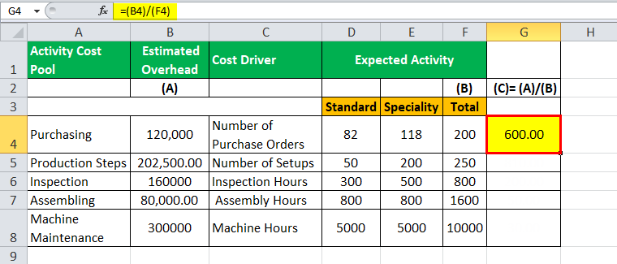

## Table of Contents

## What is Uniswap (UNI) and why would someone want to purchase it?

Uniswap (UNI) is a type of cryptocurrency that is used on a platform called Uniswap. This platform helps people trade different cryptocurrencies without needing a middleman like a bank or a traditional exchange. Uniswap works on something called the Ethereum blockchain, which is like a big, secure digital ledger that keeps track of all the trades. The special thing about Uniswap is that it uses a system called "automated liquidity provision," which means that anyone can add their cryptocurrencies to the platform and help others trade more easily.

Someone might want to purchase UNI for a few reasons. First, if they believe in the future of decentralized trading and want to support the Uniswap platform, they might buy UNI to help it grow. Second, UNI holders can vote on changes and improvements to the Uniswap platform, so if someone wants to have a say in how it develops, they would need to own some UNI. Lastly, like any cryptocurrency, people might buy UNI hoping its value will go up over time, so they can sell it later for a profit.

## How can beginners start purchasing UNI using a centralized exchange?

To start buying UNI on a centralized exchange, beginners first need to choose a reputable exchange that supports UNI, like Coinbase or Binance. They should do some research to find an exchange that is easy to use and has good security. Once they've picked an exchange, they need to sign up for an account. This usually involves giving some personal information and setting up two-factor authentication to keep the account safe. After the account is set up, they'll need to deposit money into it, usually by linking a bank account or using a credit/debit card.

Once the money is in their exchange account, beginners can search for UNI and place an order to buy it. They can choose to buy at the current market price or set a specific price they're willing to pay. After the order is filled, the UNI will show up in their exchange wallet. It's important for beginners to understand that the value of UNI can go up or down, so they should only invest money they can afford to lose. If they want to move their UNI to a personal wallet for extra security, they can do that by following the exchange's instructions for withdrawals.

## What are the steps to buy UNI directly with fiat currency?

To buy UNI directly with fiat currency, you first need to choose a centralized exchange that supports both fiat deposits and trading UNI, like Coinbase or Binance. Once you've picked an exchange, sign up for an account. You'll need to provide some personal information and set up two-[factor](/wiki/factor-investing) authentication to keep your account safe. After setting up your account, you'll need to deposit money into it. You can usually do this by linking your bank account or using a credit/debit card. The exchange will guide you through this process, making sure your money gets into your account safely.

Once you have money in your exchange account, you can search for UNI on the exchange's trading platform. You'll see the current price of UNI. To buy it, you can place an order at the current market price or set a specific price you're willing to pay. Once your order is filled, the UNI will show up in your exchange wallet. Remember, the price of UNI can go up or down, so only spend money you can afford to lose. If you want to move your UNI to a personal wallet for extra security, you can follow the exchange's instructions to withdraw it.

## Can UNI be purchased using a decentralized exchange, and if so, how?

Yes, you can buy UNI using a decentralized exchange, like Uniswap. To do this, you first need to have some Ethereum (ETH) because that's what you'll use to buy UNI. You can get ETH from a centralized exchange or another decentralized exchange. Once you have ETH, you need to connect your Ethereum wallet to the decentralized exchange. This wallet can be something like MetaMask, which you can use in your web browser. After connecting your wallet, you go to the Uniswap website, choose to swap ETH for UNI, and enter the amount of UNI you want to buy. The exchange will show you how much ETH you need to pay. If you agree with the price, you confirm the transaction, and the UNI will be sent to your wallet.

It's important to know that buying UNI on a decentralized exchange is different from using a centralized exchange. On a decentralized exchange, you're trading directly with other people's money that's been put into the exchange, not with the exchange itself. This can be safer because you don't need to trust a big company with your money, but it can also be more complicated. You need to make sure you understand how to use your wallet and how to swap your ETH for UNI. Also, the price of UNI can change quickly, so you should be ready for that. Always make sure you're only spending money you can afford to lose, because the value of UNI can go up or down.

## What are the differences between buying UNI on a centralized vs. a decentralized exchange?

When you buy UNI on a centralized exchange, you're using a big company to help you trade. They have a website where you can sign up, add money from your bank, and then buy UNI. These exchanges often have more rules and need you to give them personal information. They can be easier to use because they guide you through the process and often have customer support. But, you have to trust the company to keep your money safe. If the company gets hacked or goes out of business, you could lose your UNI.

On the other hand, buying UNI on a decentralized exchange means you're trading directly with other people's money that's been put into the exchange. You don't need to trust a big company because you're in control of your own money in your own wallet. To do this, you need to have some Ethereum first, and you use a special wallet like MetaMask to connect to the exchange. It can be a bit trickier to use because you have to understand how to swap your Ethereum for UNI. But, it can be safer because you don't have to worry about a company getting hacked or going out of business. The downside is that you might not have as much help if something goes wrong.

## How can one use a crypto wallet to buy UNI?

To use a crypto wallet to buy UNI, you first need to have a wallet that supports Ethereum and the decentralized exchange you want to use, like MetaMask. You can download MetaMask as a browser extension or use it on your phone. Once you have it set up, you'll need to add some Ethereum (ETH) to your wallet. You can get ETH from a centralized exchange or another decentralized exchange and then send it to your wallet's address. After your wallet has ETH, you go to a decentralized exchange like Uniswap, connect your wallet, and you're ready to buy UNI.

On the Uniswap website, you choose to swap your ETH for UNI. You enter how much UNI you want to buy, and the exchange will show you how much ETH you need to pay. If you're happy with the price, you confirm the transaction. The UNI will then be sent directly to your wallet. Using a crypto wallet like this means you're in control of your own money and don't have to trust a big company. But, it can be a bit more complicated, so make sure you understand how to use your wallet and the exchange before you start.

## What are the transaction fees associated with purchasing UNI?

When you buy UNI, you have to pay fees. These fees can be different depending on whether you use a centralized exchange or a decentralized exchange. On a centralized exchange, you might pay a fee for trading, which is usually a small percentage of the amount you're spending. You might also have to pay a fee to deposit money into the exchange or to withdraw your UNI to your own wallet. These fees can add up, so it's good to check what they are before you start.

On a decentralized exchange like Uniswap, you pay a fee called a "gas fee" to use the Ethereum network. This fee can change a lot depending on how busy the network is. Sometimes it's low, but other times it can be pretty high. You also pay a small fee to the people who put their money into the exchange to help you trade. This fee is usually a small percentage of your trade, like 0.3%. So, when you're buying UNI, make sure you know about these fees and how they might affect how much you're spending.

## Are there any regulatory considerations one should be aware of when buying UNI?

When you want to buy UNI, you need to think about the rules in your country. Different places have different laws about cryptocurrencies. Some countries say it's okay to buy and trade them, but others might have strict rules or even say it's not allowed. Before you start, it's a good idea to check what the rules are where you live. If you don't follow the rules, you could get in trouble or have to pay fines.

Also, if you use a centralized exchange, they might ask for your personal information to make sure they're following the law. This can include things like your name, address, and ID. They do this to stop people from using cryptocurrencies for bad things like money laundering. So, be ready to give this information if you want to buy UNI on a big exchange. It's all about making sure you're doing things the right way and staying safe.

## What are the security measures one should take when purchasing UNI?

When you want to buy UNI, it's important to keep your money safe. First, choose a good exchange that people trust and that has strong security. Look for exchanges that use two-factor authentication, which means you need to enter a special code from your phone to log in. This makes it harder for someone else to get into your account. Also, always use a strong password that's hard to guess. Don't share your password or your two-factor codes with anyone. If you're using a decentralized exchange, make sure your Ethereum wallet, like MetaMask, is set up right and that you keep your private keys secret. Your private keys are like the secret codes to your money, so if someone else finds them, they could take your UNI.

Another thing to think about is not keeping all your UNI on the exchange. Once you buy UNI, you can move it to your own wallet, like a hardware wallet, which is a special device that keeps your cryptocurrencies safe even if your computer gets hacked. When you're sending your UNI to your wallet, double-check the address you're sending it to. If you send it to the wrong address, you might lose your UNI forever. Also, be careful of scams. Don't click on links in emails or messages that you're not sure about, and never give out your private keys or passwords to anyone who contacts you, even if they say they're from the exchange. By taking these steps, you can help keep your UNI safe.

## How can advanced users leverage DeFi platforms to acquire UNI?

Advanced users can use DeFi platforms to get UNI by using different ways to trade and earn money. One way is to use decentralized exchanges like Uniswap or SushiSwap, where they can swap other cryptocurrencies they already have for UNI. They might also use [liquidity](/wiki/liquidity-risk-premium) pools, where they add their own cryptocurrencies to help others trade, and in return, they get a part of the trading fees as UNI. Another way is to use lending and borrowing platforms like Aave or Compound, where they can borrow UNI using other cryptocurrencies as collateral. These platforms let them take advantage of different DeFi opportunities to grow their UNI holdings.

Another way advanced users can get UNI is by taking part in yield farming or staking on DeFi platforms. Yield farming means they put their cryptocurrencies into different DeFi projects to earn rewards, which can sometimes be in UNI. Staking is when they lock up their cryptocurrencies to help run a blockchain network, and they get rewards, which could also be UNI. These methods can be a bit tricky and need a good understanding of how DeFi works, but they can be a good way to get more UNI if used right. Always remember that DeFi can be risky, so it's important to do a lot of research and only use money you can afford to lose.

## What are the tax implications of buying and selling UNI?

When you buy and sell UNI, you might have to pay taxes on it. In many countries, if you make money from selling UNI for more than you paid for it, that's called a capital gain, and you have to pay tax on it. The amount of tax you pay can be different depending on how long you held the UNI before selling it. If you held it for a short time, you might pay a higher tax rate than if you held it for a long time. It's important to keep track of how much you paid for the UNI and how much you sold it for, so you can figure out your taxes correctly.

Also, if you get UNI as a reward from things like yield farming or staking, that might be seen as income by the tax people. This means you have to report it and pay tax on it, just like you would with money you earn from a job. The rules about taxes and cryptocurrencies can be different in every country, so it's a good idea to check the rules where you live. Talking to a tax expert can help you understand what you need to do and make sure you're following the rules correctly.

## How can one optimize their strategy for purchasing UNI based on market analysis and trends?

To optimize your strategy for buying UNI, you should keep an eye on what's happening in the market and look for trends. One way to do this is by checking the price charts to see if UNI is going up or down over time. If you see that the price is going down and you think it might go back up, that could be a good time to buy. You can also look at news about Uniswap and the wider [cryptocurrency](/wiki/cryptocurrency) world, because big news can change the price of UNI. For example, if there's news about a new feature coming to Uniswap, that might make more people want to buy UNI, pushing the price up. Also, seeing what other people are saying on social media and in online groups can give you ideas about where the price might be heading.

Another thing to think about is how much other people are trading UNI. If a lot of people are buying and selling, it might mean the price could move a lot, so you need to be ready for that. You can also use tools like technical analysis, which looks at past price movements to guess what might happen next. These tools can help you decide when to buy UNI to get the best price. But remember, the cryptocurrency market can be unpredictable, so always be careful and only spend money you can afford to lose. By keeping up with the market and using these strategies, you can make better choices about when to buy UNI.

## What are the algorithmic trading strategies for UNI?

Algorithmic trading leverages computational power to execute trades on digital currencies like Uniswap's UNI token, based on predefined rule sets. These algorithms surpass human abilities in speed and precision, enabling rapid responses to market movements. 

One common strategy is [arbitrage](/wiki/arbitrage), which exploits price discrepancies across different exchanges. In a simplified scenario, if UNI is cheaper on one platform than another, a trader can buy low and sell high, securing a profit. The formula for potential arbitrage profit can be expressed as:

$$
\text{Profit} = (\text{Sell Price} - \text{Buy Price}) \times \text{Number of UNI Tokens} - \text{Transaction Fees}
$$

Market making is another strategy, where the algorithm provides buy and sell orders to profit from the bid-ask spread. This approach requires maintaining liquidity on both sides of the [order book](/wiki/order-book-trading-strategies) and continuously updating prices to match evolving market conditions. An exemplary Python snippet for setting up market-making orders may look like:

```python
def market_make(uni_price, spread):
    buy_price = uni_price * (1 - spread / 2)
    sell_price = uni_price * (1 + spread / 2)
    return {'buy': buy_price, 'sell': sell_price}

uni_price = 25.0  # Example current price of UNI
spread = 0.02  # Desired spread percentage
orders = market_make(uni_price, spread)
print(f"Buy at: {orders['buy']}, Sell at: {orders['sell']}")
```

Trend following involves leveraging historical price data to predict future movements and make trades based on these predictions. Algorithms typically use moving averages, where a crossover can signal a potential buy or sell opportunity:

- Simple Moving Average (SMA): $\text{SMA} = \frac{\sum (\text{closing prices over a period})}{\text{number of periods}}$

These algorithmic strategies require rigorous [backtesting](/wiki/backtesting) against historical market data to ensure their robustness and efficiency. Backtesting helps identify potential risks and refine strategies for better performance and risk management. Historical data analysis can help estimate returns, optimize parameters, and ensure the strategy's viability without incurring real-world losses. 

Each [algorithmic trading](/wiki/algorithmic-trading) strategy for UNI must be tailored to individual trading goals, risk tolerance, and market conditions to maximize efficacy and minimize potential losses.

## References & Further Reading

[1]: History & Development of Uniswap Protocol[^1]. (n.d.). Retrieved from https://uniswap.org/

[2]: Lopez de Prado, M. (2018). ["Advances in Financial Machine Learning"](https://books.google.com/books/about/Advances_in_Financial_Machine_Learning.html?id=oU9KDwAAQBAJ). Wiley.

[3]: Gudgeon, L., Perez, D., Harz, D., Livshits, B., & Gervais, A. (2020). ["The Decentralized Financial Crisis: Attacking DeFi"](https://arxiv.org/abs/2002.08099). Financial Cryptography and Data Security 2020.

[4]: Aronson, D. R. (2006). ["Evidence-Based Technical Analysis: Applying the Scientific Method and Statistical Inference to Trading Signals"](https://www.amazon.com/Evidence-Based-Technical-Analysis-Scientific-Statistical/dp/0470008741). Wiley.

[5]: Buterin, V. (2014). ["A Next-Generation Smart Contract and Decentralized Application Platform"](https://ethereum.org/content/whitepaper/whitepaper-pdf/Ethereum_Whitepaper_-_Buterin_2014.pdf). Ethereum White Paper.

[6]: Jansen, S. (2020). ["Machine Learning for Algorithmic Trading"](https://github.com/stefan-jansen/machine-learning-for-trading). Packt Publishing.

[7]: Chan, E. P. (2008). ["Quantitative Trading: How to Build Your Own Algorithmic Trading Business"](https://github.com/ftvision/quant_trading_echan_book). Wiley.