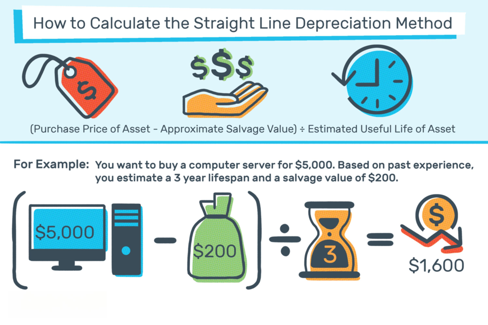

Property tax can be a perplexing and often overwhelming concept for homeowners, particularly when faced with increasing figures on their annual tax bills. This form of taxation, determined by the appraised value of a property, can sometimes seem erratic and unjust, weighing heavily on a homeowner’s financial planning and budgeting. The complexity arises from the intricate processes involved in property valuation and the variety of factors that contribute to fluctuating assessment values.

This article aims to dispel the confusion surrounding property taxes by offering clarity on the fundamental principles governing them. We will present straightforward strategies to help homeowners effectively reduce their tax liabilities, ensuring they are not paying more than necessary. Understanding the methods by which property values are assessed, and subsequently taxed, is crucial for making informed decisions and managing expenses thoughtfully.



Additionally, as technology rapidly evolves, the financial sector has witnessed significant advancements in techniques like algorithmic trading, which are becoming increasingly relevant to tax management. Algorithmic trading involves using computer systems programmed with specific rules to execute trades, and it can be applied to optimize tax outcomes. By leveraging such technology, homeowners and investors can enhance their financial handling, ensuring transactions and investments are performed with maximum fiscal efficiency.

We invite you to explore the fundamentals of property tax, strategies to limit tax expenditures, and the potentially transformative role that algorithmic trading can play in tax planning. By the conclusion of this article, the mysterious world of property taxes will hopefully seem a little less daunting, and readers will be equipped with knowledge to fortify their financial health.

## Table of Contents

## Understanding Property Taxes

Property taxes are financial charges levied by local governments, municipalities, or jurisdictions on property owners based on the assessed value of their real estate. These taxes are essential sources of revenue for public services, funding crucial communal necessities such as schools, police and fire departments, road maintenance, and public infrastructure development.

### Key Terminology: Ad Valorem

The term 'ad valorem' is pivotal in understanding property taxes. It is a Latin phrase meaning "according to value." Property taxes are typically assessed on an ad valorem basis, which implies that the tax is proportional to the property's value. This method of calculation means that properties assessed at higher values incur higher tax liabilities, ensuring that taxpayers contribute equitably in relation to the value of their properties.

### Property Value Assessment

Property value assessment is a critical process in determining property tax. This evaluation is usually conducted by a tax assessor who estimates the property's market value based on several factors, including location, size, condition, and comparable recent sales in the area. The assessment aims to reflect what the property would sell for under current market conditions. 

#### Formula to Calculate Property Taxes:

The basic formula for calculating property taxes is:

$$
\text{Property Tax} = \text{Assessed Value} \times \text{Tax Rate}
$$

Where:
- **Assessed Value**: The valuation of the property as determined by the tax assessor.
- **Tax Rate**: Sometimes referred to as a mill rate, it is typically expressed as a percentage or per thousand dollars of assessed value.

### Impact on Homeowners

Understanding how their property values are assessed can significantly impact homeowners. An increase in a property's assessed value often results in higher taxes. Therefore, accurate assessments are crucial to avoid overpaying. Homeowners have the right to challenge assessment values if they believe there is an overvaluation, thus potentially lowering their tax burden.

In summary, property taxes are integral to local government finance, with assessments grounded in the property's market value and ad valorem principles. Homeowners should remain informed about how these values are determined to manage their fiscal responsibilities effectively.

## Strategies for Lowering Property Taxes

Obtaining a property tax card is a crucial first step in ensuring the accuracy of your property's assessed value. This document provides a breakdown of your property's characteristics, such as square footage, the number of bedrooms and bathrooms, lot size, and any additional features that might influence its assessed value. By reviewing this card, you can identify discrepancies or outdated information that could lead to an incorrect tax assessment. If any errors are found, contacting your local tax assessor's office to request a correction can help to avoid overpayment.

Another effective strategy is to avoid making substantial improvements or enhancements to your property before an assessment. Additions like a new garage, swimming pool, or extended living space increase the property's market value, subsequently raising the assessed value and property taxes. It's advisable to complete such projects after assessments to postpone the impact on your tax liabilities. 

Additionally, homeowners should research available tax exemptions and relief programs, which can provide significant savings. Various programs offer tax breaks for veterans, senior citizens, or individuals with disabilities. For instance, senior citizens may be eligible for exemptions that reduce their home's assessed value or freeze it at a certain level, resulting in lower taxes. It's important to verify the qualifications and apply for these exemptions through your local tax authority to benefit from potential reductions.

Implementing these strategies requires diligence and an understanding of your local tax laws, but the potential savings can be substantial. Proactive measures like keeping your property's information up-to-date and strategically timing improvements can reduce your property tax burden significantly.

## Appealing Your Property Tax Assessment

Filing a property tax appeal is a critical recourse for homeowners who believe their property has been overvalued. This process, while sometimes daunting, can potentially lead to significant savings if pursued effectively. The initial step in appealing a property tax assessment involves a comprehensive understanding of the local processes and regulations governing property tax appeals. Each municipality may have its procedural nuances, so familiarizing oneself with these specifics is essential.

Homeowners should begin by scrutinizing their property tax assessment notice, which provides crucial information such as the deadline for filing an appeal and the assessed value assigned to the property. It is important to adhere strictly to the provided deadlines, as missing these can result in the forfeiture of the right to appeal for that tax year.

The cornerstone of a successful property tax appeal lies in producing substantial evidence that supports the claim of overvaluation. This typically involves conducting a thorough market analysis to compare the assessed property against similar properties, known as comparables, that have been recently sold in the neighborhood. The ideal comparable should closely match the appellant's property in terms of size, age, style, and location, as these factors prominently influence market value assessments.

Property owners may enhance the strength of their appeal by identifying any discrepancies in their property’s tax card. Errors in details such as the dimensions of the property, the number of rooms, or the condition can unjustly inflate the assessed value. An accurate property description ensures that the basis of the assessment is founded on correct information.

Moreover, engaging professional help, such as an appraiser or a real estate attorney familiar with tax assessments, may be beneficial in compiling a robust appeal. These experts can provide an authoritative appraisal report or legal guidance, which can articulate and substantiate the argument for a reduced valuation effectively.

Timing is another critical [factor](/wiki/factor-investing) in the appeals process. Appeals must be filed within a specified period after the assessment notice has been issued. This filing window varies by jurisdiction but is typically between 30 to 90 days. Missing this deadline generally means waiting until the next assessment cycle to appeal.

The appeals process might culminate in a hearing before a tax review board or a similar authority, depending on the locale. Preparing for this hearing necessitates an organized presentation of evidence and a clear explanation of why the current assessment is erroneous relative to comparable properties and market conditions.

Therefore, while challenging a property tax assessment requires careful preparation and adherence to procedural norms, it offers an avenue for ensuring that homeowners pay taxes reflective of their property’s true market value.

## Leveraging Algorithmic Trading for Tax Reduction

Algorithmic trading, a technique primarily used by financial institutions and day traders, relies on complex algorithms to transact large volumes of financial instruments rapidly. This technology can be harnessed for tax optimization by strategically managing investment portfolios to minimize taxable events. The following outlines how [algorithmic trading](/wiki/algorithmic-trading) can aid in effective tax planning.

Modern algorithms process vast amounts of market data to forecast trends and identify optimal trading opportunities. By employing these predictive models, investors can time the sale of assets to coincide with lower capital gains taxes or avoid taxable events altogether. For example, by utilizing algorithms to buy or sell securities in a tax-efficient manner, investors can defer tax liabilities, optimizing the timing of capital gains with respect to tax obligations.

Algorithmic trading can also enhance asset [liquidity](/wiki/liquidity-risk-premium), offering the flexibility to liquidate holdings when market conditions are favorable without triggering significant tax consequences. This liquidity management is crucial in tax planning, as it allows for strategic rebalancing of portfolios to align with both financial goals and tax considerations.

Consider the Python snippet below, which demonstrates a simplified version of an algorithmic trading strategy aimed at tax optimization:

```python
import pandas as pd
import numpy as np

def calculate_optimal_trades(price_data, tax_rate):
    """Calculate trades to minimize tax burden."""
    # Simulate expected returns and tax impact
    price_data['returns'] = price_data['price'].pct_change()
    price_data['tax_impact'] = price_data['returns'] * tax_rate

    # Optimize to reduce overall tax impact
    price_data['decision'] = np.where(price_data['tax_impact'] < 0, 'hold', 'sell')
    return price_data

# Example price data
price_data = pd.DataFrame({
    'date': pd.date_range(start='2023-01-01', periods=5, freq='D'),
    'price': [100, 105, 107, 103, 110]
})

# Assume a tax rate of 20%
result = calculate_optimal_trades(price_data, tax_rate=0.20)
print(result)
```

In this simplified model, the algorithm evaluates daily price changes and advises sell decisions only when expected tax impacts are negative, thus optimizing the tax outcome each day.

By incorporating algorithmic trading into tax planning processes, both individual investors and homeowners with diversified portfolios can manage their tax liabilities more effectively. This approach, when coupled with an understanding of trading patterns and tax regulations, enables the execution of financial strategies that are not only aligned with market performance but also optimized for tax efficiency. As algorithmic trading technologies become more accessible, they offer actionable solutions for reducing tax burdens and enhancing overall financial management.

## Conclusion

Effective management of property taxes is possible through diligent review and strategic planning. Gaining a comprehensive understanding of the property tax assessment process empowers homeowners to take actionable steps towards reducing their tax burdens. By scrutinizing property tax cards and identifying any discrepancies, owners can ensure the accuracy of their property evaluations. Such vigilance can reveal opportunities for contesting overvalued assessments, leading to potential savings on annual tax bills.

Implementing cost-saving strategies plays a crucial role in managing property tax obligations. Homeowners can benefit from familiarizing themselves with available exemptions and relief programs, tailor-made for specific demographics such as veterans and senior citizens. These programs can decrease tax liabilities significantly, providing much-needed financial relief.

Furthermore, the integration of technological advancements like algorithmic trading can enhance the efficiency of tax management. By leveraging algorithms to analyze and predict market trends, individuals can strategically manage their financial portfolios. Algorithmic trading can minimize taxable events and optimize asset liquidity, contributing to a more organized and potentially profitable financial landscape.

In conclusion, the synthesis of strategic planning with modern technology marks a transformative approach to handling property taxes. Homeowners can achieve tangible tax savings and streamlined financial management by actively engaging with tax assessment processes and embracing innovations like algorithmic trading.

## References & Further Reading

[1]: ["Property Taxes and Assessments"](https://realestate.usnews.com/real-estate/articles/what-is-a-property-tax-assessment) from the Internal Revenue Service

[2]: ["A Homeowner's Guide to Property Tax"](https://dor.wa.gov/sites/default/files/2022-02/HomeOwn.pdf) by the Lincoln Institute of Land Policy

[3]: ["The End of Accounting and the Path Forward for Investors and Managers"](https://onlinelibrary.wiley.com/doi/book/10.1002/9781119270041) by Baruch Lev and Feng Gu

[4]: ["Algorithmic Trading and DMA: An introduction to direct access trading strategies"](https://www.amazon.com/Algorithmic-Trading-DMA-introduction-strategies/dp/0956399207) by Barry Johnson

[5]: ["Machine Learning for Algorithmic Trading: Predictive models to extract signals from market and alternative data for systematic trading strategies with Python"](https://www.amazon.com/Machine-Learning-Algorithmic-Trading-alternative/dp/1839217715) by Stefan Jansen

[6]: ["Property Tax Assessment & Appeals"](https://www.phila.gov/departments/board-of-revision-of-taxes/property-assessment-appeals/) from Lawyers.com