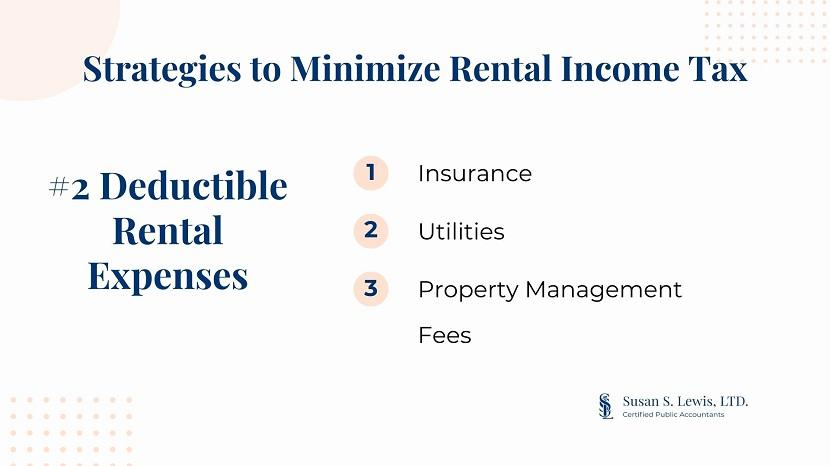

## Table of Contents

## What is property tax and why is it important to manage its expenses?

Property tax is a tax that you pay on the value of your home or land. It is usually collected by the local government, like the city or county where you live. The money from property taxes helps pay for things like schools, roads, and other public services in your community. The amount of property tax you owe depends on how much your property is worth and the tax rates set by your local government.

It's important to manage your property tax expenses because they can be a big part of your yearly costs. If you don't keep track of them, you might end up owing more money than you expected. Also, if you pay your property taxes on time, you can avoid extra fees and penalties. By managing your property tax expenses well, you can make sure you have enough money for other important things, like saving for the future or paying other bills.

## How can homeowners determine their current property tax rate?

Homeowners can find their current property tax rate by looking at their property tax bill. This bill comes from the local government, like the city or county, and it shows how much tax you owe based on the value of your home or land. The tax rate is usually shown as a percentage or a dollar amount per $100 of assessed value. You can also check your local government's website, where they often post the current tax rates for different areas.

If you want to understand how your property tax rate is calculated, you can contact your local tax assessor's office. They can explain how they figure out the value of your property and how they set the tax rate. Sometimes, the tax rate changes from year to year, so it's a good idea to check it regularly to know how much you'll need to pay.

## What are the basic eligibility criteria for property tax exemptions?

Property tax exemptions are special rules that can lower or even remove the amount of property tax you have to pay. To qualify for these exemptions, you usually need to meet certain rules set by your local government. Common reasons for exemptions include being a senior citizen, a veteran, or having a disability. Sometimes, if your income is low, you might also qualify for an exemption.

Each place has its own rules about who can get a property tax exemption. You might need to fill out forms and show proof that you meet the rules, like showing your age, military service records, or income statements. It's important to check with your local tax office to find out exactly what you need to do to apply for an exemption. They can tell you about any deadlines and help you with the application process.

## Can filing an appeal against property assessment reduce tax expenses?

Filing an appeal against your property assessment can sometimes help lower your property taxes. If you think the value of your home or land is too high, you can ask the local tax office to look at it again. If they agree with you and lower the value, your property taxes will go down because they are based on that value.

The process to file an appeal can be different depending on where you live. You usually need to fill out some forms and maybe go to a meeting to talk about why you think the value is wrong. It's important to have good reasons and maybe even some proof, like recent sales of similar homes in your area, to show that your property is worth less than what they said. If your appeal works, you could save money on your taxes.

## How does understanding local tax laws help in reducing property tax?

Understanding local tax laws can help you save money on your property taxes. When you know the rules, you can find out if you qualify for any tax breaks or exemptions. For example, some places give lower taxes to seniors, veterans, or people with disabilities. If you know about these rules, you can apply for them and maybe pay less tax.

Also, knowing the local tax laws can help you if you think your property is valued too high. You can file an appeal to get the value lowered, which means you'll pay less tax. It's important to know the deadlines and what proof you need to make a good case. By understanding these laws, you can make smart choices to keep your property tax costs down.

## What role do homestead exemptions play in lowering property tax bills?

Homestead exemptions are special rules that can lower the property taxes you have to pay on your home. They work by reducing the part of your home's value that gets taxed. For example, if your home is worth $200,000 and you get a homestead exemption of $50,000, you only pay taxes on the $150,000. This means your property tax bill will be lower because you're taxed on a smaller amount.

To get a homestead exemption, you usually need to live in the home as your main place to live. Different places have different rules about who can get these exemptions and how much they are worth. You might need to fill out some forms and show that you live there. By understanding and applying for a homestead exemption, you can save money on your property taxes every year.

## How can seniors or disabled individuals benefit from property tax relief programs?

Seniors and disabled individuals can often get help with their property taxes through special programs. These programs can lower the amount of tax they have to pay or even take it away completely. For example, many places offer exemptions for seniors, which means they don't have to pay taxes on part of their home's value. Disabled people might also get these exemptions, or they might get a special tax break because of their disability. To get these benefits, seniors and disabled individuals need to apply and show proof of their age or disability.

These tax relief programs are important because they can make a big difference in the lives of seniors and disabled people. Paying property taxes can be hard, especially if someone is living on a fixed income. By getting a tax break, they can keep more of their money for other important things, like medicine, food, or bills. It's a good idea for seniors and disabled individuals to check with their local tax office to see what programs they might qualify for and how to apply.

## What are the steps to successfully apply for a property tax freeze?

A property tax freeze is a program that stops your property taxes from going up. This can be really helpful if you're on a fixed income, like many seniors. To apply for a property tax freeze, you first need to find out if your state or local area offers this program. Not all places have it, so you should check with your local tax office or look on their website. Once you know it's available, you'll need to get the right forms to apply. These forms usually ask for information about your age, income, and the property you own.

After you fill out the forms, you'll need to send them back to the tax office before the deadline. It's important to include all the documents they ask for, like proof of your age and income. This might be things like your birth certificate, Social Security statements, or recent tax returns. If everything is correct and you meet the rules, your property taxes will stay the same even if the tax rates or the value of your home goes up. This can save you a lot of money over time, so it's worth taking the time to apply if you can.

## How does investing in energy-efficient home improvements affect property tax?

Investing in energy-efficient home improvements can sometimes affect your property tax. Some places give you a tax break if you make your home more energy-efficient. This means you might pay less in property taxes if you add things like solar panels, energy-efficient windows, or better insulation. These tax breaks are called incentives, and they're meant to encourage people to save energy and help the environment.

To get these tax breaks, you usually need to apply and show proof of the improvements you made. The rules can be different depending on where you live, so it's a good idea to check with your local tax office. They can tell you what kinds of improvements qualify and how much you can save on your taxes. By making your home more energy-efficient, you not only save money on your energy bills but might also get a break on your property taxes.

## What advanced strategies involve tax deferrals and their long-term impacts?

Tax deferrals are a way to put off paying your property taxes until later. This can be helpful if you need some extra money now, but it's important to think about the long-term effects. When you defer your taxes, you're not getting out of paying them completely. You'll still have to pay them eventually, and sometimes you might have to pay interest on the amount you deferred. This means that while you might have more money in your pocket right now, you could end up owing more in the future.

In the long run, tax deferrals can affect your finances in different ways. If you're planning to stay in your home for a long time, the deferred taxes might add up and become a big bill when you finally have to pay. On the other hand, if you're planning to sell your home, you might be able to use the money from the sale to pay off the deferred taxes. It's important to think carefully about your future plans and talk to a financial advisor to understand how tax deferrals might impact your situation over time.

## How can property owners utilize tax increment financing to manage tax expenses?

Tax increment financing (TIF) is a way for property owners to manage their tax expenses by using the extra tax money that comes from improvements to their property. When a property owner makes improvements that increase the value of their property, the taxes go up too. With TIF, the extra tax money, or the "increment," can be used to pay for the costs of those improvements instead of going straight to the local government. This can help property owners manage their tax expenses because they can use the increased taxes to pay for the upgrades they made.

Using TIF can be a smart way to handle property tax expenses, but it's important to understand how it works in your area. Different places have different rules about TIF, and you usually need to apply and get approval from your local government. If you're thinking about using TIF, it's a good idea to talk to a financial advisor or someone who knows about local tax laws. They can help you figure out if TIF is a good option for you and how to use it to manage your property tax expenses effectively.

## What are the potential risks and rewards of contesting property tax through legal means?

Contesting your property tax through legal means can be a way to lower your tax bill, but it comes with some risks. If you win your case, you might get your property's value lowered, which means you'll pay less in taxes. This can save you a lot of money over time. But, taking your case to court can be expensive and take a long time. You might need to hire a lawyer, and there's no guarantee you'll win. If you lose, you'll still have to pay the full amount of taxes, plus any legal fees you racked up.

On the other hand, the rewards can be worth it if you're successful. Not only do you save money on your current taxes, but a lower assessed value can also mean lower taxes in the future. This can be especially helpful if you're on a tight budget or if you think your property is valued much higher than it should be. Just make sure you have a strong case with good evidence, like recent sales of similar homes in your area, to show that your property's value is too high.

## What is the understanding of property taxes?

Property taxes are financial charges levied by local governments, municipalities, or jurisdictions on property owners based on the assessed value of their real estate. These taxes are essential sources of revenue for public services, funding crucial communal necessities such as schools, police and fire departments, road maintenance, and public infrastructure development.

### Key Terminology: Ad Valorem

The term 'ad valorem' is pivotal in understanding property taxes. It is a Latin phrase meaning "according to value." Property taxes are typically assessed on an ad valorem basis, which implies that the tax is proportional to the property's value. This method of calculation means that properties assessed at higher values incur higher tax liabilities, ensuring that taxpayers contribute equitably in relation to the value of their properties.

### Property Value Assessment

Property value assessment is a critical process in determining property tax. This evaluation is usually conducted by a tax assessor who estimates the property's market value based on several factors, including location, size, condition, and comparable recent sales in the area. The assessment aims to reflect what the property would sell for under current market conditions. 

#### Formula to Calculate Property Taxes:

The basic formula for calculating property taxes is:

$$
\text{Property Tax} = \text{Assessed Value} \times \text{Tax Rate}
$$

Where:
- **Assessed Value**: The valuation of the property as determined by the tax assessor.
- **Tax Rate**: Sometimes referred to as a mill rate, it is typically expressed as a percentage or per thousand dollars of assessed value.

### Impact on Homeowners

Understanding how their property values are assessed can significantly impact homeowners. An increase in a property's assessed value often results in higher taxes. Therefore, accurate assessments are crucial to avoid overpaying. Homeowners have the right to challenge assessment values if they believe there is an overvaluation, thus potentially lowering their tax burden.

In summary, property taxes are integral to local government finance, with assessments grounded in the property's market value and ad valorem principles. Homeowners should remain informed about how these values are determined to manage their fiscal responsibilities effectively.

## References & Further Reading

[1]: ["Property Taxes and Assessments"](https://realestate.usnews.com/real-estate/articles/what-is-a-property-tax-assessment) from the Internal Revenue Service

[2]: ["A Homeowner's Guide to Property Tax"](https://dor.wa.gov/sites/default/files/2022-02/HomeOwn.pdf) by the Lincoln Institute of Land Policy

[3]: ["The End of Accounting and the Path Forward for Investors and Managers"](https://onlinelibrary.wiley.com/doi/book/10.1002/9781119270041) by Baruch Lev and Feng Gu

[4]: ["Algorithmic Trading and DMA: An introduction to direct access trading strategies"](https://www.amazon.com/Algorithmic-Trading-DMA-introduction-strategies/dp/0956399207) by Barry Johnson

[5]: ["Machine Learning for Algorithmic Trading: Predictive models to extract signals from market and alternative data for systematic trading strategies with Python"](https://www.amazon.com/Machine-Learning-Algorithmic-Trading-alternative/dp/1839217715) by Stefan Jansen

[6]: ["Property Tax Assessment & Appeals"](https://www.phila.gov/departments/board-of-revision-of-taxes/property-assessment-appeals/) from Lawyers.com