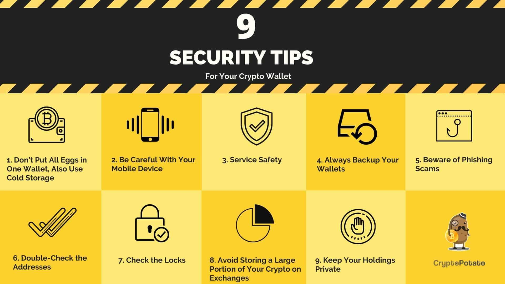

## Table of Contents

## What is Bitcoin and why is it important to secure it?

Bitcoin is a type of digital money that you can use to buy things online. It's different from regular money because it's not controlled by any government or bank. Instead, it uses something called blockchain technology, which is like a big, public record book that keeps track of all Bitcoin transactions. People can send and receive Bitcoins through the internet, and it's becoming more popular every day.

It's really important to keep your Bitcoins safe because if someone steals them, you can't get them back like you can with a credit card or bank account. Since Bitcoin is digital, hackers might try to break into your computer or phone to steal your Bitcoins. That's why people use special tools and methods, like strong passwords and secure wallets, to protect their Bitcoins. Keeping your Bitcoins secure helps you keep your money safe and makes sure you can use it whenever you need to.

## What are the most common types of Bitcoin theft?

The most common type of Bitcoin theft happens when hackers break into people's computers or phones. They might trick you into clicking on a bad link or downloading a harmful file. Once they get into your device, they can steal your Bitcoin wallet information and take your Bitcoins. This is called hacking or phishing.

Another way thieves steal Bitcoins is by taking over your online accounts. They might guess your password or use information they found about you to get into your email or social media. Once they control your accounts, they can change your Bitcoin wallet's password and steal your money. This is called account takeover.

Sometimes, thieves also target the places where people keep their Bitcoins, like [cryptocurrency](/wiki/cryptocurrency) exchanges. If they can break into these exchanges, they can steal a lot of Bitcoins at once. This is called an exchange hack. It's important to be careful and use strong security to protect your Bitcoins from these kinds of theft.

## How can beginners use strong passwords to protect their Bitcoin wallets?

Beginners can protect their Bitcoin wallets by using strong passwords. A strong password should be long and include a mix of letters, numbers, and special characters. It's a good idea to use a phrase or sentence that you can remember easily but is hard for others to guess. For example, "MyDogLoves2Play!" is better than "password123". Avoid using common words, personal information like your birthday, or simple patterns like "12345".

It's also important to use a different password for your Bitcoin wallet than the ones you use for other accounts. If one of your other accounts gets hacked, you don't want the thief to be able to get into your Bitcoin wallet too. You can use a password manager to help you keep track of all your different passwords. A password manager is a safe place to store your passwords so you don't have to remember them all.

Remember to change your password regularly, like every few months, to keep it secure. If you think someone might have seen your password or if you've used it on a website that got hacked, change it right away. Keeping your password strong and secret is one of the best ways to protect your Bitcoins.

## What is two-factor authentication and how does it help secure Bitcoin?

Two-[factor](/wiki/factor-investing) authentication, often called 2FA, is an extra layer of security you can add to your Bitcoin wallet. It works by asking you to enter not just your password, but also a second piece of information to prove it's really you. This second piece could be a code sent to your phone, a fingerprint, or even a special app on your phone. By using 2FA, you make it much harder for thieves to steal your Bitcoins, even if they somehow find out your password.

Adding 2FA to your Bitcoin wallet makes it safer because it means a thief would need both your password and your phone or another device to get into your wallet. This is a big problem for them because it's much harder to steal two things than just one. So, even if someone guesses or hacks your password, they still can't get to your Bitcoins without that second piece of information. Using 2FA is a smart way to keep your digital money safe.

## How can using hardware wallets enhance the security of Bitcoin?

Using a hardware wallet can make your Bitcoin much safer. A hardware wallet is a small device, kind of like a USB stick, that you can use to store your Bitcoin. It's different from keeping your Bitcoin on your computer or phone because it's not connected to the internet all the time. This makes it really hard for hackers to steal your Bitcoin because they can't get to your wallet through the internet. The only time you connect your hardware wallet to a computer is when you want to send or receive Bitcoin, and even then, it's safe because the private keys, which are like the secret codes to your Bitcoin, never leave the device.

Hardware wallets also help keep your Bitcoin safe by making you physically press buttons on the device to confirm any transactions. This means that even if someone tricks you into entering your password on a fake website, they still can't send your Bitcoin without having the hardware wallet in their hands. This extra step adds a lot of security and peace of mind, knowing that your Bitcoin is protected by something you can hold in your hand.

## What are cold storage solutions and how do they work?

Cold storage solutions are ways to keep your Bitcoin safe by storing it offline, away from the internet. This is important because if your Bitcoin is not connected to the internet, hackers can't get to it easily. Cold storage can be done using hardware wallets, which are small devices that you can plug into your computer only when you need to send or receive Bitcoin. Another way is using paper wallets, where you write down your Bitcoin information on a piece of paper and keep it in a safe place.

Both hardware and paper wallets work by keeping your private keys, which are like the secret codes to your Bitcoin, offline. With a hardware wallet, the private keys never leave the device, so even if you connect it to a computer, your Bitcoin stays safe. With a paper wallet, you write down the keys and store the paper somewhere secure, like a safe or a locked drawer. By using cold storage, you make it much harder for thieves to steal your Bitcoin because they would need physical access to your wallet.

## How can multi-signature wallets increase the security of Bitcoin transactions?

Multi-signature wallets, or multisig wallets, make Bitcoin transactions more secure by needing more than one person to agree before any Bitcoin can be sent. Imagine you're playing a game where you need two keys to open a treasure chest. In a multisig wallet, you set it up so that you need, say, two out of three keys to unlock and send your Bitcoin. This means that even if someone steals one of your keys, they can't take your Bitcoin without the other keys.

This setup is great for groups or businesses where different people need to agree on spending. It's like having a safety net because if one person's key gets lost or stolen, the Bitcoin is still safe. Multisig wallets make it harder for thieves to steal your Bitcoin because they would need to get more than one key, which is much tougher to do.

## What are the best practices for securing Bitcoin on exchanges?

Keeping your Bitcoin safe on exchanges means using strong security steps. One important thing is to use two-factor authentication, or 2FA. This means you need to enter a code from your phone or another device, along with your password, to log in. This makes it much harder for hackers to get into your account, even if they know your password. Also, use a strong password that's long and has a mix of letters, numbers, and special characters. Don't use the same password for different accounts, and change it every few months to keep it safe.

Another good practice is to move most of your Bitcoin off the exchange and into a secure wallet, like a hardware wallet. Exchanges are targets for hackers because they hold a lot of Bitcoin, so it's safer to keep your Bitcoin in a wallet that's not connected to the internet all the time. If you need to keep some Bitcoin on the exchange for trading, only keep what you need for a short time. Always check the exchange's security features and make sure they have a good reputation for keeping users' money safe.

Lastly, be careful with emails and messages that ask for your personal information or try to trick you into clicking on links. These are called phishing attacks, and they're a common way for thieves to steal Bitcoin. Always double-check the sender's email address and never click on links or download files from unknown sources. If something seems suspicious, contact the exchange directly through their official website or customer support to make sure it's legitimate.

## How does encryption help in protecting Bitcoin from hacking?

Encryption is like a secret code that keeps your Bitcoin safe from hackers. When you use encryption, your Bitcoin wallet's information gets turned into a jumbled mess that only you can understand with the right key. This means that even if a hacker gets into your computer or phone, they can't read or use your Bitcoin information without the key. It's like sending a secret message that only the person with the special decoder can read.

Using encryption on your Bitcoin wallet, especially when you're sending or receiving Bitcoin, makes it much harder for thieves to steal your money. When you send Bitcoin, the transaction gets encrypted so that it's safe while it travels over the internet. This means that even if someone is trying to spy on your transactions, they can't see or change them because they're all scrambled up. By using encryption, you add an extra layer of protection that helps keep your Bitcoin secure.

## What role do Bitcoin transaction monitoring and anomaly detection play in security?

Bitcoin transaction monitoring and anomaly detection help keep your Bitcoin safe by watching over your transactions and looking for anything strange. When you send or receive Bitcoin, these tools check to see if everything looks normal. If they spot something unusual, like a big amount of Bitcoin being moved out of your wallet all of a sudden, they can warn you. This way, you can quickly stop any theft or mistake before it gets worse.

These tools are important because they can catch hackers or thieves trying to steal your Bitcoin. If someone manages to get into your wallet and tries to send your Bitcoin somewhere else, the monitoring system can notice this strange activity and alert you. By using transaction monitoring and anomaly detection, you add an extra layer of security that helps protect your Bitcoin from being stolen without you knowing.

## How can one protect against phishing attacks targeting Bitcoin?

Protecting your Bitcoin from phishing attacks means being careful with emails and messages that ask for your personal information or try to trick you into clicking on links. Phishing attacks often look like they come from a real company or website, but they're actually from hackers trying to steal your Bitcoin. Always check the sender's email address carefully, and if something looks suspicious, don't click on any links or download any files. Instead, go directly to the official website of the company or exchange and contact them through their customer support to make sure the message is real.

Another way to stay safe from phishing is to use strong security tools like two-factor authentication (2FA) on your Bitcoin wallet and exchange accounts. With 2FA, even if a hacker tricks you into giving them your password, they still can't get into your account without the second piece of information, like a code sent to your phone. Also, keep your computer and phone updated with the latest security software to help protect against phishing attempts. By being careful and using these security measures, you can better protect your Bitcoin from being stolen through phishing attacks.

## What advanced security measures should experts consider for large Bitcoin holdings?

For experts with large Bitcoin holdings, using a hardware wallet is a smart move. A hardware wallet is a small device that keeps your Bitcoin safe by storing it offline. This means hackers can't get to it easily because it's not connected to the internet all the time. You only plug it into your computer when you need to send or receive Bitcoin, and even then, the secret codes to your Bitcoin never leave the device. This makes it really hard for thieves to steal your Bitcoin. Experts should also use multi-signature wallets, which need more than one person to agree before any Bitcoin can be sent. This adds an extra layer of security because even if one key gets stolen, the thief can't take your Bitcoin without the other keys.

Another important measure is to use cold storage solutions like paper wallets. A paper wallet is where you write down your Bitcoin information on a piece of paper and keep it in a safe place, like a locked drawer or a safe. This keeps your Bitcoin offline and out of reach from hackers. Experts should also set up transaction monitoring and anomaly detection systems. These tools watch over your Bitcoin transactions and alert you if they spot anything strange, like a big amount of Bitcoin being moved out of your wallet suddenly. By using these advanced security measures, experts can better protect their large Bitcoin holdings from being stolen.

## References & Further Reading

[1]: Narayanan, A., Bonneau, J., Felten, E., Miller, A., & Goldfeder, S. (2016). ["Bitcoin and Cryptocurrency Technologies: A Comprehensive Introduction"](https://press.princeton.edu/books/hardcover/9780691171692/bitcoin-and-cryptocurrency-technologies). Princeton University Press.

[2]: Antonopoulos, A. M. (2014). ["Mastering Bitcoin: Unlocking Digital Cryptocurrencies"](https://books.google.com/books/about/Mastering_Bitcoin.html?id=IXmrBQAAQBAJ). O'Reilly Media.

[3]: Conti, M., Gangwal, A., & Ruj, S. (2018). ["On the Security and Privacy of Bitcoin Transactions: A Comparative Analysis of Cryptocurrency and Traditional Finance."](https://pmc.ncbi.nlm.nih.gov/articles/PMC8838225/) International Journal of Information Security, 17(4).

[4]: Bonneau, J., Miller, A., Clark, J., Narayanan, A., Kroll, J. A., & Felten, E. W. (2015). ["Sok: Research Perspectives and Challenges for Bitcoin and Cryptocurrencies."](https://ieeexplore.ieee.org/document/7163021) 2015 IEEE Symposium on Security and Privacy.

[5]: Kharif, O. (2019). ["From Hacking to Malware: Major Cryptocurrency Heists Will Keep on Coming."](https://www.bbc.com/news/business-58163917). Bloomberg.