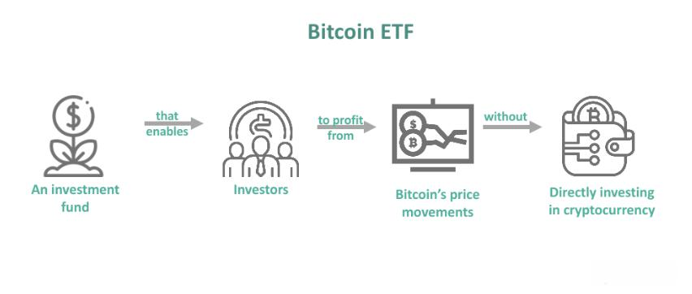

With the rise of Bitcoin and other cryptocurrencies, security remains a pressing concern for investors and users. Bitcoin, a decentralized digital currency, has experienced exponential growth in both valuation and adoption. However, its digital nature makes it susceptible to various cybersecurity risks. As Bitcoin and other cryptocurrencies become more integrated into the global financial system, ensuring the safety of these digital assets is paramount to prevent theft and unauthorized access.

Bitcoin operates on a blockchain, which provides a robust and transparent record of transactions. Despite the inherent security of the blockchain itself, individual Bitcoin holdings are not immune to threats such as hacking, phishing, and malware. These vulnerabilities can lead to the loss of significant investments. Implementing effective security measures is crucial for safeguarding Bitcoin assets from such risks.



This article aims to explore various strategies to protect your Bitcoin, focusing on essential security measures involving cold wallets, exchange security, and algorithmic trading protection. Cold wallets, which provide offline storage for cryptocurrencies, are a critical component of a comprehensive security strategy. Similarly, understanding the security features offered by cryptocurrency exchanges can mitigate risks associated with online storage. Additionally, as algorithmic trading becomes more prevalent in cryptocurrency markets, ensuring the security of trading algorithms and related technologies is vital.

By employing a combination of these strategies, Bitcoin investors and users can enhance the security of their digital assets and navigate the evolving landscape of cryptocurrency with greater confidence.

## Table of Contents

## Understanding Bitcoin Theft and Hacking

Bitcoin theft remains a significant concern in the landscape of cryptocurrency, where the digital nature of assets and the anonymity of transactions can attract malicious actors. Bitcoin theft can occur through various methods, including hacking, phishing, and malware attacks, each posing distinct threats to cryptocurrency security.

Hacking represents one of the most prevalent forms of Bitcoin theft. Attackers often target cryptocurrency exchanges, exploiting vulnerabilities in their security systems. These breaches can result in substantial losses, exemplified by high-profile incidents such as the Mt. Gox exchange hack in 2014, where approximately 850,000 Bitcoins were stolen, leading to the collapse of the platform. Such incidents underscore the importance of robust security measures for exchanges and highlight the potential risks of storing Bitcoin on platforms with inadequate protection.

Phishing attacks are another common threat, wherein attackers deceive users into divulging sensitive information such as private keys or login credentials. These schemes often involve fake websites or emails mimicking legitimate services to trick users into entering their information. The success of phishing relies heavily on the user's lack of awareness and can be mitigated through cautious verification of URLs and email sources, as well as educating users about the common tactics employed by phishers.

Malware also poses a significant risk, particularly through software that records keystrokes or captures screen information, allowing attackers to access private keys and other sensitive data. Bitcoin ransomwares, such as CryptoLocker, encrypt the victim's files and demand payment in Bitcoin for decryption keys. To combat malware threats, users are advised to maintain updated antivirus software, conduct regular security audits, and avoid downloading unverified software.

Understanding these vulnerabilities is crucial for Bitcoin users aiming to safeguard their investments. By recognizing the various tactics employed by attackers, users can take proactive measures to secure their digital assets. These measures may include using hardware wallets, enabling multi-[factor](/wiki/factor-investing) authentication, and employing secure communication protocols. Ultimately, a comprehensive and informed approach to security can significantly mitigate the risks associated with Bitcoin theft and hacking.

## Using Cold Wallets for Securing Bitcoin

Cold wallets, also known as offline wallets, are a highly secure method for storing Bitcoin because they are not connected to the internet, thus safeguarding against remote hacking attempts. The primary advantage of cold wallets is their ability to keep your private keys offline, significantly reducing exposure to online threats such as malware and phishing attacks. 

### Types of Cold Wallets

1. **Hardware Wallets**: These are physical devices specifically designed to securely store Bitcoin and other cryptocurrencies. Popular hardware wallets, like Ledger Nano S and Trezor, store the user's private keys in a secure chip and only connect to the internet when initiating a transaction. Their embedded secure elements and PIN protection enhance their safety. Hardware wallets often support a wide range of cryptocurrencies, making them versatile for diverse crypto holdings.

2. **Paper Wallets**: This method involves printing out or writing down your private key and Bitcoin address on paper. A paper wallet is free from online vulnerabilities but requires the physical protection of the printed material. The creation process should involve secure, offline generation to prevent exposure — for instance, through Python scripts using libraries like `bitcoin` or `block.io` to generate a private key from a secure random number generator. An example Python script might look like this:

   ```python
   import os
   import binascii
   import hashlib
   import base58
   from ecdsa import SigningKey, SECP256k1

   def generate_private_key():
       return binascii.hexlify(os.urandom(32)).decode('utf-8')

   def private_key_to_wif(private_key_hex):
       extended_key = "80" + private_key_hex
       first_sha256 = hashlib.sha256(binascii.unhexlify(extended_key)).hexdigest()
       second_sha256 = hashlib.sha256(binascii.unhexlify(first_sha256)).hexdigest()
       checksum = second_sha256[:8]
       wif = extended_key + checksum
       return base58.b58encode(binascii.unhexlify(wif)).decode('utf-8')

   private_key = generate_private_key()
   wif_key = private_key_to_wif(private_key)
   print(f"Private Key: {private_key}")
   print(f"WIF Private Key: {wif_key}")
   ```

### Backup Strategies

A comprehensive backup strategy is indispensable for cold wallets to prevent permanent loss of access to your Bitcoin. For hardware wallets, ensure that you securely store the recovery seed phrase, a set of words used to recover funds if the device is lost or damaged. Keep this phrase offline and in multiple secure locations. Similarly, for paper wallets, create several copies and store them in secure, fireproof, and waterproof environments. 

Furthermore, periodically assess the integrity and security of both the backup methods and storage locations to ensure sustained protection against potential physical and environmental threats.

## Storing Bitcoin on Exchanges Safely

Storing Bitcoin on exchanges offers convenience and ease of access, but it also comes with significant security risks, primarily due to the susceptibility of exchanges to hacking incidents. The history of [cryptocurrency](/wiki/cryptocurrency) is rife with cases where exchanges have been compromised, resulting in substantial losses for individuals who trusted these platforms with their digital assets. Thus, ensuring the security of Bitcoin stored on exchanges requires a strategic approach.

One of the key strategies to enhancing security is selecting an exchange with a strong reputation. A reputable exchange typically employs state-of-the-art security measures and often provides insurance for digital assets, which can offer a degree of protection in the event of a security breach. Well-known exchanges like Coinbase and Binance have extensive security protocols, including cold storage for the majority of assets, to mitigate the risks of hacking.

Multi-factor authentication (MFA) is another critical security feature that users should leverage when storing Bitcoin on exchanges. MFA requires users to provide two or more verification factors to gain access to their accounts, making unauthorized access significantly more difficult. This security layer is particularly effective against phishing attacks, where attackers attempt to harvest users' login credentials.

Exchanges also enhance security through the use of advanced encryption techniques to protect users' data and funds. Secure Sockets Layer (SSL) is commonly used to establish an encrypted link between the server and the client, ensuring all data transferred remains private. Additionally, exchanges may employ secure coding practices, collaborative auditing, and routine security checks to identify and rectify vulnerabilities.

Moreover, many exchanges support features such as withdrawal whitelist, which allows users to specify addresses to which their Bitcoin can be withdrawn, adding an extra layer of security against unauthorized transfers. 

Overall, while storing Bitcoin on exchanges can never be entirely risk-free, utilizing these security features and selecting reputable platforms can significantly reduce the risks involved.

## Combining Security Methods

A prudent approach to Bitcoin security involves combining cold and hot wallets to balance security and accessibility. Cold wallets, which are offline storage solutions such as hardware wallets and paper wallets, provide robust protection against online threats. They are ideally used for storing long-term holdings. Since they are not connected to the internet, the risk of cyberattacks is significantly minimized, ensuring that your assets are protected from hacking, phishing, and malware.

On the other hand, hot wallets, which are connected to the internet, facilitate everyday transactions and offer greater convenience for active trading and payments. Despite their increased vulnerability to cyber threats compared to cold wallets, they are essential for accessing and managing digital assets efficiently in real-time.

An effective strategy involves allocating a significant portion of Bitcoin holdings to cold wallets, ensuring their safety, while retaining a smaller, necessary amount in hot wallets for transactions. This diversification mitigates risk by limiting the exposure of digital assets to potential security breaches associated with online wallets.

Regular monitoring and audits of your security setup are crucial to maintaining the integrity of your Bitcoin holdings. This involves periodically reviewing access controls, updating security protocols, and ensuring compliance with the latest security practices. Such audits help in identifying potential weaknesses and implementing corrective measures promptly.

Moreover, adopting advanced security measures such as multi-factor authentication, encryption, and using well-structured password management systems can enhance protection. Keeping systems updated and educating oneself on the latest security threats are also key components of a comprehensive security strategy.

By effectively combining cold and hot wallets, you can craft a seamless security architecture that not only safeguards your digital investments but also facilitates ease of use, catering to both long-term holders and active traders.

## Algorithmic Trading and Its Security Implications

Algorithmic trading in the cryptocurrency landscape can offer substantial benefits, such as improved execution speed and the ability to process complex strategies. However, it simultaneously presents distinctive security challenges that require careful attention.

**Protecting Trading Algorithms and APIs**

Trading algorithms and APIs are at the core of automated trading systems, necessitating robust security measures to prevent unauthorized access. The primary objective is to shield these components from malicious actors who could exploit vulnerabilities to alter trading strategies or extract sensitive data. To achieve this, several security protocols can be implemented:

1. **Two-Factor Authentication (2FA):** This adds an extra layer of security, ensuring that access is granted only after successful presentation of two separate authentication factors.

2. **Encryption:** Secure the communication between trading systems and APIs using encryption standards like TLS (Transport Layer Security) to prevent interception of sensitive data.

3. **API Keys with Limited Permissions:** Implementing principles of least privilege by restricting API keys to necessary permissions minimizes the potential damage from unauthorized access.

4. **IP Whitelisting:** Restrict API access to predefined IP addresses to mitigate risks from unauthorized network entry.

**Secure Coding Practices and Regular Testing**

Algorithmic trading systems rely on complex codebases, making them susceptible to bugs and vulnerabilities if not properly managed. Employing secure coding practices is paramount:

- **Input Validation:** This prevents injection attacks by ensuring that all input data is validated and sanitized.

- **Error Handling:** Implement comprehensive error handling to avoid exposing system internals that attackers could exploit.

Regular testing of trading systems is essential to identify and rectify vulnerabilities. Tools such as penetration testing and static code analysis can be employed to evaluate the security posture. Here's a basic Python snippet to demonstrate secure coding practices:

```python
import hashlib
from cryptography.fernet import Fernet

# Generate a key for encryption
key = Fernet.generate_key()
cipher_suite = Fernet(key)

def secure_hash(input_string):
    return hashlib.sha256(input_string.encode()).hexdigest()

def encrypt_data(data):
    return cipher_suite.encrypt(data.encode())

def decrypt_data(encrypted_data):
    return cipher_suite.decrypt(encrypted_data).decode()

# Example usage
hashed_password = secure_hash("securepassword123")
encrypted_api_data = encrypt_data("sensitive_api_information")
decrypted_api_data = decrypt_data(encrypted_api_data)
```

This Python code exemplifies the use of cryptographic functions to bolster application security, illustrating fundamental principles such as hashing and symmetric encryption. 

**Conclusion**

Security within [algorithmic trading](/wiki/algorithmic-trading) is multifaceted and demands rigorous adherence to best practices. By integrating robust authentication methods, enforcing stringent API controls, and incorporating secure coding practices with diligent testing, cryptocurrency investors can mitigate risks and ensure the security of their automated trading operations.

## Best Practices for Bitcoin Security

To protect Bitcoin effectively, implementing a range of security measures is crucial. These measures ensure that digital assets are safeguarded from a variety of threats, both internal and external.

Encryption plays a fundamental role in Bitcoin security. By encrypting sensitive data, such as private keys, users can ensure that even if unauthorized parties gain access to their storage devices, the information remains unreadable. It is advisable to use strong encryption algorithms, such as Advanced Encryption Standard (AES), to protect Bitcoin wallets and backups.

Multi-factor authentication (MFA) is another critical practice. By requiring two or more verification factors to gain access, MFA mitigates the risk of unauthorized access stemming from compromised passwords. Users are encouraged to enable MFA on all accounts related to Bitcoin, including exchanges, wallets, and email accounts linked to these services.

Vigilant monitoring of Bitcoin holdings and related accounts is also essential. Regularly reviewing transactions and changes in account settings can help detect suspicious activities early. Users should set up alerts for any unusual activities, such as large withdrawals or changes in account details, to act swiftly against potential breaches.

Continuous education on emerging security threats and corresponding solutions is vital. The threat landscape is dynamic, with new vulnerabilities and attack methods developing over time. Staying informed through reputable sources, participating in Bitcoin communities, and attending relevant seminars or workshops can help users adapt to new security challenges and implement the latest best practices.

In summary, a proactive and comprehensive approach to Bitcoin security, emphasizing encryption, multi-factor authentication, vigilant monitoring, and continuous learning, can substantially reduce the risk of theft and unauthorized access.

## FAQs

When it comes to Bitcoin security, several frequently asked questions arise, particularly concerning the safest storage options, recovery of stolen Bitcoin, and understanding Bitcoin insurance and exchange protections. Below are detailed answers to these common queries.

### What are the safest storage options for Bitcoin?

The safest way to store Bitcoin involves using a combination of different wallet types to balance security and accessibility:

1. **Cold Wallets**: These are offline storage options, such as hardware wallets and paper wallets, which are highly secure against hacking attempts due to their lack of internet connectivity. Cold wallets should be used for storing large amounts of Bitcoin intended for long-term holding.

2. **Multi-Signature Wallets**: These wallets require multiple private keys to authorize a Bitcoin transaction, adding an extra layer of security. This feature helps prevent unauthorized access, even if one key is compromised.

3. **Hot Wallets with Security Features**: When immediate access is necessary, use hot wallets that offer robust security features like multi-factor authentication (MFA). However, only small amounts of Bitcoin should be stored in hot wallets to minimize risk.

### Is it possible to recover stolen Bitcoin?

Recovering stolen Bitcoin is an extremely challenging process, given the decentralized and pseudonymous nature of blockchain technology. Here are key points regarding this issue:

- **Blockchain Transactions**: Bitcoin transactions are irreversible once confirmed on the blockchain. This immutability means that once Bitcoin is stolen, it cannot be reversed or retrieved through the blockchain itself.

- **Tracking and Authorities**: In some cases, stolen Bitcoin can be tracked through blockchain analysis, which may help identify the thief's wallet address. In cooperation with law enforcement agencies, recovery could be possible, although it is not guaranteed.

- **Preventive Measures**: The best strategy is prevention. Employing strong security measures, such as those mentioned above, is crucial to avoid theft.

### What are the misconceptions about Bitcoin insurance and exchange protections?

Clarifying these misconceptions is vital to ensure Bitcoin users are aware of what protections are genuinely available:

- **Bitcoin Insurance**: While some insurance companies offer coverage for cryptocurrency theft or loss, it is not a standard offering and usually comes with specific conditions. It's important for users to carefully review the terms and coverage limits before assuming their assets are insured.

- **Exchange Protections**: Reputable exchanges often hold insurance policies to protect against internal breaches or errors. However, these protections typically do not cover personal account breaches resulting from insufficient user security. Users must implement their own security measures, such as enabling MFA.

In summary, understanding and implementing effective storage solutions, acknowledging the limitations of theft recovery, and recognizing the scope of insurance and exchange protections are crucial aspects of Bitcoin security. These practices enable Bitcoin holders to safeguard their assets against potential threats.

## The Bottom Line

Securing your Bitcoin requires a proactive and layered approach to address various potential threats. Employing a combination of strategies can significantly mitigate the risk of theft and unauthorized access to digital assets. One key strategy is the use of cold wallets, which store Bitcoin offline and away from internet threats. In contrast, hot wallets, which are connected to the internet, should be used for regular transactions. By diversifying between cold and hot wallets, investors can maintain a balance between security and accessibility.

In addition to storage practices, selecting reputable cryptocurrency exchanges is crucial. These exchanges should offer robust security measures, such as multi-factor authentication and insurance for digital assets, to provide an added layer of protection. Furthermore, understanding and implementing algorithmic trading securely is important, especially as it presents unique vulnerabilities. Employing secure coding practices and protecting trading algorithms from unauthorized access are vital steps.

Staying updated on the best security practices is essential in the rapidly evolving cryptocurrency environment. Continuous education on emerging security threats and solutions enables users to strengthen their Bitcoin protection measures. This includes implementing encryption where appropriate, scheduling regular security audits, and engaging in vigilant monitoring of assets and digital infrastructure. By keeping informed and utilizing a comprehensive toolkit of security strategies, Bitcoin investors can substantially enhance the safety of their digital investments.

## References & Further Reading

[1]: Narayanan, A., Bonneau, J., Felten, E., Miller, A., & Goldfeder, S. (2016). ["Bitcoin and Cryptocurrency Technologies: A Comprehensive Introduction"](https://press.princeton.edu/books/hardcover/9780691171692/bitcoin-and-cryptocurrency-technologies). Princeton University Press.

[2]: Antonopoulos, A. M. (2014). ["Mastering Bitcoin: Unlocking Digital Cryptocurrencies"](https://books.google.com/books/about/Mastering_Bitcoin.html?id=IXmrBQAAQBAJ). O'Reilly Media.

[3]: Conti, M., Gangwal, A., & Ruj, S. (2018). ["On the Security and Privacy of Bitcoin Transactions: A Comparative Analysis of Cryptocurrency and Traditional Finance."](https://pmc.ncbi.nlm.nih.gov/articles/PMC8838225/) International Journal of Information Security, 17(4).

[4]: Bonneau, J., Miller, A., Clark, J., Narayanan, A., Kroll, J. A., & Felten, E. W. (2015). ["Sok: Research Perspectives and Challenges for Bitcoin and Cryptocurrencies."](https://ieeexplore.ieee.org/document/7163021) 2015 IEEE Symposium on Security and Privacy.

[5]: Kharif, O. (2019). ["From Hacking to Malware: Major Cryptocurrency Heists Will Keep on Coming."](https://www.bbc.com/news/business-58163917). Bloomberg.