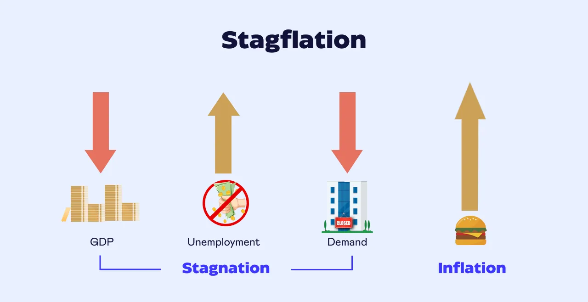

## Table of Contents

## What is stagflation and how does it affect the economy?

Stagflation is when the economy is not growing, but prices are going up and people are losing their jobs. It's a tough situation because usually, when prices go up, it's because the economy is doing well. But with stagflation, things are slow, and it's hard for people to buy things because they cost more and they might not have a job.

This situation can be really bad for the economy because it makes it hard for businesses to make money. When businesses don't make money, they might have to lay off more workers, which makes the problem worse. Also, when prices keep going up, people's money doesn't go as far, so they can't spend as much, which slows down the economy even more. It's a cycle that's hard to break, and it can take a long time for things to get better.

## What are the key indicators that a country is experiencing stagflation?

Stagflation happens when three main things are happening at the same time in a country. First, the economy stops growing or grows very slowly. This means that the country's total output of goods and services, which is called the Gross Domestic Product (GDP), isn't increasing much. Second, prices of things like food and gas start going up a lot. This is called inflation, and it means that people need to spend more money to buy the same things they used to buy. Third, more people start losing their jobs, which is called rising unemployment. When these three things happen together, it's a sign that the country might be in stagflation.

These signs can make life hard for people. When the economy isn't growing, businesses might not make as much money, so they might have to let workers go. This means more people are out of work and looking for jobs. At the same time, because prices are going up, the money people do have doesn't go as far. They might have to spend more on basic things like food and gas, and have less left over for other things. This can make the economy even slower, because people aren't spending as much money, and it can be hard to fix the problem.

## Can you explain the difference between stagflation and other economic conditions like recession or inflation?

Stagflation is different from a recession or inflation because it combines elements of both. A recession is when the economy is shrinking, and there's usually high unemployment, but prices might not be going up a lot. During a recession, businesses make less money, so they might have to let people go, and people might spend less because they're worried about the future. On the other hand, inflation is when prices of things like food and gas go up a lot, but the economy might still be growing. People might still have jobs, but their money doesn't go as far because everything costs more.

Stagflation is tricky because it's a mix of these two problems. In stagflation, the economy isn't growing, just like in a recession, and there's high unemployment. But at the same time, prices are going up a lot, just like with inflation. This makes it really hard for people because they might not have a job, and even if they do, the money they earn doesn't go as far because of the high prices. It's a tough situation for the economy because the usual ways to fix one problem might make the other problem worse.

## What are some basic strategies that individuals can use to manage their finances during stagflation?

During stagflation, it's important for people to be careful with their money. One good strategy is to make a budget and stick to it. This means figuring out how much money you have coming in and how much you need to spend on things like food, rent, and bills. Try to spend less on things you don't really need, like eating out or buying new clothes. Saving some money each month, even if it's a small amount, can help you be ready for unexpected costs.

Another strategy is to look for ways to earn more money. This could mean finding a part-time job, doing freelance work, or selling things you don't need anymore. If you're worried about losing your job, it's a good idea to keep your skills up to date and be ready to look for new job opportunities. It can also help to talk to a financial advisor who can give you personalized advice on how to manage your money during tough economic times.

Lastly, be smart about where you keep your money. During stagflation, it's a good idea to keep some money in a savings account that earns interest, so your money can grow a little bit even if prices are going up. You might also want to think about investing in things like stocks or real estate, but be careful because these can be risky. The main thing is to stay calm and make smart choices with your money, even when things are tough.

## How can businesses adapt their operations and strategies to cope with stagflation?

During stagflation, businesses need to be smart about how they spend their money. They should look at their costs and see where they can save money. This might mean cutting back on things that aren't really needed, like fancy office spaces or big travel budgets. Businesses can also try to find cheaper ways to get the things they need to make their products, like raw materials or supplies. It's important for businesses to keep a close eye on their spending and make sure they're not wasting money.

Another way businesses can cope with stagflation is by changing how they sell their products. They might need to raise their prices a little bit because costs are going up, but they have to be careful not to raise them too much or people might stop buying. Businesses can also try to find new customers or sell in new places. For example, if they usually sell in one country, they might start selling in another country where people are still buying. It's also a good idea for businesses to talk to their customers and find out what they need, so they can keep selling even when times are tough.

Lastly, businesses should think about their employees during stagflation. It can be hard to keep everyone working if the business isn't making as much money. But instead of letting people go, businesses can try other things like having employees work fewer hours or take a short break from work. They can also help their employees learn new skills, so they can do different jobs within the company. This way, businesses can keep their team together and be ready to grow again when the economy gets better.

## What role does government policy play in managing stagflation, and what specific policies are effective?

Government policy plays a big role in managing stagflation. When the economy is not growing, prices are going up, and people are losing their jobs, the government can step in to help fix things. One way they do this is by using monetary policy, which means the government can change how much money is in the economy. They might raise interest rates to slow down inflation, but they have to be careful because this could make the economy grow even slower. Another way is through fiscal policy, where the government can spend more money on things like building roads or helping people who are out of work. This can help the economy grow again, but it might also make prices go up even more if they're not careful.

Specific policies that can be effective include a mix of tight monetary policy and smart fiscal policy. Tight monetary policy means the government might raise interest rates to slow down inflation. This can make borrowing money more expensive, which can help slow down how fast prices are going up. But the government also needs to use smart fiscal policy to help the economy grow. They might spend money on things like unemployment benefits or job training programs to help people who are out of work. They could also give tax breaks to businesses to encourage them to keep people working and to invest in new projects. The trick is to balance these policies so that they help the economy grow without making inflation worse.

## How do central banks respond to stagflation, and what are the potential impacts of their monetary policies?

Central banks, like the Federal Reserve in the United States, have a big job when it comes to dealing with stagflation. They try to control how much money is in the economy and how expensive it is to borrow money. One way they do this is by changing interest rates. If prices are going up too fast, central banks might raise interest rates to make borrowing money more expensive. This can slow down how fast prices are going up, which is good for fighting inflation. But it can also make the economy grow even slower because businesses might not want to borrow money to grow if it's too expensive.

Raising interest rates can have some tricky effects during stagflation. On one hand, it can help slow down inflation, which is good. But on the other hand, it can make the economy grow even slower and make more people lose their jobs. This is because higher interest rates can make it harder for people and businesses to borrow money, so they might spend less. Central banks have to be very careful and find the right balance. They need to slow down inflation without making the economy shrink too much. It's a tough job, but central banks use all the tools they have to try to make things better.

## What are the historical examples of stagflation, and what lessons can be learned from them?

One big example of stagflation happened in the United States in the 1970s. Back then, the economy was not growing much, prices were going up a lot, and more people were losing their jobs. The government and the central bank tried different things to fix it. They raised interest rates to slow down inflation, but it took a long time and made the economy even slower for a while. It was a tough time, but eventually, the economy got better. The lesson from this is that stagflation is hard to fix and can take a long time. It's important for the government and central bank to work together and be patient.

Another example of stagflation was in the United Kingdom during the same time, the 1970s. Just like in the U.S., the economy was slow, prices were high, and unemployment was going up. The government tried to control prices and wages, but it didn't work very well. They also had to deal with strikes and other problems. In the end, it took a change in government and new policies to start fixing things. The lesson here is that sometimes, trying to control prices and wages directly doesn't work, and it might be better to focus on other ways to help the economy grow and create jobs.

From these examples, we can learn that stagflation is a tough problem that needs a lot of different solutions. It's not just about raising interest rates or controlling prices; it's about finding the right mix of policies that can help the economy grow without making inflation worse. It's also important for everyone to be patient because fixing stagflation can take a long time.

## How can investment portfolios be adjusted to mitigate the risks associated with stagflation?

When stagflation hits, it can be tough on investment portfolios because the economy is slow, prices are going up, and people are losing jobs. One way to adjust your portfolio is to focus on investments that can do well even when the economy isn't growing. For example, investing in things like gold or other precious metals can be a good idea because they often keep their value when prices are going up. Another good choice could be investing in companies that make things people always need, like food or medicine. These companies might do better because people will still buy their products even when times are tough.

Another strategy is to look at real estate investments. Property values can sometimes go up even when the economy is slow, and renting out properties can give you a steady income. It's also a good idea to have some money in savings accounts that earn interest, so your money can grow a little bit even if prices are going up. But remember, investing always comes with risks, so it's important to think about your own situation and maybe talk to a financial advisor. They can help you make smart choices that fit your needs and help you get through stagflation with your money safe.

## What advanced economic models are used to predict and analyze stagflation?

Economists use different models to try to predict and understand stagflation. One model they use is called the Phillips Curve, which looks at the relationship between unemployment and inflation. Normally, when unemployment goes down, inflation goes up because people have more money to spend. But during stagflation, both unemployment and inflation are high, which doesn't fit the usual pattern. Economists use this model to see if the economy is moving in a way that might lead to stagflation, and they can adjust their predictions based on what they see.

Another model that helps is the Aggregate Supply and Aggregate Demand (AS-AD) model. This model looks at the total amount of goods and services that businesses want to sell (aggregate supply) and the total amount that people want to buy (aggregate demand). During stagflation, aggregate supply might go down because businesses are not making as much, and at the same time, aggregate demand might not be growing because people are worried about the economy. By studying this model, economists can see how changes in supply and demand might lead to stagflation and figure out what policies might help fix the problem.

## How do international trade and global economic policies influence stagflation in a country?

International trade and global economic policies can have a big impact on whether a country experiences stagflation. When a country trades a lot with other countries, what happens in those other countries can affect its own economy. For example, if a country relies on importing oil and the price of oil goes up because of problems in other countries, this can lead to higher prices at home. This is part of what can cause inflation. At the same time, if other countries are not buying as much from the country because their economies are slow, this can hurt the country's own economy and lead to slower growth and higher unemployment.

Global economic policies, like those set by international organizations such as the World Bank or the International Monetary Fund (IMF), can also play a role. These organizations might suggest policies that countries should follow, like cutting spending or raising interest rates. These policies can help control inflation, but they might also slow down the economy even more. It's a tricky balance because what helps one part of the problem might make another part worse. So, when countries are dealing with stagflation, they need to think about how their actions fit into the bigger global picture and work with other countries to find solutions that help everyone.

## What are the long-term strategies for economic recovery from stagflation, and how can they be implemented?

To recover from stagflation over the long term, a country needs to focus on boosting its economy while keeping inflation in check. One important strategy is to invest in infrastructure, like building roads, bridges, and schools. This can create jobs and help the economy grow. At the same time, the government can work on education and training programs to help people learn new skills, so they can find better jobs. This can help lower unemployment and make the economy stronger. Another key part is to encourage businesses to invest and grow by offering tax breaks or other incentives. This can help the economy grow without making prices go up too fast.

Implementing these strategies takes careful planning and cooperation between the government, businesses, and the central bank. The government needs to spend money wisely on projects that will really help the economy grow, and they need to make sure that this spending doesn't just make prices go up even more. The central bank can help by keeping interest rates at a level that encourages borrowing and spending, but not so low that it leads to more inflation. It's also important for the government to work with other countries to make sure that global economic policies are helping, not hurting, the recovery. By working together and being patient, a country can slowly recover from stagflation and build a stronger, more stable economy.

## References & Further Reading

Blanchard, O. (2008). "The State of Macro." Journal of Economic Perspectives, 21(4), 3-24. This paper provides an overview of macroeconomic thought, particularly relevant to understanding stagflation's historical context and challenges in policy-making. It offers a detailed analysis of the interplay between monetary policy, inflation, and economic growth, crucial for comprehending the complexities of stagflation and its impact on economies.

Lopez de Prado, M. (2018). "Advances in Financial Machine Learning." Wiley. Lopez de Prado's work is instrumental in understanding the application of [machine learning](/wiki/machine-learning) in finance, including the development of [algorithmic trading](/wiki/algorithmic-trading) strategies. This book explores advanced techniques for prediction and adaptive learning, directly applicable to handling the economic [volatility](/wiki/volatility-trading-strategies) associated with stagflation.

Aronson, D. R. (2006). "Evidence-Based Technical Analysis." Wiley. Aronson's book introduces a scientific approach to technical analysis, emphasizing empirical research and data-driven decision-making. The principles outlined can enhance algorithmic trading strategies by providing robust foundations for developing models that withstand the unpredictable nature of stagflation-influenced markets.

Jansen, S. (2020). "Machine Learning for Algorithmic Trading: Second Edition." Packt Publishing. Jansen's work investigates into the practical implementation of machine learning for trading applications. Covering a wide range of techniques, from basic supervised learning to complex neural networks, this resource is invaluable for traders looking to optimize their strategies in fluctuating economic conditions, such as those presented by stagflation.

