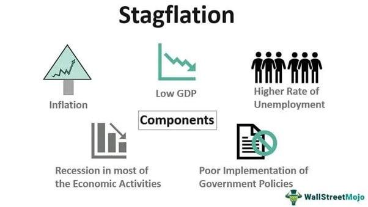

In recent years, economies worldwide have grappled with the resurgent challenge of stagflation, a dual predicament characterized by stagnant economic growth and rising inflation rates. This duality poses significant hurdles for policymakers traditionally reliant on tools that address either inflation or stagnation but not both simultaneously. The condition disrupts the conventional economic balance, straining resources and complicating interventions aimed at stabilization.

Historically, stagflation became a significant concern in the 1970s following the OPEC oil embargo, which highlighted its devastating potential on a global scale. The conundrum lies in resolving the paradoxical nature of stagflation: methods that combat inflation can exacerbate economic stagnation and vice versa. As inflation grows amid economic lethargy, solutions necessitate a nuanced appreciation of underlying causes and impacts on the broader economy.



Within this complex milieu, algorithmic trading emerges as a potential mitigating force. By leveraging advanced computational techniques, it offers the promise of enhanced market efficiency and stabilization. Algorithmic trading systems, defined by their ability to execute trades based on pre-programmed criteria, are particularly adept at processing large data volumes rapidly and adapting to shifting economic signals. They provide not only liquidity to markets experiencing stress but also aid in smoothing out volatility when economic indicators shift unpredictably.

This article explores the historical context of stagflation and its far-reaching economic implications while emphasizing algorithmic trading's potential in navigating these challenging economic environments. The fusion of technology and economic management offers new insights into managing the dual forces of stagnation and inflation, suggesting that algorithmic trading can be a significant player in addressing stagflation's complexities.

## Table of Contents

## Understanding Stagflation

Stagflation is a unique economic phenomenon characterized by the simultaneous occurrence of stagnant economic growth, high unemployment, and rising inflation. This combination poses significant challenges to traditional economic policies, which typically aim to either curb inflation or stimulate growth, but not address both issues simultaneously.

The term "stagflation" gained prominence during the 1970s, a period marked by one of the most significant instances of this economic challenge. The era was characterized by sluggish growth and escalating inflation, largely triggered by supply shocks such as the OPEC oil embargo of 1973. The embargo led to a dramatic increase in oil prices, which subsequently increased the cost of goods and services across economies reliant on oil imports. This scenario illustrated the complexities stagflation imposes on economic policy, as policymakers struggled to address the dual problem of high inflation and unemployment without exacerbating either condition.

Stagflation encompasses complex dynamics involving supply and demand factors intertwined with policy interventions. Supply-side shocks, like those experienced during the oil crisis, can drive up prices, leading to cost-push inflation. At the same time, these shocks can slow economic growth as higher production costs translate into reduced output and employment levels. Traditional demand-side economic policies, such as lowering interest rates, may be ineffective or counterproductive during stagflation. For example, reducing interest rates might stimulate spending, worsening inflation without significantly impacting employment levels.

Moreover, policy responses to stagflation require careful consideration of trade-offs that differ from those encountered during typical economic upturns or downturns. Policymakers must balance between controlling inflation and spurring growth, often resorting to innovative or unconventional measures to navigate the economy through such complex economic landscapes. These challenges underscore the need for a nuanced understanding of stagflation, as conventional economic theories may not fully account for its unique set of circumstances.

## Economic Impact of Stagflation

Stagflation presents a considerable challenge to economies worldwide by disrupting consumer spending and hindering business investment. This economic anomaly arises from the coexistence of slow economic growth, high unemployment, and rising inflation, which leads to a decrease in purchasing power for consumers. As prices rise while wages stagnate or fall, individuals find their real disposable incomes eroded, leading to a reduction in consumption. This contraction in consumer spending subsequently affects business revenues, discouraging investment and expansion due to uncertain demand projections.

The disruption caused by stagflation is further compounded by the limitations it imposes on traditional monetary policy tools. Typically, central banks might lower interest rates to stimulate economic growth by encouraging borrowing and investment. However, during periods of stagflation, reducing interest rates can further fuel inflationary pressures rather than foster economic activity. The classic monetary policy dilemma is that measures to stimulate growth risk worsening inflation, creating a policy conundrum. Thus, central banks find their conventional levers of monetary control less effective or even counterproductive.

Furthermore, stagflation strains government fiscal positions through a dual mechanism of reduced revenue and increased borrowing costs. Economic stagnation leads to a fall in tax revenues as profits dwindle and unemployment rises, thereby shrinking the tax base. At the same time, the government may face higher interest rates on its debt if inflation expectations rise, increasing the cost of borrowing. This fiscal strain limits the ability of governments to engage in countercyclical spending or stimulus measures, as public finances become increasingly constrained. Consequently, the scope for economic intervention narrows, complicating efforts to revive economic growth or control inflation, exacerbating the cyclical economic challenges presented by stagflation.

## Algorithmic Trading in the Face of Economic Challenges

Algorithmic trading, a modern investment approach, utilizes computer algorithms to automate trading decisions. By following pre-set rules, these algorithms can execute trades at speeds and frequencies that human traders cannot achieve, thereby introducing a significant advantage in dynamic market conditions. This technology-driven method processes vast amounts of data to capitalize on small price movements across different asset classes.

During periods of stagflation, characterized by stagnant economic growth and high inflation, [algorithmic trading](/wiki/algorithmic-trading) systems are particularly beneficial. They ensure market [liquidity](/wiki/liquidity-risk-premium) by executing trades at optimal times, mitigating the negative impacts of reduced economic activity. Algorithms can swiftly adjust to economic indicators, such as changes in interest rates or inflation measures, thus supporting market stability.

However, the rapid automation inherent to algorithmic trading carries risks, notably the potential for increased market [volatility](/wiki/volatility-trading-strategies). If algorithms are not adequately designed to manage the complexities of volatile markets, they may execute trades that amplify price swings. For instance, a poorly managed algorithm might rapidly sell off assets in response to a negative economic indicator, exacerbating downward market trends.

To counteract these risks, robust algorithmic strategies are essential. These strategies often incorporate sophisticated risk management features. For example, algorithms can be programmed to halt trading in volatile conditions or to adjust trading volumes in response to market liquidity changes. Additionally, algorithms often use complex prediction models that utilize [machine learning](/wiki/machine-learning) to refine their trading decisions based on historical data and emerging market trends.

Implementation of such algorithms can be illustrated through the creation of a simple trading strategy in Python:

```python
import numpy as np
import pandas as pd

def trading_strategy(prices, window_size=5):
    rolling_mean = prices.rolling(window=window_size).mean()
    rolling_std = prices.rolling(window=window_size).std()

    # Signal generation: buy (1) if the price is below the lower bound, sell (-1) if above the upper bound, hold (0) otherwise
    lower_bound = rolling_mean - rolling_std
    upper_bound = rolling_mean + rolling_std
    signals = np.where(prices < lower_bound, 1, np.where(prices > upper_bound, -1, 0))

    return signals

# Assuming 'market_data' is a DataFrame with a 'Price' column
market_data['Signals'] = trading_strategy(market_data['Price'])
```

In this example, a simple moving average and standard deviation form the basis of a mean-reversion strategy. The strategy generates buy signals when the asset price moves below the calculated lower bound and sell signals when it exceeds the upper bound. Such strategies represent the breadth of algorithmic possibilities available for market participants aiming to navigate stagflation-induced challenges.

In summary, while algorithmic trading offers significant promise in managing the unique challenges presented by stagflation, it requires careful design and management to avoid contributing to market instability. A continued focus on developing sophisticated algorithms that incorporate predictive analytics and real-time data processing is essential for ensuring that these systems can adapt to fluctuating economic conditions.

## Case Studies: Algorithmic Responses to Stagflation

Historical data suggest that algorithmic trading systems can play a significant role under stagflationary conditions, primarily by enhancing market liquidity. However, they can also contribute to market volatility. The duality of their impact is crucially determined by the algorithms' design and the economic environment in which they operate.

Algorithmic trading, particularly high-frequency trading ([HFT](/wiki/high-frequency-trading-strategies)), has transformed market dynamics by executing trades in fractions of a second, depending on pre-programmed criteria. During periods of inflationary pressure, these systems are capable of providing the needed market liquidity through rapid and consistent trading activities. By doing so, they facilitate more frequent buying and selling, even when traditional traders might be reluctant to participate due to economic uncertainty.

However, the speed and frequency with which HFT algorithms react to economic signals can inadvertently amplify market volatility. Their algorithms are programmed to respond instantly to macroeconomic indicators, such as [interest rate](/wiki/interest-rate-trading-strategies) announcements or changes in inflation forecasts. This immediacy can cause substantial short-term price fluctuations, as multiple trading systems might simultaneously execute buy or sell orders based on the same information. For example, if inflation data significantly exceeds market expectations, HFT algorithms might trigger rapid sell-offs, contributing to volatility. 

Moreover, the adaptability of these systems to macroeconomic indicators provides insights into their potential role during stagflation-like conditions. Algorithmic strategies may include adjustments based on machine learning models that predict economic indicators from historical trends. These models can be continually refined as new data become available. The algorithms may, for instance, use linear regression to forecast inflation rates, allowing them to adjust trading strategies accordingly.

Here is a simple Python example of a linear regression model that could be used to predict inflation:

```python
from sklearn.linear_model import LinearRegression
import numpy as np

# Historical GDP and inflation data
GDP_data = np.array([[2.1], [2.3], [2.5], [2.7], [2.9]])  # Example GDP growth rates
inflation_data = np.array([1.3, 1.5, 1.7, 1.9, 2.1])      # Corresponding inflation rates

# Create and fit the model
model = LinearRegression()
model.fit(GDP_data, inflation_data)

# Predict inflation for a new GDP growth rate
predicted_inflation = model.predict(np.array([[3.0]]))
print(f"Predicted inflation rate: {predicted_inflation[0]}")
```

In this simplistic model, a linear relationship is assumed between GDP growth and inflation rates, which can provide a basis for adjustments in an algorithmic trading strategy.

Through insights gained from historical data, one can appreciate that the role of algorithmic trading in stagflation is nuanced. While these systems can facilitate liquidity, they must be carefully managed to prevent excessive volatility. Ongoing monitoring and adaptive algorithmic design are essential to harness their full potential while mitigating associated risks.

## The Future: Mitigating Stagflation with Technology

Machine learning and [artificial intelligence](/wiki/ai-artificial-intelligence) (AI) have transformed trading systems by offering advanced predictive capabilities crucial for navigating stagflation. These technologies enable traders and financial institutions to better anticipate economic trends and make informed decisions, addressing the intricate dynamics of stagnant growth and inflation.

One of the key advancements is the integration of dynamic asset allocation algorithms, which optimize portfolio management under economic stress. These algorithms continuously process new data, adjusting allocation strategies to align with changing market conditions. Such adaptability is achieved through machine learning models that train on historical market information and real-time data to forecast future price movements and economic indicators. For instance, a machine learning model could leverage a wide array of economic variables, such as unemployment rates or consumer price indices, to predict market behavior.

The mathematics underpinning these systems can involve time-series analysis and regression models that forecast trends. Consider the ARIMA (AutoRegressive Integrated Moving Average) model, commonly used in financial forecasting. It can be implemented in Python as follows:

```python
import pandas as pd
from statsmodels.tsa.arima_model import ARIMA

# Load the dataset
data = pd.read_csv('economic_data.csv')

# Fit the model
model = ARIMA(data['GDP'], order=(3, 1, 2))
model_fit = model.fit(disp=0)

# Forecast
forecast, stderr, conf_int = model_fit.forecast(steps=10)
print(forecast)
```

Beyond asset allocation, AI-driven sentiment analysis offers another layer of strategic insight. These systems analyze textual data from financial news, reports, and social media to gauge market sentiment, which can influence trading decisions. By employing natural language processing (NLP) techniques, AI algorithms can detect positive or negative sentiments and their potential impact on market prices, contributing to a more refined strategy.

As these technologies evolve, their applications in mitigating stagflation become increasingly sophisticated. Machine learning enables adaptive learning, where models continuously improve with exposure to new information. This ongoing learning process promises more accurate predictions and effective responses to volatile market conditions typical of stagflation periods. Moreover, the ethical deployment of these tools is as vital as their technical capabilities, ensuring that AI-driven trading aligns with broader economic and regulatory frameworks, promoting fairness and transparency in financial markets.

In conclusion, the convergence of machine learning and AI in trading systems represents a promising frontier in addressing stagflation. As these technologies advance, they hold the potential to stabilize markets through precise data analysis and strategic adaptability, helping to navigate the complexities of simultaneous inflation and stagnant growth.

## Conclusion

Algorithmic trading has the potential to significantly stabilize markets during periods of stagflation by enabling rapid data processing and strategic adjustments. As stagflation presents a unique blend of economic stagnation and inflation, traditional economic instruments often fall short in addressing the dual challenge. In contrast, algorithmic trading offers a dynamic approach, capable of adapting swiftly to volatile market conditions. Through algorithms, traders can analyze large datasets in real time, which allows for more informed decision-making and quicker responses to economic indicators.

Technological advancements are crucial to maximizing the benefits of algorithmic trading in these contexts. The integration of artificial intelligence and machine learning into trading systems enhances their predictive capabilities, allowing for better anticipation of economic trends and more robust strategy formulation. These technologies enable the continuous refinement of trading algorithms, ensuring they remain effective in fluctuating market conditions.

However, the use of such sophisticated technology in trading also raises important ethical considerations. Issues such as data privacy, market fairness, and the potential for exacerbating volatility must be addressed. It is crucial to implement robust regulatory frameworks that ensure the responsible use of these tools, protecting market integrity and investor interests.

Collaborative efforts are essential for effectively navigating the complexities of stagflation. Policymakers, market participants, and technologists must work together to develop strategies that leverage algorithmic trading while acknowledging its limitations. Policymakers can provide guidance on regulatory standards, market participants can offer insights into practical applications, and technologists can drive innovation in trading systems. By combining expertise and resources, these stakeholders can help stabilize markets, mitigate the effects of stagflation, and set a [course](/wiki/best-algorithmic-trading-courses) for sustained economic growth.

## References & Further Reading

Blanchard, O. (2008). "The State of Macro." Journal of Economic Perspectives, 21(4), 3-24. This paper provides an overview of macroeconomic thought, particularly relevant to understanding stagflation's historical context and challenges in policy-making. It offers a detailed analysis of the interplay between monetary policy, inflation, and economic growth, crucial for comprehending the complexities of stagflation and its impact on economies.

Lopez de Prado, M. (2018). "Advances in Financial Machine Learning." Wiley. Lopez de Prado's work is instrumental in understanding the application of machine learning in finance, including the development of algorithmic trading strategies. This book explores advanced techniques for prediction and adaptive learning, directly applicable to handling the economic volatility associated with stagflation.

Aronson, D. R. (2006). "Evidence-Based Technical Analysis." Wiley. Aronson's book introduces a scientific approach to technical analysis, emphasizing empirical research and data-driven decision-making. The principles outlined can enhance algorithmic trading strategies by providing robust foundations for developing models that withstand the unpredictable nature of stagflation-influenced markets.

Jansen, S. (2020). "Machine Learning for Algorithmic Trading: Second Edition." Packt Publishing. Jansen's work investigates into the practical implementation of machine learning for trading applications. Covering a wide range of techniques, from basic supervised learning to complex neural networks, this resource is invaluable for traders looking to optimize their strategies in fluctuating economic conditions, such as those presented by stagflation.

