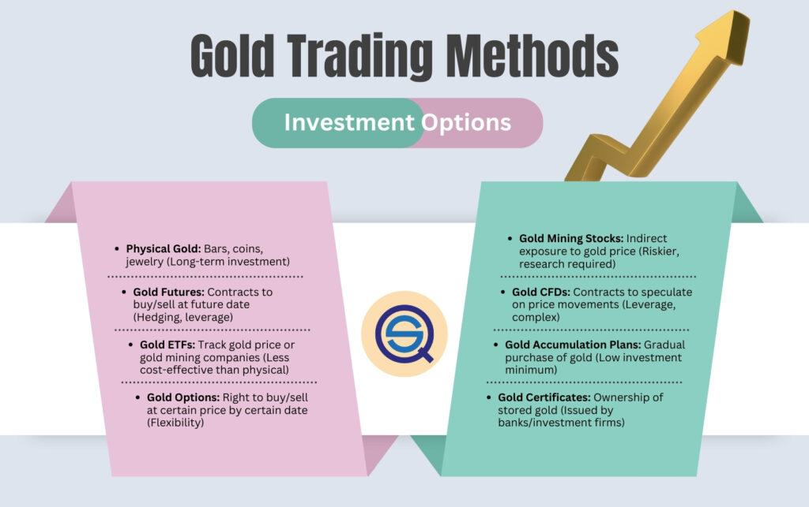

## Table of Contents

## What is gold trading and why is it important?

Gold trading is when people buy and sell gold to make money. Gold is a special metal that many people around the world like because it's pretty and valuable. People can trade gold in different ways, like buying gold bars, coins, or even trading gold on the computer through something called the stock market. The price of gold can go up and down, so traders try to buy gold when it's cheap and sell it when it's expensive.

Gold trading is important for a few reasons. First, it helps people keep their money safe. When other things like stocks or money lose value, gold usually stays valuable. This makes gold a good thing to have when times are tough. Second, gold trading can help countries' money stay strong. When a country's money is weak, it can buy gold to make it stronger. This is why many countries keep a lot of gold in their banks. So, gold trading is not just about making money, but also about keeping money safe and helping countries' economies.

## What are the basic types of gold trading?

There are a few basic types of gold trading that people use. The first type is physical gold trading. This is when people buy and sell actual gold, like gold bars, coins, or jewelry. People can keep this gold at home or in a safe place like a bank. The second type is gold futures trading. This is when people agree to buy or sell gold at a certain price in the future. They don't actually have the gold yet, but they are making a deal about it. This type of trading is often done on the computer through something called the stock market.

Another type of gold trading is gold ETFs, which stands for Exchange Traded Funds. These are like baskets of gold that people can buy and sell easily on the stock market. When you buy a gold [ETF](/wiki/etf-trading-strategies), you are not buying actual gold, but you are buying a piece of a big pool of gold that is managed by a company. This makes it easier for people to trade gold without having to deal with the physical gold themselves. Each of these types of gold trading has its own benefits and risks, so people choose the one that fits their needs best.

## How can beginners start trading gold?

Beginners can start trading gold by first learning about the different ways to trade it. They can choose to trade physical gold, like buying gold bars or coins, or they can trade gold through the stock market by using gold futures or gold ETFs. It's important for beginners to understand the risks and benefits of each type of trading. They can start by reading [books](/wiki/algo-trading-books), watching videos, or taking online courses about gold trading. This will help them make smart choices and avoid losing money.

Once beginners feel ready, they can open an account with a broker or a bank that allows them to trade gold. For physical gold, they can visit a local dealer or buy online from a trusted seller. For gold futures or ETFs, they will need to use a trading platform on their computer or phone. Beginners should start with a small amount of money that they can afford to lose, as trading can be risky. They should also keep learning and stay updated on the price of gold and what's happening in the world that might affect it. With time and practice, beginners can get better at trading gold and maybe even make some money.

## What are the risks associated with gold trading?

Gold trading can be risky because the price of gold can go up and down a lot. If you buy gold and the price goes down, you might lose money when you try to sell it. This can happen because of things like changes in the economy, big news events, or even just because a lot of people are buying or selling gold at the same time. For people who trade gold futures or ETFs, there's also the risk that they might have to buy or sell gold at a bad time if the price changes a lot before their deal is done.

Another risk is that you might not know enough about gold trading. If you're new to trading, you might make mistakes that cost you money. For example, you might buy gold at a high price thinking it will go up more, but then it goes down instead. Also, if you're trading physical gold, there's a risk that the gold you buy might not be real or might be worth less than you thought. It's important to learn as much as you can and be careful when you start trading gold.

## What are the different methods of analyzing gold prices?

There are two main ways to analyze gold prices: [fundamental analysis](/wiki/fundamental-analysis) and technical analysis. Fundamental analysis looks at things that might affect the price of gold, like the strength of the economy, inflation rates, and big events in the world. For example, if people think the economy is going to get worse, they might buy more gold because it's seen as a safe investment. This can make the price of gold go up. By understanding these factors, traders can guess if the price of gold will go up or down.

Technical analysis is different. It looks at past prices and patterns to predict what might happen next. Traders use charts and graphs to see how the price of gold has moved in the past. They look for patterns, like when the price goes up and down in a certain way, and use this information to decide when to buy or sell gold. This method doesn't care about the economy or world events; it just focuses on the numbers and patterns in the price of gold.

Both methods have their own strengths and weaknesses. Fundamental analysis can help traders understand the bigger picture and why gold prices might change, but it can be hard to predict exactly when these changes will happen. Technical analysis can be more precise about timing, but it might miss important events that could affect the price of gold. Many traders use both methods together to make better decisions about trading gold.

## How does the gold futures market work?

The gold futures market is a place where people agree to buy or sell gold at a certain price in the future. Instead of trading actual gold, people trade contracts. These contracts say that one person will buy gold and another person will sell gold at a set price on a specific date. This happens on special markets called futures exchanges, like the COMEX in New York. People use these contracts to guess if the price of gold will go up or down. If they think the price will go up, they buy a contract to get gold later at today's price. If they think the price will go down, they sell a contract to get rid of gold at today's price.

Trading gold futures can be risky because the price of gold can change a lot. If the price goes the wrong way, people can lose money. For example, if someone buys a contract to get gold later and the price goes down, they will have to pay more than the gold is worth. But it can also be a way to make money if people guess right. People who use the gold futures market can be traders who want to make money, or they can be companies that use gold and want to make sure they can buy it at a good price in the future. It's important for anyone trading gold futures to understand the risks and to keep learning about what might affect the price of gold.

## What are gold ETFs and how do they function in trading?

Gold ETFs, or Exchange Traded Funds, are a way for people to invest in gold without having to buy and store physical gold. Instead of buying actual gold, people buy shares of a gold ETF. These shares represent a small part of a big pool of gold that is managed by a company. When you buy a share of a gold ETF, you are not buying the gold itself, but you are buying into this big pool of gold. This makes it easier for people to trade gold because they can buy and sell these shares just like they would with stocks on the stock market.

Gold ETFs work in trading by letting people bet on the price of gold going up or down. If the price of gold goes up, the value of the gold ETF shares usually goes up too. This means people can make money by selling their shares for more than they paid for them. If the price of gold goes down, the value of the shares goes down as well, and people might lose money. Gold ETFs are popular because they are easy to trade and they give people a way to invest in gold without having to deal with the problems of storing and protecting physical gold.

## How can options be used in gold trading strategies?

Options can be used in gold trading to help people make money or protect their investments. An option is like a special deal that gives someone the right, but not the obligation, to buy or sell gold at a certain price before a certain time. If someone thinks the price of gold will go up, they can buy a "call option." This means they can buy gold at a set price later, even if the price goes up a lot. If the price does go up, they can make money by buying the gold at the lower price and then selling it at the higher price. If someone thinks the price of gold will go down, they can buy a "put option." This lets them sell gold at a set price later, even if the price goes down a lot. If the price does go down, they can make money by selling the gold at the higher price and then buying it back at the lower price.

Options can also be used to protect against losing money. For example, if someone already owns gold and is worried the price might go down, they can buy a put option. This way, if the price does go down, they can still sell their gold at the higher price they set with the option. This helps them avoid losing as much money. Options can be tricky to understand and use, so it's important for people to learn about them before trying to use them in their gold trading strategies. By using options wisely, people can make more money or protect their investments better.

## What role do gold CFDs play in trading?

Gold CFDs, or Contracts for Difference, are another way people can trade gold without actually buying the physical metal. When someone trades a gold CFD, they are making a deal with another person or a company about the price of gold. They agree that if the price of gold goes up, the person who bought the CFD will get money from the other person. If the price goes down, the person who bought the CFD has to pay money to the other person. This way, people can make money if they guess right about the price of gold going up or down, without having to own any gold themselves.

Using gold CFDs can be helpful because they let people trade with less money upfront than buying physical gold or gold futures. This is called trading on margin. But it's also riskier because if the price of gold moves a lot against what someone guessed, they can lose a lot of money quickly. It's important for people to understand these risks and to use tools like stop-loss orders, which can help limit how much money they might lose. Gold CFDs are a flexible way to trade gold, but they need to be used carefully.

## How do geopolitical events affect gold trading?

Geopolitical events can have a big impact on gold trading. When there's trouble or uncertainty in the world, like wars, political changes, or big disagreements between countries, people often get worried about their money. They start to see gold as a safe place to keep their money because gold usually keeps its value even when other things like stocks or money lose value. So, when these events happen, more people want to buy gold, which makes the price go up. Traders watch these events closely because they can make big changes in the price of gold.

For example, if there's a war or a big political change in a country that produces a lot of gold, it can affect how much gold is available to trade. This can make the price of gold go up because there's less gold to buy. Also, if countries put new rules or taxes on gold trading because of political reasons, it can change how easy or hard it is to trade gold. These kinds of events can make the gold market move a lot, so traders need to keep an eye on the news and be ready to change their trading plans.

## What advanced technical analysis tools are used in gold trading?

In gold trading, people use a lot of special tools to help them understand what the price of gold might do next. One popular tool is called moving averages. This tool takes the average price of gold over a certain time, like 50 days or 200 days, and puts it on a chart. Traders look at these lines to see if the price of gold is going up or down over time. If the short-term moving average, like the 50-day one, goes above the long-term moving average, like the 200-day one, it might mean the price of gold is going to keep going up. This is called a "golden cross." If it goes below, it might mean the price is going to go down, and that's called a "death cross."

Another tool traders use is called the Relative Strength Index, or RSI. This tool measures how fast the price of gold is going up or down and if it's being traded too much or too little. The RSI gives a number between 0 and 100. If the number is over 70, it might mean that gold is being bought too much and the price might go down soon. If the number is under 30, it might mean that gold is being sold too much and the price might go up soon. Traders use this information to decide when to buy or sell gold. Both moving averages and the RSI help traders make smarter choices by looking at patterns in the price of gold.

## How can algorithmic trading be applied to gold markets?

Algorithmic trading can be used in gold markets to make trading easier and faster. People use computers to create special programs, called algorithms, that look at a lot of information about gold prices very quickly. These programs can find patterns and make decisions about when to buy or sell gold without people having to do it themselves. This can be helpful because computers can work much faster than people and don't get tired or make mistakes from being emotional. Traders can set up these algorithms to follow certain rules, like buying gold when the price goes below a certain level or selling it when it goes above another level.

Using algorithmic trading in the gold market can also help people trade more often and in bigger amounts. Because the computer can look at a lot of information and make trades very quickly, it can take advantage of small changes in the price of gold that might be hard for people to see. This can lead to making more money, but it can also be risky because the computer might make trades that lose money if the market changes in unexpected ways. It's important for people using algorithmic trading to keep an eye on their programs and be ready to change them if the market changes a lot.

## What is the understanding of gold as an investment?

Gold is often regarded as a safe-haven asset, primarily because it maintains its value during economic instability. This characteristic makes it an appealing choice for investors looking to hedge against financial turbulence. Its perceived stability is rooted in its historical resilience, often contrasting with the [volatility](/wiki/volatility-trading-strategies) seen in other asset classes like equities or currencies.

Several factors play a significant role in influencing gold prices. Inflation is one such factor; as inflation rises, the value of currency typically declines, and investors often turn to gold to preserve purchasing power. The relationship between inflation and gold prices can sometimes be understood by using the formula:

$$
\text{Real Interest Rate} = \text{Nominal Interest Rate} - \text{Inflation Rate}
$$

When real interest rates are low or negative, gold becomes more attractive since the opportunity cost of holding gold—an asset that does not yield interest—decreases.

Currency devaluation is another critical [factor](/wiki/factor-investing). When a country’s currency loses value, gold prices tend to increase as gold is typically priced in US dollars, making it cheaper for foreign investors when the dollar is weak. This inverse relationship between the dollar's strength and gold price underscores its role as a currency hedge.

Geopolitical tensions also influence gold prices. Events such as wars, political instability, or diplomatic conflicts create uncertainty in financial markets, increasing demand for gold as a refuge in times of crisis.

Investors interested in gold have a variety of products available to them. Physical gold, such as bullion coins and bars, represents a tangible form of investment, offering direct exposure to gold's value. However, holding physical gold entails costs, such as storage and insurance.

Exchange-Traded Funds (ETFs) providing exposure to gold are another popular choice. These financial instruments trade on stock exchanges like regular stocks, offering investors a more liquid and accessible way to gain exposure to gold prices without the need for physical storage. ETFs may track the price of gold directly or hold shares in gold mining companies.

Gold futures represent another avenue for investment. These are standardized contracts obligating the buyer to purchase, or the seller to sell, gold at a predetermined price at a specified future date. Futures allow investors to speculate on the price movements of gold, offering potential for profit in both rising and falling markets.

Each of these products offers distinct advantages, allowing investors to choose based on their risk tolerance, investment strategy, and market outlook. Whether used for its hedging capabilities or its potential for capital appreciation, gold remains a prominent component of diversified investment portfolios.

## What is the Role of Algorithmic Trading in Gold Markets?

Algorithmic trading in gold markets involves the use of computer algorithms to automatically execute trades, based on pre-defined rules and parameters. This approach offers significant benefits over traditional trading methods, primarily in terms of efficiency, emotional neutrality, and consistency.

One of the primary advantages of [algorithmic trading](/wiki/algorithmic-trading) is the efficient execution of trades. Algorithms can process market data and execute trades much faster than human traders. This speed is crucial, particularly in volatile markets, where rapid price changes can occur. The automation provided by algorithms reduces the latency between identifying a trading opportunity and executing the trade, often making the difference between profit and loss.

Additionally, algorithmic trading minimizes human emotional involvement. Traditional trading often suffers from emotional biases such as fear and greed, which can lead to irrational decisions. By automating the trading process, these emotional biases are eliminated, resulting in more rational and consistent decision-making. Algorithms execute trades based on logical rules and statistical data rather than subjective opinions.

The integration of [machine learning](/wiki/machine-learning) (ML) and [artificial intelligence](/wiki/ai-artificial-intelligence) (AI) has further enhanced algorithmic trading strategies in gold markets. ML algorithms can analyze vast amounts of historical and real-time market data to identify patterns and trends that may not be apparent to human traders. For example, a machine learning model can be trained to recognize specific market conditions that historically precede a rise or fall in gold prices.

$$
\text{ML Prediction} = f(\text{historical data}, \text{technical indicators})
$$

Moreover, AI can optimize algorithmic trading performance by continuously learning and adapting to new data. For instance, [reinforcement learning](/wiki/reinforcement-learning), a type of AI, can be applied to refine trading strategies over time. This approach enables the algorithm to improve its decision-making capabilities by learning from past successes and failures.

```python
# Example of a simple reinforcement learning framework using Python pseudocode

class GoldTradingAI:
    def __init__(self):
        self.strategy = self.initialize_strategy()

    def initialize_strategy(self):
        # Initialize a basic trading strategy
        return {}

    def update_strategy(self, market_data):
        # Update strategy based on new data using reinforcement learning
        pass

    def execute_trade(self):
        # Execute trade according to the current strategy
        pass

# Instantiate the AI trading system
trading_ai = GoldTradingAI()

# Simulate real-time market data feed
for new_data in market_data_feed:
    trading_ai.update_strategy(new_data)
    trading_ai.execute_trade()
```

Such advances in AI and ML not only facilitate better pattern recognition and strategy optimization but also contribute to more personalized and adaptive trading systems. These systems allow traders to maintain a competitive advantage in the dynamic gold market, further solidifying the role of algorithmic trading in modern financial markets.

## References & Further Reading

[1]: Bergstra, J., Bardenet, R., Bengio, Y., & Kégl, B. (2011). ["Algorithms for Hyper-Parameter Optimization."](https://papers.nips.cc/paper/4443-algorithms-for-hyper-parameter-optimization) Advances in Neural Information Processing Systems 24.

[2]: ["Advances in Financial Machine Learning"](https://www.amazon.com/Advances-Financial-Machine-Learning-Marcos/dp/1119482089) by Marcos Lopez de Prado

[3]: ["Evidence-Based Technical Analysis: Applying the Scientific Method and Statistical Inference to Trading Signals"](https://www.amazon.com/Evidence-Based-Technical-Analysis-Scientific-Statistical/dp/0470008741) by David Aronson

[4]: ["Machine Learning for Algorithmic Trading"](https://github.com/stefan-jansen/machine-learning-for-trading) by Stefan Jansen

[5]: ["Quantitative Trading: How to Build Your Own Algorithmic Trading Business"](https://www.amazon.com/Quantitative-Trading-Build-Algorithmic-Business/dp/1119800064) by Ernest P. Chan