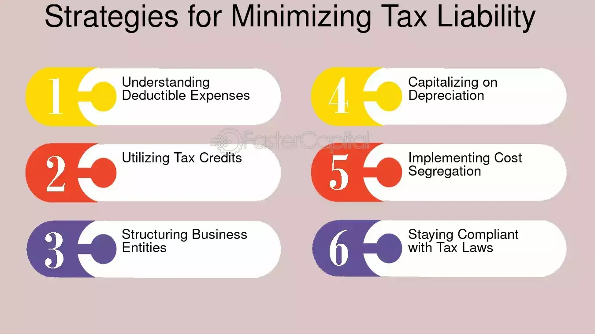

## Table of Contents

## What is a hedge fund and why do they focus on minimizing tax liability?

A hedge fund is a type of investment fund that pools money from investors to invest in a variety of assets, like stocks, bonds, and commodities. They are managed by professional investors who use different strategies to try to make money for the people who invest in the fund. Hedge funds are often seen as riskier than other types of investments, but they also have the potential to make more money.

Hedge funds focus on minimizing tax liability because it helps them keep more of the money they earn. By using smart tax strategies, they can reduce the amount of taxes they have to pay, which means more profits for the investors. This is important because investors want to see the highest possible returns on their investments, and paying less in taxes is one way to achieve that.

## What are the basic tax structures that hedge funds can use?

Hedge funds can use a few basic tax structures to minimize their tax liability. One common structure is the pass-through entity, like a limited partnership or a limited liability company (LLC). In this setup, the fund itself doesn't pay taxes on its income. Instead, the income "passes through" to the investors, who then report it on their personal tax returns. This can be beneficial because investors might be in lower tax brackets or have ways to offset the income with losses or deductions.

Another structure hedge funds might use is the offshore fund, which is set up in a country with lower tax rates or more favorable tax laws. By investing through an offshore fund, hedge funds can reduce the taxes they pay on their earnings. Investors in these funds might still have to pay taxes in their home country, but the overall tax burden can be lower. This strategy is often used by hedge funds to attract investors who want to minimize their tax liabilities.

Lastly, hedge funds can use a blocker corporation, which is a type of corporation set up to "block" certain types of income from being taxed as regular income. This can be useful for hedge funds that invest in assets that generate income that would otherwise be taxed at higher rates. By using a blocker corporation, the fund can convert this income into a form that is taxed at a lower rate, helping to increase the after-tax returns for investors.

## How do hedge funds utilize offshore entities to reduce their tax burden?

Hedge funds set up offshore entities in countries with lower taxes or special tax rules. This helps them pay less tax on the money they make. For example, they might choose places like the Cayman Islands or Bermuda. These places have laws that make it easy for hedge funds to keep more of their profits. By moving their money to these offshore funds, hedge funds can avoid higher taxes they would have to pay in other countries.

Investors in these offshore funds might still need to pay taxes in their home country, but the overall tax they pay can be less. This is because the offshore fund itself pays little to no tax, so more money is left for the investors. This makes the [hedge fund](/wiki/hedge-fund-trading-strategies) more attractive to people who want to keep as much of their investment earnings as possible. Using offshore entities is a common way for hedge funds to make their investors happier by reducing the amount of taxes they have to pay.

## What is the role of carried interest in hedge fund taxation?

Carried interest is a big deal in how hedge funds are taxed. It's a part of the profits that fund managers get as a reward for doing a good job. Instead of being taxed as regular income, carried interest is usually taxed at a lower rate, as if it were a capital gain. This means fund managers pay less tax on this money than they would if it were treated as their salary.

This lower tax rate on carried interest helps hedge funds attract talented managers. Because they can keep more of the money they earn, it's a big incentive for them to work hard and make the fund successful. But, this tax treatment has also been controversial. Some people think it's not fair that fund managers pay less tax on their earnings compared to other workers who pay regular income tax rates.

## How can hedge funds use loss harvesting to minimize taxes?

Hedge funds use a strategy called loss harvesting to lower their taxes. Loss harvesting means selling investments that have lost value. When they sell these losing investments, they can use the losses to reduce the taxes they owe on their gains. It's like using a bad investment to make a good one even better by paying less tax on it.

This strategy helps hedge funds keep more money for their investors. By carefully timing when they sell these losing investments, hedge funds can offset their profits and lower their tax bill. This means more money stays in the fund, which can lead to higher returns for everyone involved.

## What are the implications of the wash sale rule for hedge funds?

The wash sale rule is something hedge funds need to think about when they use loss harvesting to lower their taxes. This rule says you can't sell a losing investment and then buy the same or a very similar one within 30 days before or after the sale. If you do, you can't use the loss to reduce your taxes right away. For hedge funds, this means they have to be careful about when they sell and buy back investments. They need to make sure they don't break the wash sale rule, or they won't be able to use those losses to lower their tax bill.

This rule can make it harder for hedge funds to use loss harvesting effectively. They might have to wait longer than they want to buy back an investment they think is a good deal. This can affect their overall strategy and how much money they can save on taxes. But, if they plan well and follow the rules, hedge funds can still use loss harvesting to help their investors keep more of their earnings.

## How do hedge funds employ strategic asset location to optimize tax efficiency?

Hedge funds use strategic asset location to put different types of investments in the best places to pay less tax. They might put investments that make a lot of money in accounts where the taxes are lower. For example, they could put stocks that pay dividends in a tax-friendly account. This way, the money they make from those stocks is taxed less, so they can keep more of it for their investors.

They also think about where their investors live. Some places have different tax rules, so hedge funds might put certain investments in accounts that match where their investors are from. This helps make sure the investors pay the least amount of tax possible on their earnings. By being smart about where they put their money, hedge funds can help their investors keep more of their profits.

## What is the impact of the Tax Cuts and Jobs Act on hedge fund tax strategies?

The Tax Cuts and Jobs Act (TCJA) changed some things for hedge funds when it comes to taxes. One big change was the new tax rate for pass-through businesses. Hedge funds often use pass-through structures like partnerships, so this change helped them. The TCJA lets these businesses take a special deduction, which means they can pay less tax on their income. This makes it easier for hedge funds to keep more money for their investors.

Another thing the TCJA did was change the rules about how much interest a business can deduct. Before, hedge funds could deduct all their interest expenses, but now there's a limit. This can make it harder for hedge funds to use debt to grow their investments because they can't save as much on taxes. So, hedge funds have to think more carefully about how they use debt and find other ways to lower their taxes.

## How do hedge funds use derivatives and structured products to manage tax exposure?

Hedge funds use derivatives and structured products to manage their tax exposure in smart ways. Derivatives, like options and futures, let hedge funds make money without actually owning the assets. This can help them avoid some taxes because the profits from derivatives might be taxed differently than regular investments. For example, if a hedge fund uses options to make money, the gains might be treated as capital gains, which are usually taxed at a lower rate than regular income. This can help the hedge fund keep more money for its investors.

Structured products are another tool hedge funds use. These are investments that are put together in special ways to meet certain goals, like reducing taxes. A hedge fund might use a structured product to turn regular income into something that's taxed at a lower rate. For instance, they might create a product that gives them capital gains instead of interest income, which can save them a lot in taxes. By using these products, hedge funds can make their tax strategies more effective and keep more of their earnings for their investors.

## What are the advanced techniques involving foreign tax credits that hedge funds might use?

Hedge funds use foreign tax credits to lower their taxes in a smart way. They do this by investing in places where they have to pay taxes. When they pay taxes in another country, they can use those taxes as credits against what they owe in their home country. This means they don't have to pay taxes twice on the same money. For example, if a hedge fund pays taxes in a foreign country, they can use that amount to reduce the taxes they owe in the U.S. This helps them keep more money for their investors.

To make the most of foreign tax credits, hedge funds use a strategy called "basketing." This means they group their foreign income into different categories or "baskets." Each basket has its own rules for how the credits can be used. By carefully managing these baskets, hedge funds can make sure they're using their foreign tax credits in the best way possible. This can be complicated, but it helps them save a lot on taxes and keep more profits for their investors.

## How do hedge funds navigate the complexities of state and local taxes to minimize their liability?

Hedge funds have to deal with different state and local taxes, which can be tricky. They need to know the tax rules for each state where they have investors or operations. Some states have high taxes, while others have lower ones. Hedge funds can move their operations to states with lower taxes to save money. They might also choose to set up their main office in a state with good tax laws. This helps them keep more of their earnings for their investors.

Another way hedge funds handle state and local taxes is by using special tax structures. They might set up separate legal entities in different states to take advantage of the best tax deals. For example, they might use a limited partnership in one state and a corporation in another. This can help them pay less tax overall. By carefully planning where they operate and how they structure their business, hedge funds can lower their state and local tax bills and keep more money for their investors.

## What are the ethical considerations and potential regulatory changes affecting hedge fund tax minimization strategies?

Hedge funds using smart ways to pay less tax can sometimes be seen as not fair. Some people think it's wrong for hedge funds to use tricks to avoid paying taxes that other people have to pay. This can make people feel like the system is not fair. Also, when hedge funds pay less tax, it means less money for things like schools and roads. This can be a big problem for everyone. That's why there's a lot of talk about making rules to stop hedge funds from using these tax tricks.

There might be new rules coming that could change how hedge funds save on taxes. Governments are looking at ways to close loopholes and make sure everyone pays their fair share. For example, they might change the rules about carried interest or how offshore funds work. These changes could make it harder for hedge funds to use the same old tricks. Hedge funds will need to keep up with these new rules and find new ways to help their investors while still following the law.

## References & Further Reading

[1]: Lo, A. W. (2010). ["Hedge Funds: An Analytic Perspective"](https://www.jstor.org/stable/j.ctt7rq28). Princeton University Press.

[2]: Patterson, S. (2010). ["The Quants: How a New Breed of Math Whizzes Conquered Wall Street and Nearly Destroyed It"](https://www.amazon.com/Quants-Whizzes-Conquered-Street-Destroyed/dp/0307453383). Crown Business.

[3]: McCrary, S. (2014). ["How to Create and Manage a Hedge Fund: A Professional's Guide"](https://www.amazon.com/Create-Manage-Hedge-Fund-Professionals/dp/047122488X). Wiley.

[4]: Webber, L. (2007). ["Algorithmic Trading & DMA: An Introduction to Direct Access Trading Strategies"](https://www.semanticscholar.org/paper/Algorithmic-trading-%26-DMA-%3A-an-introduction-to-Johnson/aa5de1ab883d5e23b6651faa7c1807586d688e4b). 4Myeloma Press.

[5]: Inside the Black Box: A Simple Guide to Quantitative and High Frequency Trading by Rishi K. Narang.