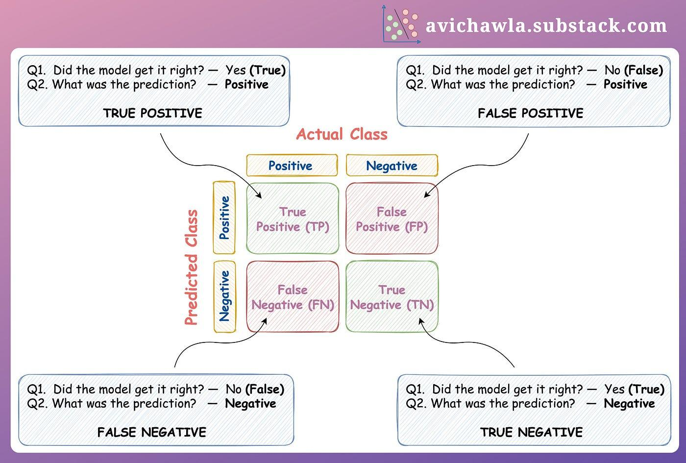

## Table of Contents

## What is a metric in the context of machine learning?

In machine learning, a metric is a way to measure how well a model is doing its job. Think of it like a score that tells you if your model is making good predictions or not. For example, if you're trying to predict whether it will rain or not, a metric can tell you how often your model gets it right. Metrics are important because they help you understand if your model is improving as you make changes to it, or if you need to try a different approach.

There are many different types of metrics, and which one you use depends on what you're trying to do. For example, accuracy is a common metric that measures the percentage of correct predictions out of all predictions made. If you're working on a classification problem, you might use accuracy, but if you're working on a regression problem, you might use something like mean squared error (MSE), which measures the average of the squares of the errors. The formula for MSE is $$ \text{MSE} = \frac{1}{n} \sum_{i=1}^{n} (y_i - \hat{y}_i)^2 $$, where \( y_i \) is the actual value, \( \hat{y}_i \) is the predicted value, and \( n \) is the number of observations. Choosing the right metric is crucial because it guides how you improve your model.

## Why are metrics important in machine learning?

Metrics are important in machine learning because they help you understand how well your model is working. Imagine you're trying to teach a computer to guess if it will rain tomorrow. You need a way to know if the computer's guesses are good or not. Metrics give you that way. They are like scores that tell you if your model is making good predictions. Without metrics, you wouldn't know if your model is getting better or worse as you make changes to it.

Choosing the right metric is also very important. Different tasks need different ways to measure success. For example, if you're trying to predict a number, like the temperature tomorrow, you might use the mean squared error (MSE) metric. The formula for MSE is $$ \text{MSE} = \frac{1}{n} \sum_{i=1}^{n} (y_i - \hat{y}_i)^2 $$, where \( y_i \) is the actual temperature, \( \hat{y}_i \) is the predicted temperature, and \( n \) is the number of days you're looking at. On the other hand, if you're trying to guess if it will rain or not, you might use accuracy, which tells you the percentage of correct guesses. Using the right metric helps you focus on what's important for your specific task.

## What are some common metrics used for classification problems?

In classification problems, one of the most common metrics is accuracy. Accuracy tells you the percentage of times your model guessed right. For example, if your model correctly guessed if it would rain 90 out of 100 times, your accuracy would be 90%. While accuracy is easy to understand, it can be misleading if you have an uneven number of examples in different categories. For instance, if 95% of your data says it will not rain, a model that always guesses "no rain" would have high accuracy but wouldn't be very useful.

Another useful metric is precision. Precision measures how many of the positive guesses your model made were actually correct. If your model said it would rain 10 times and it actually rained 8 of those times, your precision would be 80%. Precision is important when the cost of a false positive is high. Recall, on the other hand, measures how many of the actual positive cases your model caught. If it actually rained 20 times and your model caught 16 of those, your recall would be 80%. Recall is important when you want to make sure you don't miss any positive cases.

The F1 score is another metric that combines precision and recall into one number. It's the harmonic mean of precision and recall, which means it gives a single score that balances both. The formula for the F1 score is $$ \text{F1} = 2 \times \frac{\text{precision} \times \text{recall}}{\text{precision} + \text{recall}} $$. The F1 score is useful when you need to strike a balance between precision and recall, especially when you have an uneven number of examples in different categories.

## How do you choose the right metric for a machine learning task?

Choosing the right metric for a [machine learning](/wiki/machine-learning) task depends on what you're trying to achieve. If you're working on a classification problem, like guessing if it will rain or not, you might start with accuracy because it's easy to understand. Accuracy tells you the percentage of times your model guessed right. But if your data is unbalanced, like if most days it doesn't rain, accuracy might not be the best choice. In that case, you might want to use precision, which tells you how many of your positive guesses were correct, or recall, which tells you how many of the actual positive cases your model caught. The F1 score, which is the harmonic mean of precision and recall, can be a good choice when you need to balance both. The formula for the F1 score is $$ \text{F1} = 2 \times \frac{\text{precision} \times \text{recall}}{\text{precision} + \text{recall}} $$.

For regression problems, like predicting the temperature, you might use mean squared error (MSE) because it measures how far off your predictions are on average. The formula for MSE is $$ \text{MSE} = \frac{1}{n} \sum_{i=1}^{n} (y_i - \hat{y}_i)^2 $$, where \( y_i \) is the actual value, \( \hat{y}_i \) is the predicted value, and \( n \) is the number of observations. Sometimes, you might use mean absolute error (MAE) instead, which is simpler and easier to understand. The choice between MSE and MAE can depend on how much you want to penalize big mistakes. MSE punishes big errors more than MAE because it squares the differences. So, choosing the right metric means thinking about what matters most for your specific task and the kind of data you're working with.

## What is the difference between accuracy and precision in machine learning?

In machine learning, accuracy and precision are two different ways to measure how well a model is doing. Accuracy is easy to understand. It tells you the percentage of times your model guessed right out of all the guesses it made. For example, if your model correctly guessed if it would rain 90 out of 100 times, your accuracy would be 90%. Accuracy is a good starting point, but it can be misleading if your data has more examples of one type than another. For instance, if 95% of your data says it won't rain, a model that always guesses "no rain" would have high accuracy but wouldn't be very useful.

Precision, on the other hand, focuses on the positive guesses your model made. It tells you how many of those positive guesses were actually correct. If your model said it would rain 10 times and it actually rained 8 of those times, your precision would be 80%. Precision is important when the cost of making a wrong positive guess is high. For example, if you're predicting a disease, you don't want to tell someone they have it when they don't. So, while accuracy looks at all guesses, precision looks only at the positive ones and helps you understand how reliable those positive predictions are.

## Can you explain the F1 score and when it is useful?

The F1 score is a way to measure how well a model is doing when you want to balance two important things: precision and recall. Precision tells you how many of your positive guesses were right, while recall tells you how many of the actual positive cases your model caught. The F1 score combines these two into one number, which is helpful when you need to make sure your model is doing well at both catching all the positive cases and not making too many wrong guesses. The formula for the F1 score is $$ \text{F1} = 2 \times \frac{\text{precision} \times \text{recall}}{\text{precision} + \text{recall}} $$. This formula shows that the F1 score is the harmonic mean of precision and recall, meaning it gives a single score that balances both.

The F1 score is especially useful when your data is unbalanced, meaning you have a lot more examples of one type than another. For example, if you're trying to predict a rare disease, you might have a lot more "no disease" cases than "disease" cases. In this situation, accuracy might not be a good measure because a model that always guesses "no disease" could still have high accuracy but wouldn't be very useful. The F1 score helps you focus on how well your model is doing at identifying the rare cases (recall) while also keeping the number of wrong positive guesses low (precision). So, if you need to balance these two things, the F1 score is a great choice.

## What metrics are typically used for regression problems?

In regression problems, where you're trying to predict a number like the temperature tomorrow, a common metric is mean squared error (MSE). MSE measures how far off your predictions are on average. It does this by taking the difference between each prediction and the actual value, squaring those differences, and then averaging them. The formula for MSE is $$ \text{MSE} = \frac{1}{n} \sum_{i=1}^{n} (y_i - \hat{y}_i)^2 $$, where \( y_i \) is the actual value, \( \hat{y}_i \) is the predicted value, and \( n \) is the number of observations. MSE is useful because it punishes big mistakes more than small ones, which can be important if big errors are more costly.

Another common metric for regression is mean absolute error (MAE). MAE is simpler than MSE because it just takes the average of the absolute differences between the predictions and the actual values. The formula for MAE is $$ \text{MAE} = \frac{1}{n} \sum_{i=1}^{n} |y_i - \hat{y}_i| $$. MAE is easier to understand and interpret than MSE because it's in the same units as your predictions. It's a good choice when you want to treat all errors equally, no matter their size. Choosing between MSE and MAE depends on what matters more for your specific task: punishing big errors more or treating all errors the same.

## How does the choice of metric affect model optimization?

The choice of metric in machine learning is like [picking](/wiki/asset-class-picking) the right tool for a job. It tells your model what to focus on when it's learning. If you use mean squared error (MSE) for a regression problem, your model will try to make its predictions as close to the actual values as possible. MSE punishes big mistakes more because it squares the differences. The formula for MSE is $$ \text{MSE} = \frac{1}{n} \sum_{i=1}^{n} (y_i - \hat{y}_i)^2 $$. If you choose mean absolute error (MAE) instead, your model will try to keep all errors small, but it won't care as much about big mistakes. The formula for MAE is $$ \text{MAE} = \frac{1}{n} \sum_{i=1}^{n} |y_i - \hat{y}_i| $$. So, the metric you choose shapes what your model tries to do better.

For classification problems, if you choose accuracy as your metric, your model will aim to get as many guesses right as possible. But if your data is unbalanced, like if most examples are of one type, accuracy might not be the best choice. In that case, using precision or recall could be better. Precision helps your model focus on making fewer wrong positive guesses, while recall helps it catch more of the actual positive cases. The F1 score, which balances precision and recall, can be a good choice when you need both. The formula for the F1 score is $$ \text{F1} = 2 \times \frac{\text{precision} \times \text{recall}}{\text{precision} + \text{recall}} $$. By choosing the right metric, you guide your model to improve in the way that matters most for your task.

## What are some advanced metrics used in deep learning?

In [deep learning](/wiki/deep-learning), some advanced metrics go beyond the basics to help you understand how well your model is doing. One such metric is the Intersection over Union (IoU), which is often used in object detection and segmentation tasks. IoU measures how much your model's predicted area overlaps with the actual area. If your model is trying to draw a box around a cat in a picture, IoU will tell you how well that box matches the real cat's position. The formula for IoU is $$ \text{IoU} = \frac{\text{Area of Overlap}}{\text{Area of Union}} $$. A higher IoU means your model is doing a better job at finding where things are in the image.

Another advanced metric is the Area Under the Receiver Operating Characteristic Curve (AUC-ROC). This metric is useful when you're working on classification problems, especially when you need to see how well your model can tell apart different classes over a range of decision thresholds. Imagine you're trying to predict if an email is spam or not. The AUC-ROC helps you see how good your model is at this task by looking at the trade-off between true positives and false positives. A higher AUC-ROC score means your model is better at distinguishing between spam and non-spam emails. These advanced metrics give you a deeper look into your model's performance and help you make it even better.

## How can metrics be used to address class imbalance problems?

When you have a lot more examples of one class than another in your data, it's called a class imbalance problem. This can make it hard for your model to learn well because it might focus too much on the bigger class and ignore the smaller one. Accuracy, which is the percentage of times your model guessed right, can be misleading in this case. For example, if 95% of your data is "no rain" and your model always guesses "no rain," it would have high accuracy but wouldn't be very useful. To fix this, you can use other metrics like precision, recall, and the F1 score.

Precision tells you how many of your positive guesses were right, which is important when the cost of a wrong positive guess is high. Recall tells you how many of the actual positive cases your model caught, which is useful when you don't want to miss any positive cases. The F1 score combines both precision and recall into one number. The formula for the F1 score is $$ \text{F1} = 2 \times \frac{\text{precision} \times \text{recall}}{\text{precision} + \text{recall}} $$. By using these metrics, you can make sure your model pays attention to both the big and small classes, helping it learn better and make more useful predictions.

## What is the role of metrics in model evaluation and selection?

Metrics play a crucial role in evaluating and selecting machine learning models. When you're trying to decide which model to use, you need a way to compare how well they perform. Metrics give you that way. They are like scores that tell you how good a model is at making predictions. For example, if you're trying to predict if it will rain tomorrow, a metric like accuracy can tell you how often your model gets it right. By comparing the accuracy of different models, you can choose the one that does the best job.

Choosing the right metric is also important because it depends on what you're trying to do. If you're working on a classification problem, like guessing if it will rain or not, you might use accuracy, precision, recall, or the F1 score. The F1 score is useful when you have an uneven number of examples in different categories. The formula for the F1 score is $$ \text{F1} = 2 \times \frac{\text{precision} \times \text{recall}}{\text{precision} + \text{recall}} $$. For regression problems, like predicting the temperature, you might use mean squared error (MSE) or mean absolute error (MAE). The choice of metric helps you focus on what matters most for your task and guides you in picking the best model.

## How do you interpret and compare different metrics across multiple models?

When you're comparing different models, you need to look at the metrics to see which one is doing the best job. Let's say you have three models trying to guess if it will rain tomorrow. You might look at accuracy, which tells you the percentage of times the model guessed right. If Model A has an accuracy of 80%, Model B has 75%, and Model C has 85%, you might think Model C is the best. But if your data has a lot more "no rain" days than "rain" days, accuracy might not be the best metric. In that case, you could also look at precision, which tells you how many of the positive guesses (like "rain") were right, and recall, which tells you how many of the actual positive cases the model caught. The F1 score, which is the harmonic mean of precision and recall, can be a good way to balance both. The formula for the F1 score is $$ \text{F1} = 2 \times \frac{\text{precision} \times \text{recall}}{\text{precision} + \text{recall}} $$. By comparing these different metrics, you get a better picture of which model is truly the best for your task.

For regression problems, like predicting the temperature, you might use mean squared error (MSE) or mean absolute error (MAE). MSE tells you how far off your predictions are on average, and it punishes big mistakes more because it squares the differences. The formula for MSE is $$ \text{MSE} = \frac{1}{n} \sum_{i=1}^{n} (y_i - \hat{y}_i)^2 $$. MAE is simpler because it just takes the average of the absolute differences between the predictions and the actual values. The formula for MAE is $$ \text{MAE} = \frac{1}{n} \sum_{i=1}^{n} |y_i - \hat{y}_i| $$. If you have two models predicting temperature, and Model A has an MSE of 4 and Model B has an MSE of 6, Model A is doing a better job because its predictions are closer to the actual temperatures on average. But if you care more about treating all errors the same, you might prefer to compare the MAE instead. By looking at these different metrics, you can choose the model that best fits what you need.