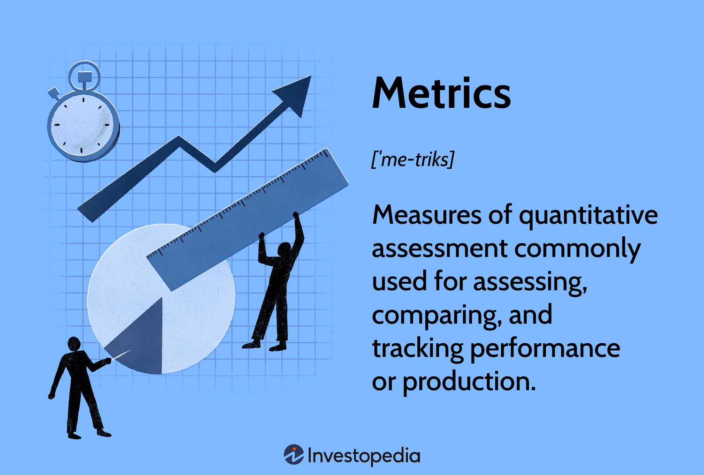

## Table of Contents

## What are metrics in data analysis?

Metrics in data analysis are like special tools that help us understand and measure things about data. They are numbers or values that we use to keep track of how well something is doing or to see patterns and trends. For example, if you run a store, a metric could be the number of customers who visit each day. This helps you know if your store is getting more or less popular.

There are many different kinds of metrics, and they can be used for different purposes. Some metrics help us measure how fast something happens, like how quickly a website loads. Other metrics might tell us about quality, like how many mistakes are in a report. By using the right metrics, we can make better decisions and improve whatever we are studying or working on.

## Why are metrics important in data analysis?

Metrics are important in data analysis because they help us turn raw data into useful information. When we look at data, it can be hard to understand what it all means. Metrics give us a way to measure specific things, like how many people visit a website or how much money a business makes. By using metrics, we can see clear numbers that show us what is happening. This makes it easier to understand the data and see if things are going well or if there are problems that need to be fixed.

Another reason metrics are important is that they help us make better decisions. When we have good metrics, we can compare different times or different parts of a business. For example, if a store owner sees that sales go up on weekends, they might decide to run special sales during those times. Metrics also help us set goals and see if we are reaching them. If a school wants to improve test scores, they can use metrics to track progress and see if their efforts are working. In short, metrics guide us in making smart choices based on data.

## What are some common types of metrics used in data analysis?

In data analysis, some common types of metrics are performance metrics, which tell us how well something is doing. For example, in a business, sales numbers and profit margins are performance metrics. They help us see if the business is making money or if it needs to change something. Another type of metric is engagement metrics, which show how much people interact with something. For instance, on a website, the number of page views or the time people spend on the site are engagement metrics. They help us understand if people like what they see and if they are interested in the content.

There are also quality metrics, which measure how good something is. In manufacturing, the number of defective products is a quality metric. It tells us if the production process is working well or if there are problems that need to be fixed. Efficiency metrics are another type, and they show how quickly and well things are done. For example, in a call center, the average time it takes to answer a call is an efficiency metric. It helps managers see if their team is working fast enough or if they need more staff.

Lastly, growth metrics tell us if something is getting bigger or better over time. For a social media platform, the number of new users each month is a growth metric. It helps the company see if it is becoming more popular. Customer satisfaction metrics are also important, as they tell us how happy people are with a product or service. For example, a restaurant might use customer reviews and ratings as satisfaction metrics to see if people like their food and service.

## How do you choose the right metrics for a specific analysis?

Choosing the right metrics for a specific analysis starts with understanding what you want to learn or achieve. Think about your goal. Are you trying to see if a business is making more money? Or do you want to know if people are enjoying a new product? Once you know your goal, pick metrics that directly help you measure it. For example, if you want to see if a website is popular, you might choose metrics like the number of visitors or how long they stay on the site. Make sure the metrics you choose are clear and easy to understand.

It's also important to make sure your metrics are relevant and useful. They should give you information that helps you make decisions or see if things are improving. Sometimes, you might need more than one metric to get a full picture. For instance, if you run a store, looking at just sales numbers might not tell you everything. You might also want to look at how many people come into the store and how much they spend on average. Finally, keep in mind that metrics can change over time. As your goals or the situation changes, you might need to choose different metrics to keep your analysis accurate and helpful.

## What is the difference between a KPI and a metric?

A metric is a number or value that helps you measure something specific. It's like a tool that gives you information about a part of your business or project. For example, the number of visitors to a website or the amount of money made in a day are metrics. They help you see what is happening, but they don't always tell you if you are doing well or meeting your goals.

A Key Performance Indicator (KPI) is a special kind of metric. KPIs are chosen because they show how well you are doing in reaching your important goals. They are like the most important metrics that tell you if you are on the right track. For example, if your goal is to make more money, a KPI might be the monthly profit, not just daily sales. KPIs help you focus on what really matters and make sure you are moving towards your big goals.

## How can metrics be used to drive business decisions?

Metrics help businesses make smart choices by giving clear numbers that show what is happening. When a business looks at metrics like sales numbers, customer visits, or how much time people spend on their website, they can see if things are going well or if there are problems. For example, if a store owner sees that sales are going down, they might decide to start a sale or change their products. By using metrics, businesses can find out what works and what doesn't, and then make decisions based on that information.

Metrics also help businesses set goals and see if they are reaching them. If a company wants to grow, they might use metrics like the number of new customers or how much their sales increase each month. These metrics tell them if they are getting closer to their goals or if they need to try something different. By keeping an eye on the right metrics, businesses can make changes quickly and keep moving in the right direction.

## What are leading and lagging indicators in metrics?

Leading indicators are metrics that help you see what might happen in the future. They give you early signs or warnings about what could be coming up. For example, if a store sees more people coming in on weekends, that's a leading indicator that sales might go up during those times. Businesses use leading indicators to plan ahead and make decisions before things happen. They help you be ready for what's next.

Lagging indicators, on the other hand, are metrics that show you what has already happened. They tell you about past performance and results. For example, the total sales at the end of the month are a lagging indicator because they show you how well the store did after the month is over. Lagging indicators are useful for looking back and understanding what worked or didn't work. They help businesses learn from the past and make better plans for the future.

## How do you ensure the accuracy and reliability of metrics?

To make sure metrics are accurate and reliable, it's important to start with good data. You need to collect data carefully and make sure it's correct. This means checking your data sources and making sure they are trustworthy. For example, if you're counting website visitors, you need to use a tool that counts them correctly. Also, you should clean your data, which means removing any mistakes or strange numbers that don't fit. By doing these things, you can trust that your metrics are based on good, solid data.

Once you have good data, you need to use the right methods to turn it into metrics. This means choosing the right formulas and calculations to make sure your metrics are correct. It's also a good idea to double-check your work. You can do this by having someone else look at your metrics or by using different tools to see if you get the same results. Keeping an eye on your metrics over time can also help. If they suddenly change a lot, it might mean there's a problem with your data or your calculations. By being careful and checking your work, you can make sure your metrics are accurate and reliable.

## What are some advanced statistical metrics used in data analysis?

Advanced statistical metrics help us understand data in more detailed ways. One example is the standard deviation, which tells us how spread out the numbers in a set of data are. If the standard deviation is small, it means the numbers are close together, and if it's big, it means they are spread out a lot. Another important metric is the correlation coefficient, which shows how much two things are related to each other. If the correlation coefficient is close to 1 or -1, it means the two things are strongly related, either in the same direction or in opposite directions. These metrics help us see patterns and understand how different parts of our data connect with each other.

Another advanced metric is the p-value, which is used in hypothesis testing. The p-value tells us if the results we see in our data are likely to happen by chance or if they are meaningful. If the p-value is small, it means our results are probably not just random, and we can trust them more. Regression analysis is also an important tool, which helps us see how one thing affects another. For example, it can show how much sales might go up if we spend more on advertising. By using these advanced metrics, we can make more accurate predictions and understand our data better.

## How can metrics be visualized effectively?

Metrics can be shown in a clear way by using different kinds of charts and graphs. A bar chart is good for comparing numbers, like how many people visited a store each month. A line graph is helpful for showing how something changes over time, like how sales go up or down. Pie charts can show parts of a whole, like what percentage of customers bought different products. By picking the right type of chart, you can make it easy for people to see and understand the metrics.

Colors and labels also make a big difference in how well people can understand your metrics. Use different colors to show different things, but don't use too many colors because it can get confusing. Labels should be clear and easy to read, telling people exactly what each part of the chart means. When you put all these things together, your charts and graphs will help people see the important information in your metrics quickly and easily.

## What are the challenges in implementing and tracking metrics?

One big challenge in using metrics is making sure the data is right. If the data is wrong, the metrics will be wrong too. This can happen if the information is not collected carefully or if there are mistakes in the data. It's important to check the data and fix any problems before using it for metrics. Another challenge is picking the right metrics. There are so many things you could measure, but not all of them will help you reach your goals. You need to choose metrics that really show what you want to know and help you make good decisions.

Another difficulty is keeping track of metrics over time. Things can change, and you need to make sure your metrics stay useful. This means you might need to update your metrics or find new ones as your goals or the situation changes. It can also be hard to get everyone in a business to understand and use the metrics. People might not see why the metrics are important or how to use them to make decisions. To overcome this, you need to explain the metrics clearly and show how they help everyone reach their goals.

## How can machine learning enhance the use of metrics in data analysis?

Machine learning can make metrics in data analysis better by finding patterns that are hard for people to see. It can look at a lot of data very quickly and find things that might be missed otherwise. For example, machine learning can help find which customers are most likely to buy something again or which products are selling well together. By using these insights, businesses can pick the best metrics to focus on and make better decisions.

Also, machine learning can help make predictions about the future based on metrics. It can use past data to guess what might happen next, like how many people will visit a store next month or how much a business might grow. This helps businesses plan ahead and set goals that are more likely to be reached. By using machine learning, metrics become more powerful tools for understanding and improving things.

## What are the key metrics to evaluate trading algorithm performance?

Evaluating the performance of trading algorithms requires a thorough understanding of several key metrics. These metrics help in assessing both the returns and risks associated with the strategies implemented by these algorithms. Here, we discuss some essential parameters:

**Financial Viability**

Financial viability is critical in evaluating an algorithm's ability to consistently deliver positive outcomes over time. It involves assessing the Return on Investment (ROI) of the algorithm, which is calculated as:

$$
\text{ROI} = \left( \frac{\text{Total Gains} - \text{Total Costs}}{\text{Total Costs}} \right) \times 100
$$

This metric provides insights into whether the trading strategy meets financial goals and expectations. Consistency in returns is a key indicator of a financially viable algorithm, but it does not guarantee future profits.

**Sharpe Ratio**

The Sharpe Ratio is widely used to evaluate the risk-adjusted return of a trading algorithm. It quantifies the excess return earned per unit of risk. The formula for the Sharpe Ratio is:

$$
\text{Sharpe Ratio} = \frac{E[R_a - R_f]}{\sigma_a}
$$

Where $E[R_a - R_f]$ is the expected excess return of the algorithm, and $\sigma_a$ is the standard deviation of the algorithm’s returns. A higher Sharpe Ratio indicates more efficient risk-to-return conversion, making it an essential metric for comparing different trading strategies.

**Winning Percentage**

Winning Percentage measures the accuracy of an algorithm in generating profitable trades. It is defined as the ratio of profitable trades to the total number of trades executed:

$$
\text{Winning Percentage} = \left( \frac{\text{Number of Winning Trades}}{\text{Total Trades}} \right) \times 100
$$

This metric helps evaluate the success rate of the trading strategy and, while useful, doesn't assure long-term profitability. It assists traders in making decisions based on historical performance data.

**Maximum Drawdown**

Maximum Drawdown indicates the largest peak-to-trough decline in the algorithm's equity, providing insights into risk management effectiveness. It is calculated as:

$$
\text{Maximum Drawdown} = \frac{\text{Peak Equity Value} - \text{Trough Equity Value}}{\text{Peak Equity Value}}
$$

Smaller drawdowns suggest better risk management and greater investor confidence. This metric helps evaluate the resilience of the algorithm against market volatility.

**Volatility Metrics**

Volatility metrics like standard deviation measure an algorithm’s risk exposure to price fluctuations. High volatility signifies a higher risk but potentially higher returns. The standard deviation of returns is calculated as:

$$
\sigma = \sqrt{\frac{1}{N} \sum_{i=1}^{N} (R_i - \bar{R})^2}
$$

Where $R_i$ represents the return at each time period, and $\bar{R}$ is the mean return of the algorithm. Understanding these metrics allows traders to align their strategies with risk tolerance and financial objectives, ensuring a balanced approach between risk and returns.

## What is Understanding Financial Viability?

Financial viability is a crucial metric in evaluating trading algorithms, as it provides insights into the effectiveness of the algorithm in generating favorable outcomes over a period. The primary focus is on assessing the algorithm's ability to meet financial objectives by examining its return on investment (ROI). ROI is calculated as:

$$
\text{ROI} = \left( \frac{\text{Net Profit}}{\text{Initial Investment}} \right) \times 100
$$

This formula assesses the algorithm's efficiency in delivering returns relative to the initial investment. A higher ROI indicates better performance, signifying that the algorithm is more effective in converting the initial capital into profits. However, it is essential to note that while financial viability provides valuable insights, it does not guarantee future profits due to the inherent unpredictability of financial markets.

Additionally, evaluating financial viability involves understanding whether the trading strategy aligns with the trader's financial goals and expectations. For instance, a conservative investor may prefer an algorithm with stable, moderate returns, focusing on capital preservation, whereas an aggressive trader might seek higher returns despite increased risk.

The assessment of financial viability helps in making informed decisions regarding the sustainability and potential of the trading strategy. Continuous monitoring and analysis allow traders to adjust their strategies as needed to better align with evolving market conditions and personal financial objectives. This proactive approach ensures that the chosen algorithm remains a valuable tool in achieving desired financial outcomes.

## What is the role of the Sharpe Ratio in algorithmic trading?

The Sharpe Ratio is a pivotal metric in algorithmic trading, measuring the risk-adjusted returns of a trading strategy. It essentially provides insight into how much excess return an algorithm generates for each unit of risk taken, making it a critical tool for traders and analysts aiming to enhance their performance assessment. The formula for the Sharpe Ratio is given by:

$$
\text{Sharpe Ratio} = \frac{R_p - R_f}{\sigma_p}
$$

where $R_p$ is the expected portfolio return, $R_f$ is the risk-free rate of return, and $\sigma_p$ is the standard deviation of the portfolio’s excess return.

A higher Sharpe Ratio signifies a more favorable risk-to-return conversion, indicating that the algorithm not only achieves excess returns but does so with efficient risk management. This efficiency is crucial, as it enables traders to compare and rank the performance of different strategies, particularly when assessing them against various levels of risk exposure.

In practice, a trading algorithm with a Sharpe Ratio greater than 1 is typically considered good, while a ratio above 2 is considered excellent. This scale helps traders quickly narrow down strategies that provide higher returns for lower risks. However, it is important to consider the limitations of the Sharpe Ratio, such as its assumption of normally distributed returns and its sensitivity to the choice of the risk-free rate.

As an example, consider a Python snippet to compute the Sharpe Ratio:

```python
def calculate_sharpe_ratio(returns, risk_free_rate):
    excess_returns = returns - risk_free_rate
    mean_excess_return = excess_returns.mean()
    std_deviation = excess_returns.std()
    sharpe_ratio = mean_excess_return / std_deviation
    return sharpe_ratio
```

In summary, the Sharpe Ratio remains a cornerstone for evaluating risk-adjusted returns, supporting traders in their quest for more effective and balanced trading strategies. By focusing on efficient risk management, the Sharpe Ratio aids in selecting strategies that align with individual risk preferences and investment goals.

## What is the significance of winning percentage?

Winning Percentage is a critical metric in the evaluation of trading algorithms, focusing on the algorithm's trading accuracy. It represents the proportion of trades that result in a profit relative to the total number of trades executed. The formula for calculating the Winning Percentage is straightforward:

$$
\text{Winning Percentage} = \left( \frac{\text{Number of Winning Trades}}{\text{Total Number of Trades}} \right) \times 100
$$

A higher Winning Percentage indicates that the algorithm is consistently able to generate profitable trades. This metric is especially vital for traders seeking to understand the historical success rate of their trading strategies. A high Winning Percentage serves as a positive indicator of trading efficiency; however, it does not inherently guarantee long-term profitability. An algorithm may exhibit a high Winning Percentage yet still incur losses if the size of losing trades outweighs the profits from winning trades.

The Winning Percentage acts as a benchmark for evaluating the success rate of executed trades, providing traders with insights into the algorithm's performance based on historical data. By analyzing this metric, traders can ascertain the reliability of the algorithm's strategy, which can influence future trading decisions and adjustments to the algorithm.

It is essential to complement the Winning Percentage with other performance indicators, such as the Sharpe Ratio or Maximum Drawdown, to obtain a holistic view of an algorithm's profitability and risk management capabilities. By doing so, traders can ensure that their strategies align with their financial goals and risk tolerance.

## What is Analyzing Maximum Drawdown?

Maximum Drawdown (MDD) is a critical metric in evaluating the performance of trading algorithms. It quantifies the largest observed percentage drop in equity from a peak to a trough before a new peak is reached. This measurement is significant because it reflects the potential loss in investment value and tests the algorithm's ability to endure adverse market conditions without incurring substantial losses.

The calculation of Maximum Drawdown is straightforward. It involves tracking the peak values of a trading strategy's equity curve and noting the deepest decline following these peaks. Mathematically, it can be represented as:

$$
\text{MDD} = \frac{\text{Peak Value} - \text{Trough Value}}{\text{Peak Value}}
$$

A lower Maximum Drawdown is preferred as it indicates effective risk management. Strategies that manage to keep drawdown low typically inspire greater investor confidence, as they suggest that the algorithm can maintain value even amid volatile market conditions. This is crucial for preserving capital and achieving stable, long-term returns.

Programmatically, Maximum Drawdown can be implemented in Python as follows:

```python
import numpy as np

def max_drawdown(equity_curve):
    # Convert array to numpy array for efficient computation
    equity_curve = np.array(equity_curve)
    # Calculate the running maximum
    running_max = np.maximum.accumulate(equity_curve)
    # Calculate drawdowns
    drawdowns = (running_max - equity_curve) / running_max
    # Return the maximum drawdown
    return np.max(drawdowns)

# Example usage with a hypothetical equity curve
equity_curve = [100, 105, 102, 98, 110, 107, 104, 108]
print("Maximum Drawdown:", max_drawdown(equity_curve))
```

Maximum Drawdown offers insight into not just the potential loss in investments but also guides the balancing of risk and return. When aligned with other risk metrics, Maximum Drawdown can help traders build a strategy that capitalizes on gains while minimizing exposure to severe losses, ultimately preserving capital and enhancing overall investment performance.

## What are Volatility Metrics and What is Their Impact?

Volatility metrics are essential in assessing an algorithm's exposure to price fluctuations in the financial markets. Standard deviation, a key measure of volatility, quantifies the degree to which the returns of a trading algorithm vary from their average over a specific period. It provides a statistical estimate of risk, helping traders to gauge the expected range of returns and potential price swings.

For instance, a higher standard deviation indicates greater price variability, suggesting that the algorithm's returns could significantly deviate from the expected average. This inherent risk must be analyzed carefully, as it can affect the stability and reliability of trading strategies. The mathematical formula for standard deviation is given by:

$$
\sigma = \sqrt{\frac{1}{N} \sum_{i=1}^{N} (R_i - \mu)^2}
$$

where $\sigma$ is the standard deviation, $R_i$ represents each individual return, $\mu$ is the mean of the returns, and $N$ is the total number of returns.

By understanding and monitoring volatility, traders can better align their strategies with their individual risk tolerance and financial objectives. For example, a trader seeking stable returns may prefer algorithms with lower volatility, whereas a risk-seeking investor might pursue strategies with higher volatility, anticipating greater returns in exchange for increased risk.

In addition to standard deviation, other volatility measures, such as the Volatility Index (VIX) and historical volatility, can also provide insights into market conditions. These metrics enable traders to assess how well a trading algorithm performs under varying market dynamics and helps in optimizing strategies to balance returns against risk exposure.

Ultimately, incorporating volatility metrics when evaluating algorithmic trading strategies facilitates more informed decision-making. It empowers traders to adjust their approaches to maintain a more consistent performance, minimizing risk exposure while capitalizing on potential opportunities within their risk parameters. By maintaining this balance, traders can achieve a more sustainable and financially sound trading strategy over time.

## References & Further Reading

[1]: Bergstra, J., Bardenet, R., Bengio, Y., & Kégl, B. (2011). ["Algorithms for Hyper-Parameter Optimization."](https://papers.nips.cc/paper/4443-algorithms-for-hyper-parameter-optimization) Advances in Neural Information Processing Systems 24.

[2]: ["Advances in Financial Machine Learning"](https://www.amazon.com/Advances-Financial-Machine-Learning-Marcos/dp/1119482089) by Marcos Lopez de Prado

[3]: ["Evidence-Based Technical Analysis: Applying the Scientific Method and Statistical Inference to Trading Signals"](https://www.amazon.com/Evidence-Based-Technical-Analysis-Scientific-Statistical/dp/0470008741) by David Aronson

[4]: ["Machine Learning for Algorithmic Trading"](https://github.com/stefan-jansen/machine-learning-for-trading) by Stefan Jansen

[5]: ["Quantitative Trading: How to Build Your Own Algorithmic Trading Business"](https://www.amazon.com/Quantitative-Trading-Build-Algorithmic-Business/dp/1119800064) by Ernest P. Chan