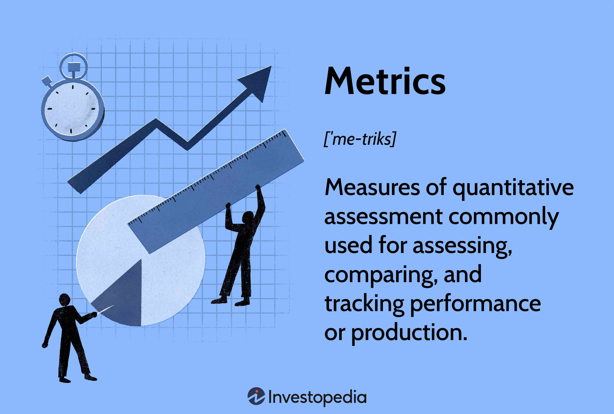

Algorithmic trading has become a transformative force in financial markets, offering new avenues for both institutional and individual traders to increase efficiency and reduce the influence of emotional biases in trading decisions. By deploying trading algorithms, market participants aim to capitalize on market opportunities with precision and speed, often unattainable through manual trading methods. These algorithms employ pre-defined rules based on mathematical models and quantitative analysis to execute trades automatically.

One of the critical components in optimizing these trading algorithms lies in the diligent assessment of their performance, achieved through specialized data analysis metrics. These metrics are instrumental in evaluating and enhancing strategies, enabling traders to assess the profitability and risk associated with various algorithmic approaches. They provide insights into an algorithm's capacity to deliver consistent returns and adapt to unpredictable market conditions.



This article focuses on the essential metrics necessary for evaluating algorithmic trading strategies, highlighting how understanding them can lead to more strategic trading decisions. By exploring the intricacies of metrics such as financial viability, risk-adjusted returns, and volatility, traders can refine their strategies, aiming for better financial outcomes. Through data-driven insights, market participants can navigate the complexities of algorithmic trading, fostering informed decisions that drive success in competitive trading environments.

## Table of Contents

## Defining a Trading Algorithm

A trading algorithm is a sophisticated set of predefined rules or instructions designed to execute trades autonomously in financial markets. These algorithms leverage mathematical models, statistical analysis, and historical data to identify and exploit market inefficiencies with the aim of maximizing profits and minimizing risks. By automating the trading process, algorithms are able to remove the emotional bias often associated with manual trading, thereby enhancing both efficiency and execution speed.

At their core, trading algorithms utilize data-driven insights to inform trading decisions. They capitalize on various market opportunities through strategies such as trend following, which involves buying or selling based on the current market trend, and statistical arbitrage, which seeks to exploit pricing inefficiencies between correlated securities. Moreover, trading algorithms are adept at market-making activities, quoting buy and sell prices to profit from the bid-ask spread.

These algorithms are not only crucial for institutional traders, who execute large volumes of trades, but also for individual traders aiming to refine their trading strategies. The primary objective of a trading algorithm is to ensure consistent execution, adhering to a systematic approach that mitigates risks while optimizing returns. By deploying these algorithmic strategies, traders can achieve a level of rigor and repeatability that manual trading cannot match. In summary, trading algorithms are pivotal tools in financial markets, embodying the intersection of finance, mathematics, and computer science to facilitate intelligent, unbiased trading decisions.

## Need for Evaluating Trading Algorithms

Evaluating trading algorithms is vital for gaining insights into their performance and effective risk management. This evaluation process involves various metrics that collectively offer a detailed understanding of an algorithm's capacity to consistently generate returns. By incorporating these metrics, traders can assess how well their algorithms are performing in different market conditions, helping them make informed decisions.

Risk-adjusted returns are a key focus when evaluating trading algorithms. Metrics like the Sharpe Ratio, which measures excess return per unit of risk, allow traders to evaluate their algorithm's efficiency in converting risk into returns. This is particularly important in quantifying the trade-off between risk and reward, enabling the identification of strategies that maximize returns while minimizing risk exposure.

Assessing the accuracy in executing profitable trades is another crucial aspect. Metrics like Winning Percentage and Maximum Drawdown give insight into how often an algorithm successfully closes trades in profit and its ability to withstand market [volatility](/wiki/volatility-trading-strategies) without incurring significant losses. This accurate measurement of trade performance helps in identifying areas where an algorithm may need adjustment to improve its profitability and stability.

Moreover, regular evaluations pinpoint specific areas that require enhancement, fostering better adaptation in dynamic markets. Financial markets are inherently volatile and constantly evolving, and an algorithm that fits one market scenario may struggle in another. Continuous reassessment allows traders to adjust parameters and update models, ensuring that the trading strategies remain effective and align with the changing market conditions.

In conclusion, continuous assessment of trading algorithms not only ensures their persistent efficacy but also provides a structured approach to understanding and managing the inherent risks associated with [algorithmic trading](/wiki/algorithmic-trading). By leveraging data-driven insights and continuously adapting to the market dynamics, traders can achieve better performance and optimize their trading strategies effectively.

## Key Metrics to Evaluate Trading Algorithm Performance

Evaluating the performance of trading algorithms requires a thorough understanding of several key metrics. These metrics help in assessing both the returns and risks associated with the strategies implemented by these algorithms. Here, we discuss some essential parameters:

**Financial Viability**

Financial viability is critical in evaluating an algorithm's ability to consistently deliver positive outcomes over time. It involves assessing the Return on Investment (ROI) of the algorithm, which is calculated as:

$$
\text{ROI} = \left( \frac{\text{Total Gains} - \text{Total Costs}}{\text{Total Costs}} \right) \times 100
$$

This metric provides insights into whether the trading strategy meets financial goals and expectations. Consistency in returns is a key indicator of a financially viable algorithm, but it does not guarantee future profits.

**Sharpe Ratio**

The Sharpe Ratio is widely used to evaluate the risk-adjusted return of a trading algorithm. It quantifies the excess return earned per unit of risk. The formula for the Sharpe Ratio is:

$$
\text{Sharpe Ratio} = \frac{E[R_a - R_f]}{\sigma_a}
$$

Where $E[R_a - R_f]$ is the expected excess return of the algorithm, and $\sigma_a$ is the standard deviation of the algorithm’s returns. A higher Sharpe Ratio indicates more efficient risk-to-return conversion, making it an essential metric for comparing different trading strategies.

**Winning Percentage**

Winning Percentage measures the accuracy of an algorithm in generating profitable trades. It is defined as the ratio of profitable trades to the total number of trades executed:

$$
\text{Winning Percentage} = \left( \frac{\text{Number of Winning Trades}}{\text{Total Trades}} \right) \times 100
$$

This metric helps evaluate the success rate of the trading strategy and, while useful, doesn't assure long-term profitability. It assists traders in making decisions based on historical performance data.

**Maximum Drawdown**

Maximum Drawdown indicates the largest peak-to-trough decline in the algorithm's equity, providing insights into risk management effectiveness. It is calculated as:

$$
\text{Maximum Drawdown} = \frac{\text{Peak Equity Value} - \text{Trough Equity Value}}{\text{Peak Equity Value}}
$$

Smaller drawdowns suggest better risk management and greater investor confidence. This metric helps evaluate the resilience of the algorithm against market volatility.

**Volatility Metrics**

Volatility metrics like standard deviation measure an algorithm’s risk exposure to price fluctuations. High volatility signifies a higher risk but potentially higher returns. The standard deviation of returns is calculated as:

$$
\sigma = \sqrt{\frac{1}{N} \sum_{i=1}^{N} (R_i - \bar{R})^2}
$$

Where $R_i$ represents the return at each time period, and $\bar{R}$ is the mean return of the algorithm. Understanding these metrics allows traders to align their strategies with risk tolerance and financial objectives, ensuring a balanced approach between risk and returns.

## Understanding Financial Viability

Financial viability is a crucial metric in evaluating trading algorithms, as it provides insights into the effectiveness of the algorithm in generating favorable outcomes over a period. The primary focus is on assessing the algorithm's ability to meet financial objectives by examining its return on investment (ROI). ROI is calculated as:

$$
\text{ROI} = \left( \frac{\text{Net Profit}}{\text{Initial Investment}} \right) \times 100
$$

This formula assesses the algorithm's efficiency in delivering returns relative to the initial investment. A higher ROI indicates better performance, signifying that the algorithm is more effective in converting the initial capital into profits. However, it is essential to note that while financial viability provides valuable insights, it does not guarantee future profits due to the inherent unpredictability of financial markets.

Additionally, evaluating financial viability involves understanding whether the trading strategy aligns with the trader's financial goals and expectations. For instance, a conservative investor may prefer an algorithm with stable, moderate returns, focusing on capital preservation, whereas an aggressive trader might seek higher returns despite increased risk.

The assessment of financial viability helps in making informed decisions regarding the sustainability and potential of the trading strategy. Continuous monitoring and analysis allow traders to adjust their strategies as needed to better align with evolving market conditions and personal financial objectives. This proactive approach ensures that the chosen algorithm remains a valuable tool in achieving desired financial outcomes.

## The Role of Sharpe Ratio in Algo Trading

The Sharpe Ratio is a pivotal metric in algorithmic trading, measuring the risk-adjusted returns of a trading strategy. It essentially provides insight into how much excess return an algorithm generates for each unit of risk taken, making it a critical tool for traders and analysts aiming to enhance their performance assessment. The formula for the Sharpe Ratio is given by:

$$
\text{Sharpe Ratio} = \frac{R_p - R_f}{\sigma_p}
$$

where $R_p$ is the expected portfolio return, $R_f$ is the risk-free rate of return, and $\sigma_p$ is the standard deviation of the portfolio’s excess return.

A higher Sharpe Ratio signifies a more favorable risk-to-return conversion, indicating that the algorithm not only achieves excess returns but does so with efficient risk management. This efficiency is crucial, as it enables traders to compare and rank the performance of different strategies, particularly when assessing them against various levels of risk exposure.

In practice, a trading algorithm with a Sharpe Ratio greater than 1 is typically considered good, while a ratio above 2 is considered excellent. This scale helps traders quickly narrow down strategies that provide higher returns for lower risks. However, it is important to consider the limitations of the Sharpe Ratio, such as its assumption of normally distributed returns and its sensitivity to the choice of the risk-free rate.

As an example, consider a Python snippet to compute the Sharpe Ratio:

```python
def calculate_sharpe_ratio(returns, risk_free_rate):
    excess_returns = returns - risk_free_rate
    mean_excess_return = excess_returns.mean()
    std_deviation = excess_returns.std()
    sharpe_ratio = mean_excess_return / std_deviation
    return sharpe_ratio
```

In summary, the Sharpe Ratio remains a cornerstone for evaluating risk-adjusted returns, supporting traders in their quest for more effective and balanced trading strategies. By focusing on efficient risk management, the Sharpe Ratio aids in selecting strategies that align with individual risk preferences and investment goals.

## Significance of Winning Percentage

Winning Percentage is a critical metric in the evaluation of trading algorithms, focusing on the algorithm's trading accuracy. It represents the proportion of trades that result in a profit relative to the total number of trades executed. The formula for calculating the Winning Percentage is straightforward:

$$
\text{Winning Percentage} = \left( \frac{\text{Number of Winning Trades}}{\text{Total Number of Trades}} \right) \times 100
$$

A higher Winning Percentage indicates that the algorithm is consistently able to generate profitable trades. This metric is especially vital for traders seeking to understand the historical success rate of their trading strategies. A high Winning Percentage serves as a positive indicator of trading efficiency; however, it does not inherently guarantee long-term profitability. An algorithm may exhibit a high Winning Percentage yet still incur losses if the size of losing trades outweighs the profits from winning trades.

The Winning Percentage acts as a benchmark for evaluating the success rate of executed trades, providing traders with insights into the algorithm's performance based on historical data. By analyzing this metric, traders can ascertain the reliability of the algorithm's strategy, which can influence future trading decisions and adjustments to the algorithm.

It is essential to complement the Winning Percentage with other performance indicators, such as the Sharpe Ratio or Maximum Drawdown, to obtain a holistic view of an algorithm's profitability and risk management capabilities. By doing so, traders can ensure that their strategies align with their financial goals and risk tolerance.

## Analyzing Maximum Drawdown

Maximum Drawdown (MDD) is a critical metric in evaluating the performance of trading algorithms. It quantifies the largest observed percentage drop in equity from a peak to a trough before a new peak is reached. This measurement is significant because it reflects the potential loss in investment value and tests the algorithm's ability to endure adverse market conditions without incurring substantial losses.

The calculation of Maximum Drawdown is straightforward. It involves tracking the peak values of a trading strategy's equity curve and noting the deepest decline following these peaks. Mathematically, it can be represented as:

$$
\text{MDD} = \frac{\text{Peak Value} - \text{Trough Value}}{\text{Peak Value}}
$$

A lower Maximum Drawdown is preferred as it indicates effective risk management. Strategies that manage to keep drawdown low typically inspire greater investor confidence, as they suggest that the algorithm can maintain value even amid volatile market conditions. This is crucial for preserving capital and achieving stable, long-term returns.

Programmatically, Maximum Drawdown can be implemented in Python as follows:

```python
import numpy as np

def max_drawdown(equity_curve):
    # Convert array to numpy array for efficient computation
    equity_curve = np.array(equity_curve)
    # Calculate the running maximum
    running_max = np.maximum.accumulate(equity_curve)
    # Calculate drawdowns
    drawdowns = (running_max - equity_curve) / running_max
    # Return the maximum drawdown
    return np.max(drawdowns)

# Example usage with a hypothetical equity curve
equity_curve = [100, 105, 102, 98, 110, 107, 104, 108]
print("Maximum Drawdown:", max_drawdown(equity_curve))
```

Maximum Drawdown offers insight into not just the potential loss in investments but also guides the balancing of risk and return. When aligned with other risk metrics, Maximum Drawdown can help traders build a strategy that capitalizes on gains while minimizing exposure to severe losses, ultimately preserving capital and enhancing overall investment performance.

## Volatility Metrics and Their Impact

Volatility metrics are essential in assessing an algorithm's exposure to price fluctuations in the financial markets. Standard deviation, a key measure of volatility, quantifies the degree to which the returns of a trading algorithm vary from their average over a specific period. It provides a statistical estimate of risk, helping traders to gauge the expected range of returns and potential price swings.

For instance, a higher standard deviation indicates greater price variability, suggesting that the algorithm's returns could significantly deviate from the expected average. This inherent risk must be analyzed carefully, as it can affect the stability and reliability of trading strategies. The mathematical formula for standard deviation is given by:

$$
\sigma = \sqrt{\frac{1}{N} \sum_{i=1}^{N} (R_i - \mu)^2}
$$

where $\sigma$ is the standard deviation, $R_i$ represents each individual return, $\mu$ is the mean of the returns, and $N$ is the total number of returns.

By understanding and monitoring volatility, traders can better align their strategies with their individual risk tolerance and financial objectives. For example, a trader seeking stable returns may prefer algorithms with lower volatility, whereas a risk-seeking investor might pursue strategies with higher volatility, anticipating greater returns in exchange for increased risk.

In addition to standard deviation, other volatility measures, such as the Volatility Index (VIX) and historical volatility, can also provide insights into market conditions. These metrics enable traders to assess how well a trading algorithm performs under varying market dynamics and helps in optimizing strategies to balance returns against risk exposure.

Ultimately, incorporating volatility metrics when evaluating algorithmic trading strategies facilitates more informed decision-making. It empowers traders to adjust their approaches to maintain a more consistent performance, minimizing risk exposure while capitalizing on potential opportunities within their risk parameters. By maintaining this balance, traders can achieve a more sustainable and financially sound trading strategy over time.

## Conclusion

The evaluation of metrics in algorithmic trading is essential for optimizing and refining trading strategies. A thorough understanding of these metrics not only promotes informed and strategic trading decisions but also enhances the potential for favorable financial outcomes. Metrics like ROI, Sharpe Ratio, Maximum Drawdown, and Volatility Analytics provide comprehensive insights into an algorithm's performance and risk exposure, allowing traders to adjust their strategies in alignment with market changes.

Algorithmic trading, being a dynamic and complex field, requires constant monitoring and assessment. By continually analyzing these metrics, traders can ensure their strategies remain effective and responsive to market shifts. Such continuous assessment allows for timely adaptations that preserve capital and improve risk management, ultimately contributing to the stability and consistency of returns.

Furthermore, emphasizing data-driven insights underlines the value of empirical evidence in trading decisions. Leveraging precise and relevant data metrics facilitates more robust trading frameworks, reducing reliance on speculation and enhancing decision-making processes. Thus, a data-centric approach not only aids in optimizing current strategies but also paves the way for developing new strategies that can withstand market volatility.

In conclusion, the disciplined evaluation of trading performance through key metrics plays a pivotal role in the continuous enhancement of algorithmic trading strategies. By focusing on data, traders can better navigate the complexity of financial markets, ensuring that their strategies are both effective and aligned with their financial objectives.

## References & Further Reading

[1]: Bergstra, J., Bardenet, R., Bengio, Y., & Kégl, B. (2011). ["Algorithms for Hyper-Parameter Optimization."](https://papers.nips.cc/paper/4443-algorithms-for-hyper-parameter-optimization) Advances in Neural Information Processing Systems 24.

[2]: ["Advances in Financial Machine Learning"](https://www.amazon.com/Advances-Financial-Machine-Learning-Marcos/dp/1119482089) by Marcos Lopez de Prado

[3]: ["Evidence-Based Technical Analysis: Applying the Scientific Method and Statistical Inference to Trading Signals"](https://www.amazon.com/Evidence-Based-Technical-Analysis-Scientific-Statistical/dp/0470008741) by David Aronson

[4]: ["Machine Learning for Algorithmic Trading"](https://github.com/stefan-jansen/machine-learning-for-trading) by Stefan Jansen

[5]: ["Quantitative Trading: How to Build Your Own Algorithmic Trading Business"](https://www.amazon.com/Quantitative-Trading-Build-Algorithmic-Business/dp/1119800064) by Ernest P. Chan